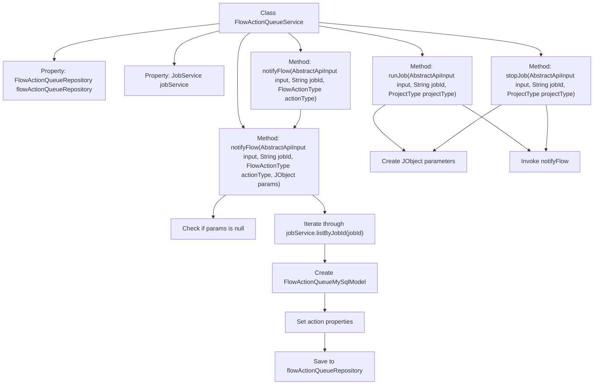

# Basic Information

|      |      |
|------|------|
| Name | FlowActionQueueService |
| Language | .java |
| Code Path | WeFe/board/board-service/src/main/java/com/welab/wefe/board/service/service/FlowActionQueueService.java |
| Package Name | com.welab.wefe.board.service.service |
| Dependencies | ['com.welab.wefe.board.service.database.entity.flow.FlowActionQueueMySqlModel', 'com.welab.wefe.board.service.database.entity.job.JobMySqlModel', 'com.welab.wefe.board.service.database.repository.FlowActionQueueRepository', 'com.welab.wefe.common.util.JObject', 'com.welab.wefe.common.web.dto.AbstractApiInput', 'com.welab.wefe.common.wefe.enums.FlowActionType', 'com.welab.wefe.common.wefe.enums.ProducerType', 'com.welab.wefe.common.wefe.enums.ProjectType', 'org.springframework.beans.factory.annotation.Autowired', 'org.springframework.stereotype.Service'] |
| Brief Description | The FlowActionQueueService provides the functionality to run and stop tasks, configures parameters based on project types, and sends operation messages to the flow service via the notifyFlow method. |

# Description

FlowActionQueueService is a service class that inherits from AbstractService. It relies on dependency injection through FlowActionQueueRepository and JobService. Its primary functions include running and stopping jobs, as well as sending operation messages to the flow service via the notifyFlow method. The runJob and stopJob methods set parameters based on the project type and invoke notifyFlow. The notifyFlow method processes input parameters, creates a FlowActionQueueMySqlModel object, sets the operation type, producer type, priority, and parameters, and finally saves it to the database. The parameters include the job ID and target role information.

# Class Summary

| Name   | Type  | Description |
|-------|------|-------------|
| FlowActionQueueService | class | The FlowActionQueueService handles task execution and stop operations, sets parameters based on the project type, and sends action messages to the flow service via the notifyFlow method, storing them in the queue. |


## Class FlowActionQueueService

|      |      |
|------|------|
| Access Modifier | @Service;public |
| Type | class |
| Name | FlowActionQueueService |
| Description | The FlowActionQueueService handles task execution and stop operations, sets parameters based on the project type, and sends action messages to the flow service via the notifyFlow method, storing them in the queue. |


### UML Class Diagram

```mermaid
classDiagram
    class AbstractService {
        <<Abstract>>
    }

    class FlowActionQueueService {
        -FlowActionQueueRepository flowActionQueueRepository
        -JobService jobService
        +runJob(AbstractApiInput input, String jobId, ProjectType projectType) void
        +stopJob(AbstractApiInput input, String jobId, ProjectType projectType) void
        +notifyFlow(AbstractApiInput input, String jobId, FlowActionType actionType) void
        +notifyFlow(AbstractApiInput input, String jobId, FlowActionType actionType, JObject params) void
    }

    class FlowActionQueueRepository {
        <<Interface>>
        +save(FlowActionQueueMySqlModel action) void
    }

    class JobService {
        <<Interface>>
        +listByJobId(String jobId) List~JobMySqlModel~
    }

    class AbstractApiInput {
        <<Abstract>>
        +fromGateway() boolean
    }

    class FlowActionQueueMySqlModel {
        -FlowActionType action
        -ProducerType producer
        -int priority
        -String params
        +setAction(FlowActionType action) void
        +setProducer(ProducerType producer) void
        +setPriority(int priority) void
        +setParams(String params) void
    }

    class JobMySqlModel {
        -String jobId
        -RoleType myRole
        +getJobId() String
        +getMyRole() RoleType
    }

    class JObject {
        +create(String key, Object value) JObject
        +put(String key, Object value) JObject
        +toStringWithNull() String
    }

    enum ProjectType {
        DeepLearning
    }

    enum FlowActionType {
        run_job
        stop_job
    }

    enum ProducerType {
        gateway
        board
    }

    enum RoleType {
        <<Enumeration>>
    }

    AbstractService <|-- FlowActionQueueService
    FlowActionQueueService --> FlowActionQueueRepository : Dependency
    FlowActionQueueService --> JobService : Dependency
    FlowActionQueueService --> AbstractApiInput : Dependency
    FlowActionQueueService --> JObject : Dependency
    JobService --> JobMySqlModel : Dependency
    FlowActionQueueRepository --> FlowActionQueueMySqlModel : Dependency
    JobMySqlModel --> RoleType : Dependency
```

This code implements a flow action queue service with core functionalities including job execution, job termination, and flow service notification. The class diagram illustrates key classes and their relationships: FlowActionQueueService inherits from AbstractService, depends on JobService and FlowActionQueueRepository to handle jobs and action queues, utilizes JObject for parameter construction, and distinguishes between project types, action types, and producer types via enumerations. The service interacts with abstract input parameters and model objects to facilitate flow action creation and persistence.


### Internal Method Call Graph



This code represents the implementation of the FlowActionQueueService class, primarily handling operations related to flow action queues. It contains two main methods: runJob and stopJob, both of which create different JObject parameters based on the project type and invoke the notifyFlow method. The notifyFlow method has two overloaded versions, with the core logic residing in the parameterized version. It iterates through all tasks for a specified jobId, creates a FlowActionQueueMySqlModel object for each task, sets relevant properties, and saves them to the database. The entire process implements the functionality of sending flow action messages to the streaming service.

### Field List

| Name  | Type  | Description |
|-------|-------|------|
| flowActionQueueRepository | FlowActionQueueRepository | Automatically inject the FlowActionQueueRepository instance. |
| jobService | JobService | Automatically inject JobService instances. |

### Method List

| Name  | Type  | Description |
|-------|-------|------|
| stopJob | void | This method stops the specified task based on the project type. If it is a DeepLearning type, the parameter is set to visualfl; otherwise, it is set to null, and then the process is notified to stop the task. |
| runJob | void | The method `runJob` sets parameters based on the project type. If it is `DeepLearning`, a JObject containing `"type":"visualfl"` is created; otherwise, it is set to null. It then calls `notifyFlow` to notify the flow to execute the task. |
| notifyFlow | void | The method notifyFlow takes input parameters input, jobId, and actionType, calls the overloaded method, and passes null as the fourth parameter. |
| notifyFlow | void | The method `notifyFlow` receives input parameters, task ID, action type, and parameters, initializing them if they are empty. It iterates through the task list, creates a flow action queue object, sets the action type, producer, priority, and parameters (including the task ID and target role), and finally saves the action queue. |


