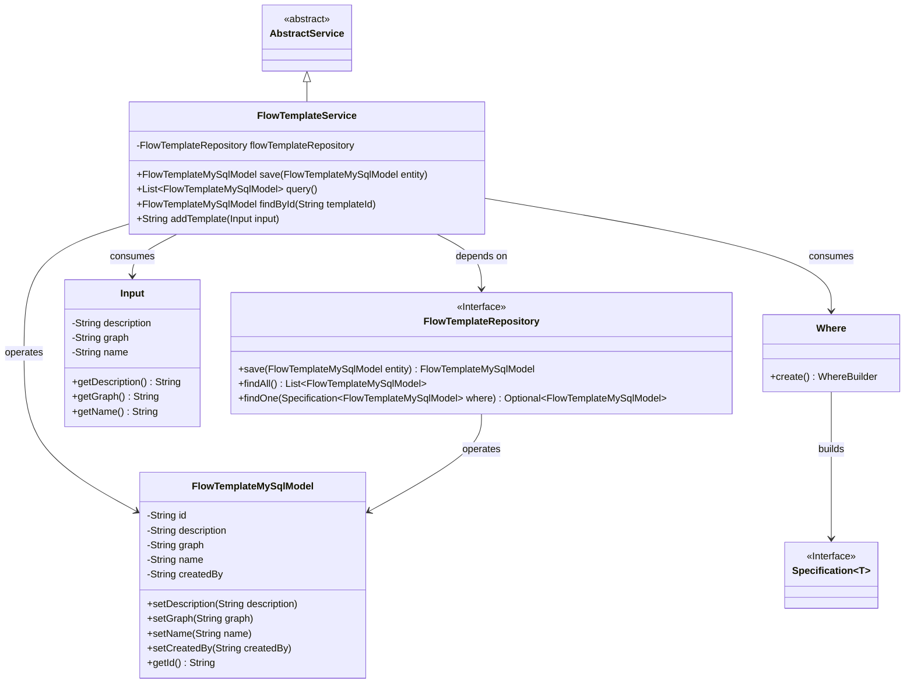
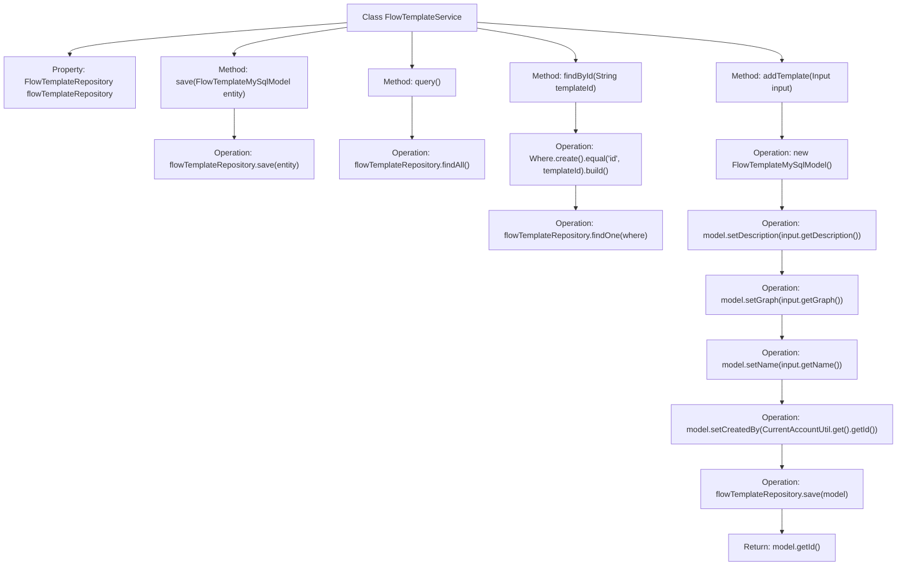

# Basic Information

|      |      |
|------|------|
| Name | FlowTemplateService |
| Language | .java |
| Code Path | WeFe/board/board-service/src/main/java/com/welab/wefe/board/service/service/FlowTemplateService.java |
| Package Name | com.welab.wefe.board.service.service |
| Dependencies | ['com.welab.wefe.board.service.api.project.flow.SaveFlowTemplateApi.Input', 'com.welab.wefe.board.service.database.entity.flow.FlowTemplateMySqlModel', 'com.welab.wefe.board.service.database.repository.FlowTemplateRepository', 'com.welab.wefe.common.data.mysql.Where', 'com.welab.wefe.common.web.util.CurrentAccountUtil', 'org.springframework.beans.factory.annotation.Autowired', 'org.springframework.data.jpa.domain.Specification', 'org.springframework.stereotype.Service', 'java.util.List'] |
| Brief Description | The FlowTemplateService provides CRUD (Create, Read, Update, Delete) functionalities for process templates, including saving, querying, searching by ID, and adding templates, utilizing the FlowTemplateRepository to interact with the database. |

# Description

FlowTemplateService is a Spring service class that extends AbstractService. It performs database operations via FlowTemplateRepository, providing functionalities to save, query, and retrieve FlowTemplateMySqlModel by ID. Specific methods include: save for persisting entities, query for returning all records, and findById for precise lookup by ID. The addTemplate method accepts an Input object, constructs a FlowTemplateMySqlModel, sets its description, flowchart, name, and creator information before saving, and returns the generated ID.

# Class Summary

| Name   | Type  | Description |
|-------|------|-------------|
| FlowTemplateService | class | The FlowTemplateService provides functionalities for adding and querying process templates, including saving, querying all, searching by ID, and adding new templates, utilizing the Repository to interact with the database. |

## Class FlowTemplateService

|      |      |
|------|------|
| Access Modifier | @Service;public |
| Type | class |
| Name | FlowTemplateService |
| Description | The FlowTemplateService provides functionalities for adding and querying process templates, including saving, querying all, searching by ID, and adding new templates, utilizing the Repository to interact with the database. |

### UML Class Diagram

This class diagram illustrates FlowTemplateService as the core service class, inheriting from AbstractService and operating the FlowTemplateMySqlModel entity through the FlowTemplateRepository interface. The service class contains CRUD methods, where the addTemplate method accepts Input parameters to create new templates, and findById utilizes Where to construct Specification for queries. The overall structure reflects a typical Spring service-layer data access pattern, encompassing entity operations, conditional queries, and dependency injection relationships.

### Internal Method Call Graph

This flowchart illustrates the structure and method invocation relationships of the FlowTemplateService class. The class contains four main methods: save() for persisting entities, query() for retrieving all records, findById() for locating records by ID, and addTemplate() for creating new templates. The addTemplate() method has the most complex workflow, involving model instantiation, property assignment, persistence operations, and ID return. All methods interact with the database through flowTemplateRepository, demonstrating a typical Spring service-layer design pattern.

### Field List

| Name  | Type  | Description |
|-------|-------|------|
| flowTemplateRepository | FlowTemplateRepository | Automated injection process template repository instance. |

### Method List

| Name  | Type  | Description |
|-------|-------|------|
| addTemplate | String | The method receives input parameters, creates a process template model, sets the description, diagram, name, and creator, and returns the template ID after saving. |
| query | List<FlowTemplateMySqlModel> | Query and return a list of all process template data. |
| save | FlowTemplateMySqlModel | Save the FlowTemplateMySqlModel entity to the database and return the saved entity. |
| findById | FlowTemplateMySqlModel | This method retrieves FlowTemplateMySqlModel data by querying with a template ID. It constructs a query condition using the Where condition builder, matching the id field with the incoming parameter templateId, and finally calls the repository's findOne method to obtain the result. If no result is found, it returns null. |

