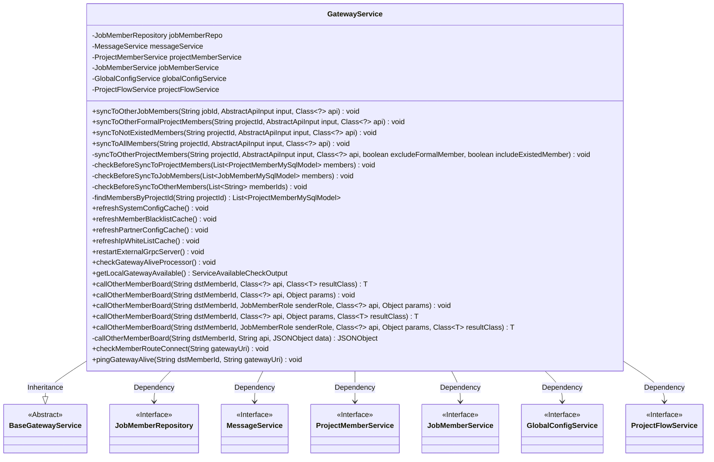

# Basic Information

|      |      |
|------|------|
| Name | GatewayService |
| Language | .java |
| Code Path | WeFe/board/board-service/src/main/java/com/welab/wefe/board/service/service/GatewayService.java |
| Package Name | com.welab.wefe.board.service.service |
| Dependencies | ['com.alibaba.fastjson.JSONObject', 'com.welab.wefe.board.service.api.project.flow', 'com.welab.wefe.board.service.api.project.node.UpdateApi', 'com.welab.wefe.board.service.api.project.project.AddApi', 'com.welab.wefe.board.service.api.service.AliveApi', 'com.welab.wefe.board.service.database.entity.job.JobMemberMySqlModel', 'com.welab.wefe.board.service.database.entity.job.ProjectFlowMySqlModel', 'com.welab.wefe.board.service.database.entity.job.ProjectMemberMySqlModel', 'com.welab.wefe.board.service.database.repository.JobMemberRepository', 'com.welab.wefe.board.service.exception.MemberGatewayException', 'com.welab.wefe.board.service.service.globalconfig.GlobalConfigService', 'com.welab.wefe.common.StatusCode', 'com.welab.wefe.common.exception.StatusCodeWithException', 'com.welab.wefe.common.util.JObject', 'com.welab.wefe.common.util.StringUtil', 'com.welab.wefe.common.web.api.base.Api', 'com.welab.wefe.common.web.dto.AbstractApiInput', 'com.welab.wefe.common.web.dto.ApiResult', 'com.welab.wefe.common.wefe.checkpoint.dto.ServiceAvailableCheckOutput', 'com.welab.wefe.common.wefe.dto.global_config.GatewayConfigModel', 'com.welab.wefe.common.wefe.enums.AuditStatus', 'com.welab.wefe.common.wefe.enums.FederatedLearningType', 'com.welab.wefe.common.wefe.enums.GatewayProcessorType', 'com.welab.wefe.common.wefe.enums.JobMemberRole', 'net.jodah.expiringmap.ExpiringMap', 'org.apache.commons.lang.StringUtils', 'org.springframework.beans.factory.annotation.Autowired', 'org.springframework.stereotype.Service', 'java.util.List', 'java.util.concurrent.TimeUnit', 'java.util.stream.Collectors'] |
| Brief Description | The `GatewayService` class provides message synchronization functionality, supporting broadcasting messages to project members or task members, including blacklist checks, communication status verification, and various cache refresh operations. |

# Description

GatewayService is a Spring-based service class that extends BaseGatewayService, primarily designed for handling message synchronization and gateway communication. It leverages multiple autowired dependencies (such as JobMemberRepository, MessageService, etc.) to implement its functionality. Core features include synchronizing messages to task members and project members, supporting various filtering conditions (e.g., excluding non-formal members or exited members). Before synchronization, it performs blacklist checks and communication status validation to ensure reliable message delivery. Additionally, it provides gateway cache updates (e.g., system configurations, blacklists), gateway liveliness checks, and route connection testing. The callOtherMemberBoard method facilitates communication with other member gateways, supporting multiple API calls and result processing.

# Class Summary

| Name   | Type  | Description |
|-------|------|-------------|
| GatewayService | class | The `GatewayService` class provides message synchronization functionality, supporting broadcasting messages to project members, checking member statuses, and managing gateway cache updates. It includes blacklist checks, communication status verification, and multiple synchronization strategies. |

## Class GatewayService

|      |      |
|------|------|
| Access Modifier | @Service;public |
| Type | class |
| Name | GatewayService |
| Description | The `GatewayService` class provides message synchronization functionality, supporting broadcasting messages to project members, checking member statuses, and managing gateway cache updates. It includes blacklist checks, communication status verification, and multiple synchronization strategies. |

### UML Class Diagram

This code illustrates a gateway service class `GatewayService` that inherits from `BaseGatewayService` and depends on multiple service interfaces such as `JobMemberRepository`, `MessageService`, etc. Its primary functionalities include synchronizing messages to project members, checking member statuses, refreshing cache configurations, and communicating with gateways of other members. The class contains multiple public and private methods for handling different types of message synchronization and gateway operations, reflecting complex business logic and rigorous member status verification mechanisms.

### Internal Method Call Graph

```mermaid
graph TD
    A[GatewayService]
    B["Property: JobMemberRepository jobMemberRepo"]
    C["Property: MessageService messageService"]
    D["Property: ProjectMemberService projectMemberService"]
    E["Property: JobMemberService jobMemberService"]
    F["Property: GlobalConfigService globalConfigService"]
    G["Property: ProjectFlowService projectFlowService"]
    H["Method: syncToOtherJobMembers"]
    I["Method: syncToOtherProjectMembers"]
    J["Method: checkBeforeSyncToProjectMembers"]
    K["Method: checkBeforeSyncToJobMembers"]
    L["Method: checkBeforeSyncToOtherMembers"]
    M["Method: findMembersByProjectId"]
    N["Method: callOtherMemberBoard"]
    O["Method: refreshSystemConfigCache"]
    P["Method: refreshMemberBlacklistCache"]
    Q["Method: refreshPartnerConfigCache"]
    R["Method: refreshIpWhiteListCache"]
    S["Method: restartExternalGrpcServer"]
    T["Method: checkGatewayAliveProcessor"]
    U["Method: getLocalGatewayAvailable"]
    V["Method: checkMemberRouteConnect"]
    W["Method: pingGatewayAlive"]

    A --> B
    A --> C
    A --> D
    A --> E
    A --> F
    A --> G
    A --> H
    A --> I
    I --> J
    I --> K
    J --> L
    K --> L
    I --> M
    I --> N
    A --> O
    A --> P
    A --> Q
    A --> R
    A --> S
    A --> T
    A --> U
    A --> V
    A --> W
```

This code demonstrates a GatewayService class that inherits from BaseGatewayService, primarily handling message synchronization and gateway communication. The class contains multiple property injections and method definitions, with core functionalities including: synchronizing messages to project members, checking member status, invoking other member boards, refreshing various cache configurations, and verifying gateway connectivity. Methods exhibit multi-layer invocation relationships, such as syncToOtherProjectMembers calling checkBeforeSyncToProjectMembers and findMembersByProjectId, ultimately completing message delivery through callOtherMemberBoard. The entire class is designed for message broadcasting and gateway communication in distributed environments, featuring robust exception handling and status verification mechanisms.

### Field List

| Name  | Type  | Description |
|-------|-------|------|
| jobMemberRepo | JobMemberRepository | Automatically inject the JobMemberRepository instance into the jobMemberRepo variable. |
| projectMemberService | ProjectMemberService | Automatically inject the ProjectMemberService instance. |
| jobMemberService | JobMemberService | Automatically inject the JobMemberService service instance. |
| projectFlowService | ProjectFlowService | Use @Autowired to automatically inject an instance of ProjectFlowService. |
| globalConfigService | GlobalConfigService | Using @Autowired to automatically inject an instance of GlobalConfigService. |
| messageService | MessageService | Automatically inject the message service instance. |
| CACHE_MAP = ExpiringMap.builder().expiration(60, TimeUnit.SECONDS).maxSize(500).build() | ExpiringMap<String, Object> | Defined a protected static final cache map CACHE_MAP, built using ExpiringMap, with an expiration time of 60 seconds and a maximum capacity of 500. |

### Method List

| Name  | Type  | Description |
|-------|-------|------|
| syncToOtherJobMembers | void | This method is used to synchronize task information with other members. If the request originates from the gateway or the current user is not part of the task, it returns directly. Otherwise, it checks the member list, iterates through and invokes the interfaces of other members for information synchronization, skipping the current user. |
| restartExternalGrpcServer | void | The method restartExternalGrpcServer sends an empty message and a restart command via sendToMyselfGateway, and may throw a StatusCodeWithException exception. |
| syncToOtherProjectMembers | void | This method is used for synchronizing project member operations: checking the request source, filtering non-members or specific roles, handling process-related operations, and invoking the member interface after skipping members meeting specific conditions. |
| refreshMemberBlacklistCache | void | Method to refresh the member blacklist cache, processed by sending a request through the gateway, may throw exceptions. |
| syncToNotExistedMembers | void | Synchronize data to non-existent project members by calling the syncToOtherProjectMembers method, passing in the project ID, input parameters, API class, and two false flags, which may throw a StatusCodeWithException. |
| syncToOtherFormalProjectMembers | void | Synchronize project member information to other formal project members, invoke internal methods to handle the synchronization logic, which may throw exceptions. |
| refreshIpWhiteListCache | void | This method is used to refresh the IP whitelist cache by sending an empty message to its own gateway and specifying the processor type. If it fails, an exception will be thrown. |
| checkBeforeSyncToOtherMembers | void | Method for checking member list validity: Remove self and deduplicate, check blacklisted members and communication status to avoid broadcast failures. |
| syncToAllMembers | void | Synchronize project data to all members by calling the syncToOtherProjectMembers method, passing in the project ID, input parameters, and API class, without skipping yourself and including all members. |
| callOtherMemberBoard | void | Invoke public methods of other member boards, with parameters including target member ID, sender role, API class, and arguments, which may throw status code exceptions. |
| refreshSystemConfigCache | void | This method is used to refresh the system configuration cache by sending a request to itself through the gateway, and may throw a StatusCodeWithException. |
| checkBeforeSyncToJobMembers | void | This method checks the member IDs in the member list and calls another method for pre-synchronization validation. |
| callOtherMemberBoard | T | General method for calling other member boards, passing in the target member ID, API class, parameters, and return type, may throw a StatusCodeWithException. |
| callOtherMemberBoard | void | Java Method: Calls other member boards, parameters include target member ID, API class, and parameter object, may throw StatusCodeWithException. |
| findMembersByProjectId | List<ProjectMemberMySqlModel> | This method retrieves the member list by project ID, filters out duplicate records where the initiator acts as a provider to avoid notifying the initiator multiple times, and returns the processed member list. |
| checkBeforeSyncToProjectMembers | void | This method checks the project member list, extracts the member IDs, and then calls another method for pre-synchronization validation. |
| callOtherMemberBoard | T | The method invokes other member interfaces through the gateway, sends request parameters, and processes the returned results. It checks whether the API result is successful and throws an exception if it fails. Upon success, it converts the data based on the return type, supporting either JObject or a specified class. |
| callOtherMemberBoard | JSONObject | The private method `callOtherMemberBoard` invokes the API of other member boards via a POST request, sends JSON data, and returns the result. Parameters include the target member ID, API address, and data. Exceptions may throw `StatusCodeWithException`. |
| checkMemberRouteConnect | void | Check the member route connection; if the gateway URI is empty, use the internal network base URI, construct the request entity, and send it to the local gateway for processing. |
| pingGatewayAlive | void | The method `pingGatewayAlive` sends a liveliness check to the target gateway, with parameters being the target member ID and gateway URI, and may throw `StatusCodeWithException` in case of exceptions. |
| refreshPartnerConfigCache | void | This method is used to refresh the partner configuration cache by sending a request to itself via the gateway. |
| callOtherMemberBoard | T | This is a Java method designed to invoke APIs of other member boards, accepting the target member ID, API class, and return type as parameters, with potential exception throwing. |
| getLocalGatewayAvailable | ServiceAvailableCheckOutput | The method sends a request through the local gateway, checks service availability, and returns the result object. |
| checkGatewayAliveProcessor | void | Method to check gateway liveliness by sending an empty message to its own gateway, with the processor type as gatewayAliveProcessor, which may throw a StatusCodeWithException. |

