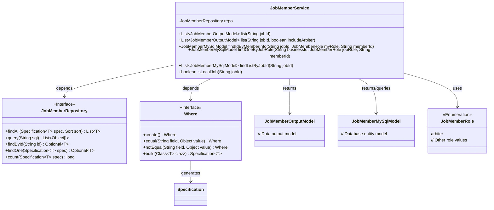
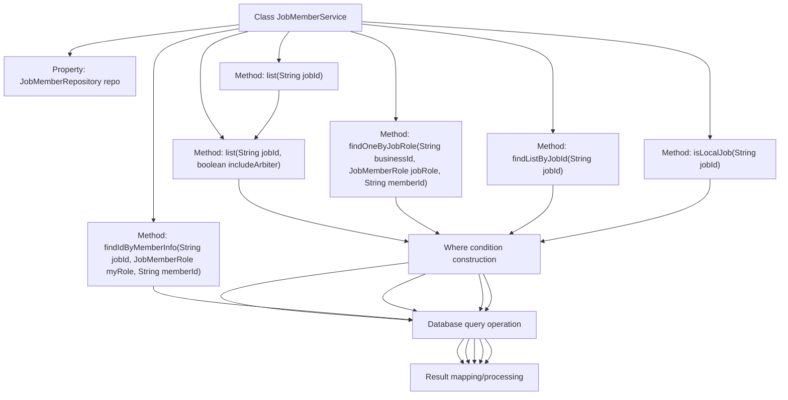
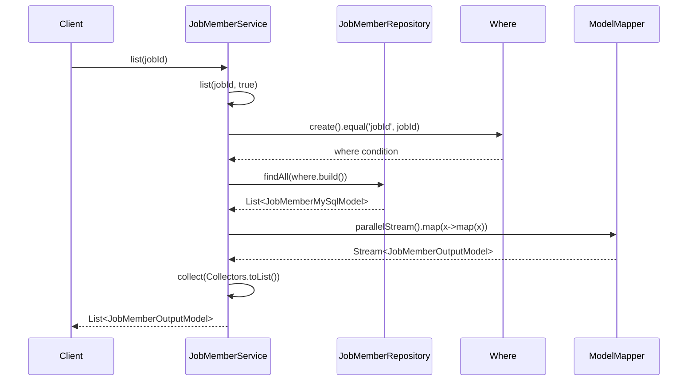

# Basic Information

|      |      |
|------|------|
| Name | JobMemberService |
| Language | .java |
| Code Path | WeFe/board/board-service/src/main/java/com/welab/wefe/board/service/service/JobMemberService.java |
| Package Name | com.welab.wefe.board.service.service |
| Dependencies | ['com.alibaba.fastjson.JSONArray', 'com.welab.wefe.board.service.database.entity.job.JobMemberMySqlModel', 'com.welab.wefe.board.service.database.repository.JobMemberRepository', 'com.welab.wefe.board.service.dto.entity.job.JobMemberOutputModel', 'com.welab.wefe.common.data.mysql.Where', 'com.welab.wefe.common.web.util.ModelMapper', 'com.welab.wefe.common.wefe.enums.JobMemberRole', 'org.springframework.beans.factory.annotation.Autowired', 'org.springframework.data.domain.Sort', 'org.springframework.data.jpa.domain.Specification', 'org.springframework.stereotype.Service', 'java.util.List', 'java.util.stream.Collectors'] |
| Brief Description | The JobMemberService provides task member query functionalities, including retrieving member lists by task ID, excluding arbitrators, conditional combined queries, and local task determination. |

# Description

JobMemberService is a service class that provides operations related to job members. Its main functionalities include: retrieving a list of job members with support for role-based filtering; querying a single member by job ID, member role, and member ID; fetching a member list based on job ID; and checking whether a job is a local job. The methods construct queries using Where conditions and execute database operations via the Repository. Some methods involve parallel stream processing and model mapping transformations.

# Class Summary

| Name   | Type  | Description |
|-------|------|-------------|
| JobMemberService | class | The JobMemberService provides job member management functionalities, including querying member lists, searching members by criteria, and checking local jobs. It supports filtering by conditions such as role and ID, utilizing parallel streams for data transformation. |

## Class JobMemberService

|      |      |
|------|------|
| Access Modifier | @Service;public |
| Type | class |
| Name | JobMemberService |
| Description | The JobMemberService provides job member management functionalities, including querying member lists, searching members by criteria, and checking local jobs. It supports filtering by conditions such as role and ID, utilizing parallel streams for data transformation. |

### UML Class Diagram

This code demonstrates a job member service class (JobMemberService) that primarily provides database operations related to job members. The class diagram clearly illustrates the relationships between the service class and the repository interface (JobMemberRepository), condition builder (Where), data models (JobMemberOutputModel/JobMemberMySqlModel), and enumeration type (JobMemberRole). The service class accesses data through the repository interface, uses Where to construct query conditions, processes two different data models, and utilizes the enumeration type to distinguish member roles. It includes various business methods such as list queries, conditional queries, and local job determination, reflecting comprehensive member management functionality.

### Internal Method Call Graph

This code represents the JobMemberService class, which primarily handles business logic related to job members. It provides various query methods including retrieving member lists, querying individual members based on conditions, querying member lists, and determining whether a job is local. The core workflow involves constructing query conditions through the Where class, invoking the Repository for database operations, and finally mapping or processing the results. Special attention is given to advanced features such as parallel stream processing and conditional filtering, reflecting considerations for performance and data integrity.

### Field List

| Name  | Type  | Description |
|-------|-------|------|
| repo | JobMemberRepository | Automatically inject the JobMemberRepository instance into the repo variable. |

### Method List

| Name  | Type  | Description |
|-------|-------|------|
| list | List<JobMemberOutputModel> | Method to query the task member list by jobId, with an option to include arbitrators. The results are sorted by role and mapped to the output model. |
| findOneByJobRole | JobMemberMySqlModel | Method queries JobMemberMySqlModel records based on business ID, position role, and member ID, returning matching results or null. |
| findIdByMemberInfo | JobMemberMySqlModel | The method retrieves the id of the job_member table via SQL query based on jobId, role, and memberId. If a record exists, it returns the corresponding entity; otherwise, it returns null. |
| list | List<JobMemberOutputModel> | This is a Java method that lists JobMemberOutputModel objects based on jobId, including all members by default. |
| findListByJobId | List<JobMemberMySqlModel> | Query the JobMemberMySqlModel list based on jobId, construct the query using equal conditions, and return the result. |
| isLocalJob | boolean | Check if the task is a local task: Query the database using jobId and the current user ID, excluding the arbitrator role. Return true if the record count is greater than 1. |

