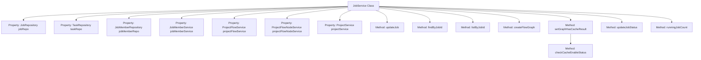
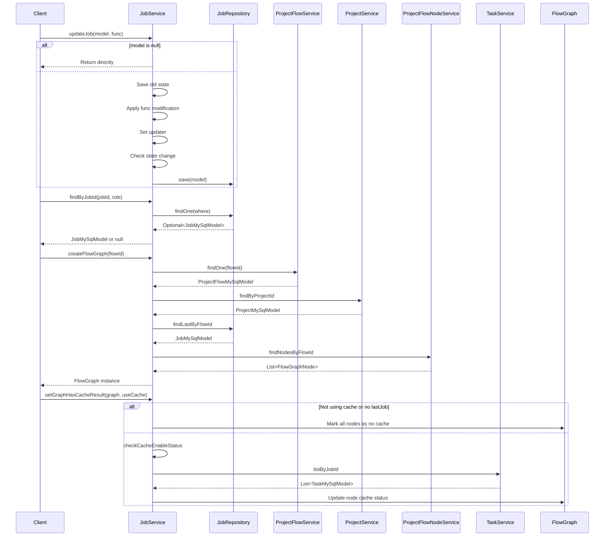

# Basic Information

|      |      |
|------|------|
| Name | JobService |
| Language | .java |
| Code Path | WeFe/board/board-service/src/main/java/com/welab/wefe/board/service/service/JobService.java |
| Package Name | com.welab.wefe.board.service.service |
| Dependencies | ['com.welab.wefe.board.service.api.project.job.UpdateJobStatusApi', 'com.welab.wefe.board.service.database.entity.job.JobMySqlModel', 'com.welab.wefe.board.service.database.entity.job.ProjectFlowMySqlModel', 'com.welab.wefe.board.service.database.entity.job.ProjectMySqlModel', 'com.welab.wefe.board.service.database.entity.job.TaskMySqlModel', 'com.welab.wefe.board.service.database.repository.JobMemberRepository', 'com.welab.wefe.board.service.database.repository.JobRepository', 'com.welab.wefe.board.service.database.repository.TaskRepository', 'com.welab.wefe.board.service.model.FlowGraph', 'com.welab.wefe.board.service.model.FlowGraphNode', 'com.welab.wefe.common.data.mysql.Where', 'com.welab.wefe.common.exception.StatusCodeWithException', 'com.welab.wefe.common.web.util.CurrentAccountUtil', 'com.welab.wefe.common.wefe.enums.JobMemberRole', 'com.welab.wefe.common.wefe.enums.JobStatus', 'com.welab.wefe.common.wefe.enums.TaskStatus', 'org.springframework.beans.factory.annotation.Autowired', 'org.springframework.data.jpa.domain.Specification', 'org.springframework.stereotype.Service', 'java.util', 'java.util.function.Function', 'java.util.stream.Collectors'] |
| Brief Description | The JobService class provides task management functionalities, including updating task status, querying tasks by ID, creating flowcharts, and setting cached results. It relies on multiple Repository and service classes, supporting task status changes, cache checks, and counting running tasks. |

# Description

JobService is a service class that inherits from AbstractService and is used to manage job-related operations. It interacts with data through multiple repositories and services, including JobRepository, TaskRepository, and others. Key functionalities include updating job statuses, querying jobs based on roles and job IDs, creating flowchart instances, setting cached results for chart nodes, checking cache availability, and updating task statuses. Additionally, it provides methods to query the number of unfinished tasks. This class handles core business logic such as task status changes, cache management, and job queries.

# Class Summary

| Name   | Type  | Description |
|-------|------|-------------|
| JobService | class | The JobService class provides task management functionalities, including updating task status, querying tasks, creating flowcharts, and setting cached results. It supports multi-role queries, handles task status changes and caching logic to ensure the correct execution of task workflows. |


## Class JobService

|      |      |
|------|------|
| Access Modifier | @Service;public |
| Type | class |
| Name | JobService |
| Description | The JobService class provides task management functionalities, including updating task status, querying tasks, creating flowcharts, and setting cached results. It supports multi-role queries, handles task status changes and caching logic to ensure the correct execution of task workflows. |


### UML Class Diagram

```mermaid
classDiagram
    class AbstractService {
        <<abstract>>
    }

    class JobService {
        -JobRepository jobRepo
        -TaskRepository taskRepo
        -JobMemberRepository jobMemberRepo
        -JobMemberService jobMemberService
        -ProjectFlowService projectFlowService
        -ProjectFlowNodeService projectFlowNodeService
        -ProjectService projectService
        -TaskService taskService
        +updateJob(JobMySqlModel model, Function~JobMySqlModel, JobMySqlModel~ func) void
        +findByJobId(String jobId, JobMemberRole role) JobMySqlModel
        +listByJobId(String jobId) List~JobMySqlModel~
        +createFlowGraph(String flowId) FlowGraph
        +setGraphHasCacheResult(FlowGraph graph, boolean useCache) void
        +updateJobStatus(UpdateJobStatusApi$Input input) void
        +runningJobCount() int
        -checkCacheEnableStatus(FlowGraph graph, JobMySqlModel lastJob) void
    }

    class JobRepository {
        <<Interface>>
        +save(JobMySqlModel model) JobMySqlModel
        +findOne(Specification~JobMySqlModel~ where) Optional~JobMySqlModel~
        +findAll(Specification~JobMySqlModel~ where) List~JobMySqlModel~
        +findLastByFlowId(String flowId, String role) JobMySqlModel
        +runningJobCount() int
    }

    class TaskRepository {
        <<Interface>>
    }

    class JobMemberRepository {
        <<Interface>>
    }

    class JobMemberService {
        <<Interface>>
    }

    class ProjectFlowService {
        <<Interface>>
        +findOne(String flowId) ProjectFlowMySqlModel
    }

    class ProjectFlowNodeService {
        <<Interface>>
        +findNodesByFlowId(String flowId) List~ProjectFlowNodeMySqlModel~
    }

    class ProjectService {
        <<Interface>>
        +findByProjectId(String projectId) ProjectMySqlModel
    }

    class TaskService {
        <<Interface>>
        +listByJobId(String jobId, JobMemberRole role) List~TaskMySqlModel~
    }

    class FlowGraph {
        +FlowGraph(String federatedLearningType, JobMySqlModel lastJob, List~ProjectFlowNodeMySqlModel~ nodes)
        +getAllJobSteps() List~FlowGraphNode~
        +getLastJob() JobMySqlModel
    }

    class FlowGraphNode {
        +getNodeId() String
        +getParamsVersion() long
        +getDeep() int
        +getChildren() List~FlowGraphNode~
        +setHasCacheResult(boolean hasCache) void
        +getHasCacheResult() boolean
    }

    class JobMySqlModel {
        +getStatus() JobStatus
        +getUpdatedBy() String
        +getStatusUpdatedTime() Date
        +getJobId() String
        +getMyRole() JobMemberRole
        +getCreatedTime() Date
        +setStatus(JobStatus status) void
        +setMessage(String message) void
        +setUpdatedBy(String updatedBy) void
        +setStatusUpdatedTime(Date date) void
    }

    class ProjectFlowMySqlModel {
        +getProjectId() String
        +getFlowId() String
        +getFederatedLearningType() String
    }

    class ProjectMySqlModel {
        +getMyRole() JobMemberRole
    }

    class TaskMySqlModel {
        +getFlowNodeId() String
        +getStatus() TaskStatus
    }

    class UpdateJobStatusApi$Input {
        +getId() String
        +getJobStatus() JobStatus
        +getMessage() String
    }

    AbstractService <|-- JobService
    JobService --> JobRepository : Dependency
    JobService --> TaskRepository : Dependency
    JobService --> JobMemberRepository : Dependency
    JobService --> JobMemberService : Dependency
    JobService --> ProjectFlowService : Dependency
    JobService --> ProjectFlowNodeService : Dependency
    JobService --> ProjectService : Dependency
    JobService --> TaskService : Dependency
    JobService --> FlowGraph : Create
    JobService --> JobMySqlModel : Operate
    JobService --> UpdateJobStatusApi$Input : Process Input
    FlowGraph --> FlowGraphNode : Contains
    FlowGraph --> JobMySqlModel : References
    ProjectFlowService --> ProjectFlowMySqlModel : Returns
    ProjectService --> ProjectMySqlModel : Returns
    TaskService --> TaskMySqlModel : Returns
    ProjectFlowNodeService --> ProjectFlowNodeMySqlModel : Returns
```

This class diagram illustrates the complete structure of JobService and its related dependencies. JobService inherits from AbstractService and primarily handles job status updates, flow graph creation, and cache management. It depends on multiple Repository and Service interfaces, including JobRepository, TaskService, etc., and interacts with core data models such as JobMySqlModel and FlowGraph. The diagram clearly presents the hierarchical relationships and dependency directions among components, reflecting the core responsibilities and complex interaction logic of this service within the job management system.


### Internal Method Call Graph





This code implements the JobService class, primarily handling business logic related to Jobs. It inherits from AbstractService and collaborates with multiple Repositories and Services to fulfill functionalities. Core methods include updating job information, querying jobs by conditions, creating flow graphs, and setting cache status. The class extensively uses Spring dependency injection and frequently interacts with databases and external services. Particularly noteworthy is the complex logic handling flow graph cache status, involving multi-level node traversal and state validation. The overall design reflects a layered architecture philosophy, with business logic concentrated in the Service layer implementation.

### Field List

| Name  | Type  | Description |
|-------|-------|------|
| taskService | TaskService | Automatically inject the TaskService instance. |
| taskRepo | TaskRepository | Automatically inject the TaskRepository instance taskRepo. |
| jobMemberService | JobMemberService | Using @Autowired to automatically inject an instance of JobMemberService. |
| projectFlowNodeService | ProjectFlowNodeService | Automatically inject the ProjectFlowNodeService service instance. |
| projectService | ProjectService | Use @Autowired to automatically inject an instance of ProjectService. |
| jobMemberRepo | JobMemberRepository | Using @Autowired to automatically inject the JobMemberRepository instance jobMemberRepo. |
| jobRepo | JobRepository | Automatically inject the JobRepository instance into the jobRepo variable. |
| projectFlowService | ProjectFlowService | Automatically inject the ProjectFlowService service instance. |

### Method List

| Name  | Type  | Description |
|-------|-------|------|
| setGraphHasCacheResult | void | This method sets the cache status of each node in the flowchart based on the cache usage flag. If caching is not enabled or there is no historical task, caching is disabled for all nodes; otherwise, it checks the cache availability of each node and recursively disables caching for child nodes of non-cached nodes until no additional nodes are disabled or an arbiter role is encountered. |
| listByJobId | List<JobMySqlModel> | Query the JobMySqlModel list based on jobId, use the condition builder to create query conditions, and return matching results. |
| findByJobId | JobMySqlModel | Query the JobMySqlModel based on jobId and role, return null if no result is found. |
| checkCacheEnableStatus | void | Check task node cache availability: Filter cacheable nodes based on creation time, mark edited nodes as unavailable, and verify whether the task status is successful. |
| createFlowGraph | FlowGraph | The method `createFlowGraph` generates a flowchart based on the `flowId`, queries process, project, and the latest task information, and returns a `FlowGraph` object containing the federated learning type, the latest task, and process nodes. |
| updateJob | void | Method for updating tasks: After checking for non-empty values, execute the function to update the model, set the updater and status change time, and finally save. |
| updateJobStatus | void | Method for updating task status: Locate the task based on the input ID, and if it exists, update the task status and message. |
| runningJobCount | int | This method returns the number of currently running tasks by invoking the runningJobCount method of jobRepo. |


