# Basic Information

|      |      |
|------|------|
| Name | MemberChatService |
| Language | .java |
| Code Path | WeFe/board/board-service/src/main/java/com/welab/wefe/board/service/service/MemberChatService.java |
| Package Name | com.welab.wefe.board.service.service |
| Dependencies | ['com.welab.wefe.board.service.api.chat.QueryChatDetailApi', 'com.welab.wefe.board.service.api.chat.UpdateToReadApi', 'com.welab.wefe.board.service.base.LoginAccountInfo', 'com.welab.wefe.board.service.constant.ChatConstant', 'com.welab.wefe.board.service.database.entity.chat.ChatLastAccountMysqlModel', 'com.welab.wefe.board.service.database.entity.chat.MemberChatMySqlModel', 'com.welab.wefe.board.service.database.entity.chat.MessageQueueMySqlModel', 'com.welab.wefe.board.service.database.repository.ChatUnreadMessageRepository', 'com.welab.wefe.board.service.database.repository.MemberChatRepository', 'com.welab.wefe.board.service.database.repository.MessageQueueRepository', 'com.welab.wefe.board.service.database.repository.MessageRepository', 'com.welab.wefe.board.service.dto.base.PagingOutput', 'com.welab.wefe.board.service.dto.entity.MemberChatOutputModel', 'com.welab.wefe.common.StatusCode', 'com.welab.wefe.common.data.mysql.Where', 'com.welab.wefe.common.data.mysql.enums.OrderBy', 'com.welab.wefe.common.exception.StatusCodeWithException', 'com.welab.wefe.common.util.JObject', 'com.welab.wefe.common.util.StringUtil', 'com.welab.wefe.common.web.service.account.SsoAccountInfo', 'com.welab.wefe.common.web.util.CurrentAccountUtil', 'com.welab.wefe.common.web.util.ModelMapper', 'com.welab.wefe.common.wefe.enums.GatewayProcessorType', 'com.welab.wefe.common.wefe.enums.ProducerType', 'org.apache.commons.collections4.CollectionUtils', 'org.springframework.beans.factory.annotation.Autowired', 'org.springframework.data.domain.Page', 'org.springframework.data.domain.PageRequest', 'org.springframework.data.domain.Pageable', 'org.springframework.data.domain.Sort', 'org.springframework.data.jpa.domain.Specification', 'org.springframework.stereotype.Service', 'org.springframework.transaction.annotation.Transactional', 'javax.persistence.criteria.Predicate', 'java.util.ArrayList', 'java.util.Date', 'java.util.List', 'java.util.UUID', 'java.util.stream.Collectors'] |
| Brief Description | The MemberChatService handles message sending, receiving, retransmission, and status updates between members. It includes functionalities such as sending messages, querying chat details, and processing unread messages. Messages are forwarded via the gatewayService, with support for transaction rollback. |

# Description

The MemberChatService is a service class that handles member chat messages, inheriting from AbstractService. It utilizes multiple repositories (such as MemberChatRepository, MessageRepository, etc.) and services (such as GatewayService, ChatUnreadMessageService, etc.) to implement message sending, receiving, storage, and status management. Key functionalities include: sending messages (with support for retry on failure), querying chat details, processing received messages, and updating message status to "read." Messages are sent to target members via the gateway service, while chat details and unread messages are recorded. The service also maintains recent chat account records to ensure the accuracy and consistency of message status.

# Class Summary

| Name   | Type  | Description |
|-------|------|-------------|
| MemberChatService | class | The MemberChatService handles the sending, receiving, and status management of messages between members. It includes functionalities such as sending messages, resending failed messages, querying chat details, processing received messages, and updating message status to "read." Messages are sent via the gatewayService, while the repository is used to store messages and unread records, with support for transaction rollback. |


## Class MemberChatService

|      |      |
|------|------|
| Access Modifier | @Service;public |
| Type | class |
| Name | MemberChatService |
| Description | The MemberChatService handles the sending, receiving, and status management of messages between members. It includes functionalities such as sending messages, resending failed messages, querying chat details, processing received messages, and updating message status to "read." Messages are sent via the gatewayService, while the repository is used to store messages and unread records, with support for transaction rollback. |


### UML Class Diagram

```mermaid
classDiagram
    class MemberChatService {
        -MemberChatRepository memberChatRepository
        -MessageRepository messageRepository
        -GatewayService gatewayService
        -ChatUnreadMessageRepository chatUnreadMessageRepository
        -MessageQueueRepository messageQueueRepository
        -ChatLastAccountService chatLastAccountService
        -ChatUnreadMessageService chatUnreadMessageService
        +sendMessage(String fromAccountId, String fromAccountName, String toMemberId, String toAccountId, String toMemberName, String toAccountName, String content) JObject
        +sendMessage(String toMemberId, String toMemberName, String toAccountId, String toAccountName, String content) JObject
        +resendMessage(String memberChatId) void
        +queryChatDetail(QueryChatDetailApi.Input input) PagingOutput~MemberChatOutputModel~
        +getOneMessage() MessageQueueMySqlModel
        +handleChatMessage(MessageQueueMySqlModel message) void
        +messageUpdateToRead(UpdateToReadApi.Input input) void
        -generateMessageId() String
    }

    class MemberChatRepository {
        +save(MemberChatMySqlModel entity) MemberChatMySqlModel
        +findById(String id) Optional~MemberChatMySqlModel~
        +updateById(String id, String field, Object value, Class~T~ clazz, boolean async) void
        +updateMessageStatus(String toAccountId, String fromAccountId, int oldStatus, int newStatus) void
        +findAll(Specification~MemberChatMySqlModel~ spec, Pageable pageable) Page~MemberChatMySqlModel~
    }

    class MessageRepository {
        // Basic Repository methods
    }

    class GatewayService {
        +sendToOtherGateway(String memberId, String data, GatewayProcessorType processorType) void
    }

    class ChatUnreadMessageRepository {
        // Basic Repository methods
    }

    class MessageQueueRepository {
        +findAll(Specification~MessageQueueMySqlModel~ spec, Pageable pageable) Page~MessageQueueMySqlModel~
        +delete(MessageQueueMySqlModel entity) void
    }

    class ChatLastAccountService {
        +add(ChatLastAccountMysqlModel model) void
    }

    class ChatUnreadMessageService {
        +addChatUnreadMessage(MemberChatMySqlModel model) void
        +delete(String toAccountId, String fromAccountId) int
    }

    class MemberChatMySqlModel {
        -String id
        -String fromAccountId
        -String fromAccountName
        -String fromMemberId
        -String fromMemberName
        -String toMemberId
        -String toMemberName
        -String toAccountId
        -String toAccountName
        -String content
        -int status
        -int direction
        -Date createdTime
        -Date updatedTime
        -String messageId
        // getters/setters
    }

    class MessageQueueMySqlModel {
        -String params
        // Other fields
    }

    class ChatLastAccountMysqlModel {
        -String accountId
        -String memberId
        -String accountName
        -String memberName
        -String liaisonAccountId
        -String liaisonMemberId
        -String liaisonAccountName
        -String liaisonMemberName
        -Date updatedTime
        // getters/setters
    }

    class MemberChatOutputModel {
        -String id
        -String fromAccountId
        -String fromMemberId
        -String toAccountId
        -String toMemberId
        -String content
        -int status
        -Date createdTime
        // getters/setters
    }

    class QueryChatDetailApi$Input {
        -String fromAccountId
        -String toAccountId
        -Long limitCreateTime
        -int pageSize
        // getters/setters
    }

    class UpdateToReadApi$Input {
        -String toAccountId
        -String fromAccountId
        // getters/setters
    }

    MemberChatService --> MemberChatRepository : depends on
    MemberChatService --> MessageRepository : depends on
    MemberChatService --> GatewayService : depends on
    MemberChatService --> ChatUnreadMessageRepository : depends on
    MemberChatService --> MessageQueueRepository : depends on
    MemberChatService --> ChatLastAccountService : depends on
    MemberChatService --> ChatUnreadMessageService : depends on
    MemberChatService --> MemberChatMySqlModel : creates/uses
    MemberChatService --> MessageQueueMySqlModel : processes
    MemberChatService --> ChatLastAccountMysqlModel : creates/uses
    MemberChatService --> MemberChatOutputModel : returns
    MemberChatService --> QueryChatDetailApi$Input : parameter
    MemberChatService --> UpdateToReadApi$Input : parameter
```

This diagram illustrates the core class relationships of MemberChatService, a service class handling member chat messages. It persists data through multiple repositories (e.g., MemberChatRepository, MessageQueueRepository), relies on GatewayService for message forwarding, uses ChatLastAccountService to maintain recent contact records, and manages unread messages via ChatUnreadMessageService. The service primarily handles business logic such as message sending, resending, status updates, and queries, involving interactions with data models like MemberChatMySqlModel and parameter objects like QueryChatDetailApi$Input.


### Internal Method Call Graph

```mermaid
graph TD
    A["MemberChatService"]
    B["sendMessage: Main method for sending messages"]
    C["sendMessage: Overloaded method"]
    D["resendMessage: Message resending"]
    E["queryChatDetail: Query chat details"]
    F["getOneMessage: Fetch unprocessed message"]
    G["handleChatMessage: Process received message"]
    H["messageUpdateToRead: Update message status to read"]
    I["generateMessageId: Generate message ID"]

    A --> B
    A --> C
    A --> D
    A --> E
    A --> F
    A --> G
    A --> H
    A --> I

    B --> B1["Create ChatLastAccount record"]
    B --> B2["Construct message data"]
    B --> B3["Create MemberChat record"]
    B --> B4["Send message via gatewayService"]
    B --> B5["Save message record"]

    C --> C1["Retrieve login information"]
    C --> C2["Invoke main sendMessage method"]

    D --> D1["Query original message"]
    D --> D2["Construct resend data"]
    D --> D3["Resend via gatewayService"]
    D --> D4["Update message status"]

    E --> E1["Build query conditions"]
    E --> E2["Execute paginated query"]
    E --> E3["Transform output model"]

    G --> G1["Parse message parameters"]
    G --> G2["Create received message record"]
    G --> G3["Attempt WebSocket push"]
    G --> G4["Save unread message"]
    G --> G5["Delete queue message"]
    G --> G6["Update recent contacts"]
```



This flowchart illustrates the core functional structure of MemberChatService. The service primarily handles message sending, receiving, querying, and status management, comprising 7 main methods and multiple substeps. The message sending process involves data construction, gateway transmission, and persistent storage; the message processing flow includes WebSocket push and unread message management; query functionality implements complex pagination and conditional filtering. All operations interact with the database through Repository and ensure data consistency through transactions.

### Field List

| Name  | Type  | Description |
|-------|-------|------|
| messageRepository | MessageRepository | Automatically inject the message repository instance. |
| chatUnreadMessageRepository | ChatUnreadMessageRepository | Use @Autowired to automatically inject an instance of ChatUnreadMessageRepository. |
| memberChatRepository | MemberChatRepository | Automatically inject the MemberChatRepository instance. |
| chatUnreadMessageService | ChatUnreadMessageService | Use @Autowired to automatically inject an instance of ChatUnreadMessageService. |
| chatLastAccountService | ChatLastAccountService | Using @Autowired to automatically inject an instance of ChatLastAccountService. |
| messageQueueRepository | MessageQueueRepository | Use @Autowired to automatically inject an instance of MessageQueueRepository. |
| gatewayService | GatewayService | Automatically inject the GatewayService instance. |

### Method List

| Name  | Type  | Description |
|-------|-------|------|
| resendMessage | void | The method `resendMessage` is used to resend a chat message. It first checks whether the message exists and its status is "failed to send"; otherwise, it throws an exception. Then, it concatenates the message data and sends it via the gateway, finally updating the message status to "successfully sent." |
| queryChatDetail | PagingOutput<MemberChatOutputModel> | Method for querying chat details: Construct query conditions based on input parameters, retrieve chat records in pagination, and convert them into output models for return. |
| messageUpdateToRead | void | This method uses transactional annotations to ensure rollback in case of exceptions, deleting unread message records and updating the message status to read. If the deletion is successful, the status update is executed. |
| handleChatMessage | void | Processing chat messages: Parse message parameters, save chat details, push to designated users (store as unread if failed), delete queue messages, update recent chat records. |
| getOneMessage | MessageQueueMySqlModel | The method `getOneMessage` queries message queue records where the producer type is `gateway`, sorts them in ascending order by creation time, and returns the first record. If no results are found, it returns `null`. |
| sendMessage | JObject | Method for sending messages: Record the most recent chat account, encapsulate the message content, push it to the target member's gateway, save message details, and handle failure status. |
| sendMessage | JObject | Message sending method with transaction: After verifying login, retrieve sender information and forward the message, rolling back on failure. |
| generateMessageId | String | Generate a unique message ID by removing hyphens from the UUID. |


