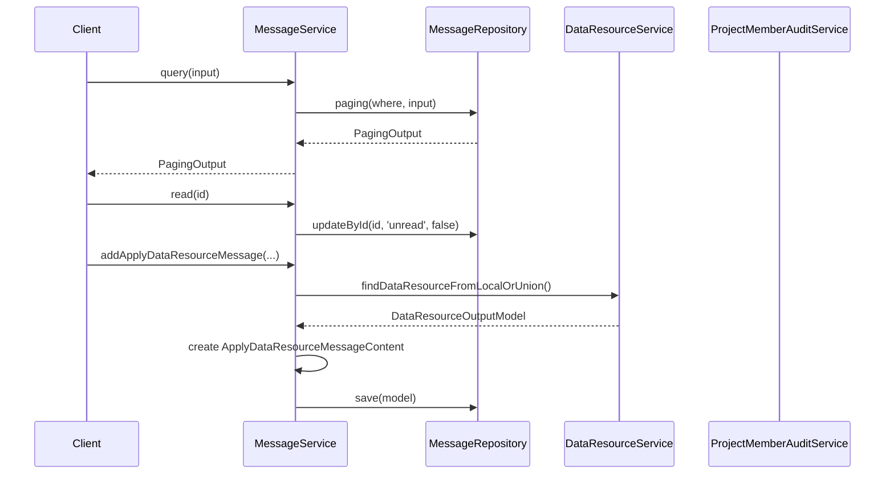

# Basic Information

|      |      |
|------|------|
| Name | MessageService |
| Language | .java |
| Code Path | WeFe/board/board-service/src/main/java/com/welab/wefe/board/service/service/MessageService.java |
| Package Name | com.welab.wefe.board.service.service |
| Dependencies | ['com.welab.wefe.board.service.api.message.QueryApi', 'com.welab.wefe.board.service.database.entity.MessageMysqlModel', 'com.welab.wefe.board.service.database.entity.job.ProjectDataSetMySqlModel', 'com.welab.wefe.board.service.database.entity.job.ProjectMemberAuditMySqlModel', 'com.welab.wefe.board.service.database.entity.job.ProjectMySqlModel', 'com.welab.wefe.board.service.database.repository.MessageRepository', 'com.welab.wefe.board.service.dto.base.PagingOutput', 'com.welab.wefe.board.service.dto.entity.MessageOutputModel', 'com.welab.wefe.board.service.dto.entity.data_resource.output.DataResourceOutputModel', 'com.welab.wefe.board.service.dto.vo.message', 'com.welab.wefe.board.service.service.data_resource.DataResourceService', 'com.welab.wefe.common.data.mysql.Where', 'com.welab.wefe.common.exception.StatusCodeWithException', 'com.welab.wefe.common.util.StringUtil', 'com.welab.wefe.common.wefe.enums.AuditStatus', 'com.welab.wefe.common.wefe.enums.JobMemberRole', 'com.welab.wefe.common.wefe.enums.MessageEvent', 'com.welab.wefe.common.wefe.enums.ProducerType', 'org.springframework.beans.factory.annotation.Autowired', 'org.springframework.data.jpa.domain.Specification', 'org.springframework.stereotype.Service'] |
| Brief Description | The MessageService provides message management functionalities, including querying, marking as read, adding messages, and handling to-do items. It supports various message types and events, such as applying for data resources and joining projects, while also managing related approval processes. |

# Description

MessageService is a message management service class that inherits from AbstractService. It performs data operations through MessageRepository and relies on DataResourceService and ProjectMemberAuditService. Key functionalities include: paginated message queries (supporting filtering by to-do status, completion status, priority level, unread status, and event type), marking messages as read, and adding various types of messages (supporting both text content and abstract content, with configurable to-do status). It also provides message processing for specific business scenarios, such as data resource application messages, data resource review messages, project join request messages, and project join review messages. These message processes generate corresponding content based on different event types and review statuses, while setting relevant attributes such as title, priority level, and to-do status. The service also includes methods for completing specific to-do tasks, such as finalizing data resource applications and project join requests.

# Class Summary

| Name   | Type  | Description |
|-------|------|-------------|
| MessageService | class | Message service class, providing message querying, marking as read, and message addition functionalities, supporting various message types and event handling, including data resource requests, project join approvals, etc. |

## Class MessageService

|      |      |
|------|------|
| Access Modifier | @Service;public |
| Type | class |
| Name | MessageService |
| Description | Message service class, providing message querying, marking as read, and message addition functionalities, supporting various message types and event handling, including data resource requests, project join approvals, etc. |

### UML Class Diagram

```mermaid
classDiagram
    class MessageService {
        -MessageRepository messageRepository
        -DataResourceService dataResourceService
        -ProjectMemberAuditService projectMemberAuditService
        +PagingOutput~MessageOutputModel~ query(QueryApi$Input input)
        +void read(String id)
        +void add(MessageEvent event, String title, String content)
        +void add(MessageEvent event, AbstractMessageContent content)
        +void add(MessageEvent event, AbstractMessageContent content, boolean isTodo)
        +void add(MessageEvent event, String title, AbstractMessageContent content, Boolean isTodo)
        +void completeApplyDataResourceTodo(ProjectDataSetMySqlModel projectDataSet)
        +void completeApplyJoinProjectTodo(String projectId)
        +void addApplyDataResourceMessage(String fromMemberId, ProjectMySqlModel project, ProjectDataSetMySqlModel projectDataSet)
        +void addAuditDataResourceMessage(String fromMemberId, ProjectMySqlModel project, ProjectDataSetMySqlModel projectDataResource, AuditStatus auditStatus, String auditComment)
        +void addApplyJoinProjectMessage(String fromMemberId, String projectId, String projectName)
        +void addAuditJoinProjectMessage(String fromMemberId, ProjectMySqlModel project, AuditStatus auditStatus, String auditComment)
    }

    class AbstractService {
        <<Abstract>>
    }

    class MessageRepository {
        <<Interface>>
        +PagingOutput~T~ paging(Specification~T~ where, QueryApi$Input input, Class~T~ clazz)
        +void updateById(String id, String field, Object value, Class~T~ clazz)
        +void save(MessageMysqlModel model)
        +void completeApplyDataResourceTodo(String projectId, String dataSetId)
        +void completeApplyJoinProjectTodo(String projectId)
    }

    class DataResourceService {
        <<Interface>>
        +DataResourceOutputModel findDataResourceFromLocalOrUnion(ProjectDataSetMySqlModel projectDataSet)
    }

    class ProjectMemberAuditService {
        <<Interface>>
        +ProjectMemberAuditMySqlModel findOne(String projectId, String fromMemberId, String currentMemberId)
    }

    class AbstractMessageContent {
        <<Abstract>>
        +String getTitle()
        +String getRelatedId1()
        +String getRelatedId2()
    }

    class TextMessageContent {
        -String message
    }

    class ApplyDataResourceMessageContent {
        -String fromMemberId
        -String projectId
        -String projectName
        -String dataResourceName
        -String dataResourceType
        -String dataResourceId
        -Long sampleCount
    }

    class AuditApplyDataResourceMessageContent {
        -String fromMemberId
        -String projectId
        -String projectName
        -String dataResourceName
        -String dataResourceType
        -String dataResourceId
        -Long sampleCount
        -AuditStatus auditStatus
        -String auditComment
    }

    class ApplyJoinProjectMessageContent {
        -String fromMemberId
        -String projectId
        -String projectName
    }

    class AuditJoinProjectMessageContent {
        -String fromMemberId
        -String projectId
        -String projectName
        -AuditStatus auditStatus
        -String auditComment
    }

    AbstractService <|-- MessageService
    MessageService --> MessageRepository : Dependency
    MessageService --> DataResourceService : Dependency
    MessageService --> ProjectMemberAuditService : Dependency
    AbstractMessageContent <|-- TextMessageContent
    AbstractMessageContent <|-- ApplyDataResourceMessageContent
    AbstractMessageContent <|-- AuditApplyDataResourceMessageContent
    AbstractMessageContent <|-- ApplyJoinProjectMessageContent
    AbstractMessageContent <|-- AuditJoinProjectMessageContent
```

This code demonstrates a message service system primarily handling operations such as message querying, reading, adding, and completion. The MessageService inherits from AbstractService and depends on three interfaces: MessageRepository, DataResourceService, and ProjectMemberAuditService. It provides multiple overloaded add methods to support processing different types of message content, including text messages, data resource application messages, data resource audit messages, etc. The class diagram clearly illustrates the inheritance and dependency relationships among these classes, as well as the hierarchical structure of various message content classes.

### Internal Method Call Graph

```mermaid
graph TD
    A["MessageService"]
    B["Dependency: MessageRepository"]
    C["Dependency: DataResourceService"]
    D["Dependency: ProjectMemberAuditService"]
    E["Method: query(QueryApi.Input)"]
    F["Method: read(String)"]
    G["Method: add(MessageEvent, String, String)"]
    H["Method: add(MessageEvent, AbstractMessageContent)"]
    I["Method: add(MessageEvent, AbstractMessageContent, boolean)"]
    J["Core Method: add(MessageEvent, String, AbstractMessageContent, Boolean)"]
    K["Method: completeApplyDataResourceTodo(ProjectDataSetMySqlModel)"]
    L["Method: completeApplyJoinProjectTodo(String)"]
    M["Method: addApplyDataResourceMessage(...)"]
    N["Method: addAuditDataResourceMessage(...)"]
    O["Method: addApplyJoinProjectMessage(...)"]
    P["Method: addAuditJoinProjectMessage(...)"]

    A --> B
    A --> C
    A --> D
    A --> E
    A --> F
    A --> G
    A --> H
    A --> I
    G --> J
    H --> J
    I --> J
    A --> K
    A --> L
    A --> M
    M --> C
    M --> J
    A --> N
    N --> C
    N --> J
    A --> O
    O --> J
    A --> P
    P --> D
    P --> J
```

The flowchart demonstrates the core structure and invocation relationships of the MessageService class, including 4 main dependency components and 8 core methods. The sequence diagram focuses on the call chains of three typical methods: query, read, and addApplyDataResourceMessage, where the add method serves as the core method invoked by multiple overloaded versions. The class design adopts a layered architecture, operating data through Repository and relying on other services to complete business logic, conforming to the typical design pattern of Spring service layer. The message processing flow includes parameter validation, content assembly, and persistence operations, supporting multiple message event types and todo status management.

### Field List

| Name  | Type  | Description |
|-------|-------|------|
| messageRepository | MessageRepository | Automatically inject the message repository instance. |
| dataResourceService | DataResourceService | Automatically inject the DataResourceService instance. |
| projectMemberAuditService | ProjectMemberAuditService | Use @Autowired to automatically inject an instance of ProjectMemberAuditService. |

### Method List

| Name  | Type  | Description |
|-------|-------|------|
| addAuditDataResourceMessage | void | The method `addAuditDataResourceMessage` is used to add an audit data resource message. It checks whether the data resource exists, and if it does, creates the message content and sets relevant attributes, triggering an approval or rejection event based on the audit status. |
| completeApplyJoinProjectTodo | void | Complete the to-do items for applying to join the project, and call the message repository to process tasks for the specified project ID. |
| add | void | The method `add` takes parameters for event, title, and content, creates a text message object, assigns the content, and then calls the method of the same name for processing. |
| add | void | This is a Java method for adding message events, which takes an event object, message content, and a boolean parameter. Inside the method, it calls another overloaded method. |
| query | PagingOutput<MessageOutputModel> | Query message method, filters data based on input conditions (todo, completion status, priority, unread status, event list), and returns paginated results. |
| completeApplyDataResourceTodo | void | This method completes the to-do items for applying data resources, receives the project dataset model parameters, extracts the project ID and dataset ID from them, and invokes the message repository to perform the relevant operations. |
| add | void | This method is used to add a message event, validate the title, set the message model properties, and save it. If the title is empty, an exception is thrown; if the to-do status is unspecified, the event's default value is used. The model includes fields such as event, producer, level, title, and content, which are ultimately saved to the database. |
| addApplyJoinProjectMessage | void | The method `addApplyJoinProjectMessage` creates an application message to join a project, sets the member ID, project ID, and name, and triggers a message event. |
| read | void | The method `read` accepts a string `id` and invokes the `updateById` method of `messageRepository` to update the status of the specified message to "read". |
| add | void | The method `add` takes `MessageEvent` and `AbstractMessageContent` as parameters, calls the overloaded method, and passes `null` values for the other two parameters. |
| addApplyDataResourceMessage | void | This method is used to add a data resource request message. After verifying the validity of the project and resources, it constructs the message content and sends it, including key data such as member ID, project information, and resource details. |
| addAuditJoinProjectMessage | void | The method processes project join requests based on review status: checks secondary review requirements and notifies relevant members when approved; notifies the requester when rejected or no review is needed. Finally, it generates corresponding message events. |

