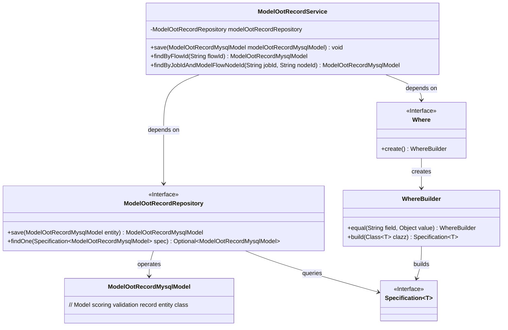
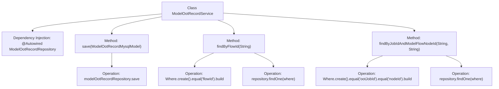

# Basic Information

|      |      |
|------|------|
| Name | ModelOotRecordService |
| Language | .java |
| Code Path | WeFe/board/board-service/src/main/java/com/welab/wefe/board/service/service/ModelOotRecordService.java |
| Package Name | com.welab.wefe.board.service.service |
| Dependencies | ['com.welab.wefe.board.service.database.entity.job.ModelOotRecordMysqlModel', 'com.welab.wefe.board.service.database.repository.ModelOotRecordRepository', 'com.welab.wefe.common.data.mysql.Where', 'org.springframework.beans.factory.annotation.Autowired', 'org.springframework.data.jpa.domain.Specification', 'org.springframework.stereotype.Service'] |
| Brief Description | The ModelOotRecordService provides save and query functionalities, supporting the retrieval of model score validation records by process ID or a combination of task ID and node ID. |

# Description

This is a Spring service class named ModelOotRecordService, primarily used for managing model scoring validation records. It interacts with the database through the auto-wired ModelOotRecordRepository. Key functionalities include: saving ModelOotRecordMysqlModel records; querying records based on process ID using Specification to construct query conditions; and performing joint queries by task ID and node ID, also utilizing Specification to build multi-condition queries. All query methods return either a single record or null.

# Class Summary

| Name   | Type  | Description |
|-------|------|-------------|
| ModelOotRecordService | class | The ModelOotRecordService provides functionality for saving and querying model scoring validation records, supporting queries by process ID or task ID and node ID. |

## Class ModelOotRecordService

|      |      |
|------|------|
| Access Modifier | @Service;public |
| Type | class |
| Name | ModelOotRecordService |
| Description | The ModelOotRecordService provides functionality for saving and querying model scoring validation records, supporting queries by process ID or task ID and node ID. |

### UML Class Diagram

This code describes a Spring service class ModelOotRecordService, which interacts with the database through the ModelOotRecordRepository interface. Its main functionalities include saving model scoring validation records, querying records by flow ID, and querying records by combining job ID and node ID. The service class uses the Where builder to create Specification query conditions, demonstrating Spring Data JPA's dynamic query capabilities. The class diagram clearly illustrates the relationship between the service layer and the persistence layer, as well as the collaborative process of query condition construction.

### Internal Method Call Graph

This flowchart illustrates the structure and key method invocation relationships of the ModelOotRecordService class. The class injects ModelOotRecordRepository via @Autowired and provides three core methods: save() for record persistence, findByFlowId() for querying records by flow ID, and findByJobIdAndModelFlowNodeId() for joint querying by job ID and node ID. Each query method uses the Where builder to construct query conditions, ultimately executing queries via the repository. The flowchart clearly presents the end-to-end logic from method calls to database operations, reflecting a typical usage pattern of Spring Data JPA.

### Field List

| Name  | Type  | Description |
|-------|-------|------|
| modelOotRecordRepository | ModelOotRecordRepository | Using @Autowired to automatically inject an instance of ModelOotRecordRepository. |

### Method List

| Name  | Type  | Description |
|-------|-------|------|
| save | void | Save the ModelOotRecordMysqlModel object to the database. |
| findByFlowId | ModelOotRecordMysqlModel | This method queries the database record by flowId, constructs the query condition using Specification, and returns the matching ModelOotRecordMysqlModel object. If no result is found, it returns null. |
| findByJobIdAndModelFlowNodeId | ModelOotRecordMysqlModel | Query the ModelOotRecordMysqlModel record based on jobId and nodeId, return null if no result is found. |

