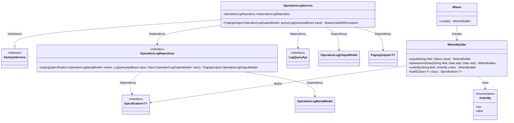
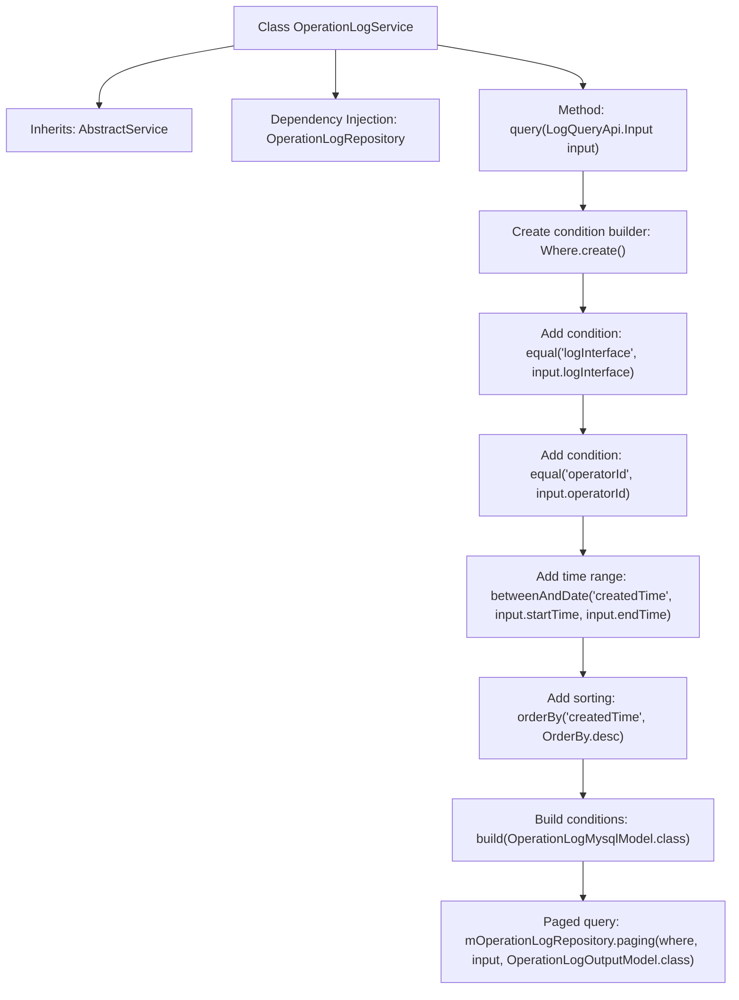

# Basic Information

|      |      |
|------|------|
| Name | OperationLogService |
| Language | .java |
| Code Path | WeFe/board/board-service/src/main/java/com/welab/wefe/board/service/service/OperationLogService.java |
| Package Name | com.welab.wefe.board.service.service |
| Dependencies | ['com.welab.wefe.board.service.api.operation.LogQueryApi', 'com.welab.wefe.board.service.database.entity.OperationLogMysqlModel', 'com.welab.wefe.board.service.database.repository.OperationLogRepository', 'com.welab.wefe.board.service.dto.base.PagingOutput', 'com.welab.wefe.board.service.dto.entity.OperationLogOutputModel', 'com.welab.wefe.common.data.mysql.Where', 'com.welab.wefe.common.data.mysql.enums.OrderBy', 'com.welab.wefe.common.exception.StatusCodeWithException', 'org.springframework.beans.factory.annotation.Autowired', 'org.springframework.data.jpa.domain.Specification', 'org.springframework.stereotype.Service'] |
| Brief Description | The OperationLogService provides log query functionality, supporting filtering by interface, operator ID, and time range, and returns paginated results. |

# Description

OperationLogService is a service class that inherits from AbstractService and is used for handling operation log queries. It injects the OperationLogRepository dependency via Autowired. The primary method, query, accepts a LogQueryApi.Input parameter and returns paginated OperationLogOutputModel results. The query conditions include exact matches for logInterface and operatorId, a time range filter for createdTime, and sorting by createdTime in descending order. Finally, it invokes the paging method of mOperationLogRepository to execute the paginated query.

# Class Summary

| Name   | Type  | Description |
|-------|------|-------------|
| OperationLogService | class | The OperationLogService provides paginated query functionality for operation logs, supporting filtering by interface, operator ID, and time range, with results sorted in descending order by creation time. |

## Class OperationLogService

|      |      |
|------|------|
| Access Modifier | @Service;public |
| Type | class |
| Name | OperationLogService |
| Description | The OperationLogService provides paginated query functionality for operation logs, supporting filtering by interface, operator ID, and time range, with results sorted in descending order by creation time. |

### UML Class Diagram

This class diagram illustrates the structural relationships of OperationLogService and its related components. OperationLogService inherits from AbstractService, depends on OperationLogRepository for data access, uses Where to construct query conditions, and returns paginated results via PagingOutput. The core functionality involves querying operation logs with dynamic conditions, supporting exact matching, date range queries, and sorting. Each component has clear responsibilities: WhereBuilder provides a fluent interface for constructing query conditions, while Repository handles concrete data access logic.

### Internal Method Call Graph

This flowchart illustrates the core query process of the OperationLogService class. Starting with the creation of a condition builder, it progressively adds field matching conditions, time range filtering, and sorting rules, ultimately executing a paged query through the Repository. The entire process strictly follows the condition builder pattern, transforming input parameters into database query specifications, demonstrating a clear chained invocation structure and data filtering logic.

### Field List

| Name  | Type  | Description |
|-------|-------|------|
| mOperationLogRepository | OperationLogRepository | Use @Autowired to automatically inject an instance of OperationLogRepository. |

### Method List

| Name  | Type  | Description |
|-------|-------|------|
| query | PagingOutput<OperationLogOutputModel> | Query operation log method, filter by interface, operator ID, and time range, return results in descending order of creation time with pagination. |

