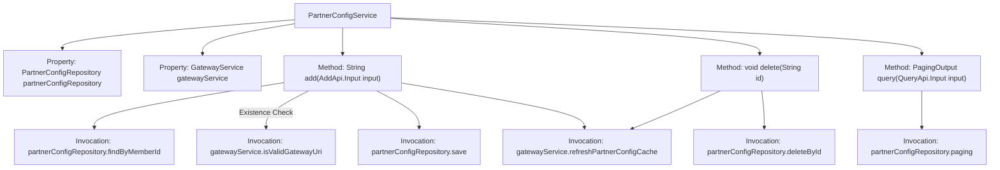

# Basic Information

|      |      |
|------|------|
| Name | PartnerConfigService |
| Language | .java |
| Code Path | WeFe/board/board-service/src/main/java/com/welab/wefe/board/service/service/PartnerConfigService.java |
| Package Name | com.welab.wefe.board.service.service |
| Dependencies | ['org.springframework.beans.factory.annotation.Autowired', 'org.springframework.stereotype.Service', 'com.welab.wefe.board.service.api.partner_config.AddApi', 'com.welab.wefe.board.service.api.partner_config.QueryApi', 'com.welab.wefe.board.service.database.entity.PartnerConfigMysqlModel', 'com.welab.wefe.board.service.database.repository.PartnerConfigRepository', 'com.welab.wefe.board.service.dto.base.PagingOutput', 'com.welab.wefe.board.service.dto.entity.PartnerConfigOutputModel', 'com.welab.wefe.common.StatusCode', 'com.welab.wefe.common.data.mysql.Where', 'com.welab.wefe.common.exception.StatusCodeWithException'] |
| Brief Description | The PartnerConfigService service class provides functionalities for adding, deleting, and querying partner configurations. During addition, it validates member IDs and gateway addresses, and notifies the gateway to update the cache after operations. The query feature supports pagination and conditional filtering. |

# Description

PartnerConfigService is a service class that inherits from AbstractService and is used to manage partner configurations. It interacts with the database through PartnerConfigRepository and relies on GatewayService for gateway address validation and cache updates. Key functionalities include: checking whether a member ID already exists when adding a configuration, validating the legality of gateway addresses, saving configurations and refreshing gateway caches; deleting configurations by ID and refreshing caches; querying configurations supports paginated queries by gateway addresses and member ID lists. All operations involve database interactions and gateway cache synchronization.

# Class Summary

| Name   | Type  | Description |
|-------|------|-------------|
| PartnerConfigService | class | The PartnerConfigService provides member configuration management, including adding (with uniqueness and gateway address validation), deleting, and paginated query functions, and notifies the gateway to update the cache after operations. |


## Class PartnerConfigService

|      |      |
|------|------|
| Access Modifier | @Service;public |
| Type | class |
| Name | PartnerConfigService |
| Description | The PartnerConfigService provides member configuration management, including adding (with uniqueness and gateway address validation), deleting, and paginated query functions, and notifies the gateway to update the cache after operations. |


### UML Class Diagram

```mermaid
classDiagram
    class AbstractService {
        <<abstract>>
    }

    class PartnerConfigService {
        -PartnerConfigRepository partnerConfigRepository
        -GatewayService gatewayService
        +String add(AddApi$Input input) StatusCodeWithException
        +void delete(String id) StatusCodeWithException
        +PagingOutput~PartnerConfigOutputModel~ query(QueryApi$Input input)
    }

    class PartnerConfigRepository {
        <<Interface>>
        +PartnerConfigMysqlModel findByMemberId(String memberId)
        +void save(PartnerConfigMysqlModel model)
        +void deleteById(String id)
        +PagingOutput~PartnerConfigOutputModel~ paging(Where where, QueryApi$Input input, Class~PartnerConfigOutputModel~ clazz)
    }

    class GatewayService {
        <<Interface>>
        +void isValidGatewayUri(String gatewayAddress)
        +void refreshPartnerConfigCache()
    }

    class PartnerConfigMysqlModel {
        -String id
        -String gatewayAddress
        -String memberId
        +String getId()
        +void setGatewayAddress(String gatewayAddress)
        +void setMemberId(String memberId)
    }

    class PartnerConfigOutputModel {
        // Output model class
    }

    class AddApi$Input {
        -String memberId
        -String gatewayAddress
    }

    class QueryApi$Input {
        -String gatewayAddress
        -List~String~ memberIdList
    }

    AbstractService <|-- PartnerConfigService
    PartnerConfigService --> PartnerConfigRepository : Dependency
    PartnerConfigService --> GatewayService : Dependency
    PartnerConfigRepository ..> PartnerConfigMysqlModel : Operates
    PartnerConfigRepository ..> PartnerConfigOutputModel : Mapping
    PartnerConfigService ..> AddApi$Input : Uses
    PartnerConfigService ..> QueryApi$Input : Uses
```

This code describes a partner configuration service system, primarily consisting of the PartnerConfigService class and its related components. The service inherits from AbstractService, performs data persistence operations through PartnerConfigRepository, and relies on GatewayService for gateway address validation and cache updates. Core functionalities include adding configurations (with duplicate checks), deleting configurations, and paginated querying of configurations, involving two data models (PartnerConfigMysqlModel and PartnerConfigOutputModel) and two input parameter structures (AddApi.Input and QueryApi.Input). The overall design reflects clear responsibility division and layered architecture principles.


### Internal Method Call Graph



This code represents the implementation of the PartnerConfigService class, primarily responsible for CRUD operations on partner configurations. The flowchart illustrates the class structure, property dependencies, and method invocation relationships. Core logic includes: validating data uniqueness and gateway address validity when adding configurations, cleaning data and refreshing cache during deletion, and supporting pagination with conditional filtering for queries. All write operations trigger gateway cache refresh to ensure data consistency. The class interacts with the database through Repository and relies on GatewayService for gateway-related operations.

### Field List

| Name  | Type  | Description |
|-------|-------|------|
| partnerConfigRepository | PartnerConfigRepository | Automatically inject the PartnerConfigRepository instance. |
| gatewayService | GatewayService | Automatically inject gateway service instances. |

### Method List

| Name  | Type  | Description |
|-------|-------|------|
| add | String | The method `add` checks if the member configuration exists, validates the gateway address, saves the new configuration, and refreshes the gateway cache, returning the configuration ID. If the configuration already exists, an exception is thrown. |
| query | PagingOutput<PartnerConfigOutputModel> | The method `query` performs paginated queries on partner configurations based on input conditions, supporting fuzzy matching of gateway addresses and filtering by member ID lists, returning paginated results. |
| delete | void | Delete the partner configuration with the specified ID and refresh the gateway cache. |


