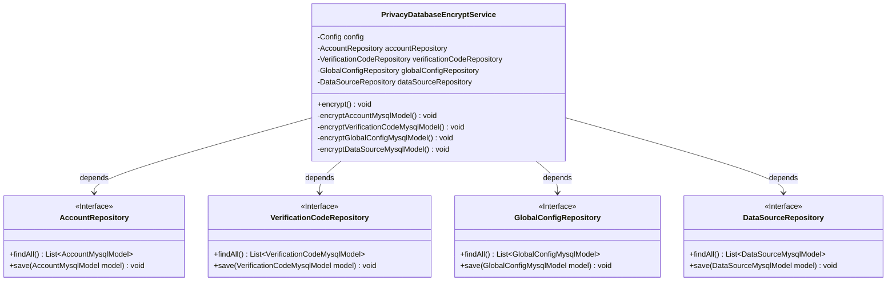
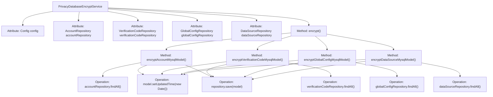

# Basic Information

|      |      |
|------|------|
| Name | PrivacyDatabaseEncryptService |
| Language | .java |
| Code Path | WeFe/board/board-service/src/main/java/com/welab/wefe/board/service/service/PrivacyDatabaseEncryptService.java |
| Package Name | com.welab.wefe.board.service.service |
| Dependencies | ['com.welab.wefe.board.service.constant.Config', 'com.welab.wefe.board.service.database.entity.AccountMysqlModel', 'com.welab.wefe.board.service.database.entity.DataSourceMysqlModel', 'com.welab.wefe.board.service.database.entity.GlobalConfigMysqlModel', 'com.welab.wefe.board.service.database.entity.VerificationCodeMysqlModel', 'com.welab.wefe.board.service.database.repository.AccountRepository', 'com.welab.wefe.board.service.database.repository.DataSourceRepository', 'com.welab.wefe.board.service.database.repository.GlobalConfigRepository', 'com.welab.wefe.board.service.database.repository.VerificationCodeRepository', 'org.springframework.beans.factory.annotation.Autowired', 'org.springframework.stereotype.Service', 'org.springframework.transaction.annotation.Transactional', 'org.springframework.util.CollectionUtils', 'java.util.Date', 'java.util.List'] |
| Brief Description | This service class is used for encrypting private data in the database, including accounts, verification codes, global configurations, and data source information. It achieves encryption by updating the timestamps of each model and saving the changes. |

# Description

The `PrivacyDatabaseEncryptService` is a Spring service class responsible for encrypting private data in databases. It accesses different data models by auto-wiring configurations and multiple repository interfaces (`AccountRepository`, `VerificationCodeRepository`, `GlobalConfigRepository`, `DataSourceRepository`). The core method `encrypt()`, annotated with transactional to ensure atomic operations, sequentially calls four private methods to handle encryption for account, verification code, global configuration, and data source models respectively. Each encryption method queries all records of the corresponding model, updates their last modified time to the current timestamp, and saves them back to the database. This service centrally manages encryption processes for various types of private data through a unified entry point.

# Class Summary

| Name   | Type  | Description |
|-------|------|-------------|
| PrivacyDatabaseEncryptService | class | The `PrivacyDatabaseEncryptService` class is used to encrypt private data in databases, including account information, verification codes, global configurations, and data source details, with the update time set to the current date. |

## Class PrivacyDatabaseEncryptService

|      |      |
|------|------|
| Access Modifier | @Service;public |
| Type | class |
| Name | PrivacyDatabaseEncryptService |
| Description | The `PrivacyDatabaseEncryptService` class is used to encrypt private data in databases, including account information, verification codes, global configurations, and data source details, with the update time set to the current date. |

### UML Class Diagram

This code demonstrates a privacy data encryption service class that handles encryption operations for different data models through four private methods. The class diagram clearly shows the dependency relationships between PrivacyDatabaseEncryptService and four Repository interfaces, which provide fundamental data access operations. Each encryption method follows a similar workflow: retrieving data lists, updating modification timestamps, and saving data. Notably, all operations are protected by @Transactional annotations to ensure data consistency. The design embodies the Single Responsibility Principle by separating encryption logic for different data types into independent methods, while achieving loose coupling through dependency injection.

### Internal Method Call Graph

This code illustrates a Spring service class `PrivacyDatabaseEncryptService` designed for encrypting private data in databases. The service processes different types of model data (account, verification code, global configuration, and data source) through four private methods. Each method retrieves data from the corresponding Repository, updates the model's `updatedTime` field, and saves it back to the database. The entire encryption operation is uniformly invoked via the `encrypt()` method, with transaction management ensuring atomicity. The flowchart clearly depicts the class structure, method invocation relationships, and data operation flow.

### Field List

| Name  | Type  | Description |
|-------|-------|------|
| config | Config | Automatically inject Config configuration instances. |
| globalConfigRepository | GlobalConfigRepository | Automatically inject global configuration repository instance. |
| dataSourceRepository | DataSourceRepository | The code snippet uses the @Autowired annotation to automatically inject an instance of DataSourceRepository. |
| verificationCodeRepository | VerificationCodeRepository | Automatically injects the CAPTCHA storage repository instance. |
| accountRepository | AccountRepository | Using @Autowired to automatically inject an instance of AccountRepository. |

### Method List

| Name  | Type  | Description |
|-------|-------|------|
| encrypt | void | Methods annotated with transactions encrypt private data such as accounts, verification codes, global configurations, and data sources, rolling back in case of exceptions. |
| encryptDataSourceMysqlModel | void | This method is used to encrypt the MySQL data source model, iterating through all models and updating the time to the current date before saving. |
| encryptAccountMysqlModel | void | Encrypt account data: Iterate through all account models, update the time to the current date, and save. |
| encryptGlobalConfigMysqlModel | void | Encrypt global configuration MySQL model: Query all configurations, and if not empty, iterate through updating the timestamp to the current time and save. |
| encryptVerificationCodeMysqlModel | void | This method is used to encrypt verification code data: query all verification code records, and if they are not empty, iterate through and update the timestamp of each record before saving. |

