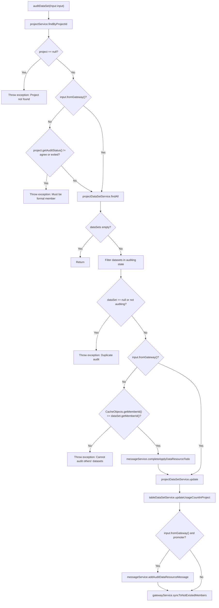

# Basic Information

|      |      |
|------|------|
| Name | ProjectDataSetAuditService |
| Language | .java |
| Code Path | WeFe/board/board-service/src/main/java/com/welab/wefe/board/service/service/ProjectDataSetAuditService.java |
| Package Name | com.welab.wefe.board.service.service |
| Dependencies | ['com.welab.wefe.board.service.api.project.dataset.AuditDataSetApi', 'com.welab.wefe.board.service.api.project.dataset.AuditDataSetApi.Input', 'com.welab.wefe.board.service.database.entity.job.ProjectDataSetMySqlModel', 'com.welab.wefe.board.service.database.entity.job.ProjectMySqlModel', 'com.welab.wefe.board.service.service.data_resource.table_data_set.TableDataSetService', 'com.welab.wefe.common.StatusCode', 'com.welab.wefe.common.exception.StatusCodeWithException', 'com.welab.wefe.common.wefe.enums.AuditStatus', 'com.welab.wefe.common.wefe.enums.JobMemberRole', 'org.springframework.beans.factory.annotation.Autowired', 'org.springframework.stereotype.Service', 'org.springframework.transaction.annotation.Transactional', 'java.util.List'] |
| Brief Description | The ProjectDataSetAuditService class is used to audit datasets, checking project status and member permissions, updating dataset audit status, and synchronizing messages and gateway data. |

# Description

ProjectDataSetAuditService is a Spring service class for auditing datasets, inheriting from AbstractService. It depends on multiple services including ProjectService and ProjectMemberService. The core method auditDataSet validates project status, dataset status, and user permissions through input parameters, executes the audit operation, and updates the dataset status. The method includes transaction management with rollback on exceptions. During the audit process, it checks conditions such as whether the project exists, whether the user is a formal member, and whether the dataset is in a pending state. Upon completion, it updates the dataset usage count and sends notification messages based on roles. The method supports both gateway and regular invocation scenarios, ensuring data consistency and permission control.

# Class Summary

| Name   | Type  | Description |
|-------|------|-------------|
| ProjectDataSetAuditService | class | The ProjectDataSetAuditService is used to audit datasets, check project status and member permissions, update dataset audit status, and synchronize messages and gateway data. |

## Class ProjectDataSetAuditService

|      |      |
|------|------|
| Access Modifier | @Service;public |
| Type | class |
| Name | ProjectDataSetAuditService |
| Description | The ProjectDataSetAuditService is used to audit datasets, check project status and member permissions, update dataset audit status, and synchronize messages and gateway data. |

### UML Class Diagram

```mermaid
classDiagram
    class AbstractService {
        <<Abstract>>
    }

    class ProjectDataSetAuditService {
        -ProjectService projectService
        -ProjectMemberService projectMemberService
        -ProjectDataSetService projectDataSetService
        -MessageService messageService
        -TableDataSetService tableDataSetService
        +auditDataSet(Input input) void
    }

    class ProjectService {
        <<Interface>>
        +findByProjectId(String projectId) ProjectMySqlModel
    }

    class ProjectMemberService {
        <<Interface>>
    }

    class ProjectDataSetService {
        <<Interface>>
        +findAll(String projectId, String dataSetId) List~ProjectDataSetMySqlModel~
        +update(ProjectDataSetMySqlModel model, Consumer~ProjectDataSetMySqlModel~ updater) void
    }

    class MessageService {
        <<Interface>>
        +completeApplyDataResourceTodo(ProjectDataSetMySqlModel dataSet) void
        +addAuditDataResourceMessage(String memberId, ProjectMySqlModel project, ProjectDataSetMySqlModel dataSet, AuditStatus status, String comment) void
    }

    class TableDataSetService {
        <<Interface>>
        +updateUsageCountInProject(String dataSetId) void
    }

    class Input {
        +getProjectId() String
        +getDataSetId() String
        +getAuditStatus() AuditStatus
        +getAuditComment() String
        +fromGateway() boolean
        +callerMemberInfo MemberInfo
    }

    class ProjectMySqlModel {
        -String projectId
        -AuditStatus auditStatus
        -boolean exited
        -JobMemberRole myRole
        +getAuditStatus() AuditStatus
        +isExited() boolean
        +getMyRole() JobMemberRole
    }

    class ProjectDataSetMySqlModel {
        -String dataSetId
        -String memberId
        -AuditStatus auditStatus
        +getAuditStatus() AuditStatus
        +getMemberId() String
        +getDataSetId() String
    }

    class StatusCodeWithException {
        +StatusCodeWithException(StatusCode code, String message)
    }

    class AuditStatus {
        <<Enumeration>>
        +auditing
        +agree
    }

    class JobMemberRole {
        <<Enumeration>>
        +promoter
    }

    AbstractService <|-- ProjectDataSetAuditService
    ProjectDataSetAuditService --> ProjectService : Dependency
    ProjectDataSetAuditService --> ProjectMemberService : Dependency
    ProjectDataSetAuditService --> ProjectDataSetService : Dependency
    ProjectDataSetAuditService --> MessageService : Dependency
    ProjectDataSetAuditService --> TableDataSetService : Dependency
    ProjectDataSetAuditService ..> Input : Uses
    ProjectDataSetAuditService ..> ProjectMySqlModel : Uses
    ProjectDataSetAuditService ..> ProjectDataSetMySqlModel : Uses
    ProjectDataSetAuditService ..> StatusCodeWithException : Throws
    Input ..> AuditStatus : Uses
    Input ..> MemberInfo : Contains
    ProjectMySqlModel ..> AuditStatus : Uses
    ProjectMySqlModel ..> JobMemberRole : Uses
    ProjectDataSetMySqlModel ..> AuditStatus : Uses
```

This code represents a project dataset audit service primarily handling dataset review workflows. ProjectDataSetAuditService inherits from AbstractService and depends on multiple service interfaces (ProjectService, ProjectMemberService, etc.). It implements the audit logic through the auditDataSet method, which checks project status, dataset status, member permissions, etc., and sends notifications via MessageService. The class diagram illustrates the dependency relationships between the service class and various interfaces, as well as the usage relationships of core model classes (e.g., ProjectMySqlModel) and enumeration types (e.g., AuditStatus).

### Internal Method Call Graph

The flowchart depicts the complete execution flow of the `auditDataSet` method in the `ProjectDataSetAuditService` class. The method first verifies the project's existence, then checks caller permissions and dataset status, proceeds to update dataset status and usage statistics, and finally determines whether to send notifications based on roles. The process includes 10 conditional branches and 7 service calls, strictly adhering to transactional and permission control requirements to ensure the integrity and security of dataset audit operations.

### Field List

| Name  | Type  | Description |
|-------|-------|------|
| projectDataSetService | ProjectDataSetService | Using @Autowired to automatically inject an instance of the ProjectDataSetService. |
| messageService | MessageService | Using @Autowired to automatically inject an instance of MessageService. |
| tableDataSetService | TableDataSetService | Automatically inject the TableDataSetService instance. |
| projectMemberService | ProjectMemberService | Automatically inject the project member service instance. |
| projectService | ProjectService | Using @Autowired to automatically inject an instance of ProjectService. |

### Method List

| Name  | Type  | Description |
|-------|-------|------|
| auditDataSet | void | The method `auditDataSet` is used to audit a dataset, checking project status, dataset status, and permissions, updating the audit status, and synchronizing information. Non-gateway requests require member permission verification, while gateway requests trigger notification messages. |

