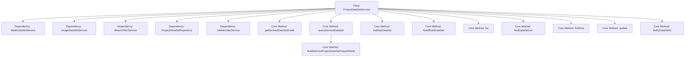
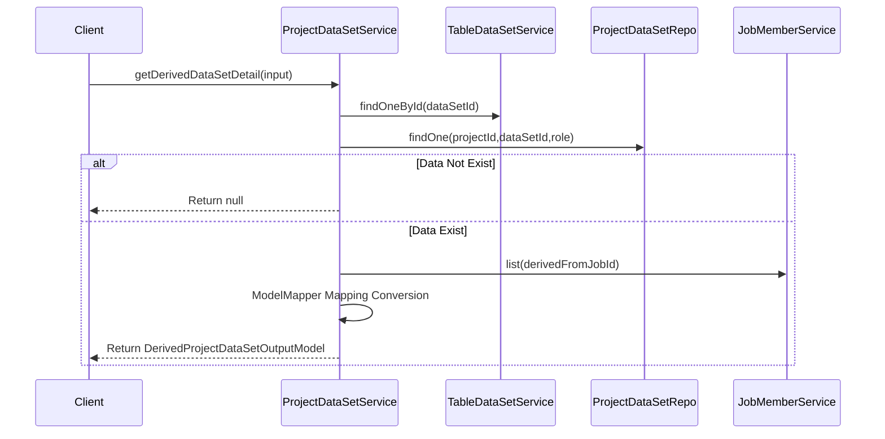

# Basic Information

|      |      |
|------|------|
| Name | ProjectDataSetService |
| Language | .java |
| Code Path | WeFe/board/board-service/src/main/java/com/welab/wefe/board/service/service/ProjectDataSetService.java |
| Package Name | com.welab.wefe.board.service.service |
| Dependencies | ['com.alibaba.fastjson.JSONObject', 'com.welab.wefe.board.service.api.gateway.GetDerivedDataSetDetailApi', 'com.welab.wefe.board.service.api.project.dataset.QueryDerivedDataSetApi', 'com.welab.wefe.board.service.database.entity.data_resource.TableDataSetMysqlModel', 'com.welab.wefe.board.service.database.entity.job.ProjectDataSetMySqlModel', 'com.welab.wefe.board.service.database.repository.ProjectDataSetRepository', 'com.welab.wefe.board.service.dto.base.PagingOutput', 'com.welab.wefe.board.service.dto.entity.data_resource.output.DataResourceOutputModel', 'com.welab.wefe.board.service.dto.entity.data_resource.output.ImageDataSetOutputModel', 'com.welab.wefe.board.service.dto.entity.data_resource.output.TableDataSetOutputModel', 'com.welab.wefe.board.service.dto.entity.job.JobMemberOutputModel', 'com.welab.wefe.board.service.dto.entity.project.data_set.DerivedProjectDataSetOutputModel', 'com.welab.wefe.board.service.dto.entity.project.data_set.ProjectDataResourceOutputModel', 'com.welab.wefe.board.service.dto.vo.JobMemberWithDataSetOutputModel', 'com.welab.wefe.board.service.service.data_resource.bloom_filter.BloomFilterService', 'com.welab.wefe.board.service.service.data_resource.image_data_set.ImageDataSetService', 'com.welab.wefe.board.service.service.data_resource.table_data_set.TableDataSetService', 'com.welab.wefe.common.StatusCode', 'com.welab.wefe.common.data.mysql.Where', 'com.welab.wefe.common.data.mysql.enums.OrderBy', 'com.welab.wefe.common.exception.StatusCodeWithException', 'com.welab.wefe.common.util.JObject', 'com.welab.wefe.common.web.util.CurrentAccountUtil', 'com.welab.wefe.common.web.util.ModelMapper', 'com.welab.wefe.common.wefe.enums.DataResourceType', 'com.welab.wefe.common.wefe.enums.DeepLearningJobType', 'com.welab.wefe.common.wefe.enums.JobMemberRole', 'org.springframework.beans.BeanUtils', 'org.springframework.beans.factory.annotation.Autowired', 'org.springframework.data.jpa.domain.Specification', 'org.springframework.stereotype.Service', 'java.util.List', 'java.util.function.Consumer', 'java.util.stream.Collectors'] |
| Brief Description | The ProjectDataSetService provides project dataset management functionalities, including querying derived dataset details, lists, and raw dataset lists, with support for conditional filtering and dataset updates. It primarily relies on components such as TableDataSetService to handle data resources. |

# Description

ProjectDataSetService is a service class that provides operations related to project datasets. Its main functionalities include: retrieving derivative dataset details, querying derivative dataset lists, listing original datasets, querying dataset lists based on conditions, and updating dataset information. The service relies on multiple components such as TableDataSetService and ImageDataSetService. The methods cover CRUD operations for datasets, support filtering by conditions like project ID, member ID, and roles, and handle dataset type conversion and exception scenarios.

# Class Summary

| Name   | Type  | Description |
|-------|------|-------------|
| ProjectDataSetService | class | The ProjectDataSetService class provides project dataset management functionalities, including querying derived/original dataset details, lists, and update operations. It supports multiple data types (tables, images, Bloom filters) and member permission controls. |

## Class ProjectDataSetService

|      |      |
|------|------|
| Access Modifier | @Service;public |
| Type | class |
| Name | ProjectDataSetService |
| Description | The ProjectDataSetService class provides project dataset management functionalities, including querying derived/original dataset details, lists, and update operations. It supports multiple data types (tables, images, Bloom filters) and member permission controls. |

### UML Class Diagram

```mermaid
classDiagram
    class ProjectDataSetService {
        -TableDataSetService tableDataSetService
        -ImageDataSetService imageDataSetService
        -BloomFilterService bloomFilterService
        -ProjectDataSetRepository projectDataSetRepo
        -JobMemberService jobMemberService
        +getDerivedDataSetDetail(GetDerivedDataSetDetailApi$Input input) DerivedProjectDataSetOutputModel
        +queryDerivedDataSet(QueryDerivedDataSetApi$Input input) PagingOutput~DerivedProjectDataSetOutputModel~
        +listRawDataSet(String projectId, DataResourceType dataResourceType, String memberId, JobMemberRole memberRole, Boolean containsY) List~ProjectDataResourceOutputModel~
        +listRawDataSet(String projectId, DataResourceType dataResourceType, String dataResourceId, String memberId, JobMemberRole memberRole, Boolean containsY, DeepLearningJobType forJobType) List~ProjectDataResourceOutputModel~
        +listAllRawDataSet(String projectId, String memberId) List~ProjectDataSetMySqlModel~
        +list(String projectId, DataResourceType dataResourceType, String memberId) List~ProjectDataResourceOutputModel~
        +findDataSetList(String projectId, String memberId, JobMemberRole memberRole) List~ProjectDataSetMySqlModel~
        +findOne(String projectId, String dataSetId, JobMemberRole memberRole) ProjectDataSetMySqlModel
        +findOne(String projectId, String dataSetId) ProjectDataSetMySqlModel
        +findAll(String projectId, String dataSetId) List~ProjectDataSetMySqlModel~
        +update(ProjectDataSetMySqlModel dataSet, Consumer~ProjectDataSetMySqlModel~ func) void
        +listByDataSetId(String projectId, String dataSetId, JobMemberRole memberRole) List~ProjectDataSetMySqlModel~
        -buildDerivedProjectDataSetOutputModel(ProjectDataSetMySqlModel projectDataSet) DerivedProjectDataSetOutputModel
    }

    class TableDataSetService {
        +findOneById(String id) TableDataSetMysqlModel
        +findDataSetFromLocalOrUnion(String memberId, String dataSetId) TableDataSetOutputModel
    }

    class ImageDataSetService {
        +findDataSetFromLocalOrUnion(String memberId, String dataSetId) ImageDataSetOutputModel
    }

    class BloomFilterService {
        +findDataSetFromLocalOrUnion(String memberId, String dataSetId) DataResourceOutputModel
    }

    class ProjectDataSetRepository {
        +paging(Specification~ProjectDataSetMySqlModel~ spec, QueryDerivedDataSetApi$Input input) PagingOutput~ProjectDataSetMySqlModel~
        +findAll(Specification~ProjectDataSetMySqlModel~ spec) List~ProjectDataSetMySqlModel~
        +findOne(Specification~ProjectDataSetMySqlModel~ spec) Optional~ProjectDataSetMySqlModel~
        +save(ProjectDataSetMySqlModel entity) ProjectDataSetMySqlModel
    }

    class JobMemberService {
        +list(String jobId, Boolean includeDeleted) List~JobMemberOutputModel~
    }

    class AbstractService {
        <<Abstract>>
        +log(Exception e) void
    }

    ProjectDataSetService --> TableDataSetService : Dependency
    ProjectDataSetService --> ImageDataSetService : Dependency
    ProjectDataSetService --> BloomFilterService : Dependency
    ProjectDataSetService --> ProjectDataSetRepository : Dependency
    ProjectDataSetService --> JobMemberService : Dependency
    ProjectDataSetService --|> AbstractService : Inheritance
```

Class Diagram Description: This diagram illustrates ProjectDataSetService as the core service class, which inherits basic functionalities from AbstractService and relies on multiple service classes (TableDataSetService, ImageDataSetService, etc.) and the data access layer (ProjectDataSetRepository) to implement dataset management capabilities. Key functionalities include derived dataset querying, raw dataset listing, dataset detail retrieval, etc., achieved by orchestrating various services to perform complex dataset management operations.

### Internal Method Call Graph

This code implements the ProjectDataSetService class, primarily handling business logic related to project datasets. The flowchart illustrates the class structure and core method invocation relationships, while the sequence diagram details the execution flow of the getDerivedDataSetDetail method. The class performs CRUD operations on various dataset types (tables, images, bloom filters) through multiple dependency services, including core functionalities like derived dataset detail queries, raw dataset list queries, conditional queries, while also handling data permission validation and exception cases.

### Field List

| Name  | Type  | Description |
|-------|-------|------|
| projectDataSetRepo | ProjectDataSetRepository | Automated injection project dataset repository instance. |
| jobMemberService | JobMemberService | Using @Autowired to automatically inject an instance of JobMemberService. |
| tableDataSetService | TableDataSetService | Automatically inject the TableDataSetService instance. |
| imageDataSetService | ImageDataSetService | Automatically inject the ImageDataSetService instance. |
| bloomFilterService | BloomFilterService | Using @Autowired to automatically inject an instance of BloomFilterService. |

### Method List

| Name  | Type  | Description |
|-------|-------|------|
| listRawDataSet | List<ProjectDataResourceOutputModel> | The method queries datasets based on conditions such as project ID and resource type, processes different types of resources, filters the results, and returns the processed resource list. |
| list | List<ProjectDataResourceOutputModel> | This method queries the project dataset based on the project ID, resource type, and member ID, converts it into an output model and populates associated data resources, and finally returns the result list. |
| buildDerivedProjectDataSetOutputModel | DerivedProjectDataSetOutputModel | Build a derived project dataset output model, copy attributes, and query related datasets. If the dataset exists, set the data resource and process the member feature list, then remotely fetch other member data. Finally, return the derived dataset model. |
| findDataSetList | List<ProjectDataSetMySqlModel> | Query the dataset list based on project ID, member ID, and role. |
| findOne | ProjectDataSetMySqlModel | Query MySQL model data based on project ID, dataset ID, and member role, returning null if no results are found. |
| listAllRawDataSet | List<ProjectDataSetMySqlModel> | The method `listAllRawDataSet` queries raw data sets based on `projectId` and `memberId`, excludes records where `sourceType` is not null, and returns the result list sorted in descending order by `createdTime`. |
| queryDerivedDataSet | PagingOutput<DerivedProjectDataSetOutputModel> | The method `queryDerivedDataSet` queries derived datasets based on input conditions, constructs WHERE clauses, and returns paginated results. It handles cases where `sourceType` is empty, sorts results in descending order by creation time, performs parallel data conversion, and returns paginated output. |
| listRawDataSet | List<ProjectDataResourceOutputModel> | This is a Java method that queries the original dataset list based on project ID, data type, member ID, role, and whether to include the Y parameter, internally calling another overloaded method. |
| getDerivedDataSetDetail | DerivedProjectDataSetOutputModel | The method retrieves derivative dataset details based on input, verifies the existence of both the dataset and project, checks that the source type is not empty, maps member and data resource information, then returns the output model. Returns null if the data does not exist, and throws an exception if the source type is empty. |
| findOne | ProjectDataSetMySqlModel | Search for the ProjectDataSetMySqlModel record with the specified project ID and dataset ID, and return null if not found. |
| findAll | List<ProjectDataSetMySqlModel> | Query the list of ProjectDataSetMySqlModel for the specified project ID and dataset ID. |
| update | void | Method for updating project dataset: Execute callback after checking non-null, set the updater, and save the data. |
| listByDataSetId | List<ProjectDataSetMySqlModel> | This method queries the project dataset list based on the project ID, dataset ID, and member role, returning a collection of MySQL models that meet the criteria. |

