# Basic Information

|      |      |
|------|------|
| Name | ProjectFlowJobService |
| Language | .java |
| Code Path | WeFe/board/board-service/src/main/java/com/welab/wefe/board/service/service/ProjectFlowJobService.java |
| Package Name | com.welab.wefe.board.service.service |
| Dependencies | ['com.alibaba.fastjson.JSONObject', 'com.welab.wefe.board.service.api.project.flow.StartFlowApi', 'com.welab.wefe.board.service.api.project.job.ResumeJobApi', 'com.welab.wefe.board.service.api.project.job.StopJobApi', 'com.welab.wefe.board.service.component.Components', 'com.welab.wefe.board.service.component.DataIOComponent', 'com.welab.wefe.board.service.component.OotComponent', 'com.welab.wefe.board.service.component.base.AbstractComponent', 'com.welab.wefe.board.service.component.base.dto.AbstractDataIOParam', 'com.welab.wefe.board.service.component.base.dto.AbstractDataSetItem', 'com.welab.wefe.board.service.database.entity.data_resource.TableDataSetMysqlModel', 'com.welab.wefe.board.service.database.entity.job', 'com.welab.wefe.board.service.database.repository', 'com.welab.wefe.board.service.dto.entity.data_resource.output.DataResourceOutputModel', 'com.welab.wefe.board.service.dto.entity.data_resource.output.TableDataSetOutputModel', 'com.welab.wefe.board.service.dto.kernel.Member', 'com.welab.wefe.board.service.dto.kernel.machine_learning.Env', 'com.welab.wefe.board.service.dto.kernel.machine_learning.JobDataSet', 'com.welab.wefe.board.service.dto.kernel.machine_learning.KernelJob', 'com.welab.wefe.board.service.dto.kernel.machine_learning.Project', 'com.welab.wefe.board.service.dto.vo.JobArbiterInfo', 'com.welab.wefe.board.service.exception.FlowNodeException', 'com.welab.wefe.board.service.model.FlowGraph', 'com.welab.wefe.board.service.model.FlowGraphNode', 'com.welab.wefe.board.service.model.JobBuilder', 'com.welab.wefe.board.service.service.data_resource.DataResourceService', 'com.welab.wefe.board.service.service.data_resource.table_data_set.TableDataSetService', 'com.welab.wefe.common.StatusCode', 'com.welab.wefe.common.exception.StatusCodeWithException', 'com.welab.wefe.common.util.DateUtil', 'com.welab.wefe.common.util.StringUtil', 'com.welab.wefe.common.web.util.CurrentAccountUtil', 'com.welab.wefe.common.wefe.checkpoint.dto.MemberAvailableCheckOutput', 'com.welab.wefe.common.wefe.enums', 'org.apache.commons.collections4.CollectionUtils', 'org.apache.commons.lang3.StringUtils', 'org.springframework.beans.BeanUtils', 'org.springframework.beans.factory.annotation.Autowired', 'org.springframework.stereotype.Service', 'org.springframework.transaction.annotation.Transactional', 'java.util', 'java.util.stream.Collectors'] |
| Brief Description | ProjectFlowJobService is a service class responsible for managing the initiation, resumption, and termination of project workflow tasks. It handles operations related to tasks, datasets, members, etc., through dependency injection of multiple service classes, and incorporates transaction processing and synchronization mechanisms. Key functionalities include initiating workflows, configuring task settings, validating task eligibility, and duplicating task information. |

# Description

ProjectFlowJobService is a Spring service class responsible for managing project workflow tasks, inheriting from AbstractService. It implements core functionalities such as workflow initiation, resumption, and termination through multiple auto-injected dependency services (e.g., JobService, TaskService). Key methods include startFlow (permission validation, task initialization), resumeJob (resuming interrupted tasks), and stopFlowJob (terminating tasks). The service incorporates strict permission controls (e.g., only creators can initiate tasks), federated learning type validation (horizontal/hybrid modes), dataset validity checks, and ensures atomic operations through transaction management. Internally, it manages task node relationships via FlowGraph, supporting task caching/reuse and error recovery mechanisms.

# Class Summary

| Name   | Type  | Description |
|-------|------|-------------|
| ProjectFlowJobService | class | The ProjectFlowJobService class is responsible for managing project flow tasks, including functionalities such as starting, pausing, and resuming tasks. It handles task creation, member management, dataset validation, and other logic through dependency injection of multiple service classes. Key methods include startFlow to initiate a process, resumeJob to resume a task, stopFlowJob to pause a task, while ensuring data consistency and permission control. |

## Class ProjectFlowJobService

|      |      |
|------|------|
| Access Modifier | @Service;public |
| Type | class |
| Name | ProjectFlowJobService |
| Description | The ProjectFlowJobService class is responsible for managing project flow tasks, including functionalities such as starting, pausing, and resuming tasks. It handles task creation, member management, dataset validation, and other logic through dependency injection of multiple service classes. Key methods include startFlow to initiate a process, resumeJob to resume a task, stopFlowJob to pause a task, while ensuring data consistency and permission control. |

### UML Class Diagram

```mermaid
classDiagram
    class ProjectFlowJobService {
        +JobService jobService
        +JobRepository jobRepo
        +TaskResultService taskResultService
        +JobMemberRepository jobMemberRepo
        +TaskResultRepository taskResultRepository
        +TaskService taskService
        +FlowActionQueueService flowActionQueueService
        +GatewayService gatewayService
        +ProjectFlowRepository projectFlowRepo
        +ProjectFlowNodeService projectFlowNodeService
        +ProjectService projectService
        +DataResourceService dataResourceService
        +ProjectFlowService projectFlowService
        +TaskRepository taskRepository
        +ProjectDataSetService projectDataSetService
        +ServiceCheckService serviceCheckService
        +TableDataSetService tableDataSetService
        +int MIX_FLOW_PROMOTER_NUM
        +String startFlow(StartFlowApi.Input input) StatusCodeWithException
        +boolean isCreator(ProjectFlowMySqlModel flow, ProjectMySqlModel project)
        +JobArbiterInfo calcArbiterInfo(ProjectFlowMySqlModel flow, StartFlowApi.Input input, ProjectMySqlModel project)
        +void resumeJob(ResumeJobApi.Input input) StatusCodeWithException
        +void stopFlowJob(StopJobApi.Input input) StatusCodeWithException
        -void setJobConfig(StartFlowApi.Input input, JobMySqlModel job, FlowGraph graph, boolean isOotMode) StatusCodeWithException
        -void checkBeforeStartFlow(FlowGraph graph, ProjectMySqlModel project, boolean isOotMode) StatusCodeWithException
        -JobMySqlModel createJob(ProjectFlowMySqlModel flow, StartFlowApi.Input input, JobMemberRole myRole)
        -List~TaskMySqlModel~ createJobTasks(JobBuilder jobBuilder, ProjectMySqlModel project, FlowGraph graph, boolean useCache, String endNodeId, FederatedLearningType federatedLearningType) StatusCodeWithException
        -void updateDataSetUsageCountInJob(KernelJob kernelJob) StatusCodeWithException
        -void copyIterationResult(JobMySqlModel oldJob, JobMySqlModel newJob, FlowGraphNode node)
        -void addPreTasks(FlowGraphNode node, List~TaskMySqlModel~ tasks, List~TaskMySqlModel~ cacheTasks)
        -List~TaskMySqlModel~ copyMixTaskInfoFromLastJob(JobMySqlModel oldJob, JobMySqlModel newJob, FlowGraphNode node, boolean copyTask)
        -TaskMySqlModel copyNodeInfoFromLastJob(JobMySqlModel oldJob, JobMySqlModel newJob, FlowGraphNode node, boolean copyTask)
        -List~JobMemberMySqlModel~ listJobMembers(String projectId, String flowId, String jobId, JobArbiterInfo jobArbiterInfo, boolean isOotMode) StatusCodeWithException
        -List~AbstractDataSetItem~ listNodeDataSetItems(ProjectFlowNodeMySqlModel node) StatusCodeWithException
        -List~JobDataSet~ listJobDataSets(JobMySqlModel job, List~FlowGraphNode~ nodes) StatusCodeWithException
    }

    class AbstractService {
        <<Abstract>>
    }

    class JobService {
        +List~JobMySqlModel~ listByJobId(String jobId)
        +void updateJob(JobMySqlModel job, Function~JobMySqlModel, JobMySqlModel~ updater)
        +void setGraphHasCacheResult(FlowGraph graph, boolean useCache)
    }

    class JobRepository {
        +JobMySqlModel findOne(String field, Object value, Class~T~ clazz)
        +JobMySqlModel findLastByFlowId(String flowId, String role)
        +void save(JobMySqlModel job)
    }

    class TaskResultService {
        +List~TaskResultMySqlModel~ listAllResult(String taskId)
    }

    class JobMemberRepository {
        +void save(JobMemberMySqlModel jobMember)
    }

    class TaskResultRepository {
        +void save(TaskResultMySqlModel taskResult)
    }

    class TaskService {
        +List~TaskMySqlModel~ listByJobId(String jobId, JobMemberRole role)
        +TaskMySqlModel findOne(String jobId, String nodeId, JobMemberRole role)
        +List~TaskMySqlModel~ findAll(String jobId, String nodeId, JobMemberRole role)
    }

    class FlowActionQueueService {
        +void runJob(Object input, String jobId, ProjectType projectType)
        +void stopJob(Object input, String jobId, ProjectType projectType)
    }

    class GatewayService {
        +void syncToOtherJobMembers(String jobId, Object input, Class~T~ apiClass)
    }

    class ProjectFlowRepository {
        +ProjectFlowMySqlModel findOne(String field, Object value, Class~T~ clazz)
    }

    class ProjectFlowNodeService {
        +List~ProjectFlowNodeMySqlModel~ findNodesByFlowId(String flowId)
        +List~ProjectFlowNodeMySqlModel~ listAboutLoadDataSetNodes(String flowId)
    }

    class ProjectService {
        +ProjectMySqlModel findByProjectId(String projectId)
    }

    class DataResourceService {
        +DataResourceOutputModel findDataResourceFromLocalOrUnion(ProjectDataSetMySqlModel projectDataSet)
        +void usageCountInJobIncrement(String dataSetId)
    }

    class ProjectFlowService {
        +void updateFlowStatus(String flowId, ProjectFlowStatus status)
    }

    class ProjectDataSetService {
        +ProjectDataSetMySqlModel findOne(String projectId, String dataSetId, JobMemberRole role)
        +List~ProjectDataSetMySqlModel~ listByDataSetId(String projectId, String dataSetId, JobMemberRole role)
    }

    class ServiceCheckService {
        +MemberAvailableCheckOutput getMemberAvailableInfo(String memberId)
    }

    class TableDataSetService {
        +TableDataSetOutputModel findDataSetFromLocalOrUnion(String memberId, String dataSetId)
        +List~TableDataSetMysqlModel~ queryAll(String jobId, ComponentType componentType)
        +void save(TableDataSetMysqlModel dataSetModel)
    }

    class JobBuilder {
        <<Utility>>
    }

    class FlowGraph {
        +List~FlowGraphNode~ getStartNodes()
        +List~FlowGraphNode~ getJobSteps(String endNodeId)
        +List~JobMemberMySqlModel~ getMembers()
        +JobMySqlModel getJob()
        +JobMySqlModel getLastJob()
    }

    class FlowGraphNode {
        +String createTaskId(JobMySqlModel job)
        +String createTaskId(JobMySqlModel job, int count)
        +List~String~ createParentTaskIds(JobMySqlModel job)
        +List~String~ createParentTaskIds(JobMySqlModel job, int count)
    }

    class KernelJob {
        +List~JobDataSet~ getDataSets()
        +List~Member~ getMembers()
        +void setFederatedLearningType(FederatedLearningType type)
        +void setProject(Project project)
        +void setMembers(List~Member~ members)
        +void setEnv(Env env)
        +void setDataSets(List~JobDataSet~ dataSets)
        +void setFederatedLearningMode(FederatedLearningModel mode)
    }

    class JobDataSet {
        +List~Member~ members
    }

    class Member {
        +String getMemberId()
        +JobMemberRole getMemberRole()
    }

    class JobArbiterInfo {
        +boolean isHasArbiter()
        +void setHasArbiter(boolean hasArbiter)
        +String getArbiterMemberId()
    }

    ProjectFlowJobService --|> AbstractService
    ProjectFlowJobService --> JobService : Dependency
    ProjectFlowJobService --> JobRepository : Dependency
    ProjectFlowJobService --> TaskResultService : Dependency
    ProjectFlowJobService --> JobMemberRepository : Dependency
    ProjectFlowJobService --> TaskResultRepository : Dependency
    ProjectFlowJobService --> TaskService : Dependency
    ProjectFlowJobService --> FlowActionQueueService : Dependency
    ProjectFlowJobService --> GatewayService : Dependency
    ProjectFlowJobService --> ProjectFlowRepository : Dependency
    ProjectFlowJobService --> ProjectFlowNodeService : Dependency
    ProjectFlowJobService --> ProjectService : Dependency
    ProjectFlowJobService --> DataResourceService : Dependency
    ProjectFlowJobService --> ProjectFlowService : Dependency
    ProjectFlowJobService --> ProjectDataSetService : Dependency
    ProjectFlowJobService --> ServiceCheckService : Dependency
    ProjectFlowJobService --> TableDataSetService : Dependency
    ProjectFlowJobService --> JobBuilder : Dependency
    ProjectFlowJobService --> FlowGraph : Dependency
    ProjectFlowJobService --> KernelJob : Dependency
    ProjectFlowJobService --> JobArbiterInfo : Dependency
    FlowGraph --> FlowGraphNode : Contains
    KernelJob --> JobDataSet : Contains
    KernelJob --> Member : Contains
    JobDataSet --> Member : Contains
```

This code demonstrates a complex federated learning task scheduling system. The main class ProjectFlowJobService is responsible for initiating, pausing, and resuming workflows by coordinating multiple services (e.g., JobService, TaskService) and components (e.g., FlowGraph, KernelJob) to orchestrate distributed tasks. The system supports various federated learning types (horizontal, vertical, hybrid) with strict permission verification, task state management, and data consistency mechanisms, reflecting a high-cohesion and low-coupling design philosophy.

### Internal Method Call Graph

This code implements the ProjectFlowJobService class, which is primarily responsible for managing project flow tasks, including core functionalities such as starting flows, resuming jobs, and stopping tasks. The flowchart clearly illustrates the invocation relationships between various methods, with startFlow serving as the core entry point that calls multiple sub-methods to complete tasks such as flow validation, job creation, and configuration setup. The class extensively utilizes service injections (e.g., jobService, taskService) to handle the persistence operations of tasks and flows, reflecting the complex business logic of multi-role collaboration in federated learning scenarios.

### Field List

| Name  | Type  | Description |
|-------|-------|------|
| taskRepository | TaskRepository | Automatically inject the TaskRepository task repository instance. |
| projectFlowService | ProjectFlowService | Using @Autowired to automatically inject an instance of ProjectFlowService. |
| projectFlowRepo | ProjectFlowRepository | Using @Autowired to automatically inject the ProjectFlowRepository instance projectFlowRepo. |
| projectFlowNodeService | ProjectFlowNodeService | Using @Autowired to automatically inject an instance of ProjectFlowNodeService. |
| taskResultRepository | TaskResultRepository | Automatically inject the TaskResultRepository instance. |
| jobService | JobService | Automatically inject JobService instances. |
| gatewayService | GatewayService | Automatically inject the GatewayService instance. |
| jobMemberRepo | JobMemberRepository | Automatically inject the JobMemberRepository instance into the jobMemberRepo variable. |
| taskService | TaskService | Using @Autowired to automatically inject a TaskService instance. |
| flowActionQueueService | FlowActionQueueService | Using @Autowired to automatically inject an instance of FlowActionQueueService. |
| projectDataSetService | ProjectDataSetService | The code snippet uses Spring's @Autowired annotation to automatically inject an instance of ProjectDataSetService. |
| dataResourceService | DataResourceService | Using @Autowired to automatically inject an instance of DataResourceService. |
| jobRepo | JobRepository | Automatically inject the JobRepository instance into the jobRepo variable. |
| projectService | ProjectService | Using @Autowired to automatically inject an instance of ProjectService. |
| tableDataSetService | TableDataSetService | Automatically inject the TableDataSetService instance. |
| taskResultService | TaskResultService | Use @Autowired to automatically inject an instance of TaskResultService. |
| serviceCheckService | ServiceCheckService | Automatically inject the ServiceCheckService service instance. |
| MIX_FLOW_PROMOTER_NUM = 2 | int | Define the static constant MIX_FLOW_PROMOTER_NUM with a value of 2. |

### Method List

| Name  | Type  | Description |
|-------|-------|------|
| startFlow | String | The method `startFlow` initiates the process, checks permissions, task status, and datasets, creates tasks while synchronizing member information, and updates the workflow status. |
| createJobTasks | List<TaskMySqlModel> | Method creates a task list, checks the starting node and cached nodes, handles the arbitrator role and hybrid federated learning type, validates parameters and builds tasks, and finally processes the cached results of the modeling node. |
| copyNodeInfoFromLastJob | TaskMySqlModel | The method copies node information from the old task to the new task, including tasks, results, and datasets, and saves it to the database. |
| calcArbiterInfo | JobArbiterInfo | The method `calcArbiterInfo` determines whether an arbiter is required based on the project type and federated learning type. Deep learning projects do not require an arbiter; in horizontal federated learning, the initiator needs an arbiter; in hybrid federated learning, a non-gateway initiator requires an arbiter. By default, it returns no arbiter. |
| setJobConfig | void | This method is used to configure task information, including creating a KernelJob object, setting up the project, member roles (such as arbiter, initiator), datasets, and federated learning mode, and finally updating the task configuration and dataset usage. |
| resumeJob | void | The transaction method `resumeJob` is used to resume a task: it checks the task's existence, permissions, and status; deep learning tasks require configuration modifications for continuation; updates the task status to "waiting to run" and notifies members synchronously. |
| copyMixTaskInfoFromLastJob | List<TaskMySqlModel> | This method copies task information from the old task to the new task, including the task itself, task results, and datasets. If the new task is empty, it returns null; otherwise, it iterates through the old task, determines whether to copy the task based on the parameters, updates the relevant attributes, and saves them. It also copies the task results and datasets to the new task, and finally returns the list of new tasks. |
| listNodeDataSetItems | List<? extends AbstractDataSetItem> | This method retrieves the dataset item list based on the node type. For DataIO and ImageDataIO types, it directly returns the dataset list from the parameters; for Oot type, it checks that the jobId is not empty before returning the dataset list; for other types, it throws an exception. Finally, it returns the dataset item list or null. |
| copyIterationResult | void | The method `copyIterationResult` copies iteration results from the old task to the new task based on the node type and federated learning type. If it is not a modeling node, it returns directly; if it is a hybrid type, it calls `copyMixTaskInfoFromLastJob`; otherwise, it calls `copyNodeInfoFromLastJob`. |
| listJobMembers | List<JobMemberMySqlModel> | The method `listJobMembers` generates a task member list by iterating through node dataset items based on parameters such as project ID and process ID, handles arbitrator logic, and returns the sorted result. |
| createJob | JobMySqlModel | Create a JobMySqlModel instance, set the learning type, role, ID, creator, name, progress, status, update time, project ID, process ID, flowchart, and remarks, and finally return the instance. |
| listJobDataSets | List<JobDataSet> | The method traverses the node list, filters nodes of specific component types, extracts dataset information, and constructs a JobDataSet list for return. It processes parameters for DataIO and Oot components, including member IDs, roles, dataset statistics, etc. |
| checkBeforeStartFlow | void | Check process initiation conditions: Ensure there is a starting node and it contains a dataset loading component; OOT mode only allows a single component; Verify the availability of each member service and the validity of datasets, including existence, authorization status, etc. |
| stopFlowJob | void | Stop the process task using transactions and synchronization locks. Check if the task exists and its status; non-promoters are not authorized to operate. Update the task status to "waiting to stop" and synchronously notify other members. |
| addPreTasks | void | The method `addPreTasks` adds the tasks cached between the current node and the end of the task list to the task list. |
| updateDataSetUsageCountInJob | void | Update dataset usage count in tasks: Iterate through task dataset member IDs and invoke the service to increment the corresponding dataset's usage count. |
| isCreator | boolean | Check if the current user is the project creator: returns true when the user role is sponsor and the account matches the process creator. |

