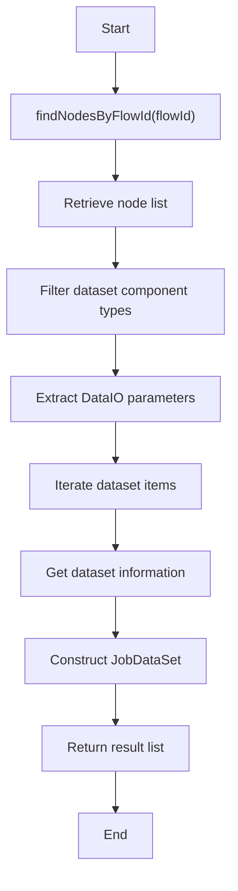
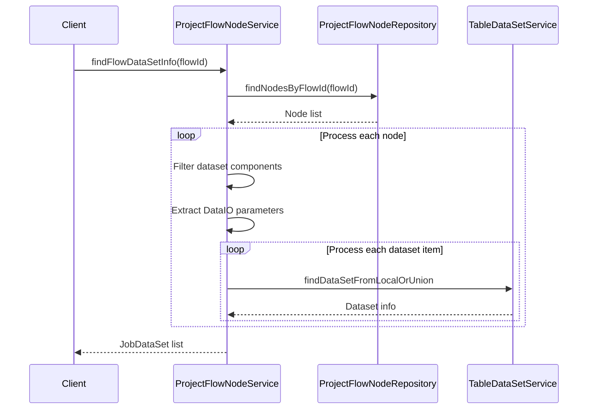
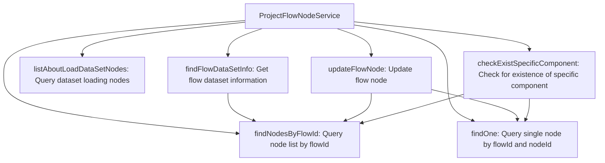
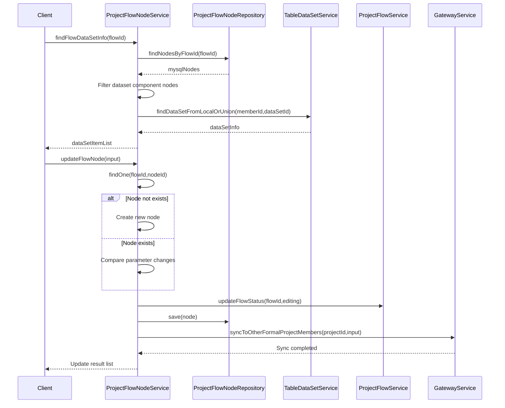

# Basic Information

|      |      |
|------|------|
| Name | ProjectFlowNodeService |
| Language | .java |
| Code Path | WeFe/board/board-service/src/main/java/com/welab/wefe/board/service/service/ProjectFlowNodeService.java |
| Package Name | com.welab.wefe.board.service.service |
| Dependencies | ['com.alibaba.fastjson.JSON', 'com.welab.wefe.board.service.api.project.node.CheckExistEvaluationComponentApi', 'com.welab.wefe.board.service.api.project.node.UpdateApi', 'com.welab.wefe.board.service.component.Components', 'com.welab.wefe.board.service.component.DataIOComponent', 'com.welab.wefe.board.service.database.entity.job.JobMySqlModel', 'com.welab.wefe.board.service.database.entity.job.ProjectFlowMySqlModel', 'com.welab.wefe.board.service.database.entity.job.ProjectFlowNodeMySqlModel', 'com.welab.wefe.board.service.database.entity.job.TaskMySqlModel', 'com.welab.wefe.board.service.database.repository.ProjectFlowNodeRepository', 'com.welab.wefe.board.service.database.repository.ProjectFlowRepository', 'com.welab.wefe.board.service.dto.entity.data_resource.output.TableDataSetOutputModel', 'com.welab.wefe.board.service.dto.entity.job.ProjectFlowNodeOutputModel', 'com.welab.wefe.board.service.dto.kernel.machine_learning.JobDataSet', 'com.welab.wefe.board.service.model.FlowGraph', 'com.welab.wefe.board.service.model.FlowGraphNode', 'com.welab.wefe.board.service.service.data_resource.table_data_set.TableDataSetService', 'com.welab.wefe.common.StatusCode', 'com.welab.wefe.common.data.mysql.Where', 'com.welab.wefe.common.exception.StatusCodeWithException', 'com.welab.wefe.common.util.StringUtil', 'com.welab.wefe.common.web.util.CurrentAccountUtil', 'com.welab.wefe.common.web.util.ModelMapper', 'com.welab.wefe.common.wefe.enums.ComponentType', 'com.welab.wefe.common.wefe.enums.JobMemberRole', 'com.welab.wefe.common.wefe.enums.ProjectFlowStatus', 'org.apache.commons.collections4.CollectionUtils', 'org.springframework.beans.factory.annotation.Autowired', 'org.springframework.data.jpa.domain.Specification', 'org.springframework.stereotype.Service', 'org.springframework.transaction.annotation.Transactional', 'java.util.ArrayList', 'java.util.Arrays', 'java.util.List', 'java.util.stream.Collectors'] |
| Brief Description | The ProjectFlowNodeService class provides process node management functionalities, including querying nodes, updating node parameters, and checking the existence of specific components. It relies on multiple services such as ProjectFlowNodeRepository and GatewayService, supporting transaction handling and parameter synchronization. |

# Description

The ProjectFlowNodeService is a service class responsible for managing operations related to project workflow nodes. Its primary functions include: locating nodes based on workflow IDs, retrieving workflow dataset information, listing nodes associated with dataset loading, updating workflow node statuses and parameters, and checking the existence of specific node types. This class leverages multiple auto-wired dependency services (such as ProjectFlowNodeRepository, GatewayService, etc.) to facilitate data access and business logic processing. It supports transactional operations and parameter change detection to ensure data consistency.

# Class Summary

| Name   | Type  | Description |
|-------|------|-------------|
| ProjectFlowNodeService | class | The ProjectFlowNodeService class provides flow node management functionalities, including querying nodes, updating node parameters, and checking the existence of specific components. It achieves data interaction through dependency injection of multiple service classes, supporting transaction processing and parameter synchronization. |

## Class ProjectFlowNodeService

|      |      |
|------|------|
| Access Modifier | @Service;public |
| Type | class |
| Name | ProjectFlowNodeService |
| Description | The ProjectFlowNodeService class provides flow node management functionalities, including querying nodes, updating node parameters, and checking the existence of specific components. It achieves data interaction through dependency injection of multiple service classes, supporting transaction processing and parameter synchronization. |

### UML Class Diagram

```mermaid
classDiagram
    class ProjectFlowNodeService {
        -ProjectFlowNodeRepository projectFlowNodeRepository
        -GatewayService gatewayService
        -ProjectFlowService projectFlowService
        -TableDataSetService tableDataSetService
        -ProjectFlowRepository projectFlowRepo
        -ProjectFlowNodeService projectFlowNodeService
        -JobService jobService
        -TaskService taskService
        +findNodesByFlowId(String flowId) List~ProjectFlowNodeMySqlModel~
        +findFlowDataSetInfo(String flowId) List~JobDataSet~
        +listAboutLoadDataSetNodes(String flowId) List~ProjectFlowNodeMySqlModel~
        +updateFlowNode(UpdateApi.Input input) List~ProjectFlowNodeOutputModel~
        +findOne(String flowId, String nodeId) ProjectFlowNodeMySqlModel
        +checkExistSpecificComponent(CheckExistEvaluationComponentApi.Input input, List~ComponentType~ targetComponentList) boolean
    }

    class ProjectFlowNodeRepository {
        <<Interface>>
        +findAll(Specification~T~ spec) List~T~
        +findOne(Specification~T~ spec) Optional~T~
        +save(T entity) T
    }

    class GatewayService {
        <<Interface>>
        +syncToOtherFormalProjectMembers(String projectId, Object input, Class~?~ apiClass) void
    }

    class ProjectFlowService {
        <<Interface>>
        +updateFlowStatus(String flowId, ProjectFlowStatus status) void
        +findOne(String flowId) ProjectFlowMySqlModel
    }

    class TableDataSetService {
        <<Interface>>
        +findDataSetFromLocalOrUnion(String memberId, String dataSetId) TableDataSetOutputModel
    }

    class JobService {
        <<Interface>>
        +createFlowGraph(String flowId) FlowGraph
        +findByJobId(String jobId, JobMemberRole role) JobMySqlModel
    }

    class TaskService {
        <<Interface>>
        +listByJobId(String jobId, JobMemberRole role) List~TaskMySqlModel~
        +findAll(String jobId, String nodeId, JobMemberRole role) List~TaskMySqlModel~
        +baseFindHomologousBranch(List~TaskMySqlModel~ totalTasks, String modelTaskId) List~TaskMySqlModel~
    }

    ProjectFlowNodeService --> ProjectFlowNodeRepository : Dependency
    ProjectFlowNodeService --> GatewayService : Dependency
    ProjectFlowNodeService --> ProjectFlowService : Dependency
    ProjectFlowNodeService --> TableDataSetService : Dependency
    ProjectFlowNodeService --> JobService : Dependency
    ProjectFlowNodeService --> TaskService : Dependency
```

Class diagram description: This diagram illustrates the relationship between ProjectFlowNodeService and its dependent service interfaces. As the core service class, ProjectFlowNodeService implements flow node management functions through six dependency interfaces, including node querying, dataset information retrieval, and flow updates. The class diagram clearly presents Spring dependency injection relationships, where Repository handles data access and various Services provide business capability support.

### Internal Method Call Graph

This code represents the ProjectFlowNodeService class, which primarily handles CRUD operations and business logic for project flow nodes. It contains six core methods: node query (findNodesByFlowId), dataset information retrieval (findFlowDataSetInfo), dataset node query (listAboutLoadDataSetNodes), node update (updateFlowNode), single node query (findOne), and component verification (checkExistSpecificComponent). The class interacts with the database through JPA repositories and relies on multiple other services to complete business processes. Notably, the updateFlowNode method implements complex node update logic and status synchronization mechanisms.

### Field List

| Name  | Type  | Description |
|-------|-------|------|
| gatewayService | GatewayService | Automatically inject the GatewayService instance. |
| projectFlowNodeService | ProjectFlowNodeService | Automatically inject the ProjectFlowNodeService service instance. |
| jobService | JobService | Using @Autowired to automatically inject an instance of JobService. |
| projectFlowNodeRepository | ProjectFlowNodeRepository | Use @Autowired to automatically inject an instance of ProjectFlowNodeRepository. |
| taskService | TaskService | Automatically inject the TaskService instance. |
| projectFlowRepo | ProjectFlowRepository | Automatically inject the ProjectFlowRepository instance with the variable name projectFlowRepo. |
| tableDataSetService | TableDataSetService | Automatically inject the TableDataSetService instance. |
| projectFlowService | ProjectFlowService | Automatically inject the ProjectFlowService instance. |

### Method List

| Name  | Type  | Description |
|-------|-------|------|
| listAboutLoadDataSetNodes | List<ProjectFlowNodeMySqlModel> | This method queries the project workflow nodes via flowId, filtering out a list of nodes with component types including data IO, image data IO, XGBoost and LR validation dataset loaders, as well as Oot types. |
| findNodesByFlowId | List<ProjectFlowNodeMySqlModel> | This method queries the ProjectFlowNodeMySqlModel list by flowId, uses the condition constructor Where to create an equal condition, and calls the repository's findAll method to return the result. |
| checkExistSpecificComponent | boolean | Check for the presence of specific components: Based on the input mode (OOT or regular process), verify whether the components in the target component list exist. In OOT mode, check the evaluation nodes; in the regular process, check the parent node type. If the data does not exist, throw an exception. |
| findFlowDataSetInfo | List<JobDataSet> | The method locates nodes based on the flowId, filters specific component types, extracts dataset parameters, and constructs a JobDataSet list containing member roles and data statistics. |
| updateFlowNode | List<ProjectFlowNodeOutputModel> | Update process node methods to handle node creation or parameter updates, automatically synchronize related node states, and notify project members. Includes parameter change detection and logic processing for specific component types. |
| findOne | ProjectFlowNodeMySqlModel | This method queries the ProjectFlowNodeMySqlModel using flowId and nodeId, constructs the query conditions with a condition builder, and returns the matching result or null. |

