# Basic Information

|      |      |
|------|------|
| Name | ProjectFlowService |
| Language | .java |
| Code Path | WeFe/board/board-service/src/main/java/com/welab/wefe/board/service/service/ProjectFlowService.java |
| Package Name | com.welab.wefe.board.service.service |
| Dependencies | ['com.alibaba.fastjson.JSON', 'com.alibaba.fastjson.JSONArray', 'com.alibaba.fastjson.JSONObject', 'com.welab.wefe.board.service.api.project.flow', 'com.welab.wefe.board.service.api.project.job.OnJobFinishedApi', 'com.welab.wefe.board.service.api.project.modeling.DetailApi', 'com.welab.wefe.board.service.api.project.modeling.QueryApi', 'com.welab.wefe.board.service.api.project.node.UpdateApi', 'com.welab.wefe.board.service.component.Components', 'com.welab.wefe.board.service.database.entity.flow.FlowTemplateMySqlModel', 'com.welab.wefe.board.service.database.entity.job', 'com.welab.wefe.board.service.database.repository', 'com.welab.wefe.board.service.dto.base.PagingOutput', 'com.welab.wefe.board.service.dto.entity.job.ProjectFlowNodeOutputModel', 'com.welab.wefe.board.service.dto.entity.job.TaskResultOutputModel', 'com.welab.wefe.board.service.dto.entity.modeling_config.ModelingInfoOutputModel', 'com.welab.wefe.board.service.dto.entity.project.ProjectFlowListOutputModel', 'com.welab.wefe.board.service.dto.entity.project.ProjectFlowProgressOutputModel', 'com.welab.wefe.board.service.dto.kernel.machine_learning.TaskConfig', 'com.welab.wefe.board.service.onlinedemo.OnlineDemoBranchStrategy', 'com.welab.wefe.common.StatusCode', 'com.welab.wefe.common.data.mysql.Where', 'com.welab.wefe.common.data.mysql.enums.OrderBy', 'com.welab.wefe.common.exception.StatusCodeWithException', 'com.welab.wefe.common.util.DateUtil', 'com.welab.wefe.common.util.JObject', 'com.welab.wefe.common.util.StringUtil', 'com.welab.wefe.common.web.util.CurrentAccountUtil', 'com.welab.wefe.common.web.util.ModelMapper', 'com.welab.wefe.common.wefe.enums', 'org.apache.commons.collections4.CollectionUtils', 'org.apache.commons.lang3.StringUtils', 'org.slf4j.Logger', 'org.slf4j.LoggerFactory', 'org.springframework.beans.BeanUtils', 'org.springframework.beans.factory.annotation.Autowired', 'org.springframework.data.jpa.domain.Specification', 'org.springframework.stereotype.Service', 'org.springframework.transaction.annotation.Transactional', 'java.util', 'java.util.stream.Collectors'] |
| Brief Description | The ProjectFlowService offers project flow management capabilities, including creating, deleting, and copying flows, updating flow information and status, handling node parameters and grid search tasks, and supporting OOT flows and model evaluation. |

# Description

ProjectFlowService is a service class based on the Spring framework, inheriting from AbstractService, responsible for managing the complete lifecycle of project workflows. This class implements core functionalities through multiple autowired dependency services (such as FlowTemplateService, ProjectService, etc.) and repositories (e.g., ProjectFlowRepository). Key features include: CRUD operations for workflows (e.g., delete, addFlow, updateFlowBaseInfo), workflow diagram updates and synchronization (updateFlowGraph), workflow copying (copy), status management (updateFlowStatus), model information queries (queryModelingInfo), as well as special operations like pinning to top (top) and OOT workflow processing (addOotFlow). All service methods employ synchronization and transactions to ensure data consistency, with cross-member collaboration facilitated through gatewayService. Exception handling returns status codes and error messages via StatusCodeWithException.

# Class Summary

| Name   | Type  | Description |
|-------|------|-------------|
| ProjectFlowService | class | The ProjectFlowService provides workflow management functionalities, including creating, deleting, and copying workflows, updating workflow information and status, handling grid search tasks, as well as querying workflow nodes and progress. It supports permission verification and status synchronization. |

## Class ProjectFlowService

|      |      |
|------|------|
| Access Modifier | @Service;public |
| Type | class |
| Name | ProjectFlowService |
| Description | The ProjectFlowService provides workflow management functionalities, including creating, deleting, and copying workflows, updating workflow information and status, handling grid search tasks, as well as querying workflow nodes and progress. It supports permission verification and status synchronization. |

### UML Class Diagram

```mermaid
classDiagram
    class ProjectFlowService {
        -Logger LOG
        +delete(DeleteApi$Input input) void
        +addFlow(AddFlowApi$Input input) String
        +updateFlowBaseInfo(UpdateFlowBaseInfoApi$Input input) void
        +updateFlowGraph(UpdateFlowGraphApi$Input input) void
        +copy(CopyFlowApi$Input input) void
        +flowFinished(OnJobFinishedApi$Input input) void
        +updateFlowStatus(String flowId, ProjectFlowStatus status) void
        +queryModelingInfo(QueryApi$Input input) PagingOutput~ModelingInfoOutputModel~
        +findModelingResult(DetailApi$Input input) TaskResultOutputModel
        +getParamsIsNullFlowNodes(String flowId) List~ProjectFlowNodeOutputModel~
        +getProgress(List~String~ flowIds) List~ProjectFlowProgressOutputModel~
        +addOotFlow(AddOotFlowApi$Input input) AddOotFlowApi$Output
        +getFlowNodes(String flowId) List~ProjectFlowNodeOutputModel~
        +top(String flowId, boolean top) void
    }

    class AbstractService {
        <<Abstract>>
    }

    class FlowTemplateService {
        <<Interface>>
    }

    class ProjectService {
        <<Interface>>
    }

    class ProjectFlowNodeService {
        <<Interface>>
    }

    class JobService {
        <<Interface>>
    }

    class TaskService {
        <<Interface>>
    }

    class ProjectMemberService {
        <<Interface>>
    }

    class ProjectFlowRepository {
        <<Interface>>
    }

    class ProjectFlowNodeRepository {
        <<Interface>>
    }

    class JobRepository {
        <<Interface>>
    }

    class TaskResultRepository {
        <<Interface>>
    }

    class TaskResultService {
        <<Interface>>
    }

    class ModelOotRecordService {
        <<Interface>>
    }

    class TaskRepository {
        <<Interface>>
    }

    ProjectFlowService --> FlowTemplateService : Dependency
    ProjectFlowService --> ProjectService : Dependency
    ProjectFlowService --> ProjectFlowNodeService : Dependency
    ProjectFlowService --> JobService : Dependency
    ProjectFlowService --> TaskService : Dependency
    ProjectFlowService --> ProjectMemberService : Dependency
    ProjectFlowService --> ProjectFlowRepository : Dependency
    ProjectFlowService --> ProjectFlowNodeRepository : Dependency
    ProjectFlowService --> JobRepository : Dependency
    ProjectFlowService --> TaskResultRepository : Dependency
    ProjectFlowService --> TaskResultService : Dependency
    ProjectFlowService --> ModelOotRecordService : Dependency
    ProjectFlowService --> TaskRepository : Dependency
    ProjectFlowService --|> AbstractService : Inheritance
```

This class diagram illustrates the core structure and dependencies of ProjectFlowService. As a workflow management service, it inherits from AbstractService and depends on 12 different service/repository interfaces, including flow template service, project service, node service, task service, etc. The service provides comprehensive lifecycle management functionalities for workflows, encompassing core operations such as creation, deletion, updating, and copying of flows, along with auxiliary features like status management, parameter handling, and progress queries. Through its rich set of interface methods, it enables full-spectrum management of federated learning workflows, supporting various business scenarios from basic information maintenance to complex state synchronization.

### Internal Method Call Graph

```mermaid
graph TD
    A["ProjectFlowService"]
    B["delete Process"]
    C["addFlow Create Process"]
    D["updateFlowBaseInfo Update Basic Info"]
    E["updateFlowGraph Update Flowchart"]
    F["copy Process"]
    G["flowFinished Process Completion Handling"]
    H["handleJobWithGridSearch Grid Search Handling"]
    I["updateFlowStatus Update Process Status"]
    J["queryModelingInfo Query Modeling Info"]
    K["findModelingResult Query Model Results"]
    L["getParamsIsNullFlowNodes Get Null Parameter Nodes"]
    M["getProgress Get Process Progress"]
    N["addOotFlow Add OOT Process"]
    O["getFlowNodes Get Process Nodes"]
    P["top Pin Process"]

    A --> B
    A --> C
    A --> D
    A --> E
    A --> F
    A --> G
    G --> H
    A --> I
    A --> J
    A --> K
    A --> L
    A --> M
    A --> N
    A --> O
    A --> P

    B --> B1["Validate Permissions"]
    B --> B2["Mark as Deleted"]
    B --> B3["Sync Status"]
    C --> C1["Validate Permissions"]
    C --> C2["Create Process"]
    C --> C3["Sync Template"]
    E --> E1["Parse Flowchart"]
    E --> E2["Update Node Relationships"]
    F --> F1["Copy Process Data"]
    F --> F2["Sync Node Info"]
    N --> N1["Validate OOT Template"]
    N --> N2["Create Record"]
```

This flowchart illustrates the core method invocation relationships of ProjectFlowService, primarily including CRUD operations for processes, status management, modeling result processing, and special features (e.g., grid search/OOT processes). The service ensures operational security through transaction management and permission validation, while multi-node synchronization is achieved via gatewayService. Key operations such as flowchart updates involve complex data structure parsing and node relationship reconstruction, while modeling-related functionalities are deeply integrated with task execution results.

### Field List

| Name  | Type  | Description |
|-------|-------|------|
| taskRepository | TaskRepository | Use @Autowired to automatically inject an instance of TaskRepository. |
| projectService | ProjectService | Using @Autowired to automatically inject an instance of ProjectService. |
| LOG = LoggerFactory.getLogger(this.getClass()) | Logger | A protected and immutable logger instance is defined in the class for logging output of the current class. |
| projectFlowRepo | ProjectFlowRepository | Automatically inject the ProjectFlowRepository instance with the variable name projectFlowRepo. |
| projectMemberService | ProjectMemberService | The code snippet uses the @Autowired annotation to automatically inject an instance of ProjectMemberService. |
| taskResultService | TaskResultService | Using @Autowired to automatically inject an instance of TaskResultService. |
| projectFlowNodeService | ProjectFlowNodeService | The code snippet uses the @Autowired annotation to automatically inject an instance of the ProjectFlowNodeService. |
| taskResultRepository | TaskResultRepository | Automatically inject the TaskResultRepository instance. |
| jobService | JobService | Automatically inject JobService instances. |
| flowTemplateService | FlowTemplateService | The code snippet uses Spring's @Autowired annotation to automatically inject an instance of FlowTemplateService. |
| taskService | TaskService | Automatically inject the TaskService instance. |
| jobRepository | JobRepository | Use @Autowired to automatically inject a JobRepository instance. |
| modelOotRecordService | ModelOotRecordService | The code snippet uses @Autowired to automatically inject an instance of ModelOotRecordService. |
| projectFlowNodeRepository | ProjectFlowNodeRepository | Automatically inject project process node repository instances. |

### Method List

| Name  | Type  | Description |
|-------|-------|------|
| updateFlowStatus | void | Method for updating process status: Check if the process exists, update the status, time, and operator, then save and update project statistics. If the process does not exist, throw an exception. |
| findOne | ProjectFlowMySqlModel | Find the project process data for the specified process ID. |
| delete | void | This method is used to delete a process, including permission verification and transaction rollback. First, it checks whether the process exists, then verifies the operation permissions (only the creator can delete or invoke via the gateway). It updates the process to a deleted state and saves it, finally synchronizing the project statistics and gateway member information. The transaction is rolled back in case of exceptions. |
| getProgress | List<ProjectFlowProgressOutputModel> | This method queries project process progress based on a list of process IDs and returns a list of output models containing progress information. It retrieves the latest task progress for each process through database queries and maps it to the output model. |
| addFlow | String | The method `addFlow` is used to create a process. After checking permissions, it generates a process ID, sets process attributes, and saves them. If it is not a gateway request and a template is used, the process diagram is updated. Finally, it synchronizes information and returns the process ID. |
| isCalculateScoreDistribution | boolean | Check if the task has training and validation metric results; return true if they exist, otherwise return false. |
| updateOldParams | void | Method for Updating Old Parameters: Use a double loop to iterate through oldParams, skip the grid_search_param node, and replace matching key-values with values from bestParams. For non-JSONObject entries, update directly; for JSONObject entries, traverse inner keys to update. |
| handleJobWithGridSearch | void | Processing tasks with grid search, extracting optimal parameters and updating task configurations and node forms. Iterate through the task list, retrieve training results, parse optimal parameters, and update task configurations and node parameters. |
| query | PagingOutput<ProjectFlowListOutputModel> | This method queries the project process list based on input conditions, including filtering criteria such as project ID, deletion status, federated learning type, etc., and sorts them by priority, sequence number, and time in descending order. The query results are supplemented with the latest task progress and creator identifier before returning paginated data. |
| findFlowsByProjectId | List<ProjectFlowMySqlModel> | The method retrieves the process list by project ID, constructs query conditions using Specification, and returns results by calling the repository. |
| getParamsIsNullFlowNodes | List<ProjectFlowNodeOutputModel> | Retrieve the list of nodes with empty parameters in the specified process ID. If a DataIO node exists and its parameters are non-empty, filter out nodes with empty parameters that support feature selection and convert them into an output model to return; otherwise, return an empty list. |
| findModelingResult | TaskResultOutputModel | This method retrieves task results based on input parameters. Returns null if the task does not exist; otherwise, it prioritizes searching for evaluation-type task results, returning the original task result if none are found. The result includes task configuration information. |
| addOotFlow | AddOotFlowApi.Output | This method is used to add an OOT process, checking job information, templates, and permissions, creating the process, and saving the record. If the process already exists, it returns directly; otherwise, it creates a new process and sets the relevant parameters. |
| updateFlowBaseInfo | void | Transactional synchronization method for updating basic process information. It checks the existence of the process and the consistency of the training type, updates the process name and description before saving, and notifies other project members synchronously. |
| getFlowNodes | List<ProjectFlowNodeOutputModel> | Get the node list based on the process ID. If it is empty, return an empty list; otherwise, map it to the output model and return. |
| top | void | The method `top` determines whether to pin or unpin the specified `flowId` based on the boolean parameter `top`, and invokes the corresponding operation in `projectFlowRepo`. |
| queryModelingInfo | PagingOutput<ModelingInfoOutputModel> | Query Modeling Information Method: Filter task results based on input conditions and return modeling information in paginated form. If parameters are required, parse the task configuration to populate them. Process flow names and component names in parallel. |
| graphNodeToFlowNode | ProjectFlowNodeMySqlModel | Convert JSON nodes to MySQL models, handle create or update logic, exclude system-type nodes, set basic attributes, and mark them as non-starting nodes. |
| copy | void | Transactional replication process method: check the target project members and process information, remotely retrieve the source process if it is not locally available, replicate the process and nodes to the target project, update the status, and notify members for synchronization. |
| updateFlowGraph | void | Method for updating processes with transactions and synchronization locks, verifying process existence before updating graph data, status, and node information, and synchronizing changes to project members. |
| flowFinished | void | The method `flowFinished` handles the task completion process: filters out tasks with non-arbitrator roles, updates project workflow status statistics, and processes tasks involving grid search. |

