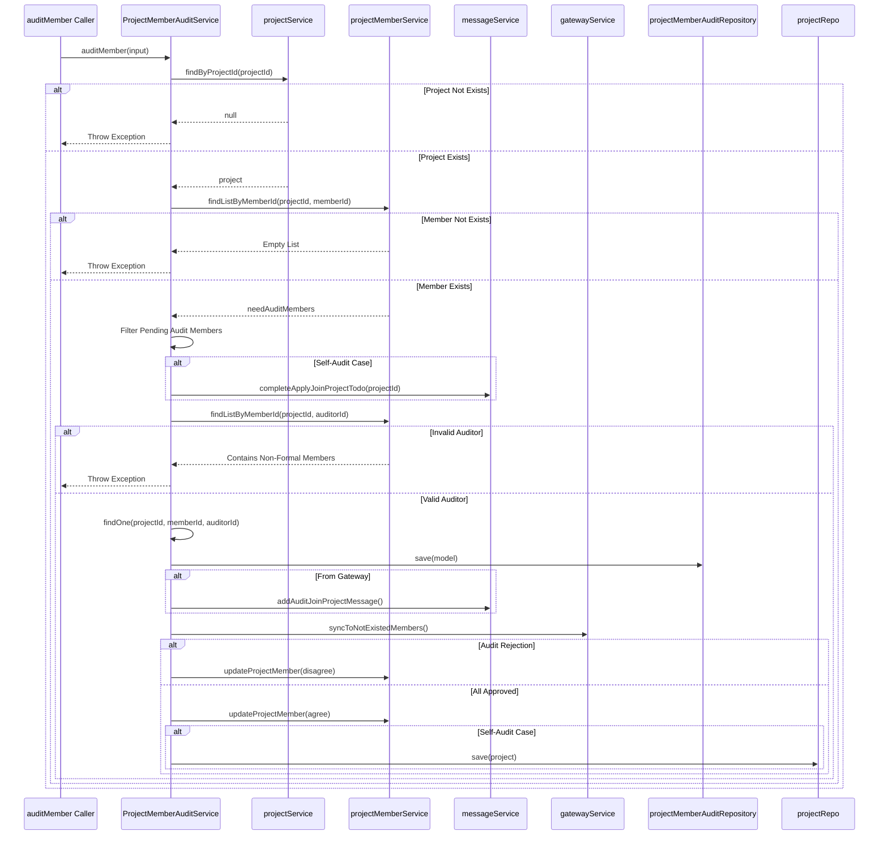

# Basic Information

|      |      |
|------|------|
| Name | ProjectMemberAuditService |
| Language | .java |
| Code Path | WeFe/board/board-service/src/main/java/com/welab/wefe/board/service/service/ProjectMemberAuditService.java |
| Package Name | com.welab.wefe.board.service.service |
| Dependencies | ['com.welab.wefe.board.service.api.project.member.audit.AuditApi', 'com.welab.wefe.board.service.database.entity.job.ProjectMemberAuditMySqlModel', 'com.welab.wefe.board.service.database.entity.job.ProjectMemberMySqlModel', 'com.welab.wefe.board.service.database.entity.job.ProjectMySqlModel', 'com.welab.wefe.board.service.database.repository.ProjectDataSetRepository', 'com.welab.wefe.board.service.database.repository.ProjectMemberAuditRepository', 'com.welab.wefe.board.service.database.repository.ProjectMemberRepository', 'com.welab.wefe.board.service.database.repository.ProjectRepository', 'com.welab.wefe.common.StatusCode', 'com.welab.wefe.common.data.mysql.Where', 'com.welab.wefe.common.exception.StatusCodeWithException', 'com.welab.wefe.common.wefe.enums.AuditStatus', 'org.springframework.beans.factory.annotation.Autowired', 'org.springframework.data.jpa.domain.Specification', 'org.springframework.stereotype.Service', 'org.springframework.transaction.annotation.Transactional', 'java.util.Date', 'java.util.List'] |
| Brief Description | The ProjectMemberAuditService provides project member audit functionalities, including querying audit records, checking whether all members have approved, and reviewing new members. It involves CRUD operations on projects, members, and datasets. |

# Description

The ProjectMemberAuditService is a service class designed for managing project member audits. It implements functionalities through multiple dependency services such as ProjectRepository and ProjectMemberRepository. Key methods include: findAllAuditList for querying audit lists, allMemberAgreed for checking whether all formal members agree to add new members, and auditMember for processing member audit requests and updating statuses.  

During the audit process, it validates project and member statuses, handles self-review scenarios, saves audit results, and notifies relevant personnel via messaging services. Audit outcomes include approval or rejection—rejections mark members as exited, while unanimous approvals update member and project statuses to "approved." Additionally, it provides findOne and listAll methods to query individual or all audit records.

# Class Summary

| Name   | Type  | Description |
|-------|------|-------------|
| ProjectMemberAuditService | class | The ProjectMemberAuditService class is used to manage project member audits, including functions such as querying audit records, checking whether all members have agreed, and reviewing new members. It ensures data consistency through transaction processing and synchronization mechanisms. |

## Class ProjectMemberAuditService

|      |      |
|------|------|
| Access Modifier | @Service;public |
| Type | class |
| Name | ProjectMemberAuditService |
| Description | The ProjectMemberAuditService class is used to manage project member audits, including functions such as querying audit records, checking whether all members have agreed, and reviewing new members. It ensures data consistency through transaction processing and synchronization mechanisms. |

### UML Class Diagram

```mermaid
classDiagram
    class ProjectMemberAuditService {
        -ProjectRepository projectRepo
        -ProjectService projectService
        -ProjectMemberRepository projectMemberRepo
        -ProjectMemberService projectMemberService
        -ProjectDataSetRepository projectDataSetRepo
        -ProjectDataSetService projectDataSetService
        -GatewayService gatewayService
        -MessageService messageService
        -ProjectMemberAuditRepository projectMemberAuditRepository
        +List~ProjectMemberAuditMySqlModel~ findAllAuditList(String projectId, String memberId)
        +boolean allMemberAgreed(String projectId, String memberId)
        +void auditMember(AuditApi.Input input) throws StatusCodeWithException
        +ProjectMemberAuditMySqlModel findOne(String projectId, String memberId, String auditorId)
        +List~ProjectMemberAuditMySqlModel~ listAll(String projectId, String memberId)
    }

    class ProjectMemberAuditMySqlModel {
        <<Entity>>
    }

    class ProjectMySqlModel {
        <<Entity>>
    }

    class ProjectMemberMySqlModel {
        <<Entity>>
    }

    class AuditApi {
        <<Interface>>
    }

    class Where {
        <<Builder>>
        +static Where create()
        +Where equal(String field, Object value)
        +Where notEqual(String field, Object value)
        +Specification~T~ build(Class~T~ clazz)
    }

    ProjectMemberAuditService --> ProjectRepository : Dependency
    ProjectMemberAuditService --> ProjectService : Dependency
    ProjectMemberAuditService --> ProjectMemberRepository : Dependency
    ProjectMemberAuditService --> ProjectMemberService : Dependency
    ProjectMemberAuditService --> ProjectDataSetRepository : Dependency
    ProjectMemberAuditService --> ProjectDataSetService : Dependency
    ProjectMemberAuditService --> GatewayService : Dependency
    ProjectMemberAuditService --> MessageService : Dependency
    ProjectMemberAuditService --> ProjectMemberAuditRepository : Dependency
    ProjectMemberAuditService --> Where : Condition Building
    ProjectMemberAuditService --> ProjectMemberAuditMySqlModel : Operates
    ProjectMemberAuditService --> ProjectMySqlModel : Operates
    ProjectMemberAuditService --> ProjectMemberMySqlModel : Operates
    ProjectMemberAuditService ..|> AuditApi : Implements
```

This class diagram illustrates the core structure and dependencies of ProjectMemberAuditService. As a Spring service, it primarily handles business logic related to project member audits, including querying audit records, checking if all members have agreed, and executing member audit operations. It relies on multiple Repository and Service classes for database operations and business logic execution, while utilizing the Where builder to create query conditions. The service interacts with entity classes such as ProjectMemberAuditMySqlModel, ProjectMySqlModel, and ProjectMemberMySqlModel, and implements partial functionality of the AuditApi interface. The overall design demonstrates clear responsibility division and layered architecture principles.

### Internal Method Call Graph

```mermaid
graph TD
    A["Class ProjectMemberAuditService"]
    B["Property: ProjectRepository projectRepo"]
    C["Property: ProjectService projectService"]
    D["Property: ProjectMemberRepository projectMemberRepo"]
    E["Property: ProjectMemberService projectMemberService"]
    F["Property: ProjectDataSetRepository projectDataSetRepo"]
    G["Property: ProjectDataSetService projectDataSetService"]
    H["Property: GatewayService gatewayService"]
    I["Property: MessageService messageService"]
    J["Property: ProjectMemberAuditRepository projectMemberAuditRepository"]
    K["Method: List<ProjectMemberAuditMySqlModel> findAllAuditList"]
    L["Method: boolean allMemberAgreed"]
    M["Method: void auditMember"]
    N["Method: ProjectMemberAuditMySqlModel findOne"]
    O["Method: List<ProjectMemberAuditMySqlModel> listAll"]

    A --> B
    A --> C
    A --> D
    A --> E
    A --> F
    A --> G
    A --> H
    A --> I
    A --> J
    A --> K
    A --> L
    A --> M
    A --> N
    A --> O
```

This code implements the ProjectMemberAuditService class, primarily used to manage the project member approval process. The class contains multiple dependent services and repositories, providing methods such as finding approval lists, checking if all members have agreed, approving members, finding individual approval records, and listing all approval statuses. The flowchart illustrates the class structure and dependencies, while the sequence diagram details the execution flow of the auditMember method, including key steps such as project validation, member checks, approval processing, message notifications, and status updates.

### Field List

| Name  | Type  | Description |
|-------|-------|------|
| projectDataSetService | ProjectDataSetService | Use @Autowired to automatically inject an instance of ProjectDataSetService. |
| projectMemberService | ProjectMemberService | Automatically inject the project member service instance. |
| projectMemberAuditRepository | ProjectMemberAuditRepository | Use @Autowired to automatically inject an instance of ProjectMemberAuditRepository. |
| gatewayService | GatewayService | Using @Autowired to automatically inject an instance of GatewayService. |
| projectMemberRepo | ProjectMemberRepository | Automatically inject project member repository instances. |
| projectService | ProjectService | Automatically inject the ProjectService instance. |
| projectDataSetRepo | ProjectDataSetRepository | Automatically inject project dataset repository instance. |
| messageService | MessageService | Using @Autowired to automatically inject an instance of MessageService. |
| projectRepo | ProjectRepository | Using @Autowired to automatically inject the ProjectRepository instance projectRepo. |

### Method List

| Name  | Type  | Description |
|-------|-------|------|
| auditMember | void | The method `auditMember` is used to review project members, verify the validity of the project and members, handle self-reviews and reviews by others, save the review results, update member statuses, and synchronize messages and gateway data. |
| findAllAuditList | List<ProjectMemberAuditMySqlModel> | This method queries the audit list based on the project ID and member ID, constructs query conditions using a conditional builder, and retrieves the results through the repository interface. |
| listAll | List<ProjectMemberAuditMySqlModel> | Query project member audit records: Retrieve all matching audit data from the database based on project ID and member ID. |
| allMemberAgreed | boolean | Check if all project members have agreed: Query the unapproved review records by project ID and member ID. If no records are found, return true. |
| findOne | ProjectMemberAuditMySqlModel | This method queries the database using the project ID, member ID, and reviewer ID, and returns a matching ProjectMemberAuditMySqlModel object. If no result is found, it returns null. |

