# Basic Information

|      |      |
|------|------|
| Name | ProjectMemberService |
| Language | .java |
| Code Path | WeFe/board/board-service/src/main/java/com/welab/wefe/board/service/service/ProjectMemberService.java |
| Package Name | com.welab.wefe.board.service.service |
| Dependencies | ['com.welab.wefe.board.service.api.project.member.AddApi', 'com.welab.wefe.board.service.api.project.member.ListInProjectApi', 'com.welab.wefe.board.service.database.entity.job', 'com.welab.wefe.board.service.database.repository.ProjectMemberAuditRepository', 'com.welab.wefe.board.service.database.repository.ProjectMemberRepository', 'com.welab.wefe.board.service.dto.entity.ProjectMemberInput', 'com.welab.wefe.common.StatusCode', 'com.welab.wefe.common.data.mysql.Where', 'com.welab.wefe.common.data.mysql.enums.OrderBy', 'com.welab.wefe.common.exception.StatusCodeWithException', 'com.welab.wefe.common.util.StringUtil', 'com.welab.wefe.common.web.util.CurrentAccountUtil', 'com.welab.wefe.common.wefe.enums.AuditStatus', 'com.welab.wefe.common.wefe.enums.FederatedLearningType', 'com.welab.wefe.common.wefe.enums.JobMemberRole', 'org.apache.commons.collections4.CollectionUtils', 'org.slf4j.Logger', 'org.slf4j.LoggerFactory', 'org.springframework.beans.factory.annotation.Autowired', 'org.springframework.data.jpa.domain.Specification', 'org.springframework.stereotype.Service', 'org.springframework.transaction.annotation.Transactional', 'java.util.ArrayList', 'java.util.HashSet', 'java.util.List', 'java.util.Set', 'java.util.function.Consumer', 'java.util.function.Function', 'java.util.stream.Collectors'] |
| Brief Description | The ProjectMemberService class is used to manage project members, providing functionalities such as adding members, querying members, and updating member statuses. It supports member operations for different roles (e.g., promoter and provider) and handles approval statuses and message notifications. |

# Description

The ProjectMemberService is a service class responsible for managing operations related to project members. Its main functionalities include adding project members, checking member existence, updating member status, querying member lists, and more. This class leverages multiple auto-injected dependency services (such as ProjectMemberRepository, ProjectService, etc.) to implement these features. When adding a member, it processes differently based on the member's role (promoter or provider) and updates the approval status and dataset status accordingly. It also includes methods for querying member lists and updating member information, ensuring the integrity and consistency of project member management.

# Class Summary

| Name   | Type  | Description |
|-------|------|-------------|
| ProjectMemberService | class | The ProjectMemberService class is used to manage project members, including adding members, checking member existence, updating member status, and querying member information. It supports member operations for different roles (such as promoters and providers), handles approval status changes, and synchronizes message notifications. |


## Class ProjectMemberService

|      |      |
|------|------|
| Access Modifier | @Service;public |
| Type | class |
| Name | ProjectMemberService |
| Description | The ProjectMemberService class is used to manage project members, including adding members, checking member existence, updating member status, and querying member information. It supports member operations for different roles (such as promoters and providers), handles approval status changes, and synchronizes message notifications. |


### UML Class Diagram

```mermaid
classDiagram
    class ProjectMemberService {
        -Logger LOG
        -ProjectMemberRepository projectMemberRepo
        -ProjectService projectService
        -GatewayService gatewayService
        -ProjectDataSetService projectDataSetService
        -JobService jobService
        -JobMemberService jobMemberService
        -ProjectMemberAuditRepository projectMemberAuditRepository
        -MessageService messageService
        +addMember(AddApi$Input input) void
        -checkExistMember(String currentMemberId, List~ProjectMemberMySqlModel~ members) boolean
        -checkMembers(List~ProjectMemberMySqlModel~ members) boolean
        -addPromoterMember(AddApi$Input input, ProjectMemberInput item) void
        -addProviderMember(AddApi$Input input, ProjectMemberInput item) void
        +listFormalProjectMembers(String projectId) List~ProjectMemberMySqlModel~
        +findListByProjectId(String projectId) List~ProjectMemberMySqlModel~
        +findOneByMemberId(String projectId, String memberId, JobMemberRole role) ProjectMemberMySqlModel
        +findListByMemberId(String projectId, String memberId) List~ProjectMemberMySqlModel~
        +updateProjectMember(ProjectMemberMySqlModel projectMemberMySqlModel, Function~ProjectMemberMySqlModel, ProjectMemberMySqlModel~ func) ProjectMemberMySqlModel
        +update(ProjectMemberMySqlModel projectMemberMySqlModel, Consumer~ProjectMemberMySqlModel~ func) ProjectMemberMySqlModel
        +findList(ListInProjectApi$Input input) List~ProjectMemberMySqlModel~
        +listFormalProjectProviders(String projectId) List~ProjectMemberMySqlModel~
    }

    class ProjectMemberMySqlModel {
        <<Entity>>
        // Attributes and methods omitted
    }

    class ProjectMemberInput {
        <<DTO>>
        // Attributes and methods omitted
    }

    class AddApi$Input {
        <<DTO>>
        // Attributes and methods omitted
    }

    class ListInProjectApi$Input {
        <<DTO>>
        // Attributes and methods omitted
    }

    class JobMemberRole {
        <<Enum>>
        // Enum values omitted
    }

    class AuditStatus {
        <<Enum>>
        // Enum values omitted
    }

    ProjectMemberService --> ProjectMemberRepository : Dependency
    ProjectMemberService --> ProjectService : Dependency
    ProjectMemberService --> GatewayService : Dependency
    ProjectMemberService --> ProjectDataSetService : Dependency
    ProjectMemberService --> JobService : Dependency
    ProjectMemberService --> JobMemberService : Dependency
    ProjectMemberService --> ProjectMemberAuditRepository : Dependency
    ProjectMemberService --> MessageService : Dependency
    ProjectMemberService --> ProjectMemberMySqlModel : Operates
    ProjectMemberService --> ProjectMemberInput : Uses
    ProjectMemberService --> AddApi$Input : Uses
    ProjectMemberService --> ListInProjectApi$Input : Uses
    ProjectMemberService --> JobMemberRole : Uses
    ProjectMemberService --> AuditStatus : Uses
```

This code demonstrates a project management service class `ProjectMemberService`, which handles operations such as adding, querying, and updating project members. The class collaborates with multiple dependent services (e.g., `ProjectService`, `GatewayService`, etc.) to fulfill its functionality. Key business logic includes verifying member existence, adding members with different roles (promoter or provider), and updating member status. The core method `addMember` implements a transactional member addition process, incorporating permission checks and state management. The class diagram clearly illustrates the dependency relationships between services and the primary data transfer objects.


### Internal Method Call Graph

```mermaid
graph TD
    A["ProjectMemberService Class"]
    B["Attribute: Logger LOG"]
    C["Attribute: ProjectMemberRepository projectMemberRepo"]
    D["Attribute: ProjectService projectService"]
    E["Attribute: GatewayService gatewayService"]
    F["Attribute: ProjectDataSetService projectDataSetService"]
    G["Attribute: JobService jobService"]
    H["Attribute: JobMemberService jobMemberService"]
    I["Attribute: ProjectMemberAuditRepository projectMemberAuditRepository"]
    J["Attribute: MessageService messageService"]
    K["Method: addMember(AddApi.Input input)"]
    L["Method: checkExistMember(String currentMemberId, List<ProjectMemberMySqlModel> members)"]
    M["Method: checkMembers(List<ProjectMemberMySqlModel> members)"]
    N["Method: addPromoterMember(AddApi.Input input, ProjectMemberInput item)"]
    O["Method: addProviderMember(AddApi.Input input, ProjectMemberInput item)"]
    P["Method: listFormalProjectMembers(String projectId)"]
    Q["Method: findListByProjectId(String projectId)"]
    R["Method: findOneByMemberId(String projectId, String memberId, JobMemberRole role)"]
    S["Method: findListByMemberId(String projectId, String memberId)"]
    T["Method: updateProjectMember(ProjectMemberMySqlModel projectMemberMySqlModel, Function<ProjectMemberMySqlModel, ProjectMemberMySqlModel> func)"]
    U["Method: update(ProjectMemberMySqlModel projectMemberMySqlModel, Consumer<ProjectMemberMySqlModel> func)"]
    V["Method: findList(ListInProjectApi.Input input)"]
    W["Method: listFormalProjectProviders(String projectId)"]

    A --> B
    A --> C
    A --> D
    A --> E
    A --> F
    A --> G
    A --> H
    A --> I
    A --> J
    A --> K
    A --> L
    A --> M
    A --> N
    A --> O
    A --> P
    A --> Q
    A --> R
    A --> S
    A --> T
    A --> U
    A --> V
    A --> W
```



This code represents the implementation of the `ProjectMemberService` class, primarily used for managing project member-related operations. The class leverages multiple auto-wired services and repositories to achieve functionalities such as adding members, checking member existence, and updating member information. The core method `addMember` handles the logic for adding members, invoking different addition methods based on member roles (promoter or provider), and performing relevant data validation and status updates. Other methods provide functionalities for querying, updating, and validating project member information, ensuring the integrity and consistency of project member management.

### Field List

| Name  | Type  | Description |
|-------|-------|------|
| projectService | ProjectService | Using @Autowired to automatically inject an instance of ProjectService. |
| projectMemberRepo | ProjectMemberRepository | Use @Autowired to automatically inject an instance of ProjectMemberRepository with the variable name projectMemberRepo. |
| messageService | MessageService | Automatically inject the MessageService instance. |
| jobService | JobService | Automatically inject JobService instances. |
| projectMemberAuditRepository | ProjectMemberAuditRepository | Use @Autowired to automatically inject an instance of ProjectMemberAuditRepository. |
| jobMemberService | JobMemberService | Using @Autowired to automatically inject an instance of JobMemberService. |
| LOG = LoggerFactory.getLogger(this.getClass()) | Logger | A protected and immutable logger instance is defined in the class for logging output of the current class. |
| gatewayService | GatewayService | Automatically inject the GatewayService instance. |
| projectDataSetService | ProjectDataSetService | Using @Autowired to automatically inject an instance of ProjectDataSetService. |

### Method List

| Name  | Type  | Description |
|-------|-------|------|
| listFormalProjectMembers | List<ProjectMemberMySqlModel> | This method queries the formal member list of a specified project, with conditions including matching the project ID, approval status as agreed, and not having exited. It returns all member data that meets the criteria. |
| findListByProjectId | List<ProjectMemberMySqlModel> | This method retrieves a list of project members based on the project ID, sorted in ascending order by creation time, and returns the collection of member data that meets the criteria. |
| updateProjectMember | ProjectMemberMySqlModel | Methods for updating project member information: If the input is empty, return empty; otherwise, apply the function to update member information and set the updater, then save and return the updated data. |
| addMember | void | The method `addMember` is used to add project members, check whether a member already exists, add different members based on roles, clear historical review records, send notification messages, and synchronize updates for other members. |
| findListByMemberId | List<ProjectMemberMySqlModel> | This method queries the project member list by project ID and member ID, using a condition builder to filter database records and return the results. |
| checkExistMember | boolean | Check member existence: Filter initiators who have not exited, ensure ID uniqueness and quantity ≥ 2, return existence if current member has not exited. |
| update | ProjectMemberMySqlModel | Update the project member MySQL model, execute custom operations if the model is not empty, set the updater, and save. |
| checkMembers | boolean | Check project member validity: Filter members who have not exited and are approved, ensuring there are at least 2 initiators and no duplicate member IDs. |
| addPromoterMember | void | The method `addPromoterMember` is used to add project promoter members: it checks whether the member exists, creates a new member and sets the review status to "Under Review" if the member does not exist, updates the dataset status, and synchronizes project information if it is an invited member. |
| findOneByMemberId | ProjectMemberMySqlModel | This method queries project members by project ID, member ID, and role, returning matching database records or null. |
| addProviderMember | void | The method `addProviderMember` is used to add project members. If a member does not exist, a new one will be created. The approval status is set based on the call source: when invoked via the gateway, the initiator is automatically approved; otherwise, manual approval is required. It updates the member status and dataset approval status, and synchronizes project information if the member is invited. |
| findList | List<ProjectMemberMySqlModel> | The method retrieves the member list based on the project ID. If the input includes the original task ID, it further verifies member validity. In vertical federated learning, exited members are prohibited from operations, and the final output is a list of valid members. A data-not-found error is thrown in case of exceptions. |
| listFormalProjectProviders | List<ProjectMemberMySqlModel> | Method to list project's official suppliers: Filter the member list based on project ID to show those who have passed review, have not exited, and have the role of supplier. |


