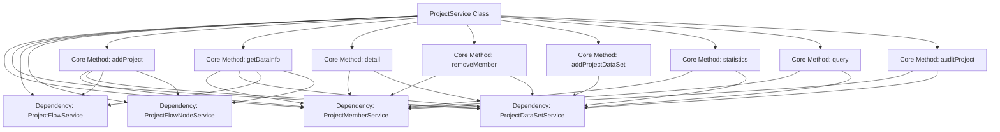
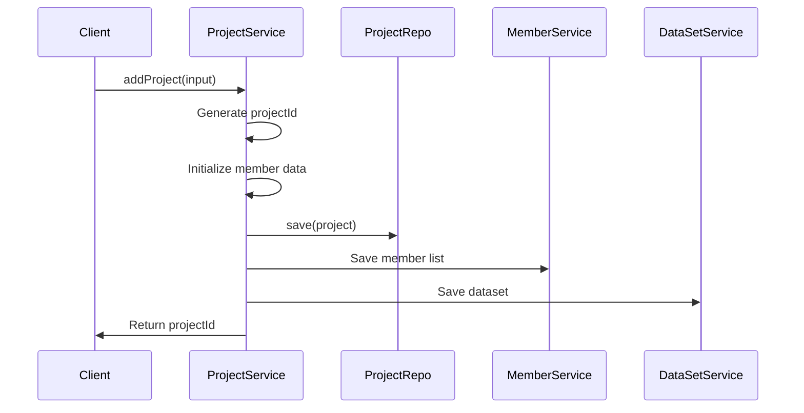

# Basic Information

|      |      |
|------|------|
| Name | ProjectService |
| Language | .java |
| Code Path | WeFe/board/board-service/src/main/java/com/welab/wefe/board/service/service/ProjectService.java |
| Package Name | com.welab.wefe.board.service.service |
| Dependencies | ['com.welab.wefe.board.service.api.project.dataset.AddDataSetApi', 'com.welab.wefe.board.service.api.project.dataset.RemoveDataSetApi', 'com.welab.wefe.board.service.api.project.member.ExitProjectApi', 'com.welab.wefe.board.service.api.project.member.ListInProjectApi', 'com.welab.wefe.board.service.api.project.member.RemoveApi', 'com.welab.wefe.board.service.api.project.project', 'com.welab.wefe.board.service.database.entity.job', 'com.welab.wefe.board.service.database.repository', 'com.welab.wefe.board.service.dto.base.PagingOutput', 'com.welab.wefe.board.service.dto.entity.ProjectDataSetInput', 'com.welab.wefe.board.service.dto.entity.ProjectMemberInput', 'com.welab.wefe.board.service.dto.entity.project.ProjectDetailMemberOutputModel', 'com.welab.wefe.board.service.dto.entity.project.ProjectMemberOutputModel', 'com.welab.wefe.board.service.dto.entity.project.ProjectOutputModel', 'com.welab.wefe.board.service.dto.entity.project.ProjectQueryOutputModel', 'com.welab.wefe.board.service.dto.entity.project.data_set.ProjectDataResourceOutputModel', 'com.welab.wefe.board.service.dto.vo.AuditStatusCounts', 'com.welab.wefe.board.service.dto.vo.ProjectFlowStatisticsResult', 'com.welab.wefe.board.service.dto.vo.RoleCounts', 'com.welab.wefe.board.service.onlinedemo.OnlineDemoBranchStrategy', 'com.welab.wefe.board.service.service.account.AccountService', 'com.welab.wefe.board.service.service.data_resource.DataResourceService', 'com.welab.wefe.common.Convert', 'com.welab.wefe.common.StatusCode', 'com.welab.wefe.common.data.mysql.Where', 'com.welab.wefe.common.exception.StatusCodeWithException', 'com.welab.wefe.common.util.StringUtil', 'com.welab.wefe.common.util.ThreadUtil', 'com.welab.wefe.common.web.dto.AbstractApiInput', 'com.welab.wefe.common.web.util.CurrentAccountUtil', 'com.welab.wefe.common.web.util.ModelMapper', 'com.welab.wefe.common.wefe.enums.AuditStatus', 'com.welab.wefe.common.wefe.enums.FederatedLearningType', 'com.welab.wefe.common.wefe.enums.JobMemberRole', 'com.welab.wefe.common.wefe.enums.ProjectFlowStatus', 'org.apache.commons.collections4.CollectionUtils', 'org.apache.commons.lang3.StringUtils', 'org.springframework.beans.factory.annotation.Autowired', 'org.springframework.data.jpa.domain.Specification', 'org.springframework.stereotype.Service', 'org.springframework.transaction.annotation.Transactional', 'java.util', 'java.util.stream.Collectors'] |
| Brief Description | The ProjectService class is a service class for project management systems, with main functionalities including: creating projects, managing project members, dataset review, project status updates, data synchronization, etc. Core methods include addProject (add new project), auditProject (review project), removeMember (remove member), addProjectDataSet (add dataset), etc. It supports transaction processing, permission verification, data synchronization, and message notifications. |

# Description

ProjectService is a project management system service class that provides full lifecycle management functionalities for projects. Key features include: project creation, member management (add/remove/review), dataset management (add/delete), project information query (details/statistics/pagination), and project status management (exit/close/pin). The service ensures transactional consistency through @Transactional and integrates multiple sub-services (ProjectMemberService/ProjectDataSetService, etc.) and repository layers (ProjectRepository, etc.) to implement business logic. Core capabilities encompass: multi-role permission control (promoter/provider), review process management (auditing/agree/disagree), data synchronization mechanism (gatewayService), and resource usage statistics (updateUsageCountInProject). The system supports project workflow status tracking, dataset review, and member collaboration management, with operation notifications delivered via the messaging service (messageService).

# Class Summary

| Name   | Type  | Description |
|-------|------|-------------|
| ProjectService | class | The ProjectService class is a Spring service component that provides project management functionalities, including project creation, member addition/removal, dataset operations, approval workflows, and project status updates. Core features involve transaction handling, data synchronization, permission control, and message notifications, supporting multi-role collaboration and audit trails. |

## Class ProjectService

|      |      |
|------|------|
| Access Modifier | @Service;public |
| Type | class |
| Name | ProjectService |
| Description | The ProjectService class is a Spring service component that provides project management functionalities, including project creation, member addition/removal, dataset operations, approval workflows, and project status updates. Core features involve transaction handling, data synchronization, permission control, and message notifications, supporting multi-role collaboration and audit trails. |

### UML Class Diagram

```mermaid
classDiagram
    class ProjectService {
        <<Service>>
        -ProjectMemberService projectMemberService
        -ProjectDataSetService projectDataSetService
        -ProjectFlowService projectFlowService
        -ProjectFlowNodeService projectFlowNodeService
        -JobService jobService
        -ProjectService projectService
        -ProjectRepository projectRepo
        -ProjectMemberRepository projectMemberRepo
        -ProjectDataSetRepository projectDataSetRepo
        -ProjectMemberAuditRepository projectMemberAuditRepository
        -ProjectMemberAuditService projectMemberAuditService
        -ProjectFlowRepository projectFlowRepository
        -ProjectFlowNodeRepository projectFlowNodeRepository
        -DataResourceService dataResourceService
        -MessageService messageService
        -AccountService accountService
        +String addProject(AddApi.Input input) throws StatusCodeWithException
        +DataInfoApi.Output getDataInfo(DataInfoApi.Input input) throws StatusCodeWithException
        +ProjectOutputModel detail(String projectId) throws StatusCodeWithException
        +void removeMember(RemoveApi.Input input) throws StatusCodeWithException
        +ProjectMySqlModel addProjectDataSet(AddDataSetApi.Input input) throws StatusCodeWithException
        +void removeDataSet(RemoveDataSetApi.Input input) throws Exception
        +CountStatisticsApi.Output statistics(QueryApi.Input input)
        +PagingOutput~ProjectQueryOutputModel~ query(QueryApi.Input input)
        +void updateProject(UpdateProjectApi.Input input) throws StatusCodeWithException
        +ProjectMySqlModel findByProjectId(String projectId)
        +void auditProject(AuditApi.Input input) throws StatusCodeWithException
        +void syncAuditProjectInfo(String projectId, AuditApi.Input input) throws StatusCodeWithException
        +void pullNewestProjectInfo(AbstractApiInput input, String projectId, String callerMemberId, JobMemberRole myRole) throws StatusCodeWithException
        +DataInfoApi.Output getPromoterDataInfo(String projectId, String callerMemberId) throws StatusCodeWithException
        +void exitProject(ExitProjectApi.Input input) throws StatusCodeWithException
        +void closeProject(CloseProjectApi.Input input, boolean byScheduledJob) throws StatusCodeWithException
        +void updateFlowStatusStatistics(String projectId)
        +ProjectMySqlModel findProjectByJobId(String jobId)
        +void top(String projectId, boolean top)
    }

    class ProjectMemberService {
        <<Service>>
        +List~ProjectMemberMySqlModel~ findListByProjectId(String projectId)
        +ProjectMemberMySqlModel findOneByMemberId(String projectId, String memberId, JobMemberRole memberRole)
        +void updateProjectMember(ProjectMemberMySqlModel member, Function~ProjectMemberMySqlModel, ProjectMemberMySqlModel~ updater)
        +List~ProjectMemberMySqlModel~ listFormalProjectMembers(String projectId)
    }

    class ProjectDataSetService {
        <<Service>>
        +List~ProjectDataSetMySqlModel~ findDataSetList(String projectId, String memberId, JobMemberRole memberRole)
        +ProjectDataSetMySqlModel findOne(String projectId, String dataSetId, JobMemberRole memberRole)
        +List~ProjectDataSetMySqlModel~ listAllRawDataSet(String projectId, String memberId)
        +List~ProjectDataResourceOutputModel~ listRawDataSet(String projectId, String memberId, JobMemberRole memberRole, AuditStatus auditStatus, Boolean exited)
    }

    class ProjectFlowService {
        <<Service>>
        +List~ProjectFlowMySqlModel~ findFlowsByProjectId(String projectId)
        +ProjectFlowMySqlModel findOne(String flowId)
    }

    class ProjectFlowNodeService {
        <<Service>>
        +List~ProjectFlowNodeMySqlModel~ findNodesByFlowId(String flowId)
        +ProjectFlowNodeMySqlModel findOne(String flowId, String nodeId)
    }

    class JobService {
        <<Service>>
        +List~JobMySqlModel~ listByJobId(String jobId)
    }

    class MessageService {
        <<Service>>
        +void addApplyJoinProjectMessage(String memberId, String projectId, String projectName)
        +void addApplyDataResourceMessage(String memberId, ProjectMySqlModel project, ProjectDataSetMySqlModel dataSet)
        +void completeApplyJoinProjectTodo(String projectId)
        +void addAuditJoinProjectMessage(String memberId, ProjectMySqlModel project, AuditStatus auditStatus, String auditComment)
    }

    class DataResourceService {
        <<Service>>
        +void updateUsageCountInProject(String dataSetId)
        +void delete(String dataSetId, DataResourceType dataResourceType)
    }

    class AccountService {
        <<Service>>
    }

    class ProjectRepository {
        <<Repository>>
        +void save(ProjectMySqlModel project)
        +ProjectMySqlModel findOne(String field, Object value, Class~ProjectMySqlModel~ clazz)
        +List~Object[]~ query(String sql)
        +List~ProjectMySqlModel~ queryByClass(String sql, Class~ProjectMySqlModel~ clazz)
        +void updateById(String id, String field, Object value, Class~ProjectMySqlModel~ clazz)
        +void updateById(String id, Map~String, Object~ params, Class~ProjectMySqlModel~ clazz)
        +void top(String projectId)
        +void cancelTop(String projectId)
    }

    class ProjectMemberRepository {
        <<Repository>>
        +void save(ProjectMemberMySqlModel member)
        +void updateById(String id, Map~String, Object~ params, Class~ProjectMemberMySqlModel~ clazz)
    }

    class ProjectDataSetRepository {
        <<Repository>>
        +void save(ProjectDataSetMySqlModel dataSet)
        +void disableDataSetWhenMemberExist(String projectId, String memberId, String memberRole)
        +int queryNeedAuditDataSetCount(String projectId, String memberId)
        +void updateById(String id, Map~String, Object~ params, Class~ProjectDataSetMySqlModel~ clazz)
    }

    class ProjectMemberAuditRepository {
        <<Repository>>
        +List~ProjectMemberAuditMySqlModel~ findAll(Specification~ProjectMemberAuditMySqlModel~ spec)
        +void deleteAuditingRecord(String projectId, String memberId)
    }

    class ProjectFlowRepository {
        <<Repository>>
        +List~Object[]~ countProjectFlowStatus(String projectId)
        +void save(ProjectFlowMySqlModel flow)
    }

    class ProjectFlowNodeRepository {
        <<Repository>>
        +void save(ProjectFlowNodeMySqlModel node)
    }

    ProjectService --> ProjectMemberService : Dependency
    ProjectService --> ProjectDataSetService : Dependency
    ProjectService --> ProjectFlowService : Dependency
    ProjectService --> ProjectFlowNodeService : Dependency
    ProjectService --> JobService : Dependency
    ProjectService --> MessageService : Dependency
    ProjectService --> DataResourceService : Dependency
    ProjectService --> AccountService : Dependency
    ProjectService --> ProjectRepository : Dependency
    ProjectService --> ProjectMemberRepository : Dependency
    ProjectService --> ProjectDataSetRepository : Dependency
    ProjectService --> ProjectMemberAuditRepository : Dependency
    ProjectService --> ProjectFlowRepository : Dependency
    ProjectService --> ProjectFlowNodeRepository : Dependency
```

### Internal Method Call Graph

This flowchart illustrates the core architecture of ProjectService and its primary method invocation relationships. The class diagram shows its dependencies on multiple sub-services (e.g., ProjectMemberService, ProjectDataSetService) and includes 7 core business methods. The sequence diagram details the execution flow of the addProject method: after client invocation, the service sequentially completes project ID generation, data initialization, database storage operations, and finally returns the result. The design adopts a layered architecture with clear separation of business logic, achieving loose coupling through dependency injection, while key operations incorporate transaction management and exception handling mechanisms.

### Field List

| Name  | Type  | Description |
|-------|-------|------|
| jobService | JobService | Using @Autowired to automatically inject an instance of JobService. |
| projectService | ProjectService | Using @Autowired to automatically inject an instance of ProjectService. |
| projectMemberAuditService | ProjectMemberAuditService | Use @Autowired to automatically inject an instance of the ProjectMemberAuditService. |
| projectMemberRepo | ProjectMemberRepository | Automatically inject project member repository instances. |
| projectDataSetService | ProjectDataSetService | Automatically inject the ProjectDataSetService instance. |
| messageService | MessageService | Automatically inject the MessageService instance. |
| projectRepo | ProjectRepository | Using @Autowired to automatically inject an instance of ProjectRepository. |
| projectFlowService | ProjectFlowService | Automatically inject the ProjectFlowService instance. |
| projectDataSetRepo | ProjectDataSetRepository | Automated injection of project dataset repository instances. |
| accountService | AccountService | Use @Autowired to automatically inject an instance of AccountService. |
| projectFlowRepository | ProjectFlowRepository | Automatically inject the ProjectFlowRepository instance. |
| dataResourceService | DataResourceService | Use @Autowired to automatically inject an instance of DataResourceService. |
| projectMemberService | ProjectMemberService | Automatically inject the ProjectMemberService service instance. |
| projectMemberAuditRepository | ProjectMemberAuditRepository | Use @Autowired to automatically inject an instance of ProjectMemberAuditRepository. |
| projectFlowNodeRepository | ProjectFlowNodeRepository | Automatically inject project process node repository instances. |
| projectFlowNodeService | ProjectFlowNodeService | Automatically inject project process node service instances. |

### Method List

| Name  | Type  | Description |
|-------|-------|------|
| updateProject | void | Transactional synchronous update item method, checks permissions before updating item information and synchronizing it to the gateway. |
| removeDataSet | void | This method is used to delete project datasets, including permission verification and data source processing. For non-gateway requests, project status and user roles must be validated. Original datasets can only be deleted by their creators or promoters, while derived datasets can only be deleted by promoters. After deletion, the dataset usage count is updated and synchronized to other members. |
| buildJobOutputModel | ProjectQueryOutputModel | This method converts project data into an output model, populates the member list and sets sponsor information, while also counting the number of datasets requiring review. It returns the complete project query output model. |
| pullNewestProjectInfo | void | The method `pullNewestProjectInfo` is used to update or create project information. If the project does not exist, it creates a new project, members, and datasets; if it exists, it updates the project information, member statuses, and dataset review statuses. The process involves CRUD operations on projects, members, and datasets. |
| statistics | CountStatisticsApi.Output | This method counts the number of different roles and review statuses in the project. First, it groups and counts by role to ensure all roles are recorded; then it groups and counts by review status, similarly ensuring all statuses are recorded; finally, it returns the total count along with the two statistical results. |
| addProject | String | The method `addProject` is used to create a project, process input parameters to generate a project ID, set member roles and datasets, save project information to the database, and send relevant notification messages. If the request is not from a gateway, the project creator is automatically approved; otherwise, the request requires review. |
| closeProject | void | Method for closing a project: Check project existence and permissions, set the closed status and time, update data resource usage counts, and notify other members. When closed by a scheduled task, the operator is the administrator; otherwise, it is the project initiator. |
| query | PagingOutput<ProjectQueryOutputModel> | This method performs project queries, constructs SQL statements, and adds conditions, sorting, and pagination, returning paginated results. It includes fields such as project ID, status, time, etc., and processes data using parallel streams. |
| syncAuditProjectInfo | void | The method synchronously reviews project information, including members, datasets, and process nodes. It checks the initiator member, calls external services to retrieve data, updates or inserts member and dataset statuses, filters and saves eligible processes and nodes. |
| getDataInfo | DataInfoApi.Output | The method `getDataInfo` retrieves project information based on input parameters, including project members, datasets, workflows, and nodes. It throws an exception if the project does not exist. The method returns an output object containing all relevant data. |
| getPromoterDataInfo | DataInfoApi.Output | Obtain project initiator data information: By invoking the gateway service to search for the initiator among project members, retrieve their data information if present; otherwise, throw an exception. |
| exitProject | void | Method for handling project exit logic: Check project existence, verify role permissions, update project and member statuses, disable related datasets, delete pending review records, and update dataset usage counts. |
| buildQueryWhere | String | This method dynamically constructs SQL query conditions based on input parameters, including member ID, role, project type, name, creation time range, status, and other conditions, while handling logical relationships. |
| removeMember | void | The transactional synchronous method `removeMember` validates the project and permissions, marks the member as exited, processes related datasets, and synchronizes with the gateway. If removing oneself, it marks the project as exited. |
| detail | ProjectOutputModel | This method retrieves project details based on the project ID, including the member list and datasets, while distinguishing between the roles of initiators and providers. If the project does not exist, an exception is thrown. It ultimately returns an output model containing project information, member roles, and status. |
| auditProject | void | The method `auditProject` is used to review a project, checking its status and membership, updating the review status, handling approval or rejection scenarios, and synchronizing information. If a member approves and is not the creator, other members' reviews are required. Finally, it updates the project and member statuses and sends a notification. |
| addProjectDataSet | ProjectMySqlModel | This method adds a dataset to the project and includes the following key logic: checking project validity, verifying member permissions, handling dataset review status (auto-approval or pending review), updating dataset usage counts, and synchronizing information via the gateway. Transactions are rolled back in case of exceptions. |
| findByProjectId | ProjectMySqlModel | This method queries the project records in the database by project ID, uses a conditional constructor to create query conditions, and returns matching records or null. |
| checkAuditingRecord | void | Check the review records of project members, automatically process the review status of removed members, update the review status of relevant members and projects to "approved," and delete pending review records. |
| updateFlowStatusStatistics | void | This method is used to update the project workflow status statistics. First, it queries the quantity of project workflow statuses, then constructs a statistical result object, and finally updates the workflow status statistics field in the project database record. |
| findProjectByJobId | ProjectMySqlModel | Query the project by jobId: First retrieve the task list using the jobId. If it is empty, return null; otherwise, return the project corresponding to the first task. |
| top | void | The method determines whether to pin or unpin a specified item based on the boolean value `top`: if true, it calls `projectRepo.top`; if false, it calls `projectRepo.cancelTop`. |

