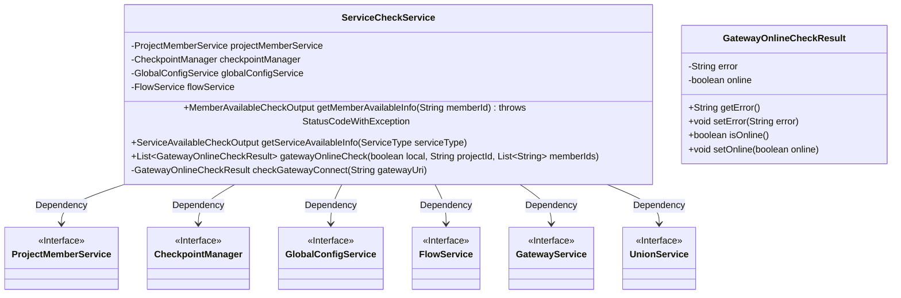
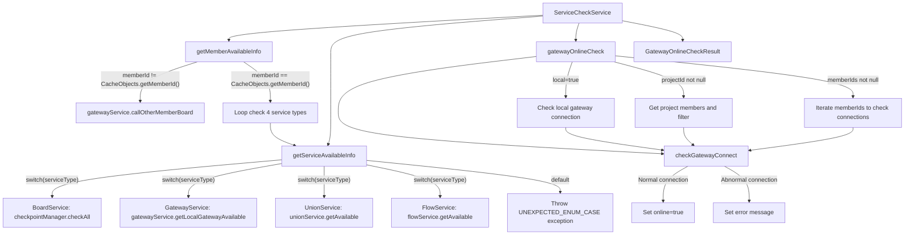

# Basic Information

|      |      |
|------|------|
| Name | ServiceCheckService |
| Language | .java |
| Code Path | WeFe/board/board-service/src/main/java/com/welab/wefe/board/service/service/ServiceCheckService.java |
| Package Name | com.welab.wefe.board.service.service |
| Dependencies | ['com.welab.wefe.board.service.api.member.MemberAvailableCheckApi', 'com.welab.wefe.board.service.database.entity.job.ProjectMemberMySqlModel', 'com.welab.wefe.board.service.sdk.FlowService', 'com.welab.wefe.board.service.service.globalconfig.GlobalConfigService', 'com.welab.wefe.common.StatusCode', 'com.welab.wefe.common.exception.StatusCodeWithException', 'com.welab.wefe.common.util.StringUtil', 'com.welab.wefe.common.wefe.checkpoint.CheckpointManager', 'com.welab.wefe.common.wefe.checkpoint.dto.MemberAvailableCheckOutput', 'com.welab.wefe.common.wefe.checkpoint.dto.ServiceAvailableCheckOutput', 'com.welab.wefe.common.wefe.dto.global_config.GatewayConfigModel', 'com.welab.wefe.common.wefe.enums.ServiceType', 'org.apache.commons.collections4.CollectionUtils', 'org.springframework.beans.factory.annotation.Autowired', 'org.springframework.stereotype.Service', 'java.util.ArrayList', 'java.util.Arrays', 'java.util.List', 'java.util.stream.Collectors'] |
| Brief Description | The ServiceCheckService provides member service availability checking functionality, including local and remote service status queries, as well as gateway connectivity detection. It supports four types of service checks: BoardService, UnionService, GatewayService, and FlowService. |

# Description

The ServiceCheckService is a service class that inherits from AbstractService and is used to check member service availability and gateway connection status. It relies on ProjectMemberService, CheckpointManager, GlobalConfigService, and FlowService. Its main functionalities include: checking the service availability of specified members, invoking via the gateway if the member is not itself; verifying the availability of BoardService, UnionService, GatewayService, and FlowService; and inspecting gateway connection status, supporting both local and remote detection, returning a GatewayOnlineCheckResult object containing error messages and online status.

# Class Summary

| Name   | Type  | Description |
|-------|------|-------------|
| ServiceCheckService | class | ServiceCheckService provides member service availability checking functionality, including status queries for services such as BoardService and UnionService, as well as gateway connectivity testing. It supports both local and remote member checks, returning service status or error messages. |

## Class ServiceCheckService

|      |      |
|------|------|
| Access Modifier | @Service;public |
| Type | class |
| Name | ServiceCheckService |
| Description | ServiceCheckService provides member service availability checking functionality, including status queries for services such as BoardService and UnionService, as well as gateway connectivity testing. It supports both local and remote member checks, returning service status or error messages. |

### UML Class Diagram

This code represents a service check class, whose main functionalities include checking member service availability, retrieving service availability information, and performing gateway connectivity checks. The class diagram illustrates the dependency relationships between ServiceCheckService and multiple interfaces such as ProjectMemberService and CheckpointManager, which are injected via @Autowired. GatewayOnlineCheckResult serves as an inner class for storing gateway check results. The overall design employs dependency injection to achieve loose coupling, with enumeration types handling the check logic for different service types.

### Internal Method Call Graph

This flowchart illustrates the core logic flow of ServiceCheckService. It primarily consists of four key methods: The member availability check (getMemberAvailableInfo) determines whether to make remote calls or locally inspect four types of service statuses; The service availability check (getServiceAvailableInfo) dispatches inspection requests for different service types via switch statements; The gateway online check (gatewayOnlineCheck) handles gateway detection for local/project members/specified members; The underlying connection check (checkGatewayConnect) actually performs gateway connectivity tests and returns result objects. The overall design follows a layered architecture with robust exception handling, supporting multiple service status detection scenarios.

### Field List

| Name  | Type  | Description |
|-------|-------|------|
| projectMemberService | ProjectMemberService | Using @Autowired to automatically inject an instance of ProjectMemberService. |
| flowService | FlowService | Using @Autowired to automatically inject the FlowService instance. |
| checkpointManager | CheckpointManager | The code automatically injects a CheckpointManager instance via @Autowired. |
| globalConfigService | GlobalConfigService | Using @Autowired to automatically inject an instance of GlobalConfigService. |

### Method List

| Name  | Type  | Description |
|-------|-------|------|
| getMemberAvailableInfo | MemberAvailableCheckOutput | Method to check member service availability. If it is not the user themselves, invoke the gateway service; otherwise, check the availability status of the four services—BoardService, UnionService, GatewayService, and FlowService—and return the result. |
| getServiceAvailableInfo | ServiceAvailableCheckOutput | This method returns the availability status of the corresponding service based on the incoming service type. It invokes different inspection methods for different service types and returns failure messages in case of exceptions. By default, it throws an unexpected enumeration exception. |
| gatewayOnlineCheck | List<GatewayOnlineCheckResult> | The method `gatewayOnlineCheck` verifies the gateway connection status. If `local` is true, it checks the intranet gateway; if `projectId` is not empty, it checks the project member gateways; if `memberIds` is not empty, it checks the specified member gateways. Returns a list of verification results. |
| checkGatewayConnect | GatewayOnlineCheckResult | Methods to check the gateway connection status: Set online to true if normal, otherwise log the error message. |

