# Basic Information

|      |      |
|------|------|
| Name | ServingService |
| Language | .java |
| Code Path | WeFe/board/board-service/src/main/java/com/welab/wefe/board/service/service/ServingService.java |
| Package Name | com.welab.wefe.board.service.service |
| Dependencies | ['com.alibaba.fastjson.JSON', 'com.alibaba.fastjson.JSONObject', 'com.welab.wefe.board.service.api.data_output_info.PushModelToServingByProviderApi', 'com.welab.wefe.board.service.component.EvaluationComponent', 'com.welab.wefe.board.service.component.modeling.ScoreCardComponent', 'com.welab.wefe.board.service.database.entity.job.JobMySqlModel', 'com.welab.wefe.board.service.database.entity.job.TaskMySqlModel', 'com.welab.wefe.board.service.database.entity.job.TaskResultMySqlModel', 'com.welab.wefe.board.service.database.repository.JobRepository', 'com.welab.wefe.board.service.dto.entity.job.JobMemberOutputModel', 'com.welab.wefe.board.service.dto.serving.ProviderModelPushResult', 'com.welab.wefe.board.service.service.globalconfig.GlobalConfigService', 'com.welab.wefe.common.StatusCode', 'com.welab.wefe.common.constant.SecretKeyType', 'com.welab.wefe.common.exception.StatusCodeWithException', 'com.welab.wefe.common.http.HttpRequest', 'com.welab.wefe.common.http.HttpResponse', 'com.welab.wefe.common.util.JObject', 'com.welab.wefe.common.util.RSAUtil', 'com.welab.wefe.common.util.SignUtil', 'com.welab.wefe.common.util.StringUtil', 'com.welab.wefe.common.wefe.dto.global_config.MemberInfoModel', 'com.welab.wefe.common.wefe.dto.global_config.ServingConfigModel', 'com.welab.wefe.common.wefe.enums.Algorithm', 'com.welab.wefe.common.wefe.enums.ComponentType', 'com.welab.wefe.common.wefe.enums.JobMemberRole', 'com.welab.wefe.common.wefe.enums.TaskResultType', 'org.springframework.beans.factory.annotation.Autowired', 'org.springframework.stereotype.Service', 'java.util.List', 'java.util.Map', 'java.util.TreeMap', 'java.util.stream.Collectors'] |
| Brief Description | The ServingService class provides model synchronization and global configuration update functionalities, including member information refresh, RSA key distribution, model parameter construction, and request processing logic, supporting federated training task coordination. |

# Description

ServingService is a service class that inherits from AbstractService, primarily designed to handle operations related to Serving services. It implements functionalities through multiple auto-injected services (such as JobRepository, JobMemberService, etc.). Key methods include `refreshMemberInfo` for updating member information, `pushRsaKeyToServing` for pushing RSA keys, and `request` for processing service requests with support for signature verification. `syncModelToServing` is used for model synchronization, involving task and role processing, and invoking member model pushes. The class also encompasses features like constructing model parameters, checking tasks, and retrieving member lists. Additionally, it defines several helper methods, such as obtaining algorithm types and model parameters, ensuring the correctness of interactions with Serving services and data processing.

# Class Summary

| Name   | Type  | Description |
|-------|------|-------------|
| ServingService | class | The ServingService class provides member information updates, RSA key distribution, and model synchronization functionalities. It interacts with the Serving service via HTTP requests, supporting signature verification and error handling. |

## Class ServingService

|      |      |
|------|------|
| Access Modifier | @Service;public |
| Type | class |
| Name | ServingService |
| Description | The ServingService class provides member information updates, RSA key distribution, and model synchronization functionalities. It interacts with the Serving service via HTTP requests, supporting signature verification and error handling. |

### UML Class Diagram

```mermaid
classDiagram
    class ServingService {
        -JobRepository jobRepository
        -JobMemberService jobMemberService
        -TaskResultService taskResultService
        -TaskService taskService
        -GlobalConfigService globalConfigService
        -GatewayService gatewayService
        +refreshMemberInfo(MemberInfoModel model, String unionBaseUrl) void
        +pushRsaKeyToServing() void
        -request(String api, TreeMap~String, Object~ params) JSONObject
        -request(String api, TreeMap~String, Object~ params, Boolean needSign) JSONObject
        +syncModelToServing(String taskId, JobMemberRole role) Object
        -pushToServing(String taskId, JobMemberRole role) void
        -check(String taskId, JobMemberRole role) void
        -callMembersPushToServing(String taskId, JobMemberRole role) List~ProviderModelPushResult~
        -callSingleMemberPushToServing(String taskId, JobMemberOutputModel member) ProviderModelPushResult
        -extractProviderTaskId(String taskId) String
        -getMemberListByTaskIdAndRole(String taskId, JobMemberRole role) List~JobMemberOutputModel~
        -getMemberListByJobId(String jobId) List~JobMemberOutputModel~
        -getMembersByJobId(String jobId) List~JSONObject~
        -callOtherMemberPushServing(String memberId, String taskId, JobMemberRole role) void
        +buildModelParams(String taskId, JobMemberRole role) TreeMap~String, Object~
        -getScoresDistribution(TaskResultMySqlModel taskResult) Object
        -getScoreCardInfo(TaskResultMySqlModel taskResult) Object
        -getModelParam(TaskResultMySqlModel taskResult) JObject
        -extractName(JobMySqlModel job) String
        -getFeatureEngineerMap(String taskId, JobMemberRole role) Map~Integer, Object~
        -getByJobId(String jobId, JobMemberRole role) JobMySqlModel
        -fillPublicKey(List~JobMemberOutputModel~ memberList) List~JSONObject~
        -getModelIdByTaskIdAndRole(String taskId, JobMemberRole role) String
        -getTaskResult(String taskId, JobMemberRole role) TaskResultMySqlModel
        -getAlgorithm(ComponentType componentType) Algorithm
        -getModelParam(String taskResult) String
    }

    class AbstractService {
        <<Abstract>>
    }

    class JobRepository {
        <<Interface>>
    }

    class JobMemberService {
        <<Interface>>
    }

    class TaskResultService {
        <<Interface>>
    }

    class TaskService {
        <<Interface>>
    }

    class GlobalConfigService {
        <<Interface>>
    }

    class GatewayService {
        <<Interface>>
    }

    class MemberInfoModel {
        +String memberId
        +String memberName
        +String rsaPrivateKey
        +String rsaPublicKey
        +SecretKeyType secretKeyType
    }

    class ProviderModelPushResult {
        +String memberId
        +String memberName
        +Boolean success
        +create(String memberId, String memberName, Boolean success) ProviderModelPushResult
    }

    class JobMemberOutputModel {
        +String memberId
        +String memberName
        +JobMemberRole jobRole
    }

    class TaskResultMySqlModel {
        +String jobId
        +String taskId
        +String modelId
        +String role
        +String result
        +String componentType
        +String name
    }

    class JobMySqlModel {
        +String jobId
        +String name
        +FederatedLearningType federatedLearningType
    }

    class PushModelToServingByProviderApi {
        <<Interface>>
        +Input of(String taskId, JobMemberRole role) Input
    }

    class JObject {
        +create() JObject
        +create(String json) JObject
        +put(String key, Object value) void
        +getString(String key) String
        +getJObjectByPath(String path) JObject
    }

    ServingService --|> AbstractService : Inheritance
    ServingService --> JobRepository : Dependency
    ServingService --> JobMemberService : Dependency
    ServingService --> TaskResultService : Dependency
    ServingService --> TaskService : Dependency
    ServingService --> GlobalConfigService : Dependency
    ServingService --> GatewayService : Dependency
    ServingService --> MemberInfoModel : Dependency
    ServingService --> ProviderModelPushResult : Dependency
    ServingService --> JobMemberOutputModel : Dependency
    ServingService --> TaskResultMySqlModel : Dependency
    ServingService --> JobMySqlModel : Dependency
    ServingService --> PushModelToServingByProviderApi : Dependency
    ServingService --> JObject : Dependency
```

This code describes a service class named `ServingService`, primarily responsible for handling operations related to model serving, including refreshing member information, pushing RSA keys, and synchronizing models to the serving end. The class inherits from `AbstractService` and depends on multiple other service interfaces such as `JobRepository`, `JobMemberService`, etc. `ServingService` interacts with backend services by constructing parameters and making API requests to manage business logic such as model synchronization and member information updates. The code utilizes various data structures like `TreeMap` and `JSONObject` to manage request parameters and response data, while ensuring operational reliability through exception handling mechanisms.

### Internal Method Call Graph

```mermaid
graph TD
    A["Class ServingService"]
    B["Property: JobRepository jobRepository"]
    C["Property: JobMemberService jobMemberService"]
    D["Property: TaskResultService taskResultService"]
    E["Property: TaskService taskService"]
    F["Property: GlobalConfigService globalConfigService"]
    G["Property: GatewayService gatewayService"]
    H["Method: refreshMemberInfo"]
    I["Method: pushRsaKeyToServing"]
    J["Method: request"]
    K["Method: syncModelToServing"]
    L["Method: pushToServing"]
    M["Method: check"]
    N["Method: callMembersPushToServing"]
    O["Method: callSingleMemberPushToServing"]
    P["Method: extractProviderTaskId"]
    Q["Method: getMemberListByTaskIdAndRole"]
    R["Method: getMemberListByJobId"]
    S["Method: getMembersByJobId"]
    T["Method: callOtherMemberPushServing"]
    U["Method: buildModelParams"]
    V["Method: getScoresDistribution"]
    W["Method: getScoreCardInfo"]
    X["Method: getModelParam"]
    Y["Method: extractName"]
    Z["Method: getFeatureEngineerMap"]
    AA["Method: getByJobId"]
    AB["Method: fillPublicKey"]
    AC["Method: getModelIdByTaskIdAndRole"]
    AD["Method: getTaskResult"]
    AE["Method: getAlgorithm"]
    AF["Method: getModelParam"]

    A --> B
    A --> C
    A --> D
    A --> E
    A --> F
    A --> G
    A --> H
    A --> I
    A --> J
    A --> K
    K --> L
    L --> M
    K --> N
    N --> O
    O --> T
    U --> M
    U --> AD
    U --> R
    U --> AA
    U --> Z
    Z --> D
    Z --> E
    U --> V
    U --> W
    W --> AD
    W --> D
    U --> X
    U --> Y
    U --> AE
    U --> AF
    S --> AB
    AB --> C
    AB --> G
    AD --> D
    Q --> AD
    Q --> C
    P --> K
    T --> G
    H --> J
    I --> J
    L --> J
```

This code represents a service class named ServingService, primarily designed to handle operations related to model serving. It includes multiple methods such as refreshMemberInfo for updating member information, pushRsaKeyToServing for pushing RSA keys, and syncModelToServing for synchronizing models to the serving end. The class utilizes Autowired injections of other services like JobRepository and JobMemberService to facilitate data retrieval and processing. The methods form complex business workflows through call relationships—for instance, syncModelToServing invokes pushToServing and callMembersPushToServing, which in turn further call callSingleMemberPushToServing and callOtherMemberPushServing. The overall design reflects a layered and modular approach, with each method having clear responsibilities and working collaboratively to achieve the core functionalities of model serving.

### Field List

| Name  | Type  | Description |
|-------|-------|------|
| jobRepository | JobRepository | Use @Autowired to automatically inject a JobRepository instance. |
| globalConfigService | GlobalConfigService | The code snippet uses the @Autowired annotation to automatically inject an instance of GlobalConfigService. |
| taskService | TaskService | Automatically inject the TaskService instance. |
| taskResultService | TaskResultService | Automatically inject the TaskResultService service instance. |
| jobMemberService | JobMemberService | Using @Autowired to automatically inject an instance of JobMemberService. |
| gatewayService | GatewayService | Using @Autowired to automatically inject an instance of GatewayService. |

### Method List

| Name  | Type  | Description |
|-------|-------|------|
| getScoreCardInfo | Object | The method `getScoreCardInfo` retrieves the scorecard and binning information based on the task results. It returns null if the scorecard task is not found; otherwise, it creates and returns a JSON object containing the scorecard data and binning results. |
| callSingleMemberPushToServing | ProviderModelPushResult | Method calls the individual member push service, returning the member ID, name, and true upon success; logs the failure and returns false. |
| extractName | String | Extract the names and IDs of JobMySqlModel objects and concatenate them into a string. |
| main | void | Create a Java code to instantiate a ProviderModelPushResult object and output it as a JSON string. The object should include the parameters mem, name, and false. |
| callMembersPushToServing | List<ProviderModelPushResult> | This method retrieves the member list based on the task ID and role, filters out non-current members and non-provider roles, invokes the push service one by one, and returns the result list. |
| buildModelParams | TreeMap<String, Object> | This method constructs model parameters: it checks the task and role, retrieves task results, members, task information, and feature engineering data, fills in parameters such as role, model ID, algorithm, etc., and finally returns a parameter set in TreeMap format. |
| pushRsaKeyToServing | void | The method `pushRsaKeyToServing` stores the RSA key pair into a TreeMap and invokes an interface to update the server-side key. It may throw a `StatusCodeWithException` exception. |
| getScoresDistribution | Object | Method to Obtain Task Score Distribution: Query task results based on task ID, role, and type. If they exist, extract the score distribution data for the specified key names from the results. |
| extractProviderTaskId | String | This method replaces "promoter" with "provider" in the string taskId and returns the result. |
| callOtherMemberPushServing | void | This method invokes the gateway service to push a task to the specified member, with parameters including member ID, task ID, and role, and may throw an exception. |
| request | JSONObject | This method is used to send JSON requests with signatures. If a signature is required, generate it using a private key and encapsulate the request body. After verifying the service address, send the request, handle the response status code and error messages, and return the JSON result upon success. |
| request | JSONObject | The private method `request` accepts an API and an ordered parameter table, invokes the overloaded method, and enables validation by default, potentially throwing a status code exception. |
| getMemberListByJobId | List<JobMemberOutputModel> | Get the member list for the specified task ID by calling the `list` method of `jobMemberService`, excluding deleted members. |
| getMembersByJobId | List<JSONObject> | Retrieve the member list based on the task ID and populate the public key information. |
| getModelParam | JObject | This method extracts model parameters from task results, including raw results and scorecard information. |
| check | void | Check task permissions. Local tasks are prohibited from being pushed or exported. |
| refreshMemberInfo | void | Method for refreshing member information, which receives the member model and alliance base URL, constructs a TreeMap containing parameters such as member ID, name, RSA key, etc., and sends a request to the specified interface. |
| getMemberListByTaskIdAndRole | List<JobMemberOutputModel> | The method retrieves the task result by task ID and role, then queries the member list based on the job ID from the task result, and returns a list of members that are not in a deleted status. |
| getFeatureEngineerMap | Map<Integer, Object> | This method retrieves feature engineering results based on task ID and role, returning a mapping sorted by task positions. It throws an exception if the task does not exist. |
| pushToServing | void | Push the task to the server, construct the parameters, and initiate the request. |
| getByJobId | JobMySqlModel | Query JobMySqlModel data from jobRepository based on jobId and role. |
| fillPublicKey | List<JSONObject> | The method converts the member list into a list of JSON objects containing member ID, role, public key, URL, key type, and other information, logging exceptions when they occur. |
| getModelIdByTaskIdAndRole | String | Get the model ID based on the task ID and role, then call the task result to return the corresponding model ID. |
| getTaskResult | TaskResultMySqlModel | Get task results: Query the task results of model training type based on task ID and role. |
| getAlgorithm | Algorithm | Return the corresponding algorithm based on the component type: HorzLR/VertLR/MixLR returns LogisticRegression, HorzSecureBoost/VertSecureBoost/MixSecureBoost returns XGBoost, and other types throw an exception. |
| getModelParam | String | Extract model parameters: Parse and return the value of the `model_param` field from `taskResult`. |
| syncModelToServing | Object | The method `syncModelToServing` pushes task data to the server. If the role is the initiator, it calls member push, returning "Synchronization successful" upon success and throwing `StatusCodeWithException` in case of exceptions. |

