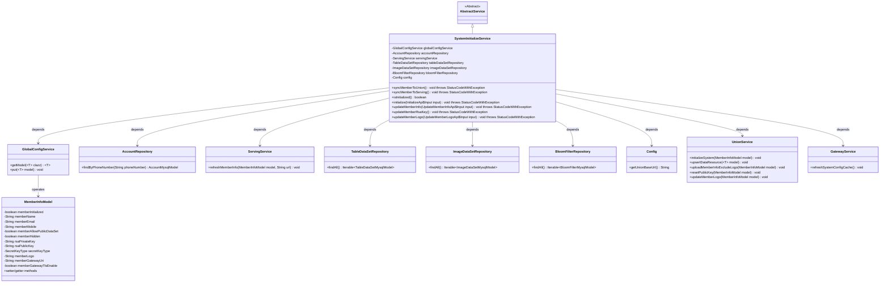
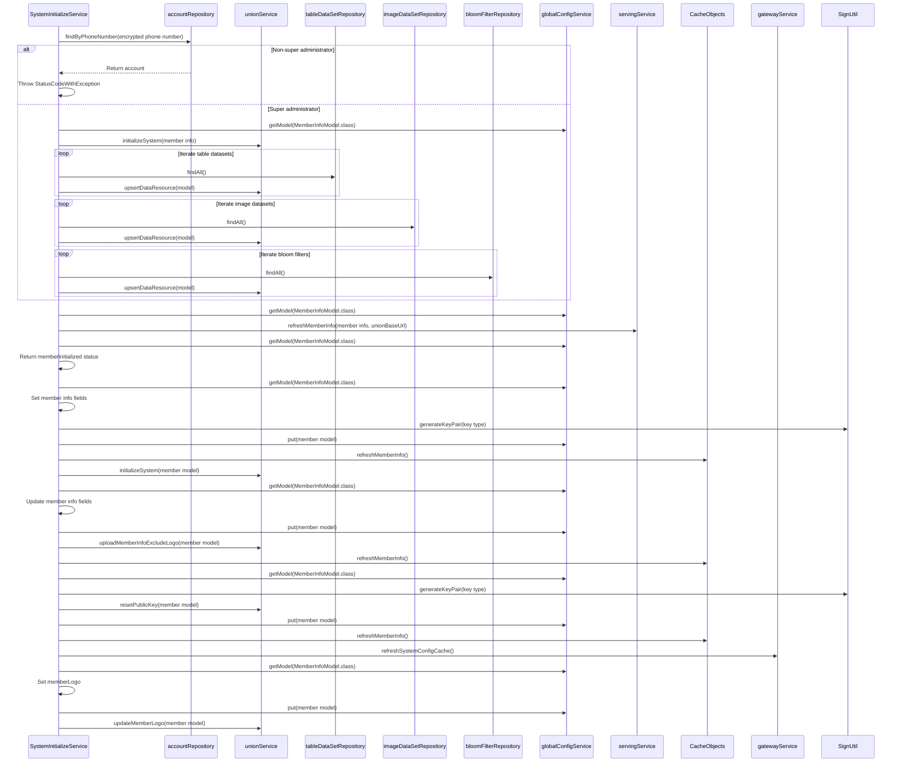

# Basic Information

|      |      |
|------|------|
| Name | SystemInitializeService |
| Language | .java |
| Code Path | WeFe/board/board-service/src/main/java/com/welab/wefe/board/service/service/SystemInitializeService.java |
| Package Name | com.welab.wefe.board.service.service |
| Dependencies | ['com.welab.wefe.board.service.api.member.InitializeApi', 'com.welab.wefe.board.service.api.member.UpdateMemberInfoApi', 'com.welab.wefe.board.service.api.member.UpdateMemberLogoApi', 'com.welab.wefe.board.service.constant.Config', 'com.welab.wefe.board.service.database.entity.AccountMysqlModel', 'com.welab.wefe.board.service.database.entity.data_resource.BloomFilterMysqlModel', 'com.welab.wefe.board.service.database.entity.data_resource.ImageDataSetMysqlModel', 'com.welab.wefe.board.service.database.entity.data_resource.TableDataSetMysqlModel', 'com.welab.wefe.board.service.database.repository.AccountRepository', 'com.welab.wefe.board.service.database.repository.data_resource.BloomFilterRepository', 'com.welab.wefe.board.service.database.repository.data_resource.ImageDataSetRepository', 'com.welab.wefe.board.service.database.repository.data_resource.TableDataSetRepository', 'com.welab.wefe.board.service.service.globalconfig.GlobalConfigService', 'com.welab.wefe.common.StatusCode', 'com.welab.wefe.common.constant.SecretKeyType', 'com.welab.wefe.common.exception.StatusCodeWithException', 'com.welab.wefe.common.util.SignUtil', 'com.welab.wefe.common.web.util.CurrentAccountUtil', 'com.welab.wefe.common.web.util.DatabaseEncryptUtil', 'com.welab.wefe.common.wefe.dto.global_config.MemberInfoModel', 'org.springframework.beans.factory.annotation.Autowired', 'org.springframework.stereotype.Service', 'org.springframework.transaction.annotation.Transactional', 'java.security.NoSuchAlgorithmException'] |
| Brief Description | The SystemInitializeService provides system initialization, member information synchronization, and update functionalities, including data resource synchronization, key updates, and member information management, which can only be operated by super administrators. |

# Description

The SystemInitializeService is a system initialization service class that inherits from AbstractService. It provides system initialization, member information synchronization, and update functionalities through multiple auto-wired dependencies (such as GlobalConfigService, AccountRepository, etc.). Key methods include syncMemberToUnion and syncMemberToServing for synchronizing member information to the alliance and service nodes, initialize for system initialization, updateMemberInfo and updateMemberLogo for updating member information and logos, and updateMemberRsaKey for updating RSA keys. All operations undergo permission verification and transaction management to ensure data consistency.

# Class Summary

| Name   | Type  | Description |
|-------|------|-------------|
| SystemInitializeService | class | The SystemInitializeService provides system initialization and member information synchronization functions, including operations such as data resource synchronization, key updates, and member information maintenance, which require super administrator privileges. |

## Class SystemInitializeService

|      |      |
|------|------|
| Access Modifier | @Service;public |
| Type | class |
| Name | SystemInitializeService |
| Description | The SystemInitializeService provides system initialization and member information synchronization functions, including operations such as data resource synchronization, key updates, and member information maintenance, which require super administrator privileges. |

### UML Class Diagram

This class diagram illustrates the core structure and dependencies of SystemInitializeService. As a Spring service class inheriting from AbstractService, it implements system initialization, member information synchronization, and key updates through 7 dependent components. Key functionalities include: 1) Managing MemberInfoModel configurations via GlobalConfigService; 2) Synchronizing data to UnionService using multiple repositories; 3) Transactional operations for member information, keys, and logos. The diagram clearly presents the service's collaboration with data layer, configuration layer, and external services, particularly highlighting its core logic for managing MemberInfoModel states.

### Internal Method Call Graph

```mermaid
graph TD
    A["Class SystemInitializeService"]
    B["Property: GlobalConfigService globalConfigService"]
    C["Property: AccountRepository accountRepository"]
    D["Property: ServingService servingService"]
    E["Property: TableDataSetRepository tableDataSetRepository"]
    F["Property: ImageDataSetRepository imageDataSetRepository"]
    G["Property: BloomFilterRepository bloomFilterRepository"]
    H["Property: Config config"]
    I["Method: syncMemberToUnion"]
    J["Method: syncMemberToServing"]
    K["Method: isInitialized"]
    L["Method: initialize"]
    M["Method: updateMemberInfo"]
    N["Method: updateMemberRsaKey"]
    O["Method: updateMemberLogo"]

    A --> B
    A --> C
    A --> D
    A --> E
    A --> F
    A --> G
    A --> H
    A --> I
    A --> J
    A --> K
    A --> L
    A --> M
    A --> N
    A --> O
```

This flowchart illustrates the structure of the SystemInitializeService class and its primary method invocation relationships, including 7 dependency injection properties and 6 core methods. The sequence diagram details the execution flow of key methods such as syncMemberToUnion, covering operations like permission verification, data synchronization, key generation, and cache refresh. It demonstrates the complete processing chain for system initialization, member information synchronization, and key updates, involving interactions between 10 different components.

### Field List

| Name  | Type  | Description |
|-------|-------|------|
| bloomFilterRepository | BloomFilterRepository | The code snippet uses @Autowired to automatically inject an instance of BloomFilterRepository. |
| imageDataSetRepository | ImageDataSetRepository | Use @Autowired to automatically inject an instance of ImageDataSetRepository. |
| config | Config | Automatically inject Config configuration object instance. |
| servingService | ServingService | Use @Autowired to automatically inject an instance of the ServingService. |
| globalConfigService | GlobalConfigService | Using @Autowired to automatically inject an instance of GlobalConfigService. |
| tableDataSetRepository | TableDataSetRepository | Use @Autowired to automatically inject an instance of TableDataSetRepository. |
| accountRepository | AccountRepository | Automatically inject the AccountRepository instance. |

### Method List

| Name  | Type  | Description |
|-------|-------|------|
| initialize | void | Initialization system method, check if already initialized, set member information and generate key pairs, finally refresh cache and initialize federated services. |
| updateMemberRsaKey | void | The method `updateMemberRsaKey` is used to update a member's RSA key: it generates a new key pair and updates the model, rolling back in case of exceptions; it notifies associated services to reset the public key, refresh caches, and update gateway configurations. |
| syncMemberToUnion | void | Synchronize members to the alliance system: Check super administrator permissions, initialize the system, and update all table data, image data, and Bloom filter resources. Throw an exception if permissions are insufficient. |
| syncMemberToServing | void | The synchronous method `syncMemberToServing` calls `servingService` to refresh member information, using the `MemberInfoModel` and `UnionBaseUrl` configurations, and may throw a `StatusCodeWithException` exception. |
| updateMemberLogo | void | The method annotated with transactions updates the member logo, catches exceptions for rollback, and invokes the global configuration service and federated service to complete the operation. |
| updateMemberInfo | void | The method `updateMemberInfo` is used to update member information, including fields such as name, email, and phone number. It supports transaction rollback and throws `StatusCodeWithException` in case of exceptions. After updating, the changes are synchronized to `unionService` and the cache is refreshed. |
| isInitialized | boolean | Check if the member information has been initialized, returns a boolean value. |

