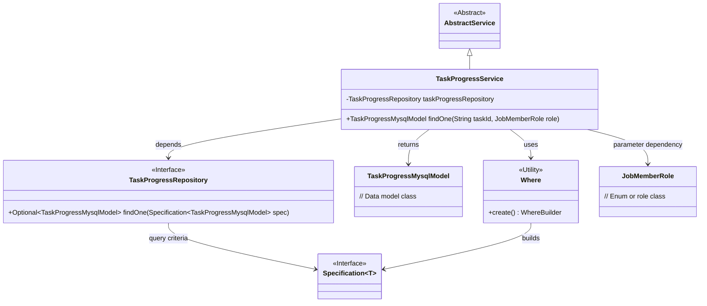
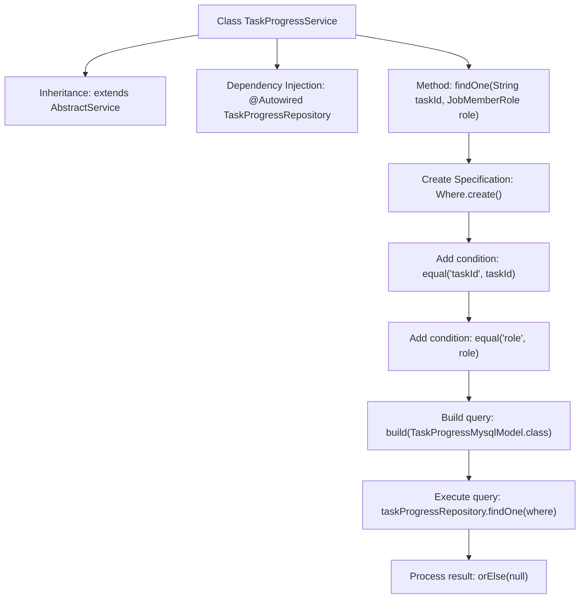

# Basic Information

|      |      |
|------|------|
| Name | TaskProgressService |
| Language | .java |
| Code Path | WeFe/board/board-service/src/main/java/com/welab/wefe/board/service/service/TaskProgressService.java |
| Package Name | com.welab.wefe.board.service.service |
| Dependencies | ['com.welab.wefe.board.service.database.entity.job.TaskProgressMysqlModel', 'com.welab.wefe.board.service.database.repository.TaskProgressRepository', 'com.welab.wefe.common.data.mysql.Where', 'com.welab.wefe.common.wefe.enums.JobMemberRole', 'org.springframework.beans.factory.annotation.Autowired', 'org.springframework.data.jpa.domain.Specification', 'org.springframework.stereotype.Service'] |
| Brief Description | The TaskProgressService retrieves TaskProgressMysqlModel data based on taskId and role through the taskProgressRepository. |

# Description

TaskProgressService is a service class that inherits from AbstractService and injects TaskProgressRepository via @Autowired. It provides a findOne method to query TaskProgressMysqlModel data based on taskId and role parameters. The query conditions are constructed using the Where utility class, including equality matches for taskId and role. If no data is found, it returns null.

# Class Summary

| Name   | Type  | Description |
|-------|------|-------------|
| TaskProgressService | class | TaskProgressService queries TaskProgressMysqlModel data by taskId and role through taskProgressRepository. |

## Class TaskProgressService

|      |      |
|------|------|
| Access Modifier | @Service;public |
| Type | class |
| Name | TaskProgressService |
| Description | TaskProgressService queries TaskProgressMysqlModel data by taskId and role through taskProgressRepository. |

### UML Class Diagram

This code demonstrates a Spring-based service class TaskProgressService, which inherits from AbstractService and performs database queries through TaskProgressRepository. The core functionality is to retrieve task progress records by task ID and role, utilizing the Where utility class to construct JPA Specification query conditions. The class diagram clearly illustrates the relationship between the service layer and persistence layer, as well as the collaboration patterns among utility classes, model classes, and interfaces, showcasing typical applications of Spring dependency injection and JPA specification queries.

### Internal Method Call Graph

This flowchart illustrates the core structure and workflow of the TaskProgressService class. The class inherits from AbstractService and obtains a TaskProgressRepository instance through dependency injection. The main method findOne constructs query conditions (including taskId and role matching) through chained calls, builds the query using JPA Specification, executes the database operation, and finally handles the Optional result with null value processing. The entire process demonstrates a typical pattern of Spring Data JPA's dynamic query and result handling.

### Field List

| Name  | Type  | Description |
|-------|-------|------|
| taskProgressRepository | TaskProgressRepository | Automatically inject the TaskProgressRepository instance. |

### Method List

| Name  | Type  | Description |
|-------|-------|------|
| findOne | TaskProgressMysqlModel | Query the task progress record for the specified task ID and role, returning null if no results are found. |

