# Basic Information

|      |      |
|------|------|
| Name | TaskResultService |
| Language | .java |
| Code Path | WeFe/board/board-service/src/main/java/com/welab/wefe/board/service/service/TaskResultService.java |
| Package Name | com.welab.wefe.board.service.service |
| Dependencies | ['com.alibaba.fastjson.JSON', 'com.alibaba.fastjson.JSONObject', 'com.welab.wefe.board.service.api.data_resource.table_data_set.DetailApi', 'com.welab.wefe.board.service.api.project.job.task.GetFeatureApi', 'com.welab.wefe.board.service.component.DataIOComponent', 'com.welab.wefe.board.service.component.base.io.Names', 'com.welab.wefe.board.service.component.base.io.NodeOutputItem', 'com.welab.wefe.board.service.component.feature.FeatureSelectionComponent', 'com.welab.wefe.board.service.component.feature.HorzOneHotComponent', 'com.welab.wefe.board.service.component.feature.HorzOneHotComponent.Params.MemberInfoModel', 'com.welab.wefe.board.service.database.entity.data_resource.TableDataSetMysqlModel', 'com.welab.wefe.board.service.database.entity.job.TaskMySqlModel', 'com.welab.wefe.board.service.database.entity.job.TaskResultMySqlModel', 'com.welab.wefe.board.service.database.repository.TaskRepository', 'com.welab.wefe.board.service.database.repository.TaskResultRepository', 'com.welab.wefe.board.service.dto.entity.MemberFeatureInfoModel', 'com.welab.wefe.board.service.dto.entity.data_resource.output.TableDataSetOutputModel', 'com.welab.wefe.board.service.exception.FlowNodeException', 'com.welab.wefe.board.service.exception.MemberGatewayException', 'com.welab.wefe.board.service.model.FlowGraph', 'com.welab.wefe.board.service.model.FlowGraphNode', 'com.welab.wefe.board.service.service.data_resource.table_data_set.TableDataSetService', 'com.welab.wefe.common.StatusCode', 'com.welab.wefe.common.data.mysql.Where', 'com.welab.wefe.common.exception.StatusCodeWithException', 'com.welab.wefe.common.util.JObject', 'com.welab.wefe.common.web.util.CurrentAccountUtil', 'com.welab.wefe.common.wefe.enums.ComponentType', 'com.welab.wefe.common.wefe.enums.JobMemberRole', 'com.welab.wefe.common.wefe.enums.TaskResultType', 'org.apache.commons.collections.CollectionUtils', 'org.springframework.beans.factory.annotation.Autowired', 'org.springframework.data.jpa.domain.Specification', 'org.springframework.stereotype.Service', 'java.util.ArrayList', 'java.util.Arrays', 'java.util.List', 'java.util.Set'] |
| Brief Description | The TaskResultService provides task result query and processing functionalities, including searching results by conditions, parsing binned results, obtaining feature lists and statistical information, and supports feature selection, missing rate, CV/IV calculation, among other features. |

# Description

The TaskResultService is a service class that inherits from AbstractService, primarily used for managing and querying task result data. It implements functionalities through multiple auto-injected dependency services (such as TaskResultRepository, ProjectFlowNodeService, etc.). Key methods include: querying task result lists or individual results based on conditions like jobId and nodeId; processing feature binning results; obtaining feature lists with support for CV/IV filtering and missing rate statistics; retrieving feature column information from different components (such as DataIO, FeatureSelection, etc.); and interrupting inference tasks, among other operations. The class also includes multiple helper methods for parsing and processing task result data.

# Class Summary

| Name   | Type  | Description |
|-------|------|-------------|
| TaskResultService | class | TaskResultService is a service class that provides task result query and management functionalities, including searching task results by conditions, parsing binning results, retrieving feature lists, and processing feature statistics and binning information. |

## Class TaskResultService

|      |      |
|------|------|
| Access Modifier | @Service;public |
| Type | class |
| Name | TaskResultService |
| Description | TaskResultService is a service class that provides task result query and management functionalities, including searching task results by conditions, parsing binning results, retrieving feature lists, and processing feature statistics and binning information. |

### UML Class Diagram

```mermaid
classDiagram
    class TaskResultService {
        -TaskResultRepository taskResultRepository
        -ProjectFlowNodeService projectFlowNodeService
        -TaskRepository taskRepository
        -ProjectMemberService projectMemberService
        -JobService jobService
        -ProjectService projectService
        -TableDataSetService tableDataSetService
        -GatewayService gatewayService
        -TaskService taskService
        +findList(String jobId, String nodeId, JobMemberRole role, String type) List~TaskResultMySqlModel~
        +findOne(String jobId, String nodeId, JobMemberRole role, String type) TaskResultMySqlModel
        +listAllResult(String taskId) List~TaskResultMySqlModel~
        +findByTaskIdAndType(String taskId, String type) TaskResultMySqlModel
        +getResultFeature(GetFeatureApi.Input input) GetFeatureApi.Output
        +getMemberFeatures(FlowGraph graph, FlowGraphNode node) List~MemberFeatureInfoModel~
        +getDataIOFeature(FlowGraphNode node) List~MemberFeatureInfoModel~
        +getFeatureSelectFeature(FlowGraphNode node, FlowGraph flowGraph) List~MemberFeatureInfoModel~
        +getBinningResultFeature(TaskMySqlModel task) List~MemberFeatureInfoModel~
        +findByTaskIdAndTypeAndRole(String taskId, String type, JobMemberRole role) TaskResultMySqlModel
        +findByTaskIdAndRoleNotEqualType(String taskId, String type, JobMemberRole role) List~TaskResultMySqlModel~
        +findModelByJobIdAndNodeIdAndRole(String jobId, String flowNodeId, JobMemberRole role) TaskResultMySqlModel
        +stopDeepLearningInfer(String taskId) void
        +findByJobIdAndComponentTypeAndType(String jobId, ComponentType componentType, TaskResultType type, JobMemberRole role) TaskResultMySqlModel
        +findModelByJobIdAndTypeAndRole(String jobId, String type, JobMemberRole role) List~TaskResultMySqlModel~
        -parseBinningResult(TaskResultMySqlModel featureBinningTaskResult) List~JObject~
        -setCvIvMissingRate(GetFeatureApi.Output out, FlowGraph graph, FlowGraphNode node) void
        -setInfoAboutBinning(GetFeatureApi.Output out, FlowGraph graph, FlowGraphNode node) void
        -setInfoAboutStatistic(GetFeatureApi.Output out, FlowGraph graph, FlowGraphNode node) void
        -getOneHotFeature(FlowGraphNode node, FlowGraph flowGraph) List~MemberFeatureInfoModel~
        -parserBinningResult(JObject result) MemberFeatureInfoModel
    }

    class TaskResultMySqlModel {
        // Data model class
    }

    class MemberFeatureInfoModel {
        // Member feature information model
    }

    class FlowGraph {
        // Flow graph model
    }

    class FlowGraphNode {
        // Flow graph node model
    }

    class GetFeatureApi {
        <<Interface>>
        // Feature retrieval interface
    }

    class Where {
        <<Interface>>
        // Conditional builder interface
    }

    TaskResultService --> TaskResultRepository : Dependency
    TaskResultService --> ProjectFlowNodeService : Dependency
    TaskResultService --> TaskRepository : Dependency
    TaskResultService --> ProjectMemberService : Dependency
    TaskResultService --> JobService : Dependency
    TaskResultService --> ProjectService : Dependency
    TaskResultService --> TableDataSetService : Dependency
    TaskResultService --> GatewayService : Dependency
    TaskResultService --> TaskService : Dependency
    TaskResultService --> TaskResultMySqlModel : Operation
    TaskResultService --> MemberFeatureInfoModel : Operation
    TaskResultService --> FlowGraph : Operation
    TaskResultService --> FlowGraphNode : Operation
    TaskResultService --> GetFeatureApi : Implementation
    TaskResultService --> Where : Usage
```

This class diagram illustrates the core structure and relationships of the TaskResultService. TaskResultService is a service class primarily responsible for handling business logic related to task results, including querying task results, retrieving feature information, and parsing binning results. It depends on multiple Repository and Service classes such as TaskResultRepository and JobService for data access and other business operations. Additionally, it operates on various model classes like TaskResultMySqlModel and MemberFeatureInfoModel, and implements the functionality of the GetFeatureApi interface. The class diagram clearly depicts the dependencies and associations between these classes, reflecting the service's complex functionality and rich business logic.

### Internal Method Call Graph

This code implements the TaskResultService class, primarily handling business logic related to task results. It interacts with databases through multiple dependency-injected services, providing functionalities such as querying task results, parsing binning results, and retrieving feature lists. Core methods include basic query methods like findList and findOne, as well as business methods like getResultFeature, which invokes setCvIvMissingRate to set CV/IV values and missing rates for features. The class also contains auxiliary methods such as parseBinningResult for parsing binning results and getMemberFeatures for retrieving member feature information. The overall design adopts a layered architecture, accessing databases via Repository and processing business logic through Service.

### Field List

| Name  | Type  | Description |
|-------|-------|------|
| projectFlowNodeService | ProjectFlowNodeService | Automatically inject project process node service instances. |
| jobService | JobService | Using @Autowired to automatically inject an instance of JobService. |
| tableDataSetService | TableDataSetService | Using @Autowired to automatically inject an instance of TableDataSetService. |
| taskResultRepository | TaskResultRepository | Automatically injects a TaskResultRepository instance. |
| taskService | TaskService | Use @Autowired to automatically inject an instance of TaskService. |
| projectService | ProjectService | Using @Autowired to automatically inject an instance of ProjectService. |
| gatewayService | GatewayService | Using @Autowired to automatically inject an instance of GatewayService. |
| taskRepository | TaskRepository | Automatically inject the TaskRepository instance. |
| projectMemberService | ProjectMemberService | Automatically inject the ProjectMemberService service instance. |

### Method List

| Name  | Type  | Description |
|-------|-------|------|
| parserBinningResult | MemberFeatureInfoModel | Parse the JSON result to construct a member feature information model, including member ID, role, and feature list. The feature names are derived from the key set of binningResult. Finally, set the member name and return the model. |
| findModelByJobIdAndNodeIdAndRole | TaskResultMySqlModel | This method queries the TaskResultMySqlModel that meets the criteria by jobId, flowNodeId, and role, returning the first matching result or null. The query conditions include servingModel being true. |
| findByTaskIdAndType | TaskResultMySqlModel | This method queries the database by task ID and type, returning a matching TaskResultMySqlModel object, or null if no results are found. |
| getBinningResultFeature | List<MemberFeatureInfoModel> | This method retrieves the binning result features based on the task ID. If the task result does not exist, an empty list is returned. It parses the binning results and provider results from the model parameters, analyzes their features separately, and then returns the aggregated results. |
| getFeatureSelectFeature | List<MemberFeatureInfoModel> | The method `getFeatureSelectFeature` retrieves feature selection information based on nodes and flowcharts. It parses node parameters and data IO parameters, matches member roles and IDs, sets the dataset ID, and returns the member list. |
| findByTaskIdAndTypeAndRole | TaskResultMySqlModel | Query MySQL task results based on task ID, type, and role, returning matching results or null. |
| getOneHotFeature | List<MemberFeatureInfoModel> | The method `getOneHotFeature` extracts member feature information from FlowGraph nodes. First, it retrieves the parameters of the DataIO component and filters member features that meet the criteria. If the parameters are empty, it returns the default features. It then iterates through the matches between members and the dataset to construct a feature list. If there is a record from the last task, it updates the feature list via the gateway service, handling the merging of old and new features. Finally, it returns the list of member feature information. |
| setInfoAboutStatistic | void | Method Setting Feature Statistics: Check the node statistical type and query the task result. If none exists, return. If present, set the statistical flag, iterate through the result members, calculate the missing rate and coefficient of variation, and store them. |
| setInfoAboutBinning | void | The method `setInfoAboutBinning` processes the feature binning results: it retrieves the task ID, searches for the binning node, and returns if none is found; it queries the binning result data, parses and iterates through the results, extracts the feature IV values, and stores them in the output object. |
| getDataIOFeature | List<MemberFeatureInfoModel> | The method extracts data IO features from FlowGraphNode, traverses dataset items, creates a feature information model for each member containing member ID, role, feature list, and dataset ID, and finally returns a list of member feature information. |
| listAllResult | List<TaskResultMySqlModel> | This method queries the database using a task ID and returns a list of all matching task results. It constructs query conditions using a conditional builder and invokes the repository interface to execute the query. |
| stopDeepLearningInfer | void | Stop the deep learning inference task with the specified ID, check its existence, and update its status to stopped. |
| findByJobIdAndComponentTypeAndType | TaskResultMySqlModel | The method queries MySQL task results by task ID, component type, result type, and role, using a condition builder to generate query conditions, and returns matching results or null. |
| findModelByJobIdAndTypeAndRole | List<TaskResultMySqlModel> | This method queries the database by task ID, type, and role, returning a list of TaskResultMySqlModel that meet the criteria. It uses Where to construct the query conditions and calls the repository to execute the query. |
| getMemberFeatures | List<MemberFeatureInfoModel> | The method `getMemberFeatures` retrieves member feature information by traversing input nodes to search the training dataset. Based on the component type, it invokes different methods to handle data I/O, feature selection, or one-hot encoding. If not found, it recursively searches the parent node. |
| parseBinningResult | List<JObject> | Analyzing binning results: Extract the binning results and provider results from the model parameters in the task results, then merge and return them as a list. |
| findList | List<TaskResultMySqlModel> | This method queries the task result list based on task ID, node ID, role, and type, generates query conditions using a condition builder, and returns the results. |
| getResultFeature | GetFeatureApi.Output | This method retrieves feature results based on the input and returns an output containing a list of features. If the node is a feature selection component and historical tasks exist, it supplements the CV, IV, and missing rate information of the features. |
| findByTaskIdAndRoleNotEqualType | List<TaskResultMySqlModel> | This method queries the database conditionally and returns a list of task results that match the task ID, are of non-specified types, have a specified role, and have a service model value of true. |
| findOne | TaskResultMySqlModel | This method queries the TaskResultMySqlModel by jobId, nodeId, role, and type, returning the matching result or null. |
| setCvIvMissingRate | void | This method sets the missing rate information for CV and IV, including statistical information and binning information. |

