# Basic Information

|      |      |
|------|------|
| Name | TaskService |
| Language | .java |
| Code Path | WeFe/board/board-service/src/main/java/com/welab/wefe/board/service/service/TaskService.java |
| Package Name | com.welab.wefe.board.service.service |
| Dependencies | ['com.welab.wefe.board.service.api.project.flow.QueryDataIoTaskConfigApi', 'com.welab.wefe.board.service.api.project.flow.QueryDataIoTaskFeaturesApi', 'com.welab.wefe.board.service.api.project.job.task.DetailApi', 'com.welab.wefe.board.service.component.OotComponent', 'com.welab.wefe.board.service.database.entity.job', 'com.welab.wefe.board.service.database.repository.JobRepository', 'com.welab.wefe.board.service.database.repository.TaskRepository', 'com.welab.wefe.board.service.dto.entity.DataIoTaskFeatureInfoOutputModel', 'com.welab.wefe.common.StatusCode', 'com.welab.wefe.common.data.mysql.Where', 'com.welab.wefe.common.data.mysql.enums.OrderBy', 'com.welab.wefe.common.exception.StatusCodeWithException', 'com.welab.wefe.common.util.JObject', 'com.welab.wefe.common.util.StringUtil', 'com.welab.wefe.common.web.util.CurrentAccountUtil', 'com.welab.wefe.common.wefe.enums.ComponentType', 'com.welab.wefe.common.wefe.enums.JobMemberRole', 'com.welab.wefe.common.wefe.enums.TaskStatus', 'org.apache.commons.collections4.CollectionUtils', 'org.slf4j.Logger', 'org.slf4j.LoggerFactory', 'org.springframework.beans.factory.annotation.Autowired', 'org.springframework.data.jpa.domain.Specification', 'org.springframework.stereotype.Service', 'java.util.ArrayList', 'java.util.Arrays', 'java.util.Collections', 'java.util.List', 'java.util.function.Function', 'java.util.stream.Collectors', 'java.util.stream.Stream'] |
| Brief Description | TaskService is a service class that provides task management functionalities, including querying task history, updating tasks, and finding nodes in the same branch. It relies on multiple services such as TaskRepository and ProjectService, and supports operations like grid search model result queries and DataIO task configuration retrieval. |

# Description

The TaskService is a Spring service class primarily responsible for managing business logic related to tasks. It performs various task operations by automatically injecting multiple dependency services (such as TaskRepository, ProjectService, JobService, etc.). Key functionalities include: querying model results containing grid search, retrieving node execution records, finding tasks based on conditions, updating task information, and locating data IO task configurations and feature details. The class also provides methods for handling task branching and parent-child relationships, supporting data IO feature queries in both OOT and non-OOT modes. It flexibly retrieves task data through diverse query conditions and sorting methods while handling exceptional cases.

# Class Summary

| Name   | Type  | Description |
|-------|------|-------------|
| TaskService | class | The TaskService provides task management functionalities, including querying task history, retrieving task details, updating tasks, and handling data IO task configurations. It supports grid search queries, branch node lookup, and feature information retrieval. |

## Class TaskService

|      |      |
|------|------|
| Access Modifier | @Service;public |
| Type | class |
| Name | TaskService |
| Description | The TaskService provides task management functionalities, including querying task history, retrieving task details, updating tasks, and handling data IO task configurations. It supports grid search queries, branch node lookup, and feature information retrieval. |

### UML Class Diagram

```mermaid
classDiagram
    class TaskService {
        -Logger LOG
        +TaskRepository taskRepo
        +ProjectService projectService
        +JobService jobService
        +JobMemberService jobMemberService
        +GatewayService gatewayService
        +ProjectFlowService projectFlowService
        +ProjectFlowNodeService projectFlowNodeService
        +JobRepository jobRepository
        +List~TaskMySqlModel~ listTaskWithGridSearch(String jobId)
        +List~TaskMySqlModel~ findTaskHistory(String flowId, String flowNodeId, JobMemberRole role)
        +TaskMySqlModel findOne(DetailApi.Input input) throws StatusCodeWithException
        +List~TaskMySqlModel~ findAll(DetailApi.Input input)
        +TaskMySqlModel findOne(String taskId)
        +TaskMySqlModel findOne(String jobId, String flowNodeId, JobMemberRole role)
        +List~TaskMySqlModel~ findAll(String jobId, String flowNodeId, JobMemberRole role)
        +List~TaskMySqlModel~ findAll(String jobId, String flowNodeId)
        +List~TaskMySqlModel~ listByJobId(String jobId, JobMemberRole role)
        +TaskMySqlModel updateTask(TaskMySqlModel model, Function~TaskMySqlModel,TaskMySqlModel~ func)
        +TaskMySqlModel findByParentTaskId(String parentTaskId)
        +List~TaskMySqlModel~ findAll(String jobId, String flowId, ComponentType componentType)
        +JObject findDataIoTaskConfig(QueryDataIoTaskConfigApi.Input input)
        +TaskMySqlModel findDataIoTask(String jobId, JobMemberRole role)
        +List~TaskMySqlModel~ findHomologousBranchByJobId(String jobId, JobMemberRole role, String taskId) throws StatusCodeWithException
        +List~TaskMySqlModel~ baseFindHomologousBranch(List~TaskMySqlModel~ totalTaskList, String taskId)
        +List~DataIoTaskFeatureInfoOutputModel~ findDataIoTaskFeatures(QueryDataIoTaskFeaturesApi.Input input) throws StatusCodeWithException
        -List~DataIoTaskFeatureInfoOutputModel~ findDataIoTaskFeaturesWithOot(QueryDataIoTaskFeaturesApi.Input input) throws StatusCodeWithException
        -List~DataIoTaskFeatureInfoOutputModel~ findDataIoTaskFeaturesWithNonOot(QueryDataIoTaskFeaturesApi.Input input) throws StatusCodeWithException
        -void findTotalSubTaskMysqlModelList(List~TaskMySqlModel~ resultList, List~TaskMySqlModel~ totalTaskList, String startTaskId)
        -void findTotalParentTaskMysqlModelList(List~TaskMySqlModel~ resultList, List~TaskMySqlModel~ totalTaskList, String startTaskIds)
    }

    class TaskRepository {
        <<Interface>>
        +List~TaskMySqlModel~ findTaskWithGridSearch(String jobId)
        +List~TaskMySqlModel~ findAll(Specification~TaskMySqlModel~ where)
        +Optional~TaskMySqlModel~ findOne(Specification~TaskMySqlModel~ where)
        +TaskMySqlModel save(TaskMySqlModel model)
        +TaskMySqlModel findOne(String field, String value, Class~TaskMySqlModel~ clazz)
    }

    class ProjectService {
        <<Interface>>
        +ProjectMySqlModel findByProjectId(String projectId)
        +ProjectMySqlModel findProjectByJobId(String jobId)
    }

    class JobService {
        <<Interface>>
        +JobMySqlModel findByJobId(String jobId, JobMemberRole role)
    }

    class JobMemberService {
        <<Interface>>
        +List~JobMemberMySqlModel~ findListByJobId(String jobId)
    }

    class GatewayService {
        <<Interface>>
        +Object callOtherMemberBoard(String memberId, JobMemberRole role, Class~?~ apiClass, Object input, Class~?~ returnType)
    }

    class ProjectFlowService {
        <<Interface>>
        +ProjectFlowMySqlModel findOne(String flowNodeId)
    }

    class ProjectFlowNodeService {
        <<Interface>>
        +List~ProjectFlowNodeMySqlModel~ findNodesByFlowId(String flowId)
    }

    class JobRepository {
        <<Interface>>
        +JobMySqlModel findLastByFlowId(String flowId, String role)
    }

    TaskService --> TaskRepository : Dependency
    TaskService --> ProjectService : Dependency
    TaskService --> JobService : Dependency
    TaskService --> JobMemberService : Dependency
    TaskService --> GatewayService : Dependency
    TaskService --> ProjectFlowService : Dependency
    TaskService --> ProjectFlowNodeService : Dependency
    TaskService --> JobRepository : Dependency
```

This class diagram illustrates the core structure and dependencies of TaskService. TaskService is a Spring service class containing 8 dependency-injected components (such as TaskRepository, ProjectService, etc.) and provides 20+ public methods for task management. Key functionalities include: task query (findOne/findAll), task update (updateTask), task history retrieval (findTaskHistory), data IO task configuration query (findDataIoTaskConfig), and complex homologous branch queries (findHomologousBranchByJobId). The diagram clearly demonstrates the collaboration between the service layer, persistence layer, and other service modules, highlighting the central role of the task management module within the system.

### Internal Method Call Graph

```mermaid
graph TD
    A["Class TaskService"]
    B["Property: Logger LOG"]
    C["Property: TaskRepository taskRepo"]
    D["Property: ProjectService projectService"]
    E["Property: JobService jobService"]
    F["Property: JobMemberService jobMemberService"]
    G["Property: GatewayService gatewayService"]
    H["Property: ProjectFlowService projectFlowService"]
    I["Property: ProjectFlowNodeService projectFlowNodeService"]
    J["Property: JobRepository jobRepository"]

    K["Method: listTaskWithGridSearch(String jobId)"]
    L["Method: findTaskHistory(String flowId, String flowNodeId, JobMemberRole role)"]
    M["Method: findOne(DetailApi.Input input)"]
    N["Method: findAll(DetailApi.Input input)"]
    O["Method: findOne(String taskId)"]
    P["Method: findOne(String jobId, String flowNodeId, JobMemberRole role)"]
    Q["Method: findAll(String jobId, String flowNodeId, JobMemberRole role)"]
    R["Method: findAll(String jobId, String flowNodeId)"]
    S["Method: listByJobId(String jobId, JobMemberRole role)"]
    T["Method: updateTask(TaskMySqlModel model, Function<TaskMySqlModel, TaskMySqlModel> func)"]
    U["Method: findByParentTaskId(String parentTaskId)"]
    V["Method: findAll(String jobId, String flowId, ComponentType componentType)"]
    W["Method: findDataIoTaskConfig(QueryDataIoTaskConfigApi.Input input)"]
    X["Method: findDataIoTask(String jobId, JobMemberRole role)"]
    Y["Method: findHomologousBranchByJobId(String jobId, JobMemberRole role, String taskId)"]
    Z["Method: baseFindHomologousBranch(List<TaskMySqlModel> totalTaskList, String taskId)"]
    AA["Method: findDataIoTaskFeatures(QueryDataIoTaskFeaturesApi.Input input)"]
    AB["Method: findDataIoTaskFeaturesWithOot(QueryDataIoTaskFeaturesApi.Input input)"]
    AC["Method: findDataIoTaskFeaturesWithNonOot(QueryDataIoTaskFeaturesApi.Input input)"]
    AD["Method: findTotalSubTaskMysqlModelList(List<TaskMySqlModel> resultList, List<TaskMySqlModel> totalTaskList, String startTaskId)"]
    AE["Method: findTotalParentTaskMysqlModelList(List<TaskMySqlModel> resultList, List<TaskMySqlModel> totalTaskList, String startTaskIds)"]

    A --> B
    A --> C
    A --> D
    A --> E
    A --> F
    A --> G
    A --> H
    A --> I
    A --> J
    A --> K
    A --> L
    A --> M
    A --> N
    A --> O
    A --> P
    A --> Q
    A --> R
    A --> S
    A --> T
    A --> U
    A --> V
    A --> W
    A --> X
    A --> Y
    Y --> Z
    A --> AA
    AA --> AB
    AA --> AC
    Z --> AD
    Z --> AE
```

This code represents a Spring service class TaskService, primarily responsible for handling business logic related to tasks. Through multiple auto-injected dependency services (such as TaskRepository, ProjectService, etc.), it implements rich functionalities including task queries (e.g., querying by jobId, conditional filtering), task updates, data IO task configuration retrieval, and feature information queries. Notably, it handles data IO feature queries under two modes (OOT and non-OOT) and provides recursive methods for querying parent-child relationships of task nodes. Most methods in the class revolve around TaskMySqlModel, achieving flexible task management capabilities through various query condition combinations.

### Field List

| Name  | Type  | Description |
|-------|-------|------|
| jobService | JobService | Using @Autowired to automatically inject an instance of JobService. |
| gatewayService | GatewayService | Automatically inject the GatewayService instance. |
| jobMemberService | JobMemberService | Using @Autowired to automatically inject an instance of JobMemberService. |
| jobRepository | JobRepository | Use @Autowired to automatically inject an instance of JobRepository. |
| taskRepo | TaskRepository | Use @Autowired to automatically inject the TaskRepository instance taskRepo. |
| projectFlowService | ProjectFlowService | Using @Autowired to automatically inject an instance of ProjectFlowService. |
| LOG = LoggerFactory.getLogger(this.getClass()) | Logger | Declare a protected final log object LOG, initialized with the current class name. |
| projectFlowNodeService | ProjectFlowNodeService | Automatically inject project process node service instances. |
| projectService | ProjectService | Using @Autowired to automatically inject an instance of ProjectService. |

### Method List

| Name  | Type  | Description |
|-------|-------|------|
| findDataIoTask | TaskMySqlModel | This method queries the task list by jobId and role, returning null if no results are found; otherwise, it filters and returns the first task of type DATA_IO. |
| listByJobId | List<TaskMySqlModel> | This method queries the task list based on the task ID and role, and returns the results sorted in ascending order by position. |
| findHomologousBranchByJobId | List<TaskMySqlModel> | This method queries the associated task list by task ID and role. If the task does not exist, an exception is thrown, and ultimately it returns the list of homologous branch tasks. |
| findAll | List<TaskMySqlModel> | Query the task list for a specified jobId and flowNodeId. |
| findOne | TaskMySqlModel | Search for tasks with the specified taskId and where the role is not an arbitrator. Returns null if no results are found. |
| findOne | TaskMySqlModel | Query task data: Retrieve matching TaskMySqlModel records from taskRepo based on jobId, flowNodeId, and role conditions. Return null if no match is found. |
| findAll | List<TaskMySqlModel> | The method searches for an item based on the input parameters, returns null if the item does not exist, otherwise returns the specified task list. |
| listTaskWithGridSearch | List<TaskMySqlModel> | List the task list for the specified jobId and query the database using grid search. |
| baseFindHomologousBranch | List<TaskMySqlModel> | Find nodes in the same branch: First retrieve all child nodes of the specified task ID, then reversely search for the parent node list and reverse the result. |
| findOne | TaskMySqlModel | The method queries tasks based on input parameters: if taskId exists, it directly queries; otherwise, it retrieves associated projects and tasks via jobId or flowNodeId, validates the parameters, and returns the corresponding task. If no result is found, it returns null. |
| findDataIoTaskFeaturesWithOot | List<DataIoTaskFeatureInfoOutputModel> | This method queries the data IO feature information of a specified task. It first verifies the existence of the task and members, filters out the arbitrator role, and screens by member ID. For the initiator, it directly queries the local configuration, while for the provider, it requests the feature columns from the counterpart via the gateway. In case of exceptions, it logs the error and throws a status code exception. Finally, it returns a list containing the member ID, role, dataset ID, and feature columns. |
| updateTask | TaskMySqlModel | Method for updating tasks: After checking that the model is not empty, apply the function to modify the model and set the updater, then save and return. |
| findAll | List<TaskMySqlModel> | Find the list of TaskMySqlModel that meets the conditions of jobId, flowNodeId, and role. |
| findAll | List<TaskMySqlModel> | This method queries the TaskMySqlModel list based on jobId, flowId, and componentType, and sorts the results in descending order by createdTime. |
| findByParentTaskId | TaskMySqlModel | Query tasks based on the parent task ID and return the matching TaskMySqlModel object. |
| findTaskHistory | List<TaskMySqlModel> | Query task history based on flowId, flowNodeId, and role, excluding wait_run status, sorted by createdTime in descending order. |
| findDataIoTaskConfig | JObject | This method queries the data IO task configuration based on the input parameters. If no corresponding task is found, it returns an empty object; otherwise, it returns the task configuration information. |
| findDataIoTaskFeatures | List<DataIoTaskFeatureInfoOutputModel> | The method determines whether it is in OOT mode based on the input and calls different methods to query the data IO task characteristics. |
| findDataIoTaskFeaturesWithNonOot | List<DataIoTaskFeatureInfoOutputModel> | This method queries the characteristics of data I/O tasks. It first checks whether the process and nodes exist, then filters the data I/O nodes and validates the parameters. It iterates through the dataset list, ignores the arbiter role, filters the results based on member IDs, and finally returns the list of characteristic information. |
| findTotalSubTaskMysqlModelList | void | Recursively find all subtasks with a specified starting ID in a MySQL model and store the results in a list. |
| findTotalParentTaskMysqlModelList | void | Recursively find all parent tasks: Filter tasks based on the starting task ID, collect parent task IDs, and recursively query until no parent tasks remain. |

