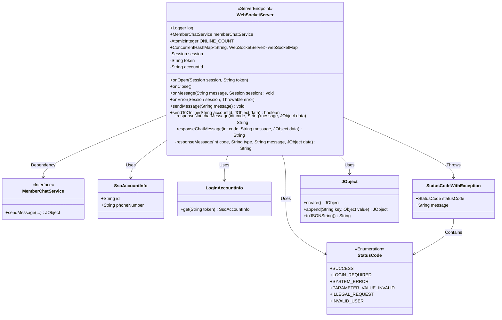
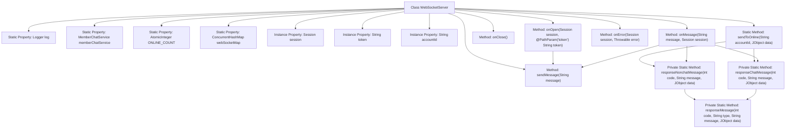
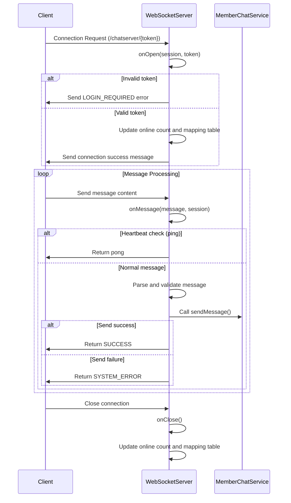

# Basic Information

|      |      |
|------|------|
| Name | WebSocketServer |
| Language | .java |
| Code Path | WeFe/board/board-service/src/main/java/com/welab/wefe/board/service/service/WebSocketServer.java |
| Package Name | com.welab.wefe.board.service.service |
| Dependencies | ['com.alibaba.fastjson.JSON', 'com.alibaba.fastjson.JSONObject', 'com.welab.wefe.board.service.base.LoginAccountInfo', 'com.welab.wefe.board.service.constant.ChatConstant', 'com.welab.wefe.common.StatusCode', 'com.welab.wefe.common.exception.StatusCodeWithException', 'com.welab.wefe.common.util.JObject', 'com.welab.wefe.common.util.StringUtil', 'com.welab.wefe.common.web.service.account.SsoAccountInfo', 'org.slf4j.Logger', 'org.slf4j.LoggerFactory', 'org.springframework.stereotype.Component', 'javax.websocket', 'javax.websocket.server.PathParam', 'javax.websocket.server.ServerEndpoint', 'java.io.IOException', 'java.util.concurrent.ConcurrentHashMap', 'java.util.concurrent.atomic.AtomicInteger'] |
| Brief Description | WebSocket server endpoint, handling user connections, message sending/receiving, and online status management, supporting heartbeat detection and message push. |

# Description

The code implements a WebSocket-based chat server endpoint, encompassing connection management, message processing, and status push functionalities. Key features include: authenticating users via tokens, maintaining an online user list and connection count statistics; processing client-sent messages with support for heartbeat detection (ping/pong) and message forwarding; enabling proactive message pushes to online users; and encapsulating standard response message formats with status codes, types, and business data. The system utilizes concurrent containers to manage connections, logs detailed operational records, and handles various exception scenarios.

# Class Summary

| Name   | Type  | Description |
|-------|------|-------------|
| WebSocketServer | class | WebSocket server class, handling user connections, message sending/receiving, and online status management, supporting heartbeat detection and message push. |

## Class WebSocketServer

|      |      |
|------|------|
| Access Modifier | @ServerEndpoint("/chatserver/{token}");@Component;public |
| Type | class |
| Name | WebSocketServer |
| Description | WebSocket server class, handling user connections, message sending/receiving, and online status management, supporting heartbeat detection and message push. |

### UML Class Diagram

This code implements a WebSocket-based chat server with core functionalities including: managing client connections (via token authentication), maintaining online user lists, handling message transmission (supporting heartbeat detection and business messages), and error handling. The central class WebSocketServer uses annotations to implement WebSocket endpoints, maintains online status through static variables, relies on MemberChatService for business logic, and interacts with frontend via JSON format. The system manages active connections through ConcurrentHashMap, provides message push and status code response mechanisms, and features a complete exception handling workflow.

### Internal Method Call Graph

This flowchart illustrates the structure of the WebSocketServer class and its main method invocation relationships, including static properties, instance properties, and key methods. The sequence diagram describes the complete process of client connection, message processing, and disconnection, covering critical interaction steps such as token validation, heartbeat checks, and message forwarding. This represents a typical WebSocket server implementation for managing connections, routing messages, and maintaining state in real-time chat scenarios.

### Field List

| Name  | Type  | Description |
|-------|-------|------|
| log = LoggerFactory.getLogger(WebSocketServer.class) | Logger | Define a static logger, associated with the WebSocketServer class. |
| webSocketMap = new ConcurrentHashMap<>() | ConcurrentHashMap<String, WebSocketServer> | A static concurrent hash table that stores mappings from strings to WebSocket servers, thread-safe. |
| session | Session | Private session object session |
| memberChatService | MemberChatService | The static member variable memberChatService, of type MemberChatService. |
| token = "" | String | The private string variable token is initialized as an empty string. |
| accountId | String | The private string-type variable accountId is used to store the account ID. |
| ONLINE_COUNT = new AtomicInteger(0) | AtomicInteger | Define a private static immutable atomic integer variable ONLINE_COUNT with an initial value of 0, used for thread-safe online count statistics. |

### Method List

| Name  | Type  | Description |
|-------|-------|------|
| onOpen | void | Method for handling WebSocket connections: Verify the validity of the token, return an error if invalid; if valid, record user information and update the online count, then return a connection success or error message. |
| sendToOnline | boolean | The method `sendToOnline` checks whether the user is online. If online, it sends the message and returns success; otherwise, it logs the event and returns failure. In case of an exception, it logs an error. |
| responseNonchatMessage | String | This is a private static method used to generate responses for non-chat messages. It takes status code, message, and JSON data as parameters, and calls the responseMessage method to return a formatted response. |
| onClose | void | The method `onClose` handles WebSocket closure: if `accountId` is not empty and exists in `webSocketMap`, it removes the entry and decrements the online count; logs the user logout information and the current number of online users. |
| responseChatMessage | String | This method is used to generate a chat message response, receiving a status code, message content, and data object, then calling a generic response method to return formatted results. |
| responseMessage | String | Static method generates a JSON response containing status code, type, message, and data (initialized when empty). Returns the concatenated JSON string. |
| onError | void | Java Method: Handle session errors, log error details including tokens and exception information. |
| sendMessage | void | Java Method: Sends a text message via WebSocket session, may throw an IO exception. |
| onMessage | void | Processing WebSocket Messages: Validate token and message validity, parse JSON data, check sender/recipient information, send messages, and return results or errors. |

