# Basic Information

|      |      |
|------|------|
| Name | service |
| Language | .java |
| Code Path | WeFe/board/board-service/src/main/java/com/welab/wefe/board/service/service |
| Package Name | docs.board.board-service.src.main.java.com.welab.wefe.board.service.service |
| Brief Description | The AccountService provides account management functionalities, relying on multiple services to support operations such as querying, filtering, and login. The GlobalConfigService manages global configurations, ensuring security and consistency. The ProjectService oversees the entire project lifecycle, including members, datasets, and statuses. The GatewayService handles message synchronization and gateway communication. The DataResourceService uniformly manages CRUD operations for various datasets. The Fusion module processes the lifecycle of data fusion tasks. ModelExport implements multi-language model code generation. The Checkpoint module monitors service health status. Other services include management functionalities for messages, chats, tasks, certificates, and more. |

# Description

## Overview  
This module is the core service collection of the federated learning platform BoardService, primarily responsible for unified management of accounts, data resources, project workflows, and multi-party secure computation tasks, functioning as an enterprise-level AI collaboration hub. The interface specifications cover CRUD operations (e.g., AccountService), health checks (ServiceCheckService), model exports (ModelExportService), etc., forming a complete RESTful/JNI/gRPC hybrid invocation system.  

Key data structures include abstract base classes (AbstractManifest), enumeration types (MainfestType), task models (FusionResultExportProgress), and cross-node communication objects (GatewayOnlineCheckResult). External dependencies involve infrastructure such as GatewayService, GlobalConfigService, and PersistentStorage, as well as standard components like RSA encryption and PMML 4.3. For example, the data fusion module relies on the WEFE_DATA library to store intermediate results, while the model export service supports code generation in 14 programming languages.  

## Core Business Scenarios  
The module supports three typical workflows: 1) Data lifecycle management (upload → parse → store), such as ImageDataSetParser converting images to PASCAL VOC format; 2) Federated task collaboration (create → review → execute), e.g., FusionTaskService coordinating cross-node alignment of the RSA-PSI algorithm; 3) Full project lifecycle control (members/workflows/datasets), akin to a workflow engine, where ProjectService manages member status changes through transactions.  

Functional completeness is reflected in multi-dimensional support: account SSO login (AccountService), health checkpoint patterns (AbstractCheckpoint), real-time communication (WebSocketServer), etc. Interaction modes include service calls (e.g., DataResourceService updating counts), asynchronous tasks (FlowJobService progress callbacks), and gateway synchronization (GatewayService message broadcasting). For instance, XGBoost model exports dynamically select language adapters, while the chat service maintains online status via duplex WebSocket.

### Package Internal Structure View

```mermaid
graph TD
    service --> account
    service --> init
    service --> data_resource
    service --> checkpoint
    service --> globalconfig
    service --> verificationcode
    service --> fusion
    service --> modelexport
    service --> ProjectMemberService.java
    service --> FlowActionQueueService.java
    service --> TaskService.java
    service --> ProjectFlowNodeService.java
    service --> SystemInitializeService.java
    service --> FlowTemplateService.java
    service --> ProjectFlowService.java
    service --> ProjectDataSetService.java
    service --> ServingService.java
    service --> AbstractService.java
    service --> EmailService.java
    service --> PartnerConfigService.java
    service --> GatewayService.java
    service --> ChatUnreadMessageService.java
    service --> DataSetColumnService.java
    service --> MessageService.java
    service --> ChatLastAccountService.java
    service --> ModelOotRecordService.java
    service --> ProjectService.java
    service --> MemberChatService.java
    service --> BlacklistService.java
    service --> JobService.java
    service --> TaskResultService.java
    service --> DataSetStorageService.java
    service --> CertOperationService.java
    service --> FlowJobService.java
    service --> ServiceCheckService.java
    service --> CacheObjects.java
    service --> PrivacyDatabaseEncryptService.java
    service --> TaskProgressService.java
    service --> ProjectDataSetAuditService.java
    service --> FeatureDataOutputInfoService.java
    service --> DataSourceService.java
    service --> JobMemberService.java
    service --> BaseGatewayService.java
    service --> WebSocketServer.java
    service --> OperationLogService.java
    service --> ProjectFlowJobService.java
    service --> ProjectMemberAuditService.java

    account --> AccountService.java
    init --> MainfestType.java
    init --> AbstractManifest.java
    data_resource --> table_data_set
    data_resource --> bloom_filter
    data_resource --> add
    data_resource --> image_data_set
    data_resource --> DataResourceUploadTaskService.java
    data_resource --> AbstractDataResourceService.java
    data_resource --> DataResourceService.java
    table_data_set --> TableDataSetService.java
    bloom_filter --> BloomFilterTaskService.java
    bloom_filter --> BloomFilterStorageService.java
    bloom_filter --> BloomFilterService.java
    bloom_filter --> BloomFilterColumnService.java
    add --> BloomFilterAddServiceDataRowConsumer.java
    add --> TableDataSetAddServiceDataRowConsumer.java
    add --> ImageDataSetAddService.java
    add --> BloomFilterAddService.java
    add --> TableDataSetAddService.java
    add --> AbstractDataResourceAddService.java
    image_data_set --> data_set_parser
    image_data_set --> ImageDataSetSampleService.java
    image_data_set --> ImageDataSetService.java
    data_set_parser --> AbstractImageDataSetParser.java
    data_set_parser --> DetectionImageDataSetParser.java
    data_set_parser --> ClassifyImageDataSetParser.java
    checkpoint --> UnionConnectionCheckpoint.java
    checkpoint --> GatewayInternetCheckpoint.java
    checkpoint --> GatewayIntranetCheckpoint.java
    checkpoint --> StorageCheckpoint.java
    checkpoint --> FlowCheckpoint.java
    globalconfig --> GlobalConfigService.java
    globalconfig --> BaseGlobalConfigService.java
    verificationcode --> VerificationCodeService.java
    fusion --> ExportProgressService.java
    fusion --> FieldInfoService.java
    fusion --> CallbackService.java
    fusion --> FusionResultStorageService.java
    fusion --> FusionTaskService.java
    fusion --> ThirdPartyService.java
    fusion --> FusionResultService.java
    modelexport --> XgboostJavaLanguage.java
    modelexport --> LogisticRegressionJavaScriptLanguage.java
    modelexport --> Node.java
    modelexport --> LogisticRegressionLanguageSelector.java
    modelexport --> XgboostPmmlLanguage.java
    modelexport --> XgboostPythonLanguage.java
    modelexport --> BaseXgboostLanguage.java
    modelexport --> XgboostCSharpLanguage.java
    modelexport --> XgboostHaskellLanguage.java
    modelexport --> XgboostRLanguage.java
    modelexport --> LogisticRegressionPythonLanguage.java
    modelexport --> ModelExportService.java
    modelexport --> LogisticRegressionModelExportService.java
    modelexport --> XgboostRubyLanguage.java
    modelexport --> BaseLogisticRegressionLanguage.java
    modelexport --> LogisticRegressionRubyLanguage.java
    modelexport --> LogisticRegressionCSharpLanguage.java
    modelexport --> LogisticRegressionRLanguage.java
    modelexport --> XgboostVisualBasicLanguage.java
    modelexport --> XgboostPowerShellLanguage.java
    modelexport --> LogisticRegressionCLanguage.java
    modelexport --> LogisticRegressionVisualBasicLanguage.java
    modelexport --> LogisticRegressionGoLanguage.java
    modelexport --> XgboostLanguageSelector.java
    modelexport --> XgboostDartLanguage.java
    modelexport --> XgboostPhpLanguage.java
    modelexport --> LogisticRegressionJavaLanguage.java
    modelexport --> LogisticRegressionPowerShellLanguage.java
    modelexport --> XgboostJavaScriptLanguage.java
    modelexport --> LogisticRegressionHaskellLanguage.java
    modelexport --> LogisticRegressionPmmlLanguage.java
    modelexport --> XgboostModelExportService.java
    modelexport --> XgboostGoLanguage.java
    modelexport --> LogisticRegressionPhpLanguage.java
    modelexport --> XgboostCLanguage.java
    modelexport --> LogisticRegressionDartLanguage.java
```

This flowchart presents the complete service layer architecture of the board-service module in the WeFe project, comprising 12 main service directories and over 50 specific service class files. The core structure takes "service" as the root node, extending downward to key submodules such as account, data_resource, and modelexport. The data_resource module is further subdivided into data processing components like table_data_set and bloom_filter, while the modelexport module includes multi-language export implementations for two machine learning models: Xgboost and LogisticRegression. The overall diagram demonstrates clear hierarchical relationships and modular design.

# File List

| Name   | Type  | Description |
|-------|------|-------------|
| [ProjectMemberService.java](ProjectMemberService.md) | file | The ProjectMemberService class is used to manage project members, providing functionalities such as adding members, querying members, and updating member statuses. It supports member operations for different roles (e.g., promoter and provider) and handles approval statuses and message notifications. |
| [FlowActionQueueService.java](FlowActionQueueService.md) | file | The FlowActionQueueService provides functionality for running and stopping tasks, configures parameters based on project types, and sends operation messages to the flow service via the notifyFlow method. |
| [TaskService.java](TaskService.md) | file | TaskService is a service class that provides task management functionalities, including querying task history, updating tasks, and finding nodes in the same branch. It depends on multiple services such as TaskRepository and ProjectService, and supports operations like grid search model result queries and DataIO task configuration retrieval. |
| [ProjectFlowNodeService.java](ProjectFlowNodeService.md) | file | The ProjectFlowNodeService class provides process node management functionalities, including querying nodes, updating node parameters, and checking the existence of specific components. It relies on multiple services such as ProjectFlowNodeRepository and GatewayService, supporting transaction handling and parameter synchronization. |
| [SystemInitializeService.java](SystemInitializeService.md) | file | The SystemInitializeService provides system initialization, member information synchronization, and update functionalities, including data resource synchronization, key updates, and member information management. Only super administrators have permission to perform these operations. |
| [FlowTemplateService.java](FlowTemplateService.md) | file | The FlowTemplateService provides CRUD operations for process templates, including saving, querying, finding by ID, and adding templates, utilizing the FlowTemplateRepository to interact with the database. |
| [ProjectFlowService.java](ProjectFlowService.md) | file | The ProjectFlowService offers project flow management capabilities, including creating, deleting, and copying flows, updating flow information and status, handling node parameters and grid search tasks, with support for OOT flows and model evaluation. |
| [ProjectDataSetService.java](ProjectDataSetService.md) | file | The ProjectDataSetService provides project dataset management functionalities, including querying derived dataset details, lists, and raw dataset lists, with support for conditional filtering and dataset updates. It primarily relies on components such as TableDataSetService to handle data resources. |
| [ServingService.java](ServingService.md) | file | The ServingService class provides model synchronization and global configuration update functionalities, including member information refresh, RSA key distribution, model parameter construction, and request processing logic, supporting federated training task coordination. |
| [AbstractService.java](AbstractService.md) | file | The abstract service class includes logging utilities and four auto-injected service components, providing exception logging methods. |
| [EmailService.java](EmailService.md) | file | The EmailService class provides email sending functionality, supporting batch sending of approval notification emails, handling retries for invalid addresses, and logging failed delivery information. It relies on global configuration to obtain SMTP parameters, including timeout and encoding settings. |
| [PartnerConfigService.java](PartnerConfigService.md) | file | The PartnerConfigService class provides functionalities for adding, deleting, and querying partner configurations. During addition, it validates member IDs and gateway addresses, and notifies the gateway to update its cache after operations. Querying supports pagination and conditional filtering. |
| [GatewayService.java](GatewayService.md) | file | The GatewayService class provides message synchronization functionality, supporting message broadcasting to project members or task members, including blacklist checks, communication status verification, and various cache refresh operations. |
| [ChatUnreadMessageService.java](ChatUnreadMessageService.md) | file | The ChatUnreadMessageService class operates on unread message data through chatUnreadMessageRepository. The addChatUnreadMessage method adds or increments the count of unread messages, while the delete method removes unread message records for specified sender and recipient accounts. |
| [DataSetColumnService.java](DataSetColumnService.md) | file | The DataSetColumnService provides functionalities for querying dataset feature lists, paginated queries, and updates. It invokes other member feature lists via the gateway, checks the dataset status, and returns feature data. It supports paginated field queries by dataset ID and allows updating dataset field information. |
| [MessageService.java](MessageService.md) | file | The MessageService provides message management functionalities, including querying, marking as read, adding messages, and handling to-do items. It supports multiple message types and events, such as applying for data resources and joining projects, while also managing related approval processes. |
| [ChatLastAccountService.java](ChatLastAccountService.md) | file | The ChatLastAccountService provides functionality for querying, adding, and deleting recently chatted accounts, along with associating unread message counts. Queries are sorted by update time, additions update or create new records, and deletions are performed based on account ID and contact ID. It includes logic for refreshing the logged-in user's cache. |
| [ModelOotRecordService.java](ModelOotRecordService.md) | file | The ModelOotRecordService provides save and query functionalities, supporting the retrieval of model score validation records by process ID or a combination of task ID and node ID. |
| [ProjectService.java](ProjectService.md) | file | The ProjectService class is a project management system service class, with main functionalities including: creating projects, managing project members, dataset review, project status updates, and data synchronization. Core methods include addProject (add a project), auditProject (review a project), removeMember (remove a member), addProjectDataSet (add a dataset), etc. It supports transaction processing, permission verification, data synchronization, and message notifications. |
| [MemberChatService.java](MemberChatService.md) | file | The MemberChatService handles message sending, receiving, retransmission, and status updates between members. It includes functionalities such as sending messages, querying chat details, and processing unread messages. Messages are forwarded via the gatewayService, with support for transaction rollback. |
| [BlacklistService.java](BlacklistService.md) | file | The BlacklistService provides blacklist management functionalities, including paginated querying of blacklists, adding members to the blacklist, removing members from the blacklist, and querying blacklist member information. After operations, it updates the cache and notifies the gateway to refresh. |
| [JobService.java](JobService.md) | file | The JobService class provides task management functionalities, including updating task status, querying tasks by ID, creating flowcharts, and setting cached results. It relies on multiple Repository and service classes, supporting task status changes, cache checks, and counting running tasks. |
| [TaskResultService.java](TaskResultService.md) | file | The TaskResultService provides task result query and processing functionalities, including conditional result retrieval, parsing binned results, obtaining feature lists and statistical information, and supports features such as feature selection, missing rate calculation, and CV/IV computation. |
| [DataSetStorageService.java](DataSetStorageService.md) | file | The DataSetStorageService provides dataset storage management functionalities, including initializing storage, checking key existence, deleting datasets, saving and reading data rows, paginated queries, and data preview operations, with support for the ClickHouse storage type. |
| [CertOperationService.java](CertOperationService.md) | file | The CertOperationService class provides certificate management functionalities, including updating status, saving certificate information, exporting certificates, querying certificates and private keys, creating certificate requests, and other operations. |
| [FlowJobService.java](FlowJobService.md) | file | The FlowJobService provides stream job management functionalities: paginated query of execution history (query), retrieval of job details (detail), and progress tracking (getProgress). It relies on multiple services and repositories, returning corresponding data models through conditional filtering and status evaluation. |
| [ServiceCheckService.java](ServiceCheckService.md) | file | The ServiceCheckService provides member service availability checking functionality, including local and remote service status queries, as well as gateway connectivity detection. It supports four types of service checks: BoardService, UnionService, GatewayService, and FlowService. |
| [CacheObjects.java](CacheObjects.md) | file | The CacheObjects class manages cached data, including member information, account mappings, data resource tags, and blacklists. It provides refresh and retrieval methods to ensure data consistency. Key functionalities include member validation, tag statistics, and account management. |
| [PrivacyDatabaseEncryptService.java](PrivacyDatabaseEncryptService.md) | file | This service class is used for encrypting private data in the database, including accounts, verification codes, global configurations, and data source information. It achieves encryption by updating the last modified timestamps of the respective models and saving the changes. |
| [TaskProgressService.java](TaskProgressService.md) | file | The TaskProgressService retrieves TaskProgressMysqlModel data from taskProgressRepository based on taskId and role. |
| [ProjectDataSetAuditService.java](ProjectDataSetAuditService.md) | file | The ProjectDataSetAuditService class is used to audit datasets, checking project status and member permissions, updating dataset audit status, and synchronizing messages and gateway data. |
| [FeatureDataOutputInfoService.java](FeatureDataOutputInfoService.md) | file | The FeatureDataOutputInfoService class inherits from AbstractService and includes task query and result encapsulation functionalities. It implements task fuzzy matching through dependencies like JobRepository, while the wrapModelResult method encapsulates model metadata and parameters. |
| [DataSourceService.java](DataSourceService.md) | file | The DataSourceService provides data source management functionalities, including adding (with name uniqueness validation and connection testing), deleting, and paginated querying of data sources, as well as testing database connections. |
| [JobMemberService.java](JobMemberService.md) | file | The JobMemberService provides task member query functionalities, including retrieving member lists by task ID, excluding arbitrators, conditional combined queries, and local task determination. |
| [BaseGatewayService.java](BaseGatewayService.md) | file | The BaseGatewayService class provides gateway message sending functionality, supporting message transmission to either its own or the counterpart gateway, while handling permission verification, exception handling, and GRPC communication. It includes methods such as address validation, metadata construction, and SSL channel creation. |
| [WebSocketServer.java](WebSocketServer.md) | file | WebSocket server endpoint, handling user connections, message sending/receiving, and online status management, supporting heartbeat detection and message push. |
| [OperationLogService.java](OperationLogService.md) | file | The OperationLogService provides log query functionality, supporting filtering by interface, operator ID, and time range, and returns paginated results. |
| [ProjectFlowJobService.java](ProjectFlowJobService.md) | file | ProjectFlowJobService is a service class responsible for managing the initiation, resumption, and termination of project flow tasks. It handles operations such as tasks, datasets, and members through dependency injection of multiple service classes, and incorporates transaction processing and synchronization mechanisms. Key functionalities include initiating workflows, configuring task settings, validating task eligibility, and replicating task information. |
| [ProjectMemberAuditService.java](ProjectMemberAuditService.md) | file | The ProjectMemberAuditService provides project member audit functionalities, including querying audit records, checking if all members have consented, and reviewing new members, involving CRUD operations on projects, members, and datasets. |
| [modelexport](modelexport/_module.md) | package | Multiple Java classes implement multi-language code generation for XGBoost and logistic regression models, including Java, Python, C#, R, etc., supporting binary and multi-class classification, and providing node processing, method signature generation, and result calculation functions. |
| [fusion](fusion/_module.md) | package | The ExportProgressService manages export progress and interacts with the database. The FieldInfoService handles field information, providing query and save functionalities. The CallbackService processes callback logic, supporting auditing and the RSA-PSI algorithm. The FusionResultStorageService manages dataset storage, supporting CRUD operations. The FusionTaskService oversees fusion tasks, handling status updates and algorithm logic. The ThirdPartyService interacts with other members via a gateway. The FusionResultService offers data export capabilities, supporting multi-threaded processing. |
| [verificationcode](verificationcode/_module.md) | package | The VerificationCodeService class provides verification code services, including phone number validation, email/SMS configuration checks, verification code sending record storage, and parameter construction functionality. |
| [globalconfig](globalconfig/_module.md) | package | The GlobalConfigService inherits from BaseGlobalConfigService, manages global configurations, depends on multiple services, and includes functionalities such as updating configurations, IP whitelist management, and configuration initialization. The BaseGlobalConfigService provides CRUD operations for configurations, supports batch operations, type conversion, and field encryption, ensuring traceability of operations. |
| [checkpoint](checkpoint/_module.md) | package | UnionConnectionCheckpoint retrieves the federated connection URL. GatewayInternetCheckpoint checks public network connectivity. GatewayIntranetCheckpoint verifies intranet connectivity. StorageCheckpoint tests storage access. FlowCheckpoint examines flow service connectivity. |
| [data_resource](data_resource/_module.md) | package | TableDataSetService manages tabular datasets, supporting functions such as file upload, deletion, and query. The BloomFilter module handles task status, data storage, and column configuration. The data resource addition module processes the import of tabular, image, and other data types. The image dataset module manages data for classification/detection tasks. The upload task service oversees upload progress and status. DataResourceService manages usage counts and queries for various datasets. |
| [init](init/_module.md) | package | The ManifestType enum defines three types: list, data_set, and project. AbstractManifest is the base class containing a type field, used to distinguish manifest types. |
| [account](account/_module.md) | package | The AccountService provides account management functionalities, including querying all accounts, paginated queries, checking mobile number existence, SSO login, and updating UI configurations. It supports sensitive information filtering and cross-member queries. |

