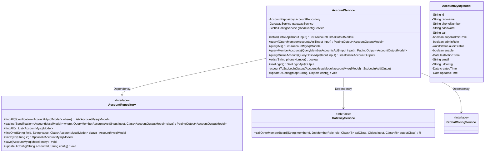
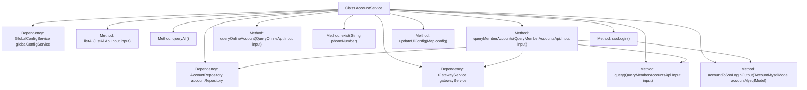

# Basic Information

|      |      |
|------|------|
| Name | AccountService |
| Language | .java |
| Code Path | WeFe/board/board-service/src/main/java/com/welab/wefe/board/service/service/account/AccountService.java |
| Package Name | com.welab.wefe.board.service.service.account |
| Dependencies | ['com.alibaba.fastjson.JSON', 'com.welab.wefe.board.service.api.account.ListAllApi', 'com.welab.wefe.board.service.api.account.QueryMemberAccountsApi', 'com.welab.wefe.board.service.api.account.QueryOnlineApi', 'com.welab.wefe.board.service.api.account.SsoLoginApi', 'com.welab.wefe.board.service.base.LoginAccountInfo', 'com.welab.wefe.board.service.database.entity.AccountMysqlModel', 'com.welab.wefe.board.service.database.repository.AccountRepository', 'com.welab.wefe.board.service.dto.base.PagingOutput', 'com.welab.wefe.board.service.dto.entity.AccountListAllOutputModel', 'com.welab.wefe.board.service.dto.entity.AccountOutputModel', 'com.welab.wefe.board.service.dto.vo.OnlineAccountOutput', 'com.welab.wefe.board.service.service.CacheObjects', 'com.welab.wefe.board.service.service.GatewayService', 'com.welab.wefe.board.service.service.WebSocketServer', 'com.welab.wefe.board.service.service.globalconfig.GlobalConfigService', 'com.welab.wefe.common.SecurityUtil', 'com.welab.wefe.common.StatusCode', 'com.welab.wefe.common.data.mysql.Where', 'com.welab.wefe.common.data.mysql.enums.OrderBy', 'com.welab.wefe.common.exception.StatusCodeWithException', 'com.welab.wefe.common.util.JObject', 'com.welab.wefe.common.util.Sha1', 'com.welab.wefe.common.util.StringUtil', 'com.welab.wefe.common.web.service.account.SsoAccountInfo', 'com.welab.wefe.common.web.util.CurrentAccountUtil', 'com.welab.wefe.common.web.util.DatabaseEncryptUtil', 'com.welab.wefe.common.web.util.ModelMapper', 'com.welab.wefe.common.wefe.enums.AuditStatus', 'com.welab.wefe.common.wefe.enums.JobMemberRole', 'org.apache.commons.collections4.CollectionUtils', 'org.springframework.beans.factory.annotation.Autowired', 'org.springframework.data.jpa.domain.Specification', 'org.springframework.stereotype.Service', 'java.util'] |
| Brief Description | The AccountService provides account management functionalities, including querying all accounts, paginated queries, checking mobile number existence, SSO login, and updating UI configurations. It supports sensitive information filtering and cross-member queries. |

# Description

The AccountService is a service class that provides account management functionalities. It depends on AccountRepository, GatewayService, and GlobalConfigService. Key features include: querying a list of all accounts with support for filtering by nickname; paginated account queries with filters for phone number, approval status, and nickname; retrieving account information for a specified member while filtering sensitive data; querying online accounts with support for filtering by account ID; checking if a phone number exists; handling SSO login, including account creation or updates; generating SSO login output information; and updating user interface configurations. The service involves data encryption, cache operations, and cross-member gateway calls.

# Class Summary

| Name   | Type  | Description |
|-------|------|-------------|
| AccountService | class | The AccountService provides account management functionalities, including querying, pagination, online status checks, SSO login, and UI configuration updates. It supports conditional filtering, sensitive information masking, and cross-member data access. |

## Class AccountService

|      |      |
|------|------|
| Access Modifier | @Service;public |
| Type | class |
| Name | AccountService |
| Description | The AccountService provides account management functionalities, including querying, pagination, online status checks, SSO login, and UI configuration updates. It supports conditional filtering, sensitive information masking, and cross-member data access. |

### UML Class Diagram

Class Diagram Description: This diagram illustrates the AccountService and its dependencies. AccountService performs data persistence operations through AccountRepository, relies on GatewayService for cross-service calls, and utilizes GlobalConfigService to retrieve global configurations. Core functionalities include account querying, pagination processing, online status checking, SSO login, etc., involving various input-output model transformations and sensitive information filtering.

### Internal Method Call Graph

This code represents the implementation of the AccountService class, which primarily handles account-related business logic. It includes multiple methods such as querying account lists, paginated account queries, checking online accounts, verifying phone number existence, and SSO login. The class injects dependencies like AccountRepository, GatewayService, and GlobalConfigService to interact with databases and external services. There are certain invocation relationships between methods, such as queryMemberAccounts calling the query method or utilizing gatewayService to access other services. The overall flow is clear, covering core functionalities of account management.

### Field List

| Name  | Type  | Description |
|-------|-------|------|
| gatewayService | GatewayService | Using @Autowired to automatically inject the GatewayService instance. |
| accountRepository | AccountRepository | Using @Autowired to automatically inject an instance of AccountRepository. |
| globalConfigService | GlobalConfigService | Use @Autowired to automatically inject an instance of GlobalConfigService. |

### Method List

| Name  | Type  | Description |
|-------|-------|------|
| queryOnlineAccount | List<OnlineAccountOutput> | Query method for online accounts: Based on the input parameters, check the member ID or gateway source and directly return the local online account list; otherwise, invoke other member data through the gateway service, throwing a system error in case of exceptions. |
| queryAll | List<AccountMysqlModel> | Query all account data and return a list. |
| query | PagingOutput<AccountOutputModel> | This method queries member accounts based on input conditions, supporting fuzzy matching for phone numbers and nicknames, exact matching for approval status, and returning paginated results sorted by creation time in descending order. |
| queryMemberAccounts | PagingOutput<AccountOutputModel> | Query member account information; if it is the current member, query directly; otherwise, call the gateway service. When processing the results, remove sensitive information and return paginated data. |
| exist | boolean | Check if the mobile number exists: Query the database through encryption and return whether there is a corresponding account record. |
| listAll | List<AccountListAllOutputModel> | This method filters accounts based on the nickname in the input parameters, queries the database, and returns a list of mapped output models. |
| ssoLogin | SsoLoginApi.Output | The method `ssoLogin` handles SSO login: if the account does not exist, it creates a new account with a random password and salt value, granting administrator privileges; if the account exists, it updates the nickname, phone number, and email information. Finally, it caches the account information and returns the login result. |
| accountToSsoLoginOutput | SsoLoginApi.Output | Convert AccountMysqlModel to SsoLoginApi.Output, setting the ID, token, mobile number, nickname, role, UI configuration, and membership information. |
| updateUiConfig | void | Update UI configuration method: Call the account repository to update the UI configuration corresponding to the current account ID, with the parameter being a JSON-stringified configuration map. |

