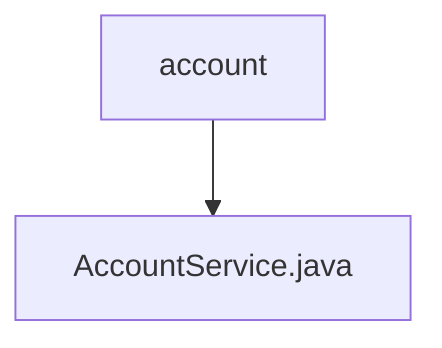

# Basic Information

|      |      |
|------|------|
| Name | account |
| Language | .java |
| Code Path | WeFe/board/board-service/src/main/java/com/welab/wefe/board/service/service/account |
| Package Name | docs.board.board-service.src.main.java.com.welab.wefe.board.service.service.account |
| Brief Description | The AccountService provides account management functionalities, including querying all accounts, paginated queries, checking mobile number existence, SSO login, and updating UI configurations. It supports sensitive information filtering and cross-member queries. |

# Description

AccountService is a service class that provides account management functionalities. It depends on AccountRepository, GatewayService, and GlobalConfigService. Key features include: querying a list of all accounts with support for filtering by nickname; paginated account queries with filters for phone number, verification status, and nickname; retrieving account information for a specified member while filtering sensitive data; querying online accounts with support for filtering by account ID; checking if a phone number exists; handling SSO login, including account creation or updates; generating SSO login output information; and updating user interface configurations. The service involves data encryption, cache operations, and cross-member gateway calls.

### Package Internal Structure View

This flowchart illustrates the hierarchical relationship between the account directory and the AccountService.java file in the WeFe project. The account, as the parent directory, contains the AccountService.java service class file, reflecting a typical layered structure design pattern in Java projects. This structure facilitates code organization and maintenance, adhering to the common principle of separating business logic from data access.

# File List

| Name   | Type  | Description |
|-------|------|-------------|
| [AccountService.java](AccountService.md) | file | The AccountService provides account management functionalities, including querying all accounts, paginated queries, checking mobile number existence, SSO login, and updating UI configurations. It supports sensitive information filtering and cross-member queries. |

