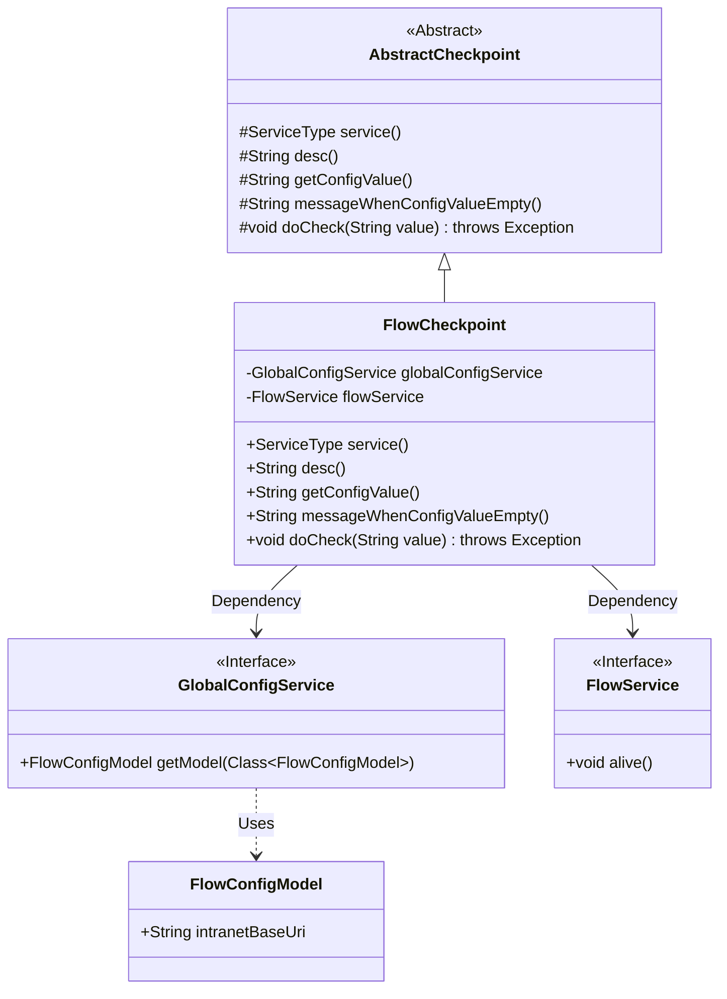
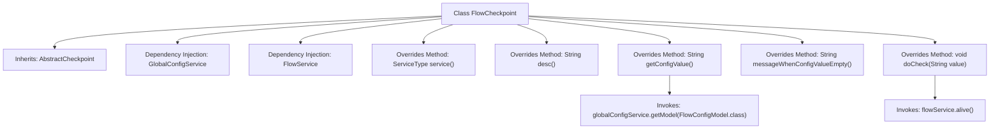

# Basic Information

|      |      |
|------|------|
| Name | FlowCheckpoint |
| Language | .java |
| Code Path | WeFe/board/board-service/src/main/java/com/welab/wefe/board/service/service/checkpoint/FlowCheckpoint.java |
| Package Name | com.welab.wefe.board.service.service.checkpoint |
| Dependencies | ['com.welab.wefe.board.service.sdk.FlowService', 'com.welab.wefe.board.service.service.globalconfig.GlobalConfigService', 'com.welab.wefe.common.wefe.checkpoint.AbstractCheckpoint', 'com.welab.wefe.common.wefe.dto.global_config.FlowConfigModel', 'com.welab.wefe.common.wefe.enums.ServiceType', 'org.springframework.beans.factory.annotation.Autowired', 'org.springframework.stereotype.Service'] |
| Brief Description | The `FlowCheckpoint` class inherits from `AbstractCheckpoint` to check the connectivity of Flow services. It depends on `GlobalConfigService` and `FlowService`, and prompts to configure the intranet address when configurations are missing. |

# Description

The code defines a service class named `FlowCheckpoint`, which inherits from `AbstractCheckpoint`. It implements functionality by injecting `GlobalConfigService` and `FlowService`. Its primary responsibility is to check connectivity with the flow service, belonging to the `FlowService` type. It retrieves the `FlowConfigModel` configuration to verify whether the intranet address is set, prompting the user to configure it if not. The actual check operation is performed by calling the `alive` method of `flowService`.

# Class Summary

| Name   | Type  | Description |
|-------|------|-------------|
| FlowCheckpoint | class | The `FlowCheckpoint` class inherits from `AbstractCheckpoint` and is used to check the connectivity of the flow service. It retrieves configurations via `globalConfigService` and invokes `flowService.alive()` for detection. If the configuration is empty, it prompts to set the intranet address. |

## Class FlowCheckpoint

|      |      |
|------|------|
| Access Modifier | @Service;public |
| Type | class |
| Name | FlowCheckpoint |
| Description | The `FlowCheckpoint` class inherits from `AbstractCheckpoint` and is used to check the connectivity of the flow service. It retrieves configurations via `globalConfigService` and invokes `flowService.alive()` for detection. If the configuration is empty, it prompts to set the intranet address. |

### UML Class Diagram

This class diagram illustrates that FlowCheckpoint inherits from the abstract class AbstractCheckpoint and implements its abstract methods. FlowCheckpoint depends on two interfaces: GlobalConfigService and FlowService, where the GlobalConfigService interface utilizes the FlowConfigModel data model. The overall structure reflects the dependency injection pattern in Spring service layer and the template method design pattern of abstract classes, which are used to implement service connectivity check functionality.

### Internal Method Call Graph

This code implements the FlowCheckpoint class, which inherits from the AbstractCheckpoint abstract class and is primarily used to check connectivity with the flow service. By injecting dependencies GlobalConfigService and FlowService, it overrides multiple parent class methods including retrieving service type, description information, configuration value, empty configuration prompt message, and the specific logic for performing checks. When obtaining configuration values, it invokes globalConfigService to retrieve FlowConfigModel, and during execution checks, it calls the alive method of flowService to verify service availability. The overall process is clear with well-defined responsibilities, representing a typical infrastructure health check implementation.

### Field List

| Name  | Type  | Description |
|-------|-------|------|
| flowService | FlowService | Using @Autowired to automatically inject the FlowService instance. |
| globalConfigService | GlobalConfigService | Using @Autowired to automatically inject an instance of GlobalConfigService. |

### Method List

| Name  | Type  | Description |
|-------|-------|------|
| getConfigValue | String | Method override, retrieve the FlowConfigModel configuration value, return null if empty, otherwise return intranetBaseUri. |
| desc | String | Check connectivity with the flow service. |
| service | ServiceType | This method overrides the parent class method and returns the service type as FlowService. |
| messageWhenConfigValueEmpty | String | Method return prompt: The flow intranet address needs to be configured in the system settings under global settings. |
| doCheck | void | Check the service's alive status by invoking the alive method of flowService. |

