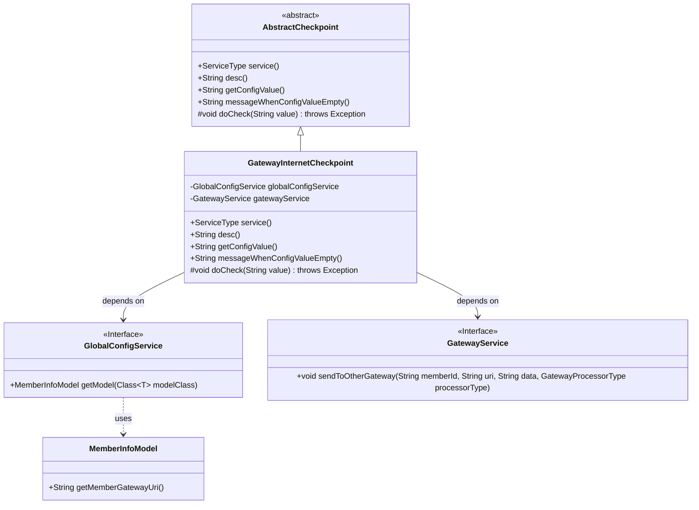
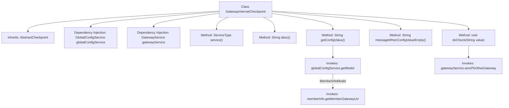

# Basic Information

|      |      |
|------|------|
| Name | GatewayInternetCheckpoint |
| Language | .java |
| Code Path | WeFe/board/board-service/src/main/java/com/welab/wefe/board/service/service/checkpoint/GatewayInternetCheckpoint.java |
| Package Name | com.welab.wefe.board.service.service.checkpoint |
| Dependencies | ['com.welab.wefe.board.service.service.CacheObjects', 'com.welab.wefe.board.service.service.GatewayService', 'com.welab.wefe.board.service.service.globalconfig.GlobalConfigService', 'com.welab.wefe.common.util.JObject', 'com.welab.wefe.common.wefe.checkpoint.AbstractCheckpoint', 'com.welab.wefe.common.wefe.dto.global_config.MemberInfoModel', 'com.welab.wefe.common.wefe.enums.GatewayProcessorType', 'com.welab.wefe.common.wefe.enums.ServiceType', 'org.springframework.beans.factory.annotation.Autowired', 'org.springframework.stereotype.Service'] |
| Brief Description | The `GatewayInternetCheckpoint` class inherits from `AbstractCheckpoint` and is used to check public network connectivity. It retrieves configurations via `globalConfigService` and invokes `gatewayService` to send requests. |

# Description

This is a Spring service class named GatewayInternetCheckpoint, which inherits from AbstractCheckpoint. It checks the public network connectivity between the board and gateway services through GatewayService and GlobalConfigService. Key functionalities include: returning the service type as GatewayService with a description indicating public network connectivity check; retrieving member gateway addresses from global configuration, prompting to configure them in member settings if not set; during actual checks, sending liveness detection requests to other gateways via gatewayService.

# Class Summary

| Name   | Type  | Description |
|-------|------|-------------|
| GatewayInternetCheckpoint | class | The `GatewayInternetCheckpoint` class inherits from `AbstractCheckpoint`, checks public network connectivity, retrieves configurations via `globalConfigService`, and invokes `gatewayService` to send requests. |

## Class GatewayInternetCheckpoint

|      |      |
|------|------|
| Access Modifier | @Service;public |
| Type | class |
| Name | GatewayInternetCheckpoint |
| Description | The `GatewayInternetCheckpoint` class inherits from `AbstractCheckpoint`, checks public network connectivity, retrieves configurations via `globalConfigService`, and invokes `gatewayService` to send requests. |

### UML Class Diagram

This diagram illustrates that the GatewayInternetCheckpoint class inherits from the AbstractCheckpoint abstract class and depends on two interfaces: GlobalConfigService and GatewayService. The GlobalConfigService interface utilizes the MemberInfoModel class to retrieve the gateway URI. The GatewayInternetCheckpoint implements functionality to check public network connectivity of gateways by invoking gatewayService to send test requests for connection verification. The overall structure demonstrates the application of Spring's dependency injection and the abstract template method pattern.

### Internal Method Call Graph

This code illustrates a Spring service class `GatewayInternetCheckpoint` that inherits from `AbstractCheckpoint` and implements multiple checkpoint-related methods. Key functionalities include retrieving gateway configuration information, checking public network connectivity, and sending heartbeat detection via `GatewayService`. The flowchart clearly presents the class structure, dependency relationships, and method invocation chain, particularly highlighting how `getConfigValue()` obtains member gateway URIs through `GlobalConfigService`, and the critical process where `doCheck()` invokes the gateway service to send detection requests.

### Field List

| Name  | Type  | Description |
|-------|-------|------|
| globalConfigService | GlobalConfigService | Automatically inject global configuration service instances. |
| gatewayService | GatewayService | Using @Autowired to automatically inject an instance of GatewayService. |

### Method List

| Name  | Type  | Description |
|-------|-------|------|
| getConfigValue | String | This method retrieves the member information configuration value: it calls the global configuration service to obtain a MemberInfoModel instance, returns null if it is empty, otherwise returns its member gateway URI. |
| desc | String | Check the public network connectivity of the board and gateway services |
| service | ServiceType | Rewrite the service method to return the GatewayService type. |
| messageWhenConfigValueEmpty | String | When the configuration value is empty, prompt the user to configure the gateway communication address in the member settings of the global settings. |
| doCheck | void | The method doCheck sends the member ID and value to another gateway, using gatewayAliveProcessor for processing. |

