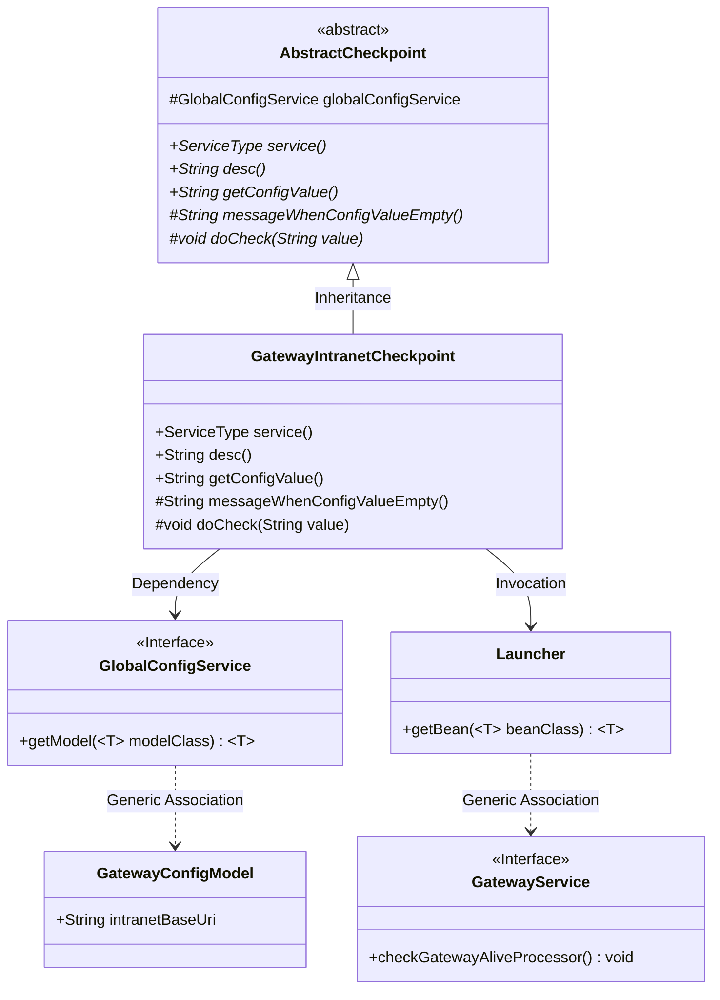
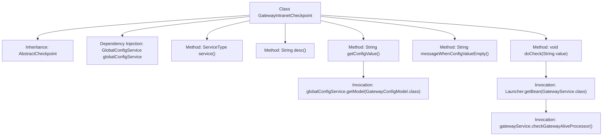

# Basic Information

|      |      |
|------|------|
| Name | GatewayIntranetCheckpoint |
| Language | .java |
| Code Path | WeFe/board/board-service/src/main/java/com/welab/wefe/board/service/service/checkpoint/GatewayIntranetCheckpoint.java |
| Package Name | com.welab.wefe.board.service.service.checkpoint |
| Dependencies | ['com.welab.wefe.board.service.service.GatewayService', 'com.welab.wefe.board.service.service.globalconfig.GlobalConfigService', 'com.welab.wefe.common.web.Launcher', 'com.welab.wefe.common.wefe.checkpoint.AbstractCheckpoint', 'com.welab.wefe.common.wefe.dto.global_config.GatewayConfigModel', 'com.welab.wefe.common.wefe.enums.ServiceType', 'org.springframework.beans.factory.annotation.Autowired', 'org.springframework.stereotype.Service'] |
| Brief Description | The `GatewayIntranetCheckpoint` class inherits from `AbstractCheckpoint` and checks the intranet connectivity between the board and the gateway. It relies on `globalConfigService` to obtain configurations and prompts to set the intranet address if not configured. It verifies the alive status through `GatewayService`. |

# Description

The code defines a service class named `GatewayIntranetCheckpoint`, which inherits from `AbstractCheckpoint`. It retrieves the gateway intranet base URI configuration via `GlobalConfigService` to check the connectivity between the board and the gateway service on the intranet. When the configuration value is empty, it prompts the user to set the gateway intranet address. The specific check logic is implemented by calling the `checkGatewayAliveProcessor` method of `GatewayService`. This checkpoint is associated with the `GatewayService` service type.

# Class Summary

| Name   | Type  | Description |
|-------|------|-------------|
| GatewayIntranetCheckpoint | class | The `GatewayIntranetCheckpoint` class is used to check the intranet connectivity between the board and the gateway service. It retrieves configurations via the `globalConfigService`. If the configuration is empty, it prompts to set the intranet address. During the check, it invokes the liveliness detection method of the `GatewayService`. |

## Class GatewayIntranetCheckpoint

|      |      |
|------|------|
| Access Modifier | @Service;public |
| Type | class |
| Name | GatewayIntranetCheckpoint |
| Description | The `GatewayIntranetCheckpoint` class is used to check the intranet connectivity between the board and the gateway service. It retrieves configurations via the `globalConfigService`. If the configuration is empty, it prompts to set the intranet address. During the check, it invokes the liveliness detection method of the `GatewayService`. |

### UML Class Diagram

This class diagram illustrates the core structure of the Gateway Intranet Checkpoint (GatewayIntranetCheckpoint) and its relationships. The class inherits from the abstract checkpoint (AbstractCheckpoint) and implements abstract methods such as service type description and configuration value retrieval. It relies on GlobalConfigService to obtain the intranet address from the gateway configuration model (GatewayConfigModel) and utilizes Launcher to acquire a GatewayService instance for connectivity checks. The overall design demonstrates the application of dependency injection and the template method pattern, enabling an extensible checkpoint mechanism.

### Internal Method Call Graph

This flowchart illustrates the structure of the GatewayIntranetCheckpoint class and its method invocation relationships. The class inherits from AbstractCheckpoint, retrieves configuration information through GlobalConfigService, and primarily checks the intranet connectivity between the board and gateway services. The core method doCheck obtains a GatewayService instance via Launcher and invokes its health check processor, demonstrating the complete process of configuration retrieval, service location, and health verification.

### Field List

| Name  | Type  | Description |
|-------|-------|------|
| globalConfigService | GlobalConfigService | The code snippet uses the @Autowired annotation to automatically inject an instance of GlobalConfigService for global configuration management. |

### Method List

| Name  | Type  | Description |
|-------|-------|------|
| messageWhenConfigValueEmpty | String | Method override, returns a prompt message when the configuration value is empty, stating that the gateway intranet address needs to be configured in the system settings of the global configuration. |
| getConfigValue | String | Rewrite the method `getConfigValue` to return the `intranetBaseUri` value of the `GatewayConfigModel` class from the global configuration. |
| service | ServiceType | This method overrides and returns the service type as GatewayService. |
| desc | String | Check the intranet connectivity between the board and gateway services. |
| doCheck | void | Code snippet for checking gateway liveliness status by invoking the checkGatewayAliveProcessor method through GatewayService. |

