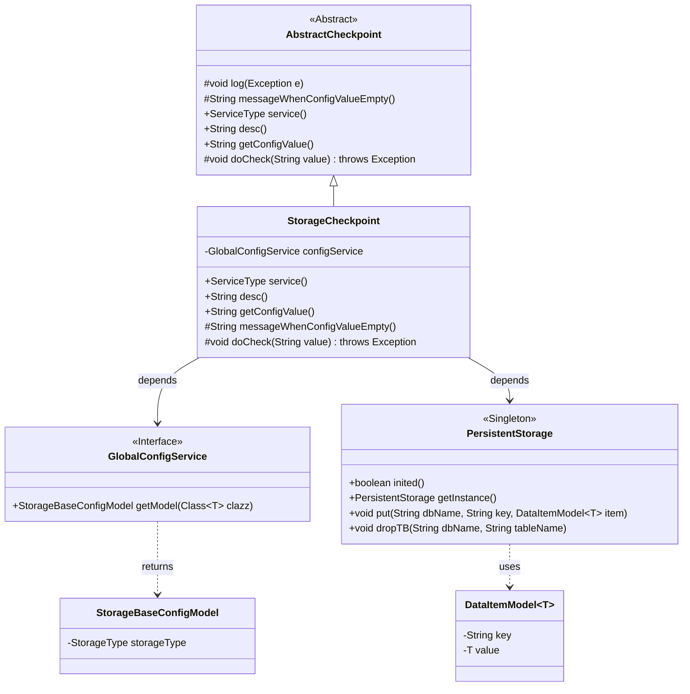
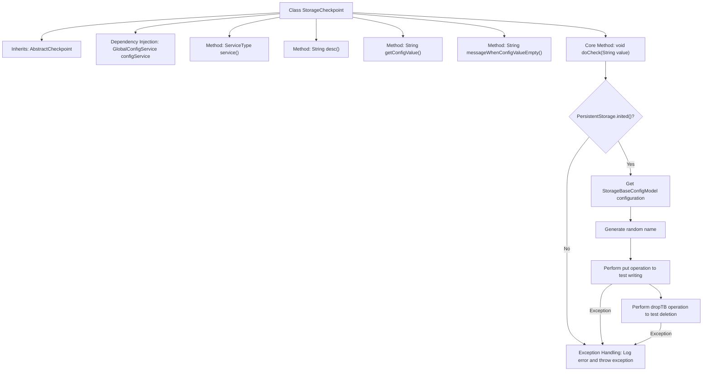

# Basic Information

|      |      |
|------|------|
| Name | StorageCheckpoint |
| Language | .java |
| Code Path | WeFe/board/board-service/src/main/java/com/welab/wefe/board/service/service/checkpoint/StorageCheckpoint.java |
| Package Name | com.welab.wefe.board.service.service.checkpoint |
| Dependencies | ['com.welab.wefe.board.service.service.globalconfig.GlobalConfigService', 'com.welab.wefe.common.data.storage.model.DataItemModel', 'com.welab.wefe.common.data.storage.service.persistent.PersistentStorage', 'com.welab.wefe.common.wefe.checkpoint.AbstractCheckpoint', 'com.welab.wefe.common.wefe.dto.global_config.storage.StorageBaseConfigModel', 'com.welab.wefe.common.wefe.enums.ServiceType', 'org.apache.commons.lang3.RandomStringUtils', 'org.springframework.beans.factory.annotation.Autowired', 'org.springframework.stereotype.Service', 'com.welab.wefe.board.service.service.DataSetStorageService.DATABASE_NAME'] |
| Brief Description | The `StorageCheckpoint` class checks storage service access, validates configurations, and tests read/write operations, prompting users to review configurations upon exceptions. |

# Description

StorageCheckpoint is a service class that inherits from AbstractCheckpoint, designed to verify the board's access status to the storage service. It retrieves storage configurations via GlobalConfigService and performs two test operations: first, writing test data with a random name to PersistentStorage, then deleting the test data. If the storage is uninitialized or the operation fails, it throws an exception prompting a check of the storage configuration. The exception message includes the specific storage type and error details.

# Class Summary

| Name   | Type  | Description |
|-------|------|-------------|
| StorageCheckpoint | class | The `StorageCheckpoint` class inherits from `AbstractCheckpoint`, checks the access status of the storage service, tests read, write, and delete operations, and prompts to check configurations upon exceptions. |

## Class StorageCheckpoint

|      |      |
|------|------|
| Access Modifier | @Service;public |
| Type | class |
| Name | StorageCheckpoint |
| Description | The `StorageCheckpoint` class inherits from `AbstractCheckpoint`, checks the access status of the storage service, tests read, write, and delete operations, and prompts to check configurations upon exceptions. |

### UML Class Diagram

Class Diagram Description: This diagram shows that the StorageCheckpoint class inherits from the AbstractCheckpoint abstract class and depends on the GlobalConfigService interface and the PersistentStorage singleton class. StorageCheckpoint implements functionality to check storage service availability, retrieves storage configurations via GlobalConfigService, and uses PersistentStorage for data operation testing. The diagram includes core classes and their relationships, clearly presenting the collaboration methods between system components.

### Internal Method Call Graph

This flowchart illustrates the core structure and execution process of the StorageCheckpoint class. Inheriting from AbstractCheckpoint and implementing multiple methods, its primary function is to validate storage service availability through the doCheck method. The process first verifies storage system initialization, retrieves configuration information, then tests storage functionality using randomly generated test data for write and delete operations. Each operational step includes exception handling mechanisms that log errors and throw detailed exceptions when failures occur. The entire flow strictly follows the "configuration check → write test → cleanup test" validation logic to ensure comprehensive storage service functionality.

### Field List

| Name  | Type  | Description |
|-------|-------|------|
| configService | GlobalConfigService | Automatically inject global configuration service instances. |

### Method List

| Name  | Type  | Description |
|-------|-------|------|
| desc | String | Check the access status of the board to the storage service. |
| messageWhenConfigValueEmpty | String | Method override, returning a null value indicates the message when the configuration value is empty. |
| getConfigValue | String | Rewrite the getConfigValue method to return null. |
| doCheck | void | Check the dataset storage configuration and test storage operations. If uninitialized or abnormal operations occur, throw an error prompt to check the configuration. |
| service | ServiceType | Rewrite the service method to return the StorageService type. |

