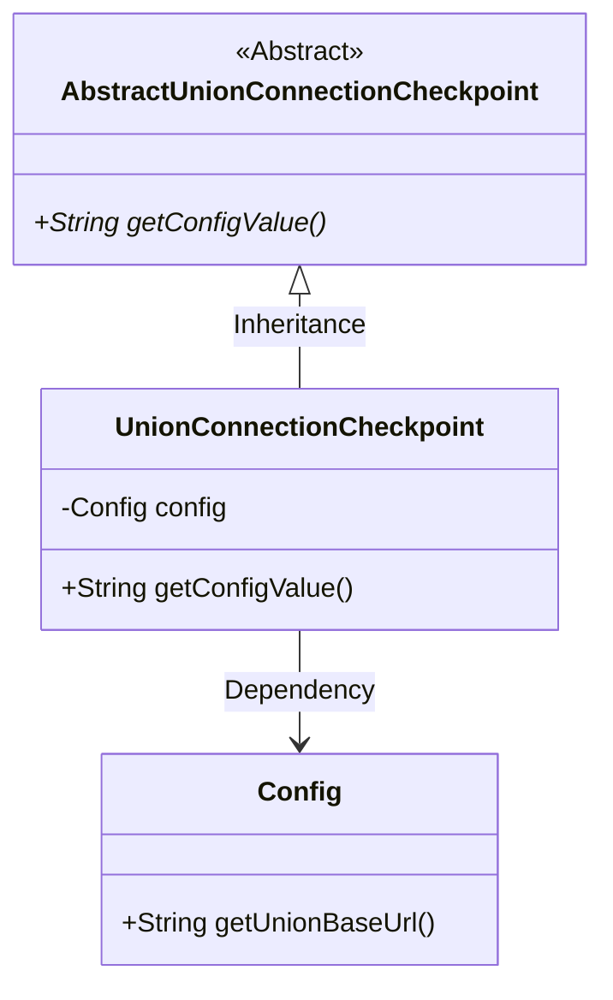
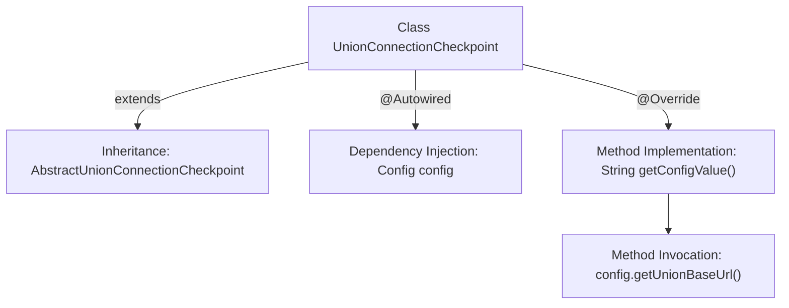

# Basic Information

|      |      |
|------|------|
| Name | UnionConnectionCheckpoint |
| Language | .java |
| Code Path | WeFe/board/board-service/src/main/java/com/welab/wefe/board/service/service/checkpoint/UnionConnectionCheckpoint.java |
| Package Name | com.welab.wefe.board.service.service.checkpoint |
| Dependencies | ['com.welab.wefe.board.service.constant.Config', 'com.welab.wefe.common.wefe.checkpoint.AbstractUnionConnectionCheckpoint', 'org.springframework.beans.factory.annotation.Autowired', 'org.springframework.stereotype.Service'] |
| Brief Description | The `UnionConnectionCheckpoint` class inherits from `AbstractUnionConnectionCheckpoint`, injects `Config` via `@Autowired`, and overrides the `getConfigValue` method to return the `UnionBaseUrl` from the config. |

# Description

The content describes a service class named UnionConnectionCheckpoint, which inherits from the abstract class AbstractUnionConnectionCheckpoint. This class automatically injects a Config configuration object via the @Autowired annotation and overrides the parent class's getConfigValue method to return the unionBaseUrl configuration value obtained from the config object. The entire class is primarily used to retrieve the base URL configuration for union connections and belongs to a service component within the Spring framework.

# Class Summary

| Name   | Type  | Description |
|-------|------|-------------|
| UnionConnectionCheckpoint | class | The `UnionConnectionCheckpoint` class inherits from `AbstractUnionCheckpoint`, injects `Config` via `@Autowired`, and overrides the `getConfigValue` method to return the `UnionBaseUrl` value from `config`. |

## Class UnionConnectionCheckpoint

|      |      |
|------|------|
| Access Modifier | @Service;public |
| Type | class |
| Name | UnionConnectionCheckpoint |
| Description | The `UnionConnectionCheckpoint` class inherits from `AbstractUnionCheckpoint`, injects `Config` via `@Autowired`, and overrides the `getConfigValue` method to return the `UnionBaseUrl` value from `config`. |

### UML Class Diagram

This class diagram illustrates the inheritance and dependency relationships among Spring service layer components. UnionConnectionCheckpoint inherits from the abstract class AbstractUnionConnectionCheckpoint and implements its abstract method getConfigValue(). The class automatically injects the Config object via @Autowired, calling config.getUnionBaseUrl() within the method to retrieve the union base URL. The diagram clearly presents the hierarchical relationships between the abstract base class, concrete implementation class, and dependent components, demonstrating the application of Spring dependency injection and the template method pattern.

### Internal Method Call Graph

This flowchart illustrates the core structure of the UnionConnectionCheckpoint class. The class inherits from AbstractUnionConnectionCheckpoint, automatically injects the Config object via @Autowired, and overrides the getConfigValue() method. Within the method implementation, it calls the getUnionBaseUrl() of the config object to retrieve the union base URL. The entire process clearly demonstrates the relationships of class inheritance, dependency injection, and method invocation, reflecting typical characteristics of Spring service components.

### Field List

| Name  | Type  | Description |
|-------|-------|------|
| config | Config | Automatically inject protected configuration objects. |

### Method List

| Name  | Type  | Description |
|-------|-------|------|
| getConfigValue | String | Override the Java method to return the combined base URL from the configuration. |

