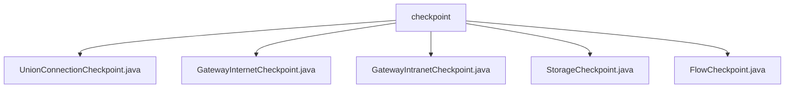

# Basic Information

|      |      |
|------|------|
| Name | checkpoint |
| Language | .java |
| Code Path | WeFe/board/board-service/src/main/java/com/welab/wefe/board/service/service/checkpoint |
| Package Name | docs.board.board-service.src.main.java.com.welab.wefe.board.service.service.checkpoint |
| Brief Description | UnionConnectionCheckpoint retrieves the federated connection URL. GatewayInternetCheckpoint checks public network connectivity. GatewayIntranetCheckpoint verifies intranet connectivity. StorageCheckpoint tests storage access. FlowCheckpoint examines flow service connectivity. |

# Description

## Overview  
This module is a service health check component under the Spring framework, with the core responsibility of verifying the connectivity configuration and availability between the Board service and its dependent services (such as Gateway/Storage/Flow, etc.). The interface specification uniformly inherits the AbstractCheckpoint abstract class, requiring the implementation of service type definition, configuration retrieval, and connectivity testing methods. Key data structures include the Config configuration object and various ServiceModels (e.g., FlowConfigModel). External dependencies involve infrastructure services such as GatewayService and GlobalConfigService. For example, UnionConnectionCheckpoint retrieves the union connection address via config.unionBaseUrl, while StorageCheckpoint tests the read/write capabilities of PersistentStorage.

## Core Business Scenarios  
The module adopts a "checkpoint" pattern to uniformly manage service health status, similar to a heartbeat detection mechanism. A typical workflow involves: retrieving target service configuration → executing connectivity tests → returning status or exceptions. For instance, GatewayIntranetCheckpoint checks the intranet address configuration and then invokes checkGatewayAliveProcessor, while FlowCheckpoint probes the alive status via flowService.alive(). Integration cases cover public/intranet detection (GatewayInternet/IntranetCheckpoint), storage service validation (StorageCheckpoint), and other scenarios, forming a comprehensive health check system for service dependencies.

### Package Internal Structure View

This flowchart illustrates the structure of 5 Java files under the checkpoint directory. All files are directly subordinate to the checkpoint node, including implementation classes such as UnionConnectionCheckpoint, GatewayInternetCheckpoint, and 5 other checkpoint files, clearly reflecting their parallel hierarchical relationship.

# File List

| Name   | Type  | Description |
|-------|------|-------------|
| [UnionConnectionCheckpoint.java](UnionConnectionCheckpoint.md) | file | The `UnionConnectionCheckpoint` class inherits from `AbstractUnionConnectionCheckpoint`, injects `Config` via `@Autowired`, and overrides the `getConfigValue` method to return the `UnionBaseUrl` from the config. |
| [GatewayInternetCheckpoint.java](GatewayInternetCheckpoint.md) | file | The `GatewayInternetCheckpoint` class inherits from `AbstractCheckpoint` and is used to check public network connectivity. It retrieves configurations via `globalConfigService` and invokes `gatewayService` to send requests. |
| [GatewayIntranetCheckpoint.java](GatewayIntranetCheckpoint.md) | file | The `GatewayIntranetCheckpoint` class inherits from `AbstractCheckpoint` and checks the connectivity between the board and the gateway's intranet. It relies on `globalConfigService` to obtain configurations and prompts to set the intranet address when unconfigured. The availability status is verified via `GatewayService`. |
| [StorageCheckpoint.java](StorageCheckpoint.md) | file | The `StorageCheckpoint` class checks storage service access, validates configurations, and tests read/write operations, prompting to review configurations upon exceptions. |
| [FlowCheckpoint.java](FlowCheckpoint.md) | file | The FlowCheckpoint class inherits from AbstractCheckpoint, checks the connectivity of Flow services, depends on GlobalConfigService and FlowService, and prompts to configure the intranet address when configurations are missing. |

