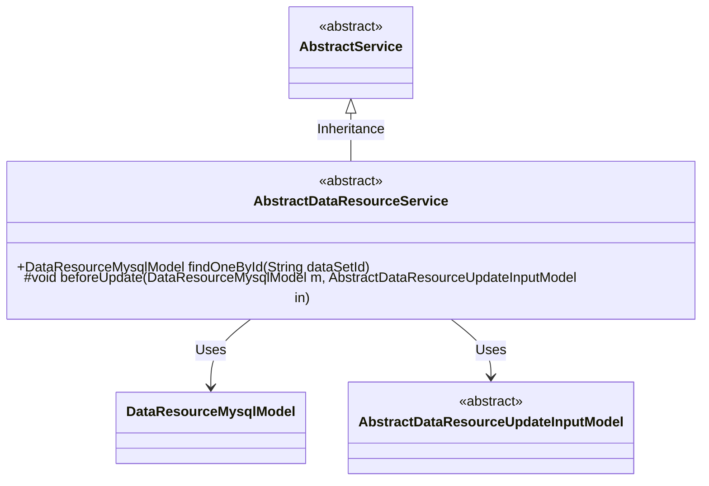
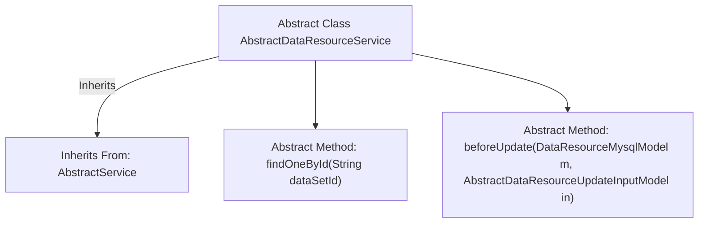

# Basic Information

|      |      |
|------|------|
| Name | AbstractDataResourceService |
| Language | .java |
| Code Path | WeFe/board/board-service/src/main/java/com/welab/wefe/board/service/service/data_resource/AbstractDataResourceService.java |
| Package Name | com.welab.wefe.board.service.service.data_resource |
| Dependencies | ['com.welab.wefe.board.service.database.entity.data_resource.DataResourceMysqlModel', 'com.welab.wefe.board.service.dto.vo.data_resource.AbstractDataResourceUpdateInputModel', 'com.welab.wefe.board.service.service.AbstractService'] |
| Brief Description | The abstract class AbstractDataResourceService provides abstract methods for querying data resources by ID and pre-update processing. |

# Description

This is an abstract class named AbstractDataResourceService, which inherits from AbstractService. It defines two abstract methods: findOneById is used to query data resources based on a dataset ID, returning a DataResourceMysqlModel object; beforeUpdate is a protected method executed before updating data resources, accepting DataResourceMysqlModel and AbstractDataResourceUpdateInputModel as parameters. This class provides the foundational framework for data resource services, with specific implementations to be completed by subclasses.

# Class Summary

| Name   | Type  | Description |
|-------|------|-------------|
| AbstractDataResourceService | class | The abstract class AbstractDataResourceService provides two methods: querying data resources by ID and pre-processing before updates. |

## Class AbstractDataResourceService

|      |      |
|------|------|
| Access Modifier | public abstract |
| Type | class |
| Name | AbstractDataResourceService |
| Description | The abstract class AbstractDataResourceService provides two methods: querying data resources by ID and pre-processing before updates. |

### UML Class Diagram

This class diagram illustrates the inheritance and dependency structure of abstract service classes. The AbstractDataResourceService inherits from AbstractService and contains two core methods: the public findOneById for querying data by ID, and the protected beforeUpdate for pre-processing before updates. The class depends on DataResourceMysqlModel as a data entity and AbstractDataResourceUpdateInputModel as the base class for update input parameters. The overall design reflects the Template Method pattern, enforcing subclasses to implement specific business logic through abstract methods.

### Internal Method Call Graph

This flowchart illustrates the structure of the abstract class `AbstractDataResourceService`, which inherits from the base class `AbstractService` and defines two core abstract methods. The `findOneById` method is used to query data resources by ID, while the `beforeUpdate` method provides a pre-processing hook before updates. These two abstract methods require concrete implementation by subclasses, embodying the characteristics of the Template Method design pattern. This pattern is suitable for scenarios requiring unified processing flows while allowing step variations.

### Field List

| Name  | Type  | Description |
|-------|-------|------|

### Method List

| Name  | Type  | Description |
|-------|-------|------|
| beforeUpdate | void | Abstract method executed before the update, with parameters being the MySQL data model and the update input model. |
| findOneById | DataResourceMysqlModel | Abstract Method: Query MySQL Data Resource Model by Dataset ID. |

