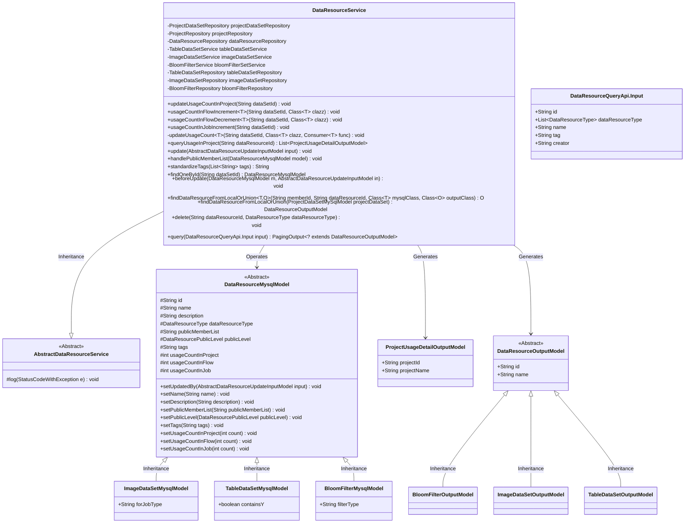
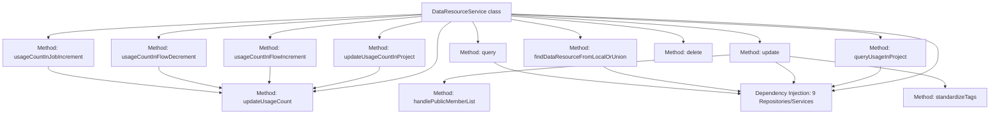
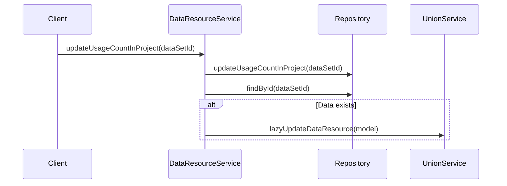

# Basic Information

|      |      |
|------|------|
| Name | DataResourceService |
| Language | .java |
| Code Path | WeFe/board/board-service/src/main/java/com/welab/wefe/board/service/service/data_resource/DataResourceService.java |
| Package Name | com.welab.wefe.board.service.service.data_resource |
| Dependencies | ['com.welab.wefe.board.service.api.data_resource.DataResourceQueryApi', 'com.welab.wefe.board.service.database.entity.data_resource.BloomFilterMysqlModel', 'com.welab.wefe.board.service.database.entity.data_resource.DataResourceMysqlModel', 'com.welab.wefe.board.service.database.entity.data_resource.ImageDataSetMysqlModel', 'com.welab.wefe.board.service.database.entity.data_resource.TableDataSetMysqlModel', 'com.welab.wefe.board.service.database.entity.job.ProjectDataSetMySqlModel', 'com.welab.wefe.board.service.database.entity.job.ProjectMySqlModel', 'com.welab.wefe.board.service.database.repository.ProjectDataSetRepository', 'com.welab.wefe.board.service.database.repository.ProjectRepository', 'com.welab.wefe.board.service.database.repository.base.BaseRepository', 'com.welab.wefe.board.service.database.repository.base.RepositoryManager', 'com.welab.wefe.board.service.database.repository.data_resource.BloomFilterRepository', 'com.welab.wefe.board.service.database.repository.data_resource.DataResourceRepository', 'com.welab.wefe.board.service.database.repository.data_resource.ImageDataSetRepository', 'com.welab.wefe.board.service.database.repository.data_resource.TableDataSetRepository', 'com.welab.wefe.board.service.dto.base.PagingOutput', 'com.welab.wefe.board.service.dto.entity.data_resource.output.BloomFilterOutputModel', 'com.welab.wefe.board.service.dto.entity.data_resource.output.DataResourceOutputModel', 'com.welab.wefe.board.service.dto.entity.data_resource.output.ImageDataSetOutputModel', 'com.welab.wefe.board.service.dto.entity.data_resource.output.TableDataSetOutputModel', 'com.welab.wefe.board.service.dto.entity.project.ProjectUsageDetailOutputModel', 'com.welab.wefe.board.service.dto.vo.data_resource.AbstractDataResourceUpdateInputModel', 'com.welab.wefe.board.service.service.CacheObjects', 'com.welab.wefe.board.service.service.data_resource.bloom_filter.BloomFilterService', 'com.welab.wefe.board.service.service.data_resource.image_data_set.ImageDataSetService', 'com.welab.wefe.board.service.service.data_resource.table_data_set.TableDataSetService', 'com.welab.wefe.common.StatusCode', 'com.welab.wefe.common.data.mysql.Where', 'com.welab.wefe.common.data.mysql.enums.OrderBy', 'com.welab.wefe.common.exception.StatusCodeWithException', 'com.welab.wefe.common.util.StringUtil', 'com.welab.wefe.common.web.util.ModelMapper', 'com.welab.wefe.common.wefe.enums.DataResourcePublicLevel', 'com.welab.wefe.common.wefe.enums.DataResourceType', 'org.apache.commons.collections4.CollectionUtils', 'org.springframework.beans.factory.annotation.Autowired', 'org.springframework.stereotype.Service', 'java.util.ArrayList', 'java.util.List', 'java.util.function.Consumer', 'java.util.stream.Collectors'] |
| Brief Description | The DataResourceService manages dataset resources, providing functionalities such as updating usage counts, querying project utilization, standardizing labels, handling visible member lists, and performing CRUD operations on data. |

# Description

The DataResourceService is a service class that inherits from AbstractDataResourceService and is used to manage data resources. It handles different types of datasets (such as table datasets, image datasets, Bloom filters, etc.) through multiple repositories and services. Key functionalities include updating the usage count of datasets in projects, querying information about datasets used in projects, updating dataset information, normalizing tag lists, managing visible member lists, retrieving detailed data resource information from local or federated services, deleting data resources, and querying data resources. The class also provides operations to increment or decrement dataset usage counts and supports paginated queries.

# Class Summary

| Name   | Type  | Description |
|-------|------|-------------|
| DataResourceService | class | The DataResourceService class manages dataset resources, providing functionalities such as updating usage counts, querying project information, standardizing tags, handling visible member lists, and performing CRUD operations on data. |

## Class DataResourceService

|      |      |
|------|------|
| Access Modifier | @Service;public |
| Type | class |
| Name | DataResourceService |
| Description | The DataResourceService class manages dataset resources, providing functionalities such as updating usage counts, querying project information, standardizing tags, handling visible member lists, and performing CRUD operations on data. |

### UML Class Diagram

This code implements a data resource management service with core functionalities including: updating dataset usage counts, querying project usage details, standardizing tag processing, and CRUD operations for data resources. The service collaborates with multiple repositories and services to support various data types (tables, images, bloom filters), and implements resource fetching logic from both local and federated services. The class diagram illustrates the inheritance relationships of core models and key dependencies, reflecting layered design and polymorphic processing capabilities.

### Internal Method Call Graph

This flowchart illustrates the core structure and key method invocation relationships of the DataResourceService class. The class manages 9 Repository/Service components through dependency injection, providing core functionalities such as data resource usage count updates, queries, and deletions. The private method updateUsageCount is called by multiple public methods to handle count update logic across different scenarios. The update method includes sub-processes like tag standardization and member visibility handling, while the query method performs differentiated queries based on resource types. The sequence diagram specifically demonstrates cross-component invocation flows during the execution of the updateUsageCountInProject method.

### Field List

| Name  | Type  | Description |
|-------|-------|------|
| bloomFilterRepository | BloomFilterRepository | Automatically inject Bloom filter repository instances. |
| bloomFilterSetService | BloomFilterService | Automatically inject the Bloom filter service instance. |
| imageDataSetService | ImageDataSetService | Using @Autowired to automatically inject an instance of ImageDataSetService. |
| projectDataSetRepository | ProjectDataSetRepository | Automatically inject the ProjectDataSetRepository instance. |
| dataResourceRepository | DataResourceRepository | Use @Autowired to automatically inject an instance of DataResourceRepository. |
| imageDataSetRepository | ImageDataSetRepository | Automatically inject the ImageDataSetRepository instance. |
| projectRepository | ProjectRepository | Use @Autowired to automatically inject an instance of ProjectRepository. |
| tableDataSetRepository | TableDataSetRepository | Use @Autowired to automatically inject an instance of TableDataSetRepository. |
| tableDataSetService | TableDataSetService | Automatically inject the TableDataSetService instance. |

### Method List

| Name  | Type  | Description |
|-------|-------|------|
| standardizeTags | String | The method `standardizeTags` processes a list of strings: removes commas, removes empty entries, deduplicates, sorts, then joins with commas and returns the result enclosed by commas. Returns an empty string if the input is empty. |
| usageCountInFlowDecrement | void | The method is used to decrement the usage count of a dataset in the process, accepting dataset ID and model class parameters, invoking an internal update method to perform the decrement-by-one operation, and may throw exceptions. |
| beforeUpdate | void | The method beforeUpdate is overridden to throw an UnsupportedOperationException, indicating that the operation is not supported. |
| findOneById | DataResourceMysqlModel | This method is used to find data resources by ID, but the current implementation only throws an unsupported operation exception. |
| update | void | Method for updating data resources: Update model attributes based on input parameters, process the public member list, save and synchronize to the federated service, and finally refresh the cache tags. If the model does not exist, return directly. |
| usageCountInJobIncrement | void | The method `usageCountInJobIncrement` searches for resources based on the dataset ID and, if found, updates their job usage count according to the type. It supports three types: images, tables, and Bloom filters. |
| handlePublicMemberList | void | Processing public member list: If the visibility level is PublicWithMemberList and the list contains the current user ID, remove that ID and clean up redundant commas. |
| updateUsageCountInProject | void | Update the usage count of datasets in the project: first update the count via the repository, query the data model, and if it exists, call the service to delay the update, logging any exceptions. |
| updateUsageCount | void | Update dataset usage count: Find the model by ID, apply the modification function if it exists, then save and trigger a delayed update. |
| usageCountInFlowIncrement | void | The method `usageCountInFlowIncrement` is used to increment the usage count of a dataset within a project. It accepts the dataset ID and model class parameters, calls `updateUsageCount` to implement the count increment by one, and may throw exceptions. |
| queryUsageInProject | List<ProjectUsageDetailOutputModel> | The method for querying resource usage details in a project involves first retrieving the resource reference records. If none are found, an empty list is returned; otherwise, it queries the project details of the referenced resources and maps the output. |
| findDataResourceFromLocalOrUnion | O | The method determines the data source based on the memberId: if it belongs to the current user, it queries the local database and maps the result to the output model; otherwise, it retrieves data by calling unionService. A StatusCodeWithException is thrown in case of exceptions. |
| findDataResourceFromLocalOrUnion | DataResourceOutputModel | The method determines the data source based on the member ID in the project dataset: if it belongs to the current user, it queries and maps the data from the local repository before returning; otherwise, it invokes the federated service to retrieve the details. A StatusCodeWithException is thrown in case of exceptions. |
| query | PagingOutput<? extends DataResourceOutputModel> | Query data resource methods, construct queries based on input conditions, support pagination and multiple resource types (tables, images, Bloom filters), and return corresponding output models. |
| delete | void | This method invokes the corresponding service to delete specified resources based on the data type, supporting image datasets, tabular datasets, and Bloom filter types. |

