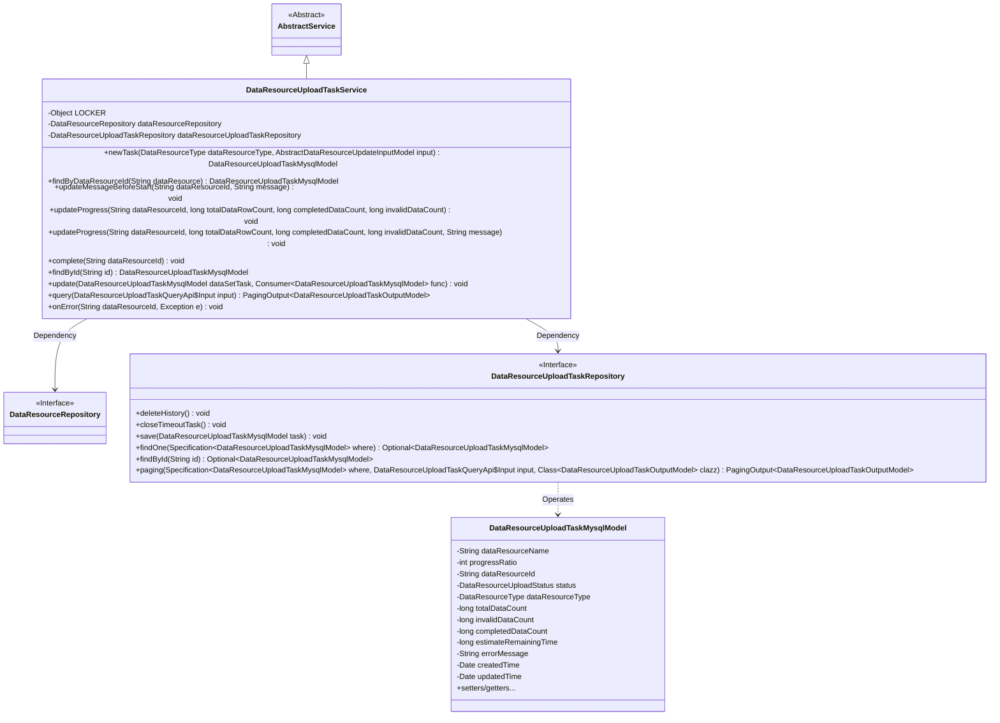
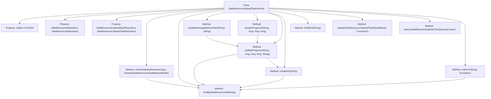
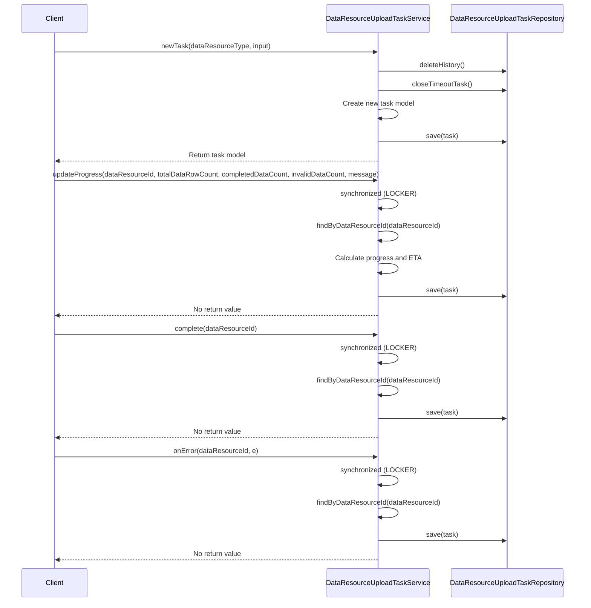

# Basic Information

|      |      |
|------|------|
| Name | DataResourceUploadTaskService |
| Language | .java |
| Code Path | WeFe/board/board-service/src/main/java/com/welab/wefe/board/service/service/data_resource/DataResourceUploadTaskService.java |
| Package Name | com.welab.wefe.board.service.service.data_resource |
| Dependencies | ['com.welab.wefe.board.service.api.data_resource.upload_task.DataResourceUploadTaskQueryApi', 'com.welab.wefe.board.service.database.entity.data_resource.DataResourceMysqlModel', 'com.welab.wefe.board.service.database.entity.data_resource.DataResourceUploadTaskMysqlModel', 'com.welab.wefe.board.service.database.repository.data_resource.DataResourceRepository', 'com.welab.wefe.board.service.database.repository.data_resource.DataResourceUploadTaskRepository', 'com.welab.wefe.board.service.dto.base.PagingOutput', 'com.welab.wefe.board.service.dto.entity.data_resource.output.DataResourceUploadTaskOutputModel', 'com.welab.wefe.board.service.dto.vo.data_resource.AbstractDataResourceUpdateInputModel', 'com.welab.wefe.board.service.service.AbstractService', 'com.welab.wefe.common.Convert', 'com.welab.wefe.common.TimeSpan', 'com.welab.wefe.common.data.mysql.Where', 'com.welab.wefe.common.util.DateUtil', 'com.welab.wefe.common.wefe.enums.DataResourceType', 'com.welab.wefe.common.wefe.enums.DataResourceUploadStatus', 'org.springframework.beans.factory.annotation.Autowired', 'org.springframework.data.jpa.domain.Specification', 'org.springframework.stereotype.Service', 'java.util.Date', 'java.util.function.Consumer'] |
| Brief Description | The DataResourceUploadTaskService manages data resource upload tasks, including creation, progress updates, completion, and error handling. It employs locks to ensure concurrency safety and supports querying and state management. |

# Description

The DataResourceUploadTaskService is a service class designed for managing data resource upload tasks, inheriting from AbstractService. It interacts with the database through DataResourceUploadTaskRepository and DataResourceRepository, providing functionalities such as task creation, progress updates, completion handling, and error management. Key operations include: cleaning up historical data and timed-out tasks when creating new tasks; employing synchronization locks to ensure concurrent operation safety; calculating and updating upload progress, including data row counts, completion percentages, and estimated remaining time; marking tasks as completed or failed; and supporting task queries by ID or resource ID. The service also includes pagination capabilities for retrieving lists of recently updated tasks.

# Class Summary

| Name   | Type  | Description |
|-------|------|-------------|
| DataResourceUploadTaskService | class | The DataResourceUploadTaskService handles data resource upload tasks, including task creation, progress updates, completion, and error handling, using locks to ensure concurrency safety. |

## Class DataResourceUploadTaskService

|      |      |
|------|------|
| Access Modifier | @Service;public |
| Type | class |
| Name | DataResourceUploadTaskService |
| Description | The DataResourceUploadTaskService handles data resource upload tasks, including task creation, progress updates, completion, and error handling, using locks to ensure concurrency safety. |

### UML Class Diagram

This code demonstrates a data resource upload task service `DataResourceUploadTaskService`, which inherits from `AbstractService` and depends on two repository interfaces: `DataResourceRepository` and `DataResourceUploadTaskRepository`. Its primary functionalities include creating upload tasks, querying tasks, updating progress, completing tasks, and handling errors. It ensures thread-safe concurrent operations through a synchronization lock mechanism, using `DataResourceUploadTaskMysqlModel` as the task entity model with fields such as task status, progress, and error messages. The service provides comprehensive task lifecycle management features, including progress calculation, time estimation, and state transitions.

### Internal Method Call Graph

This code implements a data resource upload task service with core functionalities including creating new tasks, updating task progress, marking task completion, and error handling. The flowchart illustrates the class structure and internal method invocation relationships, while the sequence diagram details the execution flow of key methods. All operations involving task state changes are thread-safe through synchronized blocks and retrieve task entities via the unified findByDataResourceId method. The progress update logic incorporates various edge case handling such as division-by-zero prevention and progress value enforcement.

### Field List

| Name  | Type  | Description |
|-------|-------|------|
| dataResourceUploadTaskRepository | DataResourceUploadTaskRepository | Automatically inject data resource upload task repository instance. |
| LOCKER = new Object() | Object | Define a static immutable object LOCKER as a synchronization lock. |
| dataResourceRepository | DataResourceRepository | Automatically inject the DataResourceRepository instance. |

### Method List

| Name  | Type  | Description |
|-------|-------|------|
| complete | void | The method `complete` synchronously updates the data resource upload task status to "completed," setting the completion count, remaining time, progress ratio, update time, and error information, then saves them. |
| updateProgress | void | Synchronously update the progress of data resource upload tasks, including calculating the progress ratio and estimating the remaining time, while ensuring thread safety and progress rationality. |
| updateMessageBeforeStart | void | Update the progress information before starting the data resource, setting the initial progress to 0 with an accompanying message. |
| findByDataResourceId | DataResourceUploadTaskMysqlModel | This method queries the database for upload task records using the data resource ID, employing a conditional constructor to specify the query criteria, and returns matching records or null. |
| newTask | DataResourceUploadTaskMysqlModel | Create a new upload task, delete old data and close timed-out tasks, then save and return after setting task attributes. |
| updateProgress | void | Update progress method, which receives the data resource ID, total number of rows, completed count, and invalid count, then calls the overloaded method for processing. |
| findById | DataResourceUploadTaskMysqlModel | This method queries the data resource upload task by ID and returns the corresponding entity or null. |
| update | void | Update dataset task: Execute callback after checking non-empty, set update time and save. |
| query | PagingOutput<DataResourceUploadTaskOutputModel> | Query data resource upload tasks, filter records with update times within the last 10 minutes, and return paginated results. |
| onError | void | The method `onError` handles data resource upload errors, synchronously updates the database task status to "failed," and records the error message and timestamp. |

