# Basic Information

|      |      |
|------|------|
| Name | data_resource |
| Language | .java |
| Code Path | WeFe/board/board-service/src/main/java/com/welab/wefe/board/service/service/data_resource |
| Package Name | docs.board.board-service.src.main.java.com.welab.wefe.board.service.service.data_resource |
| Brief Description | TableDataSetService manages tabular datasets, supporting functions such as file upload, deletion, and query. The BloomFilter module handles task status, data storage, and column configuration. The data resource addition module processes the import of tabular, image, and other data types. The image dataset module manages data for classification/detection tasks. The upload task service oversees upload progress and status. DataResourceService manages usage counts and queries for various datasets. |

# Description

## Overview  
This module serves as a data resource management platform, with its core responsibility being the unified handling of CRUD operations, parsing, and lifecycle management for datasets such as tables, images, and Bloom filters, functioning similarly to an enterprise-level ETL hub. The TableDataSetService enables multi-source data integration, BloomFilterTaskService manages task states, and ImageDataSetParser processes image annotations, while DataResourceService coordinates global resources.  

The interface specifications include batch import (AbstractDataResourceAddService), progress tracking (DataResourceUploadTaskService), and federated queries (BloomFilterService), among others. Key data structures comprise DataResourceMysqlModel, BloomFilterColumnInputModel, and image label mapping tables. External dependencies involve PersistentStorage, RSA encryption services, and various repositories. For instance, TableDataSetAddService supports CSV/SQL parsing, and ImageDataSetParser generates PASCAL VOC format files.  

## Primary Business Scenarios  
A typical workflow involves data upload → parsing → storage → application: after a user uploads a CSV, TableDataSetService parses and aggregates labels; image data is converted into training formats via ImageDataSetParser; BloomFilterTaskService synchronizes encryption and deduplication. The entire pipeline adopts a "read-process-store" paradigm, resembling a microservices architecture.  

Functional completeness is reflected in multi-type support (e.g., Excel/XML/tgz), security controls (CRT encryption), and performance optimizations (pagination/batch processing). Interaction modes include service calls (e.g., DataResourceService updating project counts) and asynchronous tasks (upload progress callbacks). For example, batch sizes are dynamically calculated during Bloom filter generation, and a factory pattern creates parsers during image export.

### Package Internal Structure View

```mermaid
graph TD
    data_resource --> table_data_set
    data_resource --> bloom_filter
    data_resource --> add
    data_resource --> image_data_set
    data_resource --> DataResourceUploadTaskService.java
    data_resource --> AbstractDataResourceService.java
    data_resource --> DataResourceService.java
    table_data_set --> TableDataSetService.java
    bloom_filter --> BloomFilterTaskService.java
    bloom_filter --> BloomFilterStorageService.java
    bloom_filter --> BloomFilterService.java
    bloom_filter --> BloomFilterColumnService.java
    add --> BloomFilterAddServiceDataRowConsumer.java
    add --> TableDataSetAddServiceDataRowConsumer.java
    add --> ImageDataSetAddService.java
    add --> BloomFilterAddService.java
    add --> TableDataSetAddService.java
    add --> AbstractDataResourceAddService.java
    image_data_set --> data_set_parser
    image_data_set --> ImageDataSetSampleService.java
    image_data_set --> ImageDataSetService.java
    data_set_parser --> AbstractImageDataSetParser.java
    data_set_parser --> DetectionImageDataSetParser.java
    data_set_parser --> ClassifyImageDataSetParser.java
```

This flowchart illustrates the complete hierarchical structure of the data_resource module in the WeFe project, comprising four submodules: table_data_set, bloom_filter, add, and image_data_set, along with their corresponding service class files. Each submodule further branches into specific service implementation classes, with the image_data_set module additionally containing a data_set_parser submodule for parsing. The top level also includes three general service class files directly under data_resource. The entire structure clearly reflects the organizational approach of data resource management services.

# File List

| Name   | Type  | Description |
|-------|------|-------------|
| [table_data_set](table_data_set/_module.md) | package | The TableDataSetService class provides dataset management functionalities, including operations such as retrieving files, deleting datasets, testing SQL queries, querying and saving datasets. It implements CRUD operations and storage management for datasets through multiple Repository and service classes. |
| [DataResourceUploadTaskService.java](DataResourceUploadTaskService.md) | file | The DataResourceUploadTaskService manages data resource upload tasks, including creation, progress updates, completion, and error handling. It employs locks to ensure concurrency safety and supports querying and status management. |
| [AbstractDataResourceService.java](AbstractDataResourceService.md) | file | The abstract class AbstractDataResourceService provides abstract methods for querying data resources by ID and pre-update processing. |
| [DataResourceService.java](DataResourceService.md) | file | The DataResourceService manages dataset resources, providing functionalities such as updating usage counts, querying project usage, standardizing labels, handling visible member lists, and performing CRUD operations on data. |
| [image_data_set](image_data_set/_module.md) | package | This module provides a unified image dataset parsing framework, supporting classification and detection tasks. It includes functionalities such as dataset splitting, version control, and ZIP packaging, with subclasses implementing specific logic. The service class manages dataset samples, supporting query, update, deletion, and statistical functions, while operating databases and handling exceptions. |
| [add](add/_module.md) | package | BloomFilterAddServiceDataRowConsumer processes data rows to generate Bloom filters, supporting batch processing, deduplication, and encryption. TableDataSetAddServiceDataRowConsumer handles tabular data in batches, supporting deduplication and label statistics. ImageDataSetAddService manages image dataset uploads, decompresses files, and stores sample information. BloomFilterAddService and TableDataSetAddService handle Bloom filter and tabular data addition respectively, supporting multiple data sources. AbstractDataResourceAddService serves as the abstract base class, defining common logic for data resource addition. |
| [bloom_filter](bloom_filter/_module.md) | package | BloomFilterTaskService manages Bloom filter task progress and exception handling, BloomFilterStorageService handles data storage operations, BloomFilterService implements Bloom filter functionality, and BloomFilterColumnService manages column data querying and updating. |

