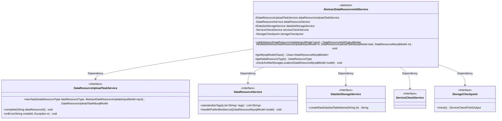

# Basic Information

|      |      |
|------|------|
| Name | AbstractDataResourceAddService |
| Language | .java |
| Code Path | WeFe/board/board-service/src/main/java/com/welab/wefe/board/service/service/data_resource/add/AbstractDataResourceAddService.java |
| Package Name | com.welab.wefe.board.service.service.data_resource.add |
| Dependencies | ['com.welab.wefe.board.service.base.file_system.WeFeFileSystem', 'com.welab.wefe.board.service.database.entity.data_resource.BloomFilterMysqlModel', 'com.welab.wefe.board.service.database.entity.data_resource.DataResourceMysqlModel', 'com.welab.wefe.board.service.database.entity.data_resource.DataResourceUploadTaskMysqlModel', 'com.welab.wefe.board.service.database.entity.data_resource.TableDataSetMysqlModel', 'com.welab.wefe.board.service.dto.vo.data_resource.AbstractDataResourceUpdateInputModel', 'com.welab.wefe.board.service.dto.vo.data_resource.DataResourceAddOutputModel', 'com.welab.wefe.board.service.service.AbstractService', 'com.welab.wefe.board.service.service.CacheObjects', 'com.welab.wefe.board.service.service.DataSetStorageService', 'com.welab.wefe.board.service.service.ServiceCheckService', 'com.welab.wefe.board.service.service.checkpoint.StorageCheckpoint', 'com.welab.wefe.board.service.service.data_resource.DataResourceService', 'com.welab.wefe.board.service.service.data_resource.DataResourceUploadTaskService', 'com.welab.wefe.common.CommonThreadPool', 'com.welab.wefe.common.StatusCode', 'com.welab.wefe.common.exception.StatusCodeWithException', 'com.welab.wefe.common.util.FileUtil', 'com.welab.wefe.common.wefe.checkpoint.dto.ServiceCheckPointOutput', 'com.welab.wefe.common.wefe.enums.DataResourceStorageServiceType', 'com.welab.wefe.common.wefe.enums.DataResourceType', 'org.modelmapper.ModelMapper', 'org.springframework.beans.factory.annotation.Autowired'] |
| Brief Description | The abstract class AbstractDataResourceAddService provides common methods for adding data resources, relies on multiple service classes, contains abstract methods and resource storage location checking logic, and supports asynchronous execution of resource saving. |

# Description

This is an abstract class AbstractDataResourceAddService, which inherits from AbstractService and is used to handle data resource addition operations. The class includes four auto-wired service components and defines three abstract methods for subclasses to implement. The main method `add` implements the common logic for resource addition, including creating upload tasks, mapping input models, setting resource attributes, etc., and executes the specific resource saving operation through an asynchronous thread. The private method `checkAndSetStorageLocation` is responsible for checking and setting the storage location based on the resource type, supporting storage configurations for different types such as table datasets, image datasets, and Bloom filters. The entire process includes error handling and cache refresh mechanisms.

# Class Summary

| Name   | Type  | Description |
|-------|------|-------------|
| AbstractDataResourceAddService | class | The abstract class AbstractDataResourceAddService provides common methods for adding data resources, including asynchronous execution and storage location checks, requiring subclasses to implement specific operations. |

## Class AbstractDataResourceAddService

|      |      |
|------|------|
| Access Modifier | public abstract |
| Type | class |
| Name | AbstractDataResourceAddService |
| Description | The abstract class AbstractDataResourceAddService provides common methods for adding data resources, including asynchronous execution and storage location checks, requiring subclasses to implement specific operations. |

### UML Class Diagram

This code demonstrates an abstract service class `AbstractDataResourceAddService`, which provides core logic for data resource addition. The class implements functionalities such as resource upload task management and storage location verification through dependency injection of multiple service interfaces (e.g., `DataResourceUploadTaskService`, `DataResourceService`, etc.). The core method `add()` executes the main resource addition workflow, including task creation, model mapping, and storage location configuration, with actual addition operations performed asynchronously via thread pool. Abstract methods `doAdd()` and `getMysqlModelClass()` require subclass implementation, reflecting the Template Method design pattern. The class supports processing multiple data resource types (e.g., tabular datasets, image datasets) with robust error handling mechanisms.

### Internal Method Call Graph

This flowchart illustrates the core structure and invocation relationships of AbstractDataResourceAddService. The class contains 4 auto-injected service properties and 3 abstract methods, with main business logic concentrated in the add() method. This method asynchronously invokes the abstract doAdd() method to complete resource addition, and includes a private method for storage location verification and setup. The sequence diagram details the complete workflow from client invocation to asynchronous task completion, involving multiple service collaborations and data persistence operations.

### Field List

| Name  | Type  | Description |
|-------|-------|------|
| dataResourceUploadTaskService | DataResourceUploadTaskService | Using @Autowired to automatically inject an instance of the DataResourceUploadTaskService. |
| dataResourceService | DataResourceService | Automatically inject the DataResourceService service instance. |
| storageCheckpoint | StorageCheckpoint | Automatically inject storage checkpoint instances. |
| dataSetStorageService | DataSetStorageService | Use @Autowired to automatically inject an instance of DataSetStorageService. |
| serviceCheckService | ServiceCheckService | Automatically inject the ServiceCheckService instance. |

### Method List

| Name  | Type  | Description |
|-------|-------|------|
| getDataResourceType | DataResourceType | Abstract method, returns the data resource type. |
| doAdd | void | Abstract method `doAdd`, which takes input model, task model, and data model parameters, and may throw exceptions. |
| add | DataResourceAddOutputModel | This method is used to add data resources, including creating upload tasks, mapping input models, setting resource attributes, and asynchronously executing save operations. Upon completion, it returns the resource ID and task ID. |
| getMysqlModelClass | Class<? extends DataResourceMysqlModel> | Abstract method, returns a class type that inherits from DataResourceMysqlModel. |
| checkAndSetStorageLocation | void | The method checks and sets the data storage location. Table datasets use storage services, configuring the service type and namespace; other types use the local file system, creating directories and setting paths. Filter files have a unified name. |

