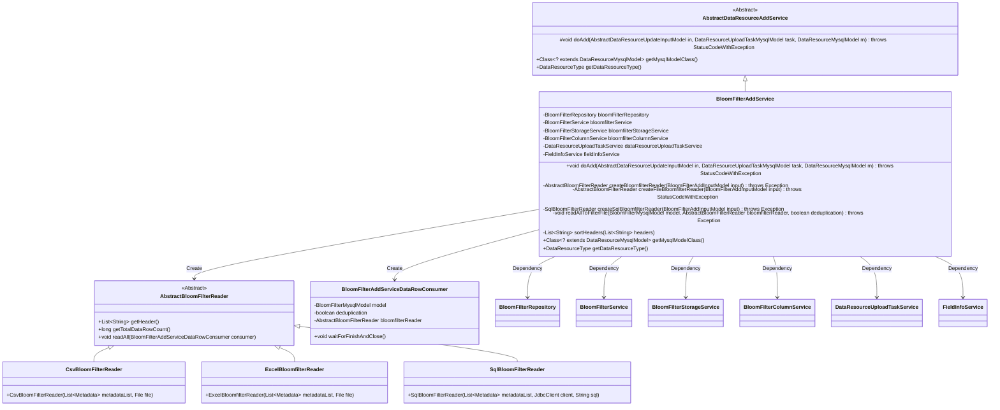
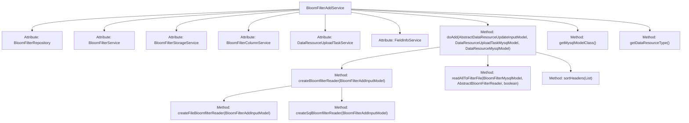
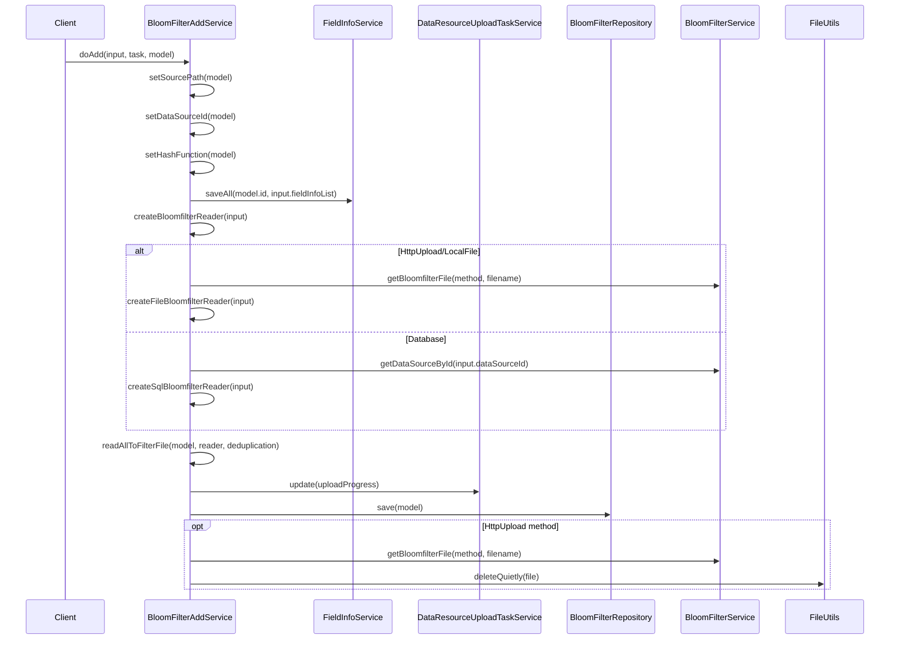

# Basic Information

|      |      |
|------|------|
| Name | BloomFilterAddService |
| Language | .java |
| Code Path | WeFe/board/board-service/src/main/java/com/welab/wefe/board/service/service/data_resource/add/BloomFilterAddService.java |
| Package Name | com.welab.wefe.board.service.service.data_resource.add |
| Dependencies | ['com.welab.wefe.board.service.base.file_system.WeFeFileSystem', 'com.welab.wefe.board.service.constant.DataSetAddMethod', 'com.welab.wefe.board.service.database.entity.DataSourceMysqlModel', 'com.welab.wefe.board.service.database.entity.data_resource.BloomFilterMysqlModel', 'com.welab.wefe.board.service.database.entity.data_resource.DataResourceMysqlModel', 'com.welab.wefe.board.service.database.entity.data_resource.DataResourceUploadTaskMysqlModel', 'com.welab.wefe.board.service.database.repository.data_resource.BloomFilterRepository', 'com.welab.wefe.board.service.dto.vo.data_resource.AbstractDataResourceUpdateInputModel', 'com.welab.wefe.board.service.dto.vo.data_resource.BloomFilterAddInputModel', 'com.welab.wefe.board.service.service.data_resource.DataResourceUploadTaskService', 'com.welab.wefe.board.service.service.data_resource.bloom_filter.BloomFilterColumnService', 'com.welab.wefe.board.service.service.data_resource.bloom_filter.BloomFilterService', 'com.welab.wefe.board.service.service.data_resource.bloom_filter.BloomFilterStorageService', 'com.welab.wefe.board.service.service.fusion.FieldInfoService', 'com.welab.wefe.board.service.util.AbstractBloomFilterReader', 'com.welab.wefe.board.service.util.CsvBloomFilterReader', 'com.welab.wefe.board.service.util.ExcelBloomfilterReader', 'com.welab.wefe.board.service.util.SqlBloomFilterReader', 'com.welab.wefe.common.StatusCode', 'com.welab.wefe.common.exception.StatusCodeWithException', 'com.welab.wefe.common.jdbc.JdbcClient', 'com.welab.wefe.common.wefe.enums.DataResourceType', 'org.apache.commons.io.FileUtils', 'org.springframework.beans.factory.annotation.Autowired', 'org.springframework.stereotype.Service', 'java.io.File', 'java.io.IOException', 'java.util.ArrayList', 'java.util.Date', 'java.util.List'] |
| Brief Description | BloomFilterAddService handles Bloom filter data addition, supporting database, HTTP upload, and local file methods. It parses data and saves it to files, including deduplication and field processing functions. |

# Description

BloomFilterAddService is a service class that inherits from AbstractDataResourceAddService, designed to handle Bloom filter addition operations. It implements functionality by injecting multiple related services (such as BloomFilterRepository, BloomFilterService, etc.). The primary method doAdd processes input models, including setting file paths, saving field information, parsing raw data, and storing it in filter files. It supports multiple data source methods (e.g., database, HTTP upload, local files) and parses them through different Reader classes (such as CsvBloomFilterReader, SqlBloomFilterReader). The service also includes auxiliary features like data deduplication and file deletion to ensure data processing integrity and efficiency.

# Class Summary

| Name   | Type  | Description |
|-------|------|-------------|
| BloomFilterAddService | class | BloomFilterAddService extends AbstractDataResourceAddService, handling the addition of Bloom filter data, including file parsing, database reading, data deduplication, and task status updates. |

## Class BloomFilterAddService

|      |      |
|------|------|
| Access Modifier | @Service;public |
| Type | class |
| Name | BloomFilterAddService |
| Description | BloomFilterAddService extends AbstractDataResourceAddService, handling the addition of Bloom filter data, including file parsing, database reading, data deduplication, and task status updates. |

### UML Class Diagram

This code demonstrates the implementation of a Bloom Filter addition service (BloomFilterAddService), which inherits from the abstract data resource addition service (AbstractDataResourceAddService). The service handles Bloom Filter addition operations, including reading data from various sources (database, HTTP upload, local files), parsing the data, and saving it to the filter. It relies on multiple service classes such as BloomFilterRepository and BloomFilterService to perform specific operations, and employs the factory method pattern to create different types of readers (AbstractBloomFilterReader) to parse data from different sources. The entire process includes steps such as data path configuration, field information storage, data parsing, and cleanup, representing a typical implementation of a data processing service.

### Internal Method Call Graph

This code implements the BloomFilterAddService, which is primarily responsible for adding Bloom filter data resources. It inherits from AbstractDataResourceAddService and collaborates with multiple services to complete data parsing, storage, and cleanup tasks. The main workflow includes: initializing model attributes, saving field information, creating corresponding readers based on data sources, parsing data into filter files, updating task status, saving models to the database, and cleaning temporary files in HTTP upload mode. The entire process incorporates exception handling and logging, supporting three data source types: database, HTTP upload, and local files.

### Field List

| Name  | Type  | Description |
|-------|-------|------|
| dataResourceUploadTaskService | DataResourceUploadTaskService | Automatically inject the DataResourceUploadTaskService service instance. |
| fieldInfoService | FieldInfoService | Automatically inject the FieldInfoService service instance. |
| bloomFilterRepository | BloomFilterRepository | Automatically inject a Bloom filter repository instance. |
| bloomfilterColumnService | BloomFilterColumnService | Automatically inject Bloom filter column service instances. |
| bloomfilterStorageService | BloomFilterStorageService | Automatically inject Bloom filter storage service instances. |
| bloomfilterService | BloomFilterService | Using @Autowired to automatically inject an instance of BloomFilterService. |

### Method List

| Name  | Type  | Description |
|-------|-------|------|
| createBloomfilterReader | AbstractBloomFilterReader | The method creates a Bloom filter reader based on the input type: Database type invokes the SQL reader, HttpUpload or LocalFile invokes the file reader, otherwise throws an exception. |
| getMysqlModelClass | Class<? extends DataResourceMysqlModel> | Rewrite the method to return the BloomFilterMysqlModel class as the data resource model class. |
| sortHeaders | List<String> | The method checks if the headers list contains "y". If not, it directly returns the original list. Otherwise, it creates a new list, skips "y", and inserts it in the second position. It ensures the original list remains unmodified. |
| doAdd | void | This method handles the addition operation of Bloom filter resources, including setting the file path, data source ID, and hash functions, saving field information, reading data into the filter file, updating the model and saving it, and finally deleting the temporary files uploaded via HTTP. In case of exceptions, it logs the error and terminates the task. |
| createSqlBloomfilterReader | SqlBloomFilterReader | Create a SqlBloomFilterReader, verify the validity of the data source, connect to the database via JdbcClient, and return the reader. |
| createFileBloomfilterReader | AbstractBloomFilterReader | Create a Bloom filter reader, select a CSV or Excel reader based on the file type, and handle exception cases. |
| readAllToFilterFile | void | Parse filter data, update task information, read headers and all data rows, wait for the consumption queue to complete, and record the time taken. |
| getDataResourceType | DataResourceType | Method override, return data type is Bloom filter. |

