# Basic Information

|      |      |
|------|------|
| Name | BloomFilterAddServiceDataRowConsumer |
| Language | .java |
| Code Path | WeFe/board/board-service/src/main/java/com/welab/wefe/board/service/service/data_resource/add/BloomFilterAddServiceDataRowConsumer.java |
| Package Name | com.welab.wefe.board.service.service.data_resource.add |
| Dependencies | ['com.welab.wefe.board.service.constant.Config', 'com.welab.wefe.board.service.database.entity.data_resource.BloomFilterMysqlModel', 'com.welab.wefe.board.service.service.data_resource.DataResourceUploadTaskService', 'com.welab.wefe.board.service.service.data_resource.bloom_filter.BloomFilterStorageService', 'com.welab.wefe.board.service.service.fusion.FieldInfoService', 'com.welab.wefe.board.service.util.AbstractBloomFilterReader', 'com.welab.wefe.board.service.util.primarykey.FieldInfo', 'com.welab.wefe.board.service.util.primarykey.PrimaryKeyUtils', 'com.welab.wefe.board.service.util.unique.AbstractDataSetUniqueFilter', 'com.welab.wefe.board.service.util.unique.DataSetBloomUniqueFilter', 'com.welab.wefe.board.service.util.unique.DataSetMemoryUniqueFilter', 'com.welab.wefe.common.BatchConsumer', 'com.welab.wefe.common.exception.StatusCodeWithException', 'com.welab.wefe.common.util.JObject', 'com.welab.wefe.common.web.Launcher', 'com.welab.wefe.fusion.core.utils.CryptoUtils', 'com.welab.wefe.fusion.core.utils.PSIUtils', 'com.welab.wefe.fusion.core.utils.bf.BloomFilters', 'org.bouncycastle.crypto.AsymmetricCipherKeyPair', 'org.bouncycastle.crypto.params.RSAKeyParameters', 'org.bouncycastle.crypto.params.RSAPrivateCrtKeyParameters', 'org.slf4j.Logger', 'org.slf4j.LoggerFactory', 'java.io.File', 'java.io.FileOutputStream', 'java.io.IOException', 'java.math.BigInteger', 'java.util.LinkedHashMap', 'java.util.List', 'java.util.concurrent.atomic.LongAdder', 'java.util.function.Consumer'] |
| Brief Description | The BloomFilterAddServiceDataRowConsumer class implements the Consumer interface and is used to process data rows and generate Bloom filters. It supports batch processing, deduplication, and RSA encryption optimization, including progress update and error handling capabilities. |

# Description

BloomFilterAddServiceDataRowConsumer is a consumer class designed to process data rows and generate Bloom filters. It accepts data rows in LinkedHashMap format and enhances write efficiency through a batch processing mechanism. The class includes a Bloom filter ID, deduplication flag, RSA key pair, and related parameters, supporting CRT-optimized encryption. Batch processing is implemented via BatchConsumer, with dynamic batch size adjustment for performance optimization. When generating Bloom filters, it uses primary keys to create unique identifiers followed by encryption, ultimately writing the results to files. The class supports deduplication functionality through AbstractDataSetUniqueFilter to determine data uniqueness. It also incorporates methods for progress updates, error handling, and waiting for queue completion.

# Class Summary

| Name   | Type  | Description |
|-------|------|-------------|
| BloomFilterAddServiceDataRowConsumer | class | The BloomFilterAddServiceDataRowConsumer class is designed to process data rows and generate Bloom filters, supporting deduplication and batch processing. It employs RSA encryption for performance optimization and incorporates progress update and error handling functionalities. |


## Class BloomFilterAddServiceDataRowConsumer

|      |      |
|------|------|
| Access Modifier | public |
| Type | class |
| Name | BloomFilterAddServiceDataRowConsumer |
| Description | The BloomFilterAddServiceDataRowConsumer class is designed to process data rows and generate Bloom filters, supporting deduplication and batch processing. It employs RSA encryption for performance optimization and incorporates progress update and error handling functionalities. |


### UML Class Diagram

```mermaid
classDiagram
    class BloomFilterAddServiceDataRowConsumer {
        -Logger LOG
        -Config config
        -String bloomfilterId
        -boolean deduplication
        -AsymmetricCipherKeyPair keyPair
        -BloomFilters bf
        -RSAKeyParameters rsaPK
        -BigInteger rsaE
        -BigInteger rsaN
        -RSAPrivateCrtKeyParameters rsaSK
        -BigInteger rsaD
        -BigInteger rsaP
        -BigInteger rsaQ
        -BigInteger cp
        -BigInteger cq
        -List~FieldInfo~ fieldInfoList
        -Integer processCount
        -Integer totalDataCount
        -String bloomfilterPath
        -BatchConsumer~LinkedHashMap~String,Object~~ batchConsumer
        -int maxBatchSize
        -AbstractDataSetUniqueFilter uniqueFilter
        -BloomFilterStorageService bloomfilterStorageService
        -DataResourceUploadTaskService dataResourceUploadTaskService
        -AbstractBloomFilterReader bloomfilterReader
        -LongAdder repeatDataCount
        +BloomFilterAddServiceDataRowConsumer(BloomFilterMysqlModel model, boolean deduplication, AbstractBloomFilterReader bloomfilterReader) throws StatusCodeWithException
        +generateFilter(String bloomfilterId, List~LinkedHashMap~String,Object~~ rows) void
        +accept(LinkedHashMap~String,Object~ row) void
        +waitForFinishAndClose() void
        +getRepeatDataCount() long
        -saveRowWithDeduplication(List~Object~ row) void
        -createUniqueFilter(long totalDataRowCount) AbstractDataSetUniqueFilter
    }

    class BloomFilterMysqlModel {
        <<Model>>
    }

    class AbstractBloomFilterReader {
        <<Abstract>>
        +getTotalDataRowCount() long
        +getReadDataRows() long
    }

    class BatchConsumer~T~ {
        <<Generic>>
        +setMaxBatchSize(int size) void
        +add(T item) void
        +waitForFinishAndClose() void
    }

    class BloomFilters {
        +add(BigInteger item) void
        +writeTo(OutputStream out) void
    }

    class AbstractDataSetUniqueFilter {
        <<Abstract>>
        +contains(String id) ContainResult
    }

    class DataSetBloomUniqueFilter {
        +DataSetBloomUniqueFilter(long capacity)
    }

    class DataSetMemoryUniqueFilter {
        +DataSetMemoryUniqueFilter()
    }

    BloomFilterAddServiceDataRowConsumer --> BloomFilterMysqlModel : Construction Dependency
    BloomFilterAddServiceDataRowConsumer --> AbstractBloomFilterReader : Dependency
    BloomFilterAddServiceDataRowConsumer --> BatchConsumer~LinkedHashMap~String,Object~~ : Composition
    BloomFilterAddServiceDataRowConsumer --> BloomFilters : Composition
    BloomFilterAddServiceDataRowConsumer --> AbstractDataSetUniqueFilter : Composition
    AbstractDataSetUniqueFilter <|-- DataSetBloomUniqueFilter : Implementation
    AbstractDataSetUniqueFilter <|-- DataSetMemoryUniqueFilter : Implementation
```

Class Diagram Description: This diagram illustrates the complete structure of the BloomFilterAddServiceDataRowConsumer class, which is a Bloom filter service data row consumer implementing the Consumer interface. The class contains multiple private member variables such as encryption parameters, batch consumers, and deduplication filters. It utilizes BloomFilters for data filtering through composition, processes batch data via the generic BatchConsumer, and creates different types of deduplication filters (in-memory or Bloom-type) through the abstract factory pattern. The overall design achieves efficient batch data processing and deduplication functionality.


### Internal Method Call Graph

```mermaid
graph TD
    A["Class BloomFilterAddServiceDataRowConsumer"]
    B["Attribute: Logger LOG"]
    C["Attribute: Config config"]
    D["Attribute: String bloomfilterId"]
    E["Attribute: boolean deduplication"]
    F["Attribute: AsymmetricCipherKeyPair keyPair"]
    G["Attribute: BloomFilters bf"]
    H["Attribute: RSAKeyParameters rsaPK"]
    I["Attribute: BigInteger rsaE"]
    J["Attribute: BigInteger rsaN"]
    K["Attribute: RSAPrivateCrtKeyParameters rsaSK"]
    L["Attribute: BigInteger rsaD"]
    M["Attribute: BigInteger rsaP"]
    N["Attribute: BigInteger rsaQ"]
    O["Attribute: BigInteger cp"]
    P["Attribute: BigInteger cq"]
    Q["Attribute: List<FieldInfo> fieldInfoList"]
    R["Attribute: Integer processCount"]
    S["Attribute: Integer totalDataCount"]
    T["Attribute: String bloomfilterPath"]
    U["Attribute: BatchConsumer batchConsumer"]
    V["Attribute: AbstractDataSetUniqueFilter uniqueFilter"]
    W["Attribute: BloomFilterStorageService bloomfilterStorageService"]
    X["Attribute: DataResourceUploadTaskService dataResourceUploadTaskService"]
    Y["Attribute: AbstractBloomFilterReader bloomfilterReader"]
    Z["Attribute: LongAdder repeatDataCount"]

    AA["Constructor: BloomFilterAddServiceDataRowConsumer"]
    AB["Method: generateFilter"]
    AC["Method: accept"]
    AD["Method: waitForFinishAndClose"]
    AE["Method: getRepeatDataCount"]
    AF["Method: saveRowWithDeduplication"]
    AG["Method: createUniqueFilter"]

    A --> B
    A --> C
    A --> D
    A --> E
    A --> F
    A --> G
    A --> H
    A --> I
    A --> J
    A --> K
    A --> L
    A --> M
    A --> N
    A --> O
    A --> P
    A --> Q
    A --> R
    A --> S
    A --> T
    A --> U
    A --> V
    A --> W
    A --> X
    A --> Y
    A --> Z
    A --> AA
    A --> AB
    A --> AC
    A --> AD
    A --> AE
    A --> AF
    A --> AG
```



This flowchart illustrates the complete structure of the BloomFilterAddServiceDataRowConsumer class, comprising 23 attributes and 7 main methods. The core functionalities include Bloom filter generation, data deduplication processing, batch consumption mode, and RSA encryption-related operations. The constructor initializes encryption parameters and deduplication filters, generateFilter implements Bloom filter data generation and writing, the accept method handles data reception and batch consumption logic, while waitForFinishAndClose ensures consumption queue completion. The overall design employs batch processing mechanisms to optimize performance, supporting efficient deduplication operations for large-scale data.

### Field List

| Name  | Type  | Description |
|-------|-------|------|
| rsaP | BigInteger | The private large integer variable rsaP, used for the RSA algorithm. |
| bloomfilterStorageService | BloomFilterStorageService | Private Bloom Filter Storage Service Instance. |
| fieldInfoList | List<FieldInfo> | Declare a public list variable named fieldInfoList to store elements of type FieldInfo. |
| rsaN | BigInteger | Defined a private big integer variable rsaN. |
| dataResourceUploadTaskService | DataResourceUploadTaskService | Private data resource upload task service instance. |
| deduplication | boolean | Boolean type variable used to control the deduplication function. |
| rsaE | BigInteger | Public exponent e in the RSA encryption algorithm. |
| rsaD | BigInteger | The exponent part d of an RSA private key, used for decryption and signing. |
| totalDataCount = 0 | Integer | The private integer variable totalDataCount is initialized to 0, used to record the total number of data. |
| processCount = 0 | Integer | The variable processCount is initialized to 0, with the type Integer. |
| rsaSK | RSAPrivateCrtKeyParameters | Private RSA CRT private key parameter variable rsaSK. |
| rsaPK | RSAKeyParameters | The private RSA key parameter variable rsaPK. |
| config | Config | The protected configuration object config. |
| maxBatchSize = 0 | int | Define an integer variable maxBatchSize with an initial value of 0. |
| rsaQ | BigInteger | The private key parameter q in the RSA algorithm. |
| bf | BloomFilters | Private Bloom filter variable bf |
| cp | BigInteger | The private large integer variable cp. |
| batchConsumer | BatchConsumer<LinkedHashMap<String, Object>> | Private batch consumer, processing data of type LinkedHashMap with keys as String and values as Object. |
| bloomfilterPath | String | Declare a private string variable bloomfilterPath to store the Bloom filter path. |
| bloomfilterReader | AbstractBloomFilterReader | The private member variable bloomfilterReader, of type AbstractBloomFilterReader. |
| LOG = LoggerFactory.getLogger(BloomFilterAddServiceDataRowConsumer.class) | Logger | The BloomFilterAddServiceDataRowConsumer class defines a private immutable logger named LOG. |
| repeatDataCount = new LongAdder() | LongAdder | Declare an immutable long-type accumulator repeatDataCount for thread-safe counting operations. |
| keyPair | AsymmetricCipherKeyPair | Asymmetric encryption key pair variable keyPair. |
| bloomfilterId | String | Private string variable used to store the Bloom filter ID. |
| cq | BigInteger | The private large integer variable cq. |
| uniqueFilter | AbstractDataSetUniqueFilter | Private unique filter object instance. |

### Method List

| Name  | Type  | Description |
|-------|-------|------|
| generateFilter | void | The method generates a Bloom filter, processes data rows and encrypts them, optimizes RSA computation using CRT, and finally writes to a file. |
| accept | void | The method dynamically adjusts the batch processing size based on the number of read data rows: setting it to 50 when less than 100 rows, to 100 when less than 1000 rows, and calculating a reasonable batch size based on the column count when exceeding. Finally, the data rows are added to the batch processor. |
| waitForFinishAndClose | void | Waiting for batch processing to complete and closing the consumer. |
| getRepeatDataCount | long | Get the long integer value of duplicate data count. |
| saveRowWithDeduplication | void | The method `saveRowWithDeduplication` is used to deduplicate and save data rows. It checks for the existence of an ID via a unique filter: if it exists, duplicate data is discarded; if it does not exist, the data is written; when uncertain, it waits for the queue write operation to complete before querying again for confirmation. |
| createUniqueFilter | AbstractDataSetUniqueFilter | Select the filter based on data volume: use a Bloom filter for over 100,000 rows, otherwise use an in-memory filter. |


