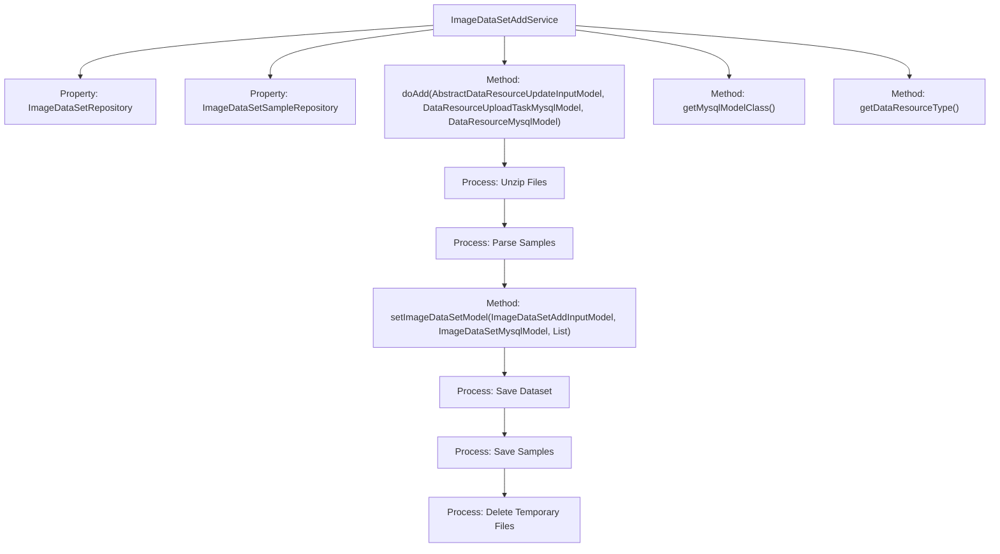

# Basic Information

|      |      |
|------|------|
| Name | ImageDataSetAddService |
| Language | .java |
| Code Path | WeFe/board/board-service/src/main/java/com/welab/wefe/board/service/service/data_resource/add/ImageDataSetAddService.java |
| Package Name | com.welab.wefe.board.service.service.data_resource.add |
| Dependencies | ['com.welab.wefe.board.service.base.file_system.WeFeFileSystem', 'com.welab.wefe.board.service.database.entity.data_resource.DataResourceMysqlModel', 'com.welab.wefe.board.service.database.entity.data_resource.DataResourceUploadTaskMysqlModel', 'com.welab.wefe.board.service.database.entity.data_resource.ImageDataSetMysqlModel', 'com.welab.wefe.board.service.database.entity.data_set.ImageDataSetSampleMysqlModel', 'com.welab.wefe.board.service.database.repository.ImageDataSetSampleRepository', 'com.welab.wefe.board.service.database.repository.data_resource.ImageDataSetRepository', 'com.welab.wefe.board.service.dto.vo.data_resource.AbstractDataResourceUpdateInputModel', 'com.welab.wefe.board.service.dto.vo.data_resource.ImageDataSetAddInputModel', 'com.welab.wefe.board.service.service.data_resource.image_data_set.data_set_parser.AbstractImageDataSetParser', 'com.welab.wefe.common.StatusCode', 'com.welab.wefe.common.exception.StatusCodeWithException', 'com.welab.wefe.common.file.decompression.SuperDecompressor', 'com.welab.wefe.common.file.decompression.dto.DecompressionResult', 'com.welab.wefe.common.util.FileUtil', 'com.welab.wefe.common.util.ListUtil', 'com.welab.wefe.common.util.StringUtil', 'com.welab.wefe.common.wefe.enums.DataResourceType', 'org.springframework.beans.factory.annotation.Autowired', 'org.springframework.stereotype.Service', 'java.io.File', 'java.util.List', 'java.util.TreeSet', 'java.util.concurrent.atomic.AtomicInteger'] |
| Brief Description | Image dataset service class, handling file decompression, sample parsing, label extraction, and database storage, with cleanup of temporary files upon completion. |

# Description

ImageDataSetAddService is a service class that handles the uploading of image datasets, inheriting from AbstractDataResourceAddService. It interacts with the database through ImageDataSetRepository and ImageDataSetSampleRepository. Its primary functions include decompressing uploaded image dataset files, parsing sample information, saving dataset and sample details to the database, and cleaning up temporary files. The service updates task progress, logs activities, handles exceptions, and sets dataset metadata such as label lists and data volume. Finally, it deletes the original files and decompressed temporary files.

# Class Summary

| Name   | Type  | Description |
|-------|------|-------------|
| ImageDataSetAddService | class | Image dataset service class, responsible for decompressing files, parsing samples, saving data to the database, and cleaning temporary files. Includes sample statistics and label processing functionality. |

## Class ImageDataSetAddService

|      |      |
|------|------|
| Access Modifier | @Service;public |
| Type | class |
| Name | ImageDataSetAddService |
| Description | Image dataset service class, responsible for decompressing files, parsing samples, saving data to the database, and cleaning temporary files. Includes sample statistics and label processing functionality. |

### UML Class Diagram

```mermaid
classDiagram
    class AbstractDataResourceAddService {
        <<Abstract>>
        #void doAdd(AbstractDataResourceUpdateInputModel in, DataResourceUploadTaskMysqlModel task, DataResourceMysqlModel m) throws StatusCodeWithException
        +Class~? extends DataResourceMysqlModel~ getMysqlModelClass()
        +DataResourceType getDataResourceType()
    }

    class ImageDataSetAddService {
        -ImageDataSetRepository imageDataSetRepository
        -ImageDataSetSampleRepository imageDataSetSampleRepository
        +void doAdd(AbstractDataResourceUpdateInputModel in, DataResourceUploadTaskMysqlModel task, DataResourceMysqlModel m) throws StatusCodeWithException
        -void setImageDataSetModel(ImageDataSetAddInputModel input, ImageDataSetMysqlModel dataSet, List~ImageDataSetSampleMysqlModel~ sampleList)
        +Class~? extends DataResourceMysqlModel~ getMysqlModelClass()
        +DataResourceType getDataResourceType()
    }

    class ImageDataSetRepository {
        <<Repository>>
        +save(ImageDataSetMysqlModel model)
    }

    class ImageDataSetSampleRepository {
        <<Repository>>
        +save(ImageDataSetSampleMysqlModel sample)
    }

    class ImageDataSetAddInputModel {
        <<InputModel>>
        -String filename
        -String forJobType
        +String getFilename()
        +String getForJobType()
    }

    class ImageDataSetMysqlModel {
        <<Model>>
        -String forJobType
        -String labelList
        -int totalDataCount
        -long labeledCount
        -boolean labelCompleted
        -long filesSize
        +setter/getter methods
    }

    class ImageDataSetSampleMysqlModel {
        <<Model>>
        -boolean labeled
        -Set~String~ labelSet
        -long fileSize
        +isLabeled()
        +getLabelSet()
        +getFileSize()
    }

    class DataResourceUploadTaskService {
        <<Service>>
        +updateMessageBeforeStart(String id, String message)
        +updateProgress(String id, int total, int current, int stage, String message)
    }

    class SuperDecompressor {
        <<Utility>>
        +static DecompressionResult decompression(File file, boolean keepStructure)
    }

    class AbstractImageDataSetParser {
        <<Abstract>>
        +static AbstractImageDataSetParser getParser(String jobType)
        +List~ImageDataSetSampleMysqlModel~ parseFilesToSamples(ImageDataSetMysqlModel model, List~File~ files)
    }

    AbstractDataResourceAddService <|-- ImageDataSetAddService : Inheritance
    ImageDataSetAddService --> ImageDataSetRepository : Dependency
    ImageDataSetAddService --> ImageDataSetSampleRepository : Dependency
    ImageDataSetAddService --> ImageDataSetAddInputModel : Processes
    ImageDataSetAddService --> ImageDataSetMysqlModel : Operates
    ImageDataSetAddService --> ImageDataSetSampleMysqlModel : Operates
    ImageDataSetAddService --> DataResourceUploadTaskService : Invokes
    ImageDataSetAddService --> SuperDecompressor : Invokes
    ImageDataSetAddService --> AbstractImageDataSetParser : Invokes
```

Class Diagram Description: This diagram illustrates the core structure of the Image Dataset Addition Service (ImageDataSetAddService), which inherits from the Abstract Data Resource Addition Service (AbstractDataResourceAddService). The service class persists data through two repositories (ImageDataSetRepository and ImageDataSetSampleRepository), processes the image dataset input model (ImageDataSetAddInputModel), and operates on two MySQL models (ImageDataSetMysqlModel and ImageDataSetSampleMysqlModel). It also relies on the task service (DataResourceUploadTaskService) for progress updates, utilizes SuperDecompressor for file decompression, and employs an abstract parser (AbstractImageDataSetParser) to convert files into sample models. The entire architecture implements functionalities such as dataset decompression, parsing, annotation processing, and batch storage for image datasets.

### Internal Method Call Graph

This code implements an image dataset addition service, with core functionalities including decompressing uploaded files, parsing image samples, saving dataset and sample information to the database, and finally cleaning up temporary files. The service inherits from an abstract data resource addition service, processes sample data in parallel via multithreading, and updates task progress in real-time. The core workflow consists of five stages: file decompression, sample parsing, model attribute setting, database storage, and resource cleanup, while maintaining metadata such as dataset label statistics and completion status.

### Field List

| Name  | Type  | Description |
|-------|-------|------|
| imageDataSetRepository | ImageDataSetRepository | Using @Autowired to automatically inject an instance of ImageDataSetRepository. |
| imageDataSetSampleRepository | ImageDataSetSampleRepository | Automatically inject an instance of ImageDataSetSampleRepository using @Autowired. |

### Method List

| Name  | Type  | Description |
|-------|-------|------|
| getMysqlModelClass | Class<? extends DataResourceMysqlModel> | This method overrides the parent class method and returns the ImageDataSetMysqlModel class as the MySQL data model class. |
| setImageDataSetModel | void | Method to set up the image dataset model, updating the dataset type, label list, total data count, labeled count, labeling completion status, and total file size. |
| doAdd | void | Code implementation for image dataset processing pipeline: decompress files, parse samples, save data to database, and finally clean up temporary files. |
| getDataResourceType | DataResourceType | Rewrite the method to return the image dataset resource type. |

