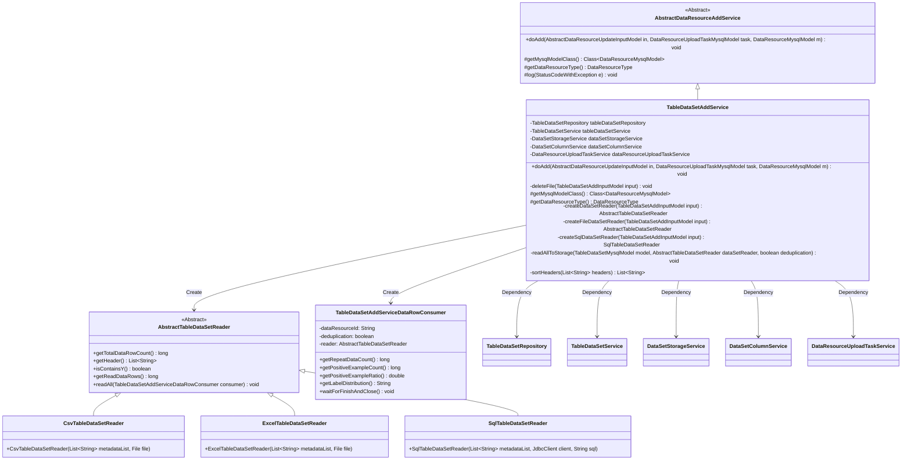
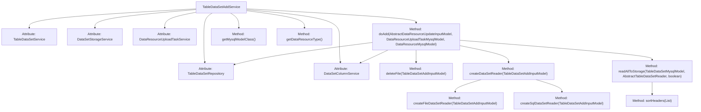
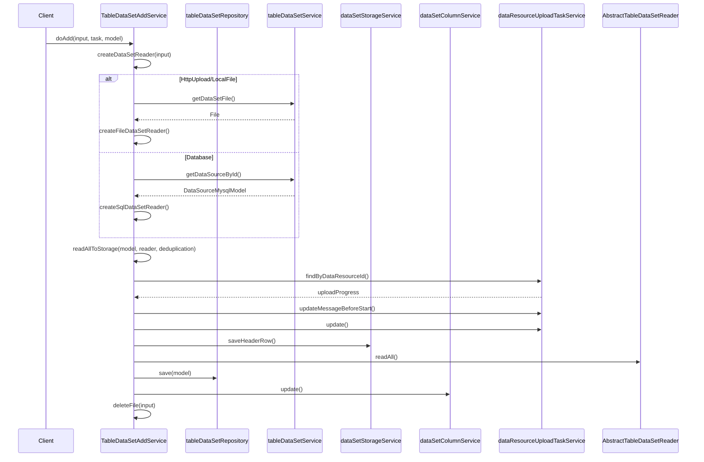

# Basic Information

|      |      |
|------|------|
| Name | TableDataSetAddService |
| Language | .java |
| Code Path | WeFe/board/board-service/src/main/java/com/welab/wefe/board/service/service/data_resource/add/TableDataSetAddService.java |
| Package Name | com.welab.wefe.board.service.service.data_resource.add |
| Dependencies | ['com.welab.wefe.board.service.constant.DataSetAddMethod', 'com.welab.wefe.board.service.database.entity.DataSourceMysqlModel', 'com.welab.wefe.board.service.database.entity.data_resource.DataResourceMysqlModel', 'com.welab.wefe.board.service.database.entity.data_resource.DataResourceUploadTaskMysqlModel', 'com.welab.wefe.board.service.database.entity.data_resource.TableDataSetMysqlModel', 'com.welab.wefe.board.service.database.repository.data_resource.TableDataSetRepository', 'com.welab.wefe.board.service.dto.vo.data_resource.AbstractDataResourceUpdateInputModel', 'com.welab.wefe.board.service.dto.vo.data_resource.TableDataSetAddInputModel', 'com.welab.wefe.board.service.service.DataSetColumnService', 'com.welab.wefe.board.service.service.DataSetStorageService', 'com.welab.wefe.board.service.service.data_resource.DataResourceUploadTaskService', 'com.welab.wefe.board.service.service.data_resource.table_data_set.TableDataSetService', 'com.welab.wefe.board.service.util.AbstractTableDataSetReader', 'com.welab.wefe.board.service.util.CsvTableDataSetReader', 'com.welab.wefe.board.service.util.ExcelTableDataSetReader', 'com.welab.wefe.board.service.util.SqlTableDataSetReader', 'com.welab.wefe.common.StatusCode', 'com.welab.wefe.common.exception.StatusCodeWithException', 'com.welab.wefe.common.jdbc.JdbcClient', 'com.welab.wefe.common.util.StringUtil', 'com.welab.wefe.common.wefe.enums.DataResourceType', 'org.apache.commons.io.FileUtils', 'org.springframework.beans.factory.annotation.Autowired', 'org.springframework.stereotype.Service', 'java.io.File', 'java.io.IOException', 'java.util.ArrayList', 'java.util.List', 'java.util.stream.Collectors'] |
| Brief Description | TableDataSetAddService is a service class for handling the addition of tabular datasets, inheriting from AbstractDataResourceAddService. It reads data through various methods (database, HTTP upload, local files), parses and stores it in databases and storage systems, supports deduplication and column sorting, and finally cleans up uploaded files. |

# Description

TableDataSetAddService is a Spring service class designed for adding tabular datasets, inheriting from AbstractDataResourceAddService. It implements core functionality through auto-injected dependency services (such as data storage, column information processing, etc.). The primary logic includes: parsing input models and creating corresponding readers (supporting three data sources: CSV/Excel/SQL), saving datasets to storage systems, processing metadata and column information, and cleaning temporary files. The service incorporates an exception handling mechanism to distinguish between form errors and system errors, ensuring data consistency. It also implements auxiliary features such as data deduplication, header column sorting (placing the y-column in the second position), statistical information calculation (e.g., positive sample ratio), and finally persists the complete dataset information to the database.

# Class Summary

| Name   | Type  | Description |
|-------|------|-------------|
| TableDataSetAddService | class | TableDataSetAddService handles the addition of table datasets, supporting database, HTTP upload, and local file methods. It parses data and stores it in databases and storage systems, featuring deduplication, column sorting, and statistical information calculation capabilities. |

## Class TableDataSetAddService

|      |      |
|------|------|
| Access Modifier | @Service;public |
| Type | class |
| Name | TableDataSetAddService |
| Description | TableDataSetAddService handles the addition of table datasets, supporting database, HTTP upload, and local file methods. It parses data and stores it in databases and storage systems, featuring deduplication, column sorting, and statistical information calculation capabilities. |

### UML Class Diagram

This diagram illustrates the class structure and relationships of TableDataSetAddService. As a subclass of AbstractDataResourceAddService, it implements table data addition functionality through five dependent services, including core methods such as file deletion, dataset reader creation (supporting CSV/Excel/SQL formats), and data storage. Three concrete implementations of AbstractTableDataSetReader handle different data sources, while TableDataSetAddServiceDataRowConsumer processes data rows. The overall design demonstrates the application of strategy pattern and polymorphism.

### Internal Method Call Graph

This code implements the TableDataSetAddService, primarily responsible for handling table dataset addition operations. It inherits from AbstractDataResourceAddService and obtains multiple service instances through dependency injection. Key functionalities include: creating dataset readers based on input, parsing and storing datasets, saving dataset information to databases, and handling file deletion. The class diagram illustrates the class structure and method invocation relationships, while the sequence diagram details the execution process of the doAdd method, including creating corresponding readers for different dataset addition methods, processing data storage and database updates, etc.

### Field List

| Name  | Type  | Description |
|-------|-------|------|
| dataResourceUploadTaskService | DataResourceUploadTaskService | Automatically inject the DataResourceUploadTaskService service instance. |
| dataSetColumnService | DataSetColumnService | Automatically inject dataset column service instances. |
| dataSetStorageService | DataSetStorageService | Automatically inject the dataset storage service instance. |
| tableDataSetRepository | TableDataSetRepository | Automatically inject the TableDataSetRepository instance. |
| tableDataSetService | TableDataSetService | The code snippet uses the @Autowired annotation to automatically inject an instance of the TableDataSetService. |

### Method List

| Name  | Type  | Description |
|-------|-------|------|
| doAdd | void | The method `doAdd` handles the addition of data resources: it parses and saves the original dataset, and if there are form errors, there is no need to re-upload the file; it saves the dataset and column information to the database; finally, it deletes the uploaded file. In case of exceptions, it determines whether to delete the file based on the type of error. |
| getDataResourceType | DataResourceType | This method overrides the parent class method and returns a data resource type as a table dataset. |
| getMysqlModelClass | Class<? extends DataResourceMysqlModel> | This method overrides the parent class method and returns the TableDataSetMysqlModel class as the MySQL data model class. |
| deleteFile | void | This method is used to delete files uploaded via HttpUpload. It checks whether the input method is HttpUpload, retrieves the corresponding file, and silently deletes it. Any exceptions encountered are logged. |
| readAllToStorage | void | The method reads the dataset into storage, including updating task status, processing table headers, reading data rows and collecting statistics, and finally updating model attributes. |
| createSqlDataSetReader | SqlTableDataSetReader | Create an SQL dataset reader, establish a JDBC connection after verifying the data source validity, and return the reader instance. |
| createDataSetReader | AbstractTableDataSetReader | Create corresponding dataset readers based on the input dataset addition method: Database type calls the SQL reader, HttpUpload or LocalFile types call the file reader, and other cases throw an exception. |
| createFileDataSetReader | AbstractTableDataSetReader | Create a file dataset reader that returns a CSV or Excel reader based on the file type, and throws a file IO error when handling exceptions. |
| sortHeaders | List<String> | The method `sortHeaders` processes a string list `headers`: if there is no "y", it returns directly; otherwise, it creates a new list, skips the original "y" element, inserts "y" at index 1, and returns the new list. |

