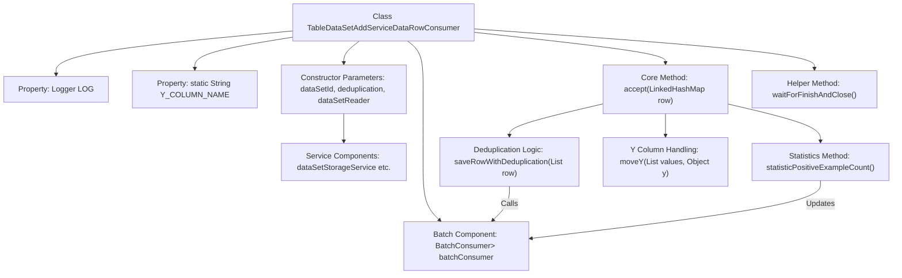

# Basic Information

|      |      |
|------|------|
| Name | TableDataSetAddServiceDataRowConsumer |
| Language | .java |
| Code Path | WeFe/board/board-service/src/main/java/com/welab/wefe/board/service/service/data_resource/add/TableDataSetAddServiceDataRowConsumer.java |
| Package Name | com.welab.wefe.board.service.service.data_resource.add |
| Dependencies | ['com.welab.wefe.board.service.dto.vo.data_set.table_data_set.LabelDistribution', 'com.welab.wefe.board.service.service.DataSetStorageService', 'com.welab.wefe.board.service.service.data_resource.DataResourceUploadTaskService', 'com.welab.wefe.board.service.util.AbstractTableDataSetReader', 'com.welab.wefe.board.service.util.unique.AbstractDataSetUniqueFilter', 'com.welab.wefe.board.service.util.unique.ContainResult', 'com.welab.wefe.board.service.util.unique.DataSetBloomUniqueFilter', 'com.welab.wefe.board.service.util.unique.DataSetMemoryUniqueFilter', 'com.welab.wefe.common.BatchConsumer', 'com.welab.wefe.common.exception.StatusCodeWithException', 'com.welab.wefe.common.util.ListUtil', 'com.welab.wefe.common.web.Launcher', 'org.apache.commons.collections4.CollectionUtils', 'org.eclipse.jetty.util.ConcurrentHashSet', 'org.slf4j.Logger', 'org.slf4j.LoggerFactory', 'java.math.BigDecimal', 'java.math.RoundingMode', 'java.util', 'java.util.concurrent.ConcurrentHashMap', 'java.util.concurrent.atomic.AtomicLong', 'java.util.concurrent.atomic.LongAdder', 'java.util.function.Consumer'] |
| Brief Description | This is a Java class designed for handling the addition of dataset rows, supporting deduplication, batch processing, and statistical functionalities. It includes features such as data storage, deduplication filtering, label distribution statistics, and positive case ratio calculation. |

# Description

This is a consumer class designed for handling row additions in datasets, with primary functionalities including batch processing of data rows, deduplication, counting positive instances, and tracking label distribution. The class receives a dataset ID, deduplication flag, and dataset reader via its constructor, initializing a batch processor and deduplication filter during setup. When processing data rows, it dynamically adjusts batch sizes based on the number of rows read, supports moving the Y column to the second position, and tracks label distribution. Deduplication is implemented via filters, supporting both in-memory and Bloom filter approaches. The class also provides methods for calculating positive instance ratios, counting duplicate data, retrieving label distribution information, and utilizes a service to save data rows and update upload progress.

# Class Summary

| Name   | Type  | Description |
|-------|------|-------------|
| TableDataSetAddServiceDataRowConsumer | class | The `TableDataSetAddServiceDataRowConsumer` class is designed for batch processing of dataset rows, supporting deduplication, calculation of positive example ratios, and label distribution, thereby improving write efficiency through batch processing. |


## Class TableDataSetAddServiceDataRowConsumer

|      |      |
|------|------|
| Access Modifier | public |
| Type | class |
| Name | TableDataSetAddServiceDataRowConsumer |
| Description | The `TableDataSetAddServiceDataRowConsumer` class is designed for batch processing of dataset rows, supporting deduplication, calculation of positive example ratios, and label distribution, thereby improving write efficiency through batch processing. |


### UML Class Diagram

```mermaid
classDiagram
    class TableDataSetAddServiceDataRowConsumer {
        -Logger LOG
        -static String Y_COLUMN_NAME
        -String dataSetId
        -boolean deduplication
        -BatchConsumer~List~Object~~ batchConsumer
        -int maxBatchSize
        -AbstractDataSetUniqueFilter uniqueFilter
        -DataSetStorageService dataSetStorageService
        -DataResourceUploadTaskService dataResourceUploadTaskService
        -AbstractTableDataSetReader dataSetReader
        -String firstColumnName
        -boolean containsY
        -int yIndex
        -AtomicLong yPositiveExampleCount
        -LongAdder repeatDataCount
        -Set~String~ labelSet
        -Map~String,Integer~ labelDistribution
        +TableDataSetAddServiceDataRowConsumer(String dataSetId, boolean deduplication, AbstractTableDataSetReader dataSetReader) throws StatusCodeWithException
        +accept(LinkedHashMap~String, Object~ row) void
        +waitForFinishAndClose() void
        +getRepeatDataCount() long
        +getPositiveExampleRatio() double
        +getPositiveExampleCount() long
        +getLabelDistribution() LabelDistribution
        -moveY(List~Object~ values, Object y) void
        -saveRowWithDeduplication(List~Object~ row) void
        -createUniqueFilter(long totalDataRowCount) AbstractDataSetUniqueFilter
        -statisticPositiveExampleCount(boolean containsY, int yIndex, List~List~Object~~ rows) void
    }

    class BatchConsumer~R~ {
        <<Interface>>
        +setMaxBatchSize(int maxBatchSize) void
        +add(R row) void
        +waitForFinishAndClose() void
        +waitForClean() void
    }

    class AbstractDataSetUniqueFilter {
        <<Interface>>
        +contains(String id) ContainResult
    }

    class DataSetBloomUniqueFilter {
        +DataSetBloomUniqueFilter(long totalDataRowCount)
    }

    class DataSetMemoryUniqueFilter {
        +DataSetMemoryUniqueFilter()
    }

    class DataSetStorageService {
        <<Interface>>
        +saveDataRows(String dataSetId, List~List~Object~~ rows) void
        +containsKey(String dataSetId, String id) boolean
        +getAddBatchSize(int columnCount) int
    }

    class DataResourceUploadTaskService {
        <<Interface>>
        +updateProgress(String dataSetId, long total, long read, long repeat) void
        +onError(String dataSetId, Exception e) void
    }

    class AbstractTableDataSetReader {
        <<Interface>>
        +getTotalDataRowCount() long
        +getReadDataRows() long
        +getHeader() List~String~
    }

    class LabelDistribution {
        +LabelDistribution(int labelCount, Map~String,Integer~ distribution)
    }

    enum ContainResult {
        In
        NotIn
        MaybeIn
    }

    TableDataSetAddServiceDataRowConsumer --> BatchConsumer~List~Object~~ : "uses"
    TableDataSetAddServiceDataRowConsumer --> AbstractDataSetUniqueFilter : "depends on"
    TableDataSetAddServiceDataRowConsumer --> DataSetStorageService : "depends on"
    TableDataSetAddServiceDataRowConsumer --> DataResourceUploadTaskService : "depends on"
    TableDataSetAddServiceDataRowConsumer --> AbstractTableDataSetReader : "depends on"
    AbstractDataSetUniqueFilter <|-- DataSetBloomUniqueFilter : "implements"
    AbstractDataSetUniqueFilter <|-- DataSetMemoryUniqueFilter : "implements"
```

Class diagram description: This diagram illustrates the structure of the TableDataSetAddServiceDataRowConsumer class and its dependencies. The class is a data row consumer responsible for handling table dataset addition operations, including deduplication, batch processing, and progress updates. It depends on multiple service interfaces such as BatchConsumer and DataSetStorageService, and employs the abstract factory pattern to create different deduplication filters. Core functionalities include data row processing, deduplication checks, batch storage, and statistical calculations.


### Internal Method Call Graph



This flowchart illustrates the core structure and data flow path of the TableDataSetAddServiceDataRowConsumer class. The class primarily implements the Consumer interface to process data rows, incorporating key functionalities such as batch processing, deduplication validation, and special handling of the Y column. It utilizes the BatchConsumer component for optimized batch storage, dynamically adjusting batch sizes based on data volume while maintaining business metrics like label distribution statistics and positive example counts. Storage services and dataset readers are injected during construction, with the accept method implementing the main processing logic chain that includes critical steps such as data validation, column position adjustment, and deduplication judgment.

### Field List

| Name  | Type  | Description |
|-------|-------|------|
| dataSetStorageService | DataSetStorageService | Private immutable dataset storage service instance. |
| repeatDataCount = new LongAdder() | LongAdder | Declare an immutable long-type accumulator repeatDataCount for thread-safe counting operations. |
| yIndex | int | Private integer constant yIndex. |
| dataSetReader | AbstractTableDataSetReader | Private immutable dataset reader instance. |
| firstColumnName | String | Private immutable string variable storing the name of the first column. |
| Y_COLUMN_NAME = "y" | String | Define a static constant string Y_COLUMN_NAME with the value "y". |
| labelSet = new ConcurrentHashSet<>() | Set<String> | Declare a thread-safe string collection labelSet, implemented using ConcurrentHashSet. |
| yPositiveExampleCount = new AtomicLong(0) | AtomicLong | The private atomic long variable yPositiveExampleCount, initialized to 0, is used for thread-safe counting. |
| deduplication | boolean | Private immutable boolean value for deduplication control. |
| maxBatchSize = 0 | int | The private integer variable maxBatchSize has an initial value of 0. |
| containsY | boolean | Private boolean variable indicating whether Y is included. |
| LOG = LoggerFactory.getLogger(TableDataSetAddServiceDataRowConsumer.class) | Logger | The class TableDataSetAddServiceDataRowConsumer defines a private immutable logger LOG for recording log information. |
| dataResourceUploadTaskService | DataResourceUploadTaskService | A private immutable file resource upload task service instance. |
| labelDistribution = new ConcurrentHashMap<>() | Map<String, Integer> | Define a thread-safe string-to-integer mapping variable `labelDistribution`, initialized as a concurrent hash table. |
| batchConsumer | BatchConsumer<List<Object>> | Private constant `BatchConsumer`, with a generic type of `List<Object>`. |
| dataSetId | String | Private immutable string variable dataSetId. |
| uniqueFilter | AbstractDataSetUniqueFilter | The private member variable uniqueFilter, of type AbstractDataSetUniqueFilter. |

### Method List

| Name  | Type  | Description |
|-------|-------|------|
| getPositiveExampleCount | long | Get the count of positive examples. |
| getLabelDistribution | LabelDistribution | The method returns a new LabelDistribution object containing the size and distribution of the label set. |
| statisticPositiveExampleCount | void | Count the number of positive instances: Check the value of the specified column (yIndex=1) in the row data, ignoring null values and "0". If the value is non-zero, increment the counter. Prerequisites: The data must include the Y column, yIndex must be valid, and the data must not be empty. |
| saveRowWithDeduplication | void | The method `saveRowWithDeduplication` processes data rows through uniqueness checks: discards if existing, writes if nonexistent, and waits for queue writing to reconfirm when uncertain. |
| accept | void | The method dynamically adjusts the batch size based on the number of lines read, starting with a smaller initial batch to quickly initiate the progress bar. When processing column data, if a Y column is included, its position is adjusted and its distribution is counted (stopping if there are too many categories). Finally, the data rows are saved according to the deduplication settings. |
| getRepeatDataCount | long | Get the long integer value of duplicate data count. |
| getPositiveExampleRatio | double | This method calculates the proportion of positive cases. If the total number of data rows minus duplicate data is less than or equal to 0, it returns 0; otherwise, it divides the number of positive cases by the total and retains 4 decimal places. |
| waitForFinishAndClose | void | The method `waitForFinishAndClose` invokes the same method of `batchConsumer`, waiting for completion and then closing. |
| createUniqueFilter | AbstractDataSetUniqueFilter | Choose a filter based on data volume: use a Bloom filter for over 100,000 rows, otherwise use an in-memory filter. |
| moveY | void | The method moveY moves the element y in the list values to a specified position, removing the validation that y must be an integer to accommodate the continuous data requirements of deep learning regression scenarios. |


