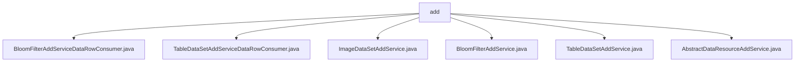

# Basic Information

|      |      |
|------|------|
| Name | add |
| Language | .java |
| Code Path | WeFe/board/board-service/src/main/java/com/welab/wefe/board/service/service/data_resource/add |
| Package Name | docs.board.board-service.src.main.java.com.welab.wefe.board.service.service.data_resource.add |
| Brief Description | BloomFilterAddServiceDataRowConsumer processes data rows to generate Bloom filters, supporting batch processing, deduplication, and encryption. TableDataSetAddServiceDataRowConsumer handles tabular data in batches, supporting deduplication and label statistics. ImageDataSetAddService manages image dataset uploads, decompresses files, and stores sample information. BloomFilterAddService and TableDataSetAddService handle Bloom filter and tabular data addition respectively, supporting multiple data sources. AbstractDataResourceAddService serves as the abstract base class, defining common logic for data resource addition. |

# Description

## Overview  
The core responsibility of this module is to handle the addition of various types of data resources (tables, images, Bloom filters), including data parsing, deduplication, storage, and metadata management. The interface specifications uniformly adopt a batch processing mechanism, supporting dynamic adjustment of batch sizes, and integrate security features such as CRT-optimized encryption and RSA key pairs. Key data structures include LinkedHashMap-formatted data rows, Bloom filter IDs, and label distribution statistics. External dependencies involve storage components like BloomFilterRepository and ImageDataSetRepository, as well as RSA encryption services. For example, TableDataSetAddService supports parsing three data sources (CSV/Excel/SQL), while ImageDataSetAddService specializes in image decompression and sample storage.  

## Primary Business Scenarios  
The module integrates three typical workflows: batch import of tabular data, decompression and storage of image datasets, and Bloom filter generation, resembling an ETL pipeline model. In terms of interaction, all follow the "read-process-store" paradigm, with task scheduling and exception handling unified through the AbstractDataResourceAddService abstract class. Full functionality includes data deduplication (dual-mode: in-memory/Bloom filter), label distribution statistics, and temporary file cleanup. A typical application example: after a user uploads a CSV file, the service automatically parses it, calculates the positive sample ratio, and implements encrypted deduplication via BloomFilterAddService. API integration cases include asynchronous task submission, progress callbacks, and multi-source adapters (e.g., SqlBloomFilterReader).

### Package Internal Structure View

This flowchart illustrates the file structure relationships within the data_resource/add directory of the WeFe project. The parent node "add" contains six direct child file nodes, including three concrete service implementation classes (BloomFilterAddService.java, TableDataSetAddService.java, ImageDataSetAddService.java), two data row consumer classes (BloomFilterAddServiceDataRowConsumer.java, TableDataSetAddServiceDataRowConsumer.java), and one abstract base class (AbstractDataResourceAddService.java). All files reside at the same hierarchical level with no nested subdirectories.

# File List

| Name   | Type  | Description |
|-------|------|-------------|
| [BloomFilterAddServiceDataRowConsumer.java](BloomFilterAddServiceDataRowConsumer.md) | file | The BloomFilterAddServiceDataRowConsumer class implements the Consumer interface and is designed to process data rows and generate Bloom filters. It supports batch processing, deduplication, and RSA encryption optimization, incorporating progress updates and error handling capabilities. |
| [TableDataSetAddServiceDataRowConsumer.java](TableDataSetAddServiceDataRowConsumer.md) | file | This is a Java class designed for handling dataset row additions, supporting deduplication, batch processing, and statistical functionalities. It includes features such as data storage, deduplication filtering, label distribution statistics, and positive case ratio calculation. |
| [ImageDataSetAddService.java](ImageDataSetAddService.md) | file | Image dataset service class, handling file decompression, sample parsing, label extraction, and database storage, with cleanup of temporary files upon completion. |
| [BloomFilterAddService.java](BloomFilterAddService.md) | file | BloomFilterAddService handles the addition of Bloom filter data, supporting database, HTTP upload, and local file methods. It parses the data and saves it to files, incorporating deduplication and field processing functionalities. |
| [TableDataSetAddService.java](TableDataSetAddService.md) | file | TableDataSetAddService is a service class for handling the addition of tabular datasets, inheriting from AbstractDataResourceAddService. It reads data through various methods (database, HTTP upload, local files), parses and stores it in databases and storage systems, supports deduplication and column sorting, and finally cleans up uploaded files. |
| [AbstractDataResourceAddService.java](AbstractDataResourceAddService.md) | file | The abstract class AbstractDataResourceAddService provides common methods for adding data resources, relies on multiple service classes, contains abstract methods and resource storage location checking logic, and supports asynchronous execution of resource saving. |

