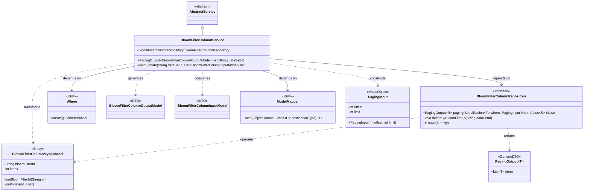
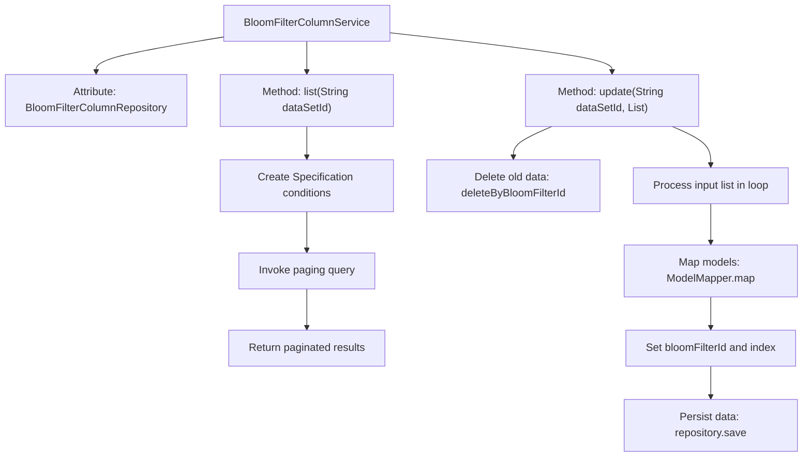

# Basic Information

|      |      |
|------|------|
| Name | BloomFilterColumnService |
| Language | .java |
| Code Path | WeFe/board/board-service/src/main/java/com/welab/wefe/board/service/service/data_resource/bloom_filter/BloomFilterColumnService.java |
| Package Name | com.welab.wefe.board.service.service.data_resource.bloom_filter |
| Dependencies | ['com.welab.wefe.board.service.database.entity.fusion.bloomfilter.BloomFilterColumnMysqlModel', 'com.welab.wefe.board.service.database.repository.fusion.BloomFilterColumnRepository', 'com.welab.wefe.board.service.dto.base.PagingInput', 'com.welab.wefe.board.service.dto.base.PagingOutput', 'com.welab.wefe.board.service.dto.fusion.BloomFilterColumnInputModel', 'com.welab.wefe.board.service.dto.fusion.BloomFilterColumnOutputModel', 'com.welab.wefe.board.service.service.AbstractService', 'com.welab.wefe.common.data.mysql.Where', 'com.welab.wefe.common.data.mysql.enums.OrderBy', 'org.modelmapper.ModelMapper', 'org.springframework.beans.factory.annotation.Autowired', 'org.springframework.data.jpa.domain.Specification', 'org.springframework.stereotype.Service', 'java.util.List'] |
| Brief Description | The BloomFilterColumnService provides paginated query and batch update functionalities for dataset fields, supporting operations such as index-based sorting and clearing followed by re-saving. |

# Description

BloomFilterColumnService is a service class that inherits from AbstractService and contains two core methods. The list method queries BloomFilterColumnMysqlModel data based on dataSetId, sorts them in ascending order by index, and returns BloomFilterColumnOutputModel results using pagination. The update method first deletes old data according to dataSetId, then sequentially maps the input BloomFilterColumnInputModel list to BloomFilterColumnMysqlModel for saving, while setting the bloomFilterId and index properties. Data operations are implemented through bloomFilterColumnRepository.

# Class Summary

| Name   | Type  | Description |
|-------|------|-------------|
| BloomFilterColumnService | class | BloomFilterColumnService provides paginated query and batch update functionalities for dataset fields. Queries support sorting, while updates involve deleting old data first and then saving new data by index. |

## Class BloomFilterColumnService

|      |      |
|------|------|
| Access Modifier | @Service;public |
| Type | class |
| Name | BloomFilterColumnService |
| Description | BloomFilterColumnService provides paginated query and batch update functionalities for dataset fields. Queries support sorting, while updates involve deleting old data first and then saving new data by index. |

### UML Class Diagram

Class Diagram Description: This diagram illustrates BloomFilterColumnService as the core service class, inheriting from AbstractService, which interacts with the database through the BloomFilterColumnRepository interface. The service class utilizes the Where utility to build query conditions, employs ModelMapper for DTO-entity conversion, handles paginated queries (PagingInput/PagingOutput) and batch update operations. It involves BloomFilterColumnInputModel/BloomFilterColumnOutputModel data transfer objects and BloomFilterColumnMysqlModel persistence entities, demonstrating the complete workflow from parameter reception, business processing to data storage.

### Internal Method Call Graph

This code demonstrates a Spring service class BloomFilterColumnService, which primarily provides paginated query and batch update functionalities for Bloom filter columns. The flowchart clearly illustrates how the list() method constructs query conditions via Specification and performs paginated queries, as well as the complete workflow of the update() method that first deletes old data before iteratively saving new data. Special attention should be paid to the update method's complete data update chain including model mapping, field assignment, and persistence operations, while the list method handles the special scenario where frontend requests unpaginated data but backend implements preventive pagination.

### Field List

| Name  | Type  | Description |
|-------|-------|------|
| bloomFilterColumnRepository | BloomFilterColumnRepository | Automatically inject Bloom filter column store instances. |

### Method List

| Name  | Type  | Description |
|-------|-------|------|
| list | PagingOutput<BloomFilterColumnOutputModel> | This method queries the Bloom filter columns for a specified dataset ID, sorted in ascending order by index. The frontend does not require pagination, but to prevent an excessive number of fields, internal paginated queries (10,000 entries per page) are used, returning paginated results. |
| update | void | This method first deletes all columns with the specified dataset ID, then iterates through the input list, maps each element to a database model while setting the dataset ID and index, and finally saves them to the database. |

