# Basic Information

|      |      |
|------|------|
| Name | BloomFilterService |
| Language | .java |
| Code Path | WeFe/board/board-service/src/main/java/com/welab/wefe/board/service/service/data_resource/bloom_filter/BloomFilterService.java |
| Package Name | com.welab.wefe.board.service.service.data_resource.bloom_filter |
| Dependencies | ['com.welab.wefe.board.service.api.data_resource.bloom_filter.BloomFilterDataResourceListApi', 'com.welab.wefe.board.service.api.data_resource.bloom_filter.BloomFilterDeleteApi', 'com.welab.wefe.board.service.base.file_system.WeFeFileSystem', 'com.welab.wefe.board.service.constant.BloomfilterAddMethod', 'com.welab.wefe.board.service.database.entity.DataSourceMysqlModel', 'com.welab.wefe.board.service.database.entity.data_resource.BloomFilterMysqlModel', 'com.welab.wefe.board.service.database.entity.job.ProjectMemberMySqlModel', 'com.welab.wefe.board.service.database.entity.job.ProjectMySqlModel', 'com.welab.wefe.board.service.database.repository.DataSourceRepository', 'com.welab.wefe.board.service.database.repository.JobMemberRepository', 'com.welab.wefe.board.service.database.repository.JobRepository', 'com.welab.wefe.board.service.database.repository.ProjectRepository', 'com.welab.wefe.board.service.database.repository.base.RepositoryManager', 'com.welab.wefe.board.service.database.repository.data_resource.BloomFilterRepository', 'com.welab.wefe.board.service.dto.entity.BloomFilterDataResourceListOutputModel', 'com.welab.wefe.board.service.dto.entity.data_resource.output.BloomFilterOutputModel', 'com.welab.wefe.board.service.dto.entity.project.ProjectDetailMemberOutputModel', 'com.welab.wefe.board.service.dto.entity.project.data_set.ProjectDataResourceOutputModel', 'com.welab.wefe.board.service.dto.vo.data_resource.BloomFilterUpdateInputModel', 'com.welab.wefe.board.service.onlinedemo.OnlineDemoBranchStrategy', 'com.welab.wefe.board.service.service.CacheObjects', 'com.welab.wefe.board.service.service.ProjectDataSetService', 'com.welab.wefe.board.service.service.ProjectMemberService', 'com.welab.wefe.board.service.service.data_resource.DataResourceService', 'com.welab.wefe.common.StatusCode', 'com.welab.wefe.common.exception.StatusCodeWithException', 'com.welab.wefe.common.jdbc.JdbcClient', 'com.welab.wefe.common.web.util.ModelMapper', 'com.welab.wefe.common.wefe.enums.DataResourcePublicLevel', 'com.welab.wefe.common.wefe.enums.DataResourceType', 'org.apache.commons.lang3.StringUtils', 'org.springframework.beans.factory.annotation.Autowired', 'org.springframework.stereotype.Service', 'java.io.File', 'java.util.List', 'java.util.stream.Collectors'] |
| Brief Description | The BloomFilterService provides Bloom filter related operations, including query, deletion, update, file retrieval, and SQL testing functionalities. It relies on multiple repositories and services to handle data resources and project member permissions. |

# Description

The code defines a service class named BloomFilterService, which inherits from DataResourceService. It implements Bloom filter-related functionalities through multiple auto-wired repository interfaces (such as BloomFilterRepository, JobRepository, etc.). Key features include: searching for local or federated datasets, retrieving uploaded files, deleting Bloom filter records, processing visible member lists, testing SQL queries, querying project data resource lists, and updating Bloom filter information. The service also involves interactions with federated services, such as data resource synchronization and deletion operations.

# Class Summary

| Name   | Type  | Description |
|-------|------|-------------|
| BloomFilterService | class | The BloomFilterService class provides Bloom filter-related operations, including lookup, deletion, update, file processing, and SQL testing functionalities, involving multiple repositories and service dependencies. |

## Class BloomFilterService

|      |      |
|------|------|
| Access Modifier | @Service;public |
| Type | class |
| Name | BloomFilterService |
| Description | The BloomFilterService class provides Bloom filter-related operations, including lookup, deletion, update, file processing, and SQL testing functionalities, involving multiple repositories and service dependencies. |

### UML Class Diagram

```mermaid
classDiagram
    class BloomFilterService {
        -BloomFilterRepository repo
        -BloomFilterStorageService bloomfilterStorageService
        -JobRepository jobRepository
        -JobMemberRepository jobMemberRepository
        -JobRepository featureJobRepository
        -DataSourceRepository dataSourceRepo
        -ProjectRepository projectRepo
        -ProjectMemberService projectMemberService
        -ProjectDataSetService projectDataSetService
        +BloomFilterOutputModel findDataSetFromLocalOrUnion(String memberId, String dataSetId) throws StatusCodeWithException
        +File getBloomfilterFile(BloomfilterAddMethod method, String filename) throws StatusCodeWithException
        +void delete(BloomFilterDeleteApi.Input input) throws Exception
        +void delete(String bloomFilterId) throws Exception
        +void delete(BloomFilterMysqlModel model) throws Exception
        +void handlePublicMemberList(BloomFilterMysqlModel model)
        +DataSourceMysqlModel getDataSourceById(String dataSourceId)
        +BloomFilterMysqlModel findOne(String bloomFilterId)
        +String testSqlQuery(String dataSourceId, String sql) throws StatusCodeWithException
        +BloomFilterDataResourceListOutputModel query(BloomFilterDataResourceListApi.Input input) throws StatusCodeWithException
        +void update(BloomFilterUpdateInputModel input) throws StatusCodeWithException
    }

    class BloomFilterRepository {
        <<Interface>>
    }

    class BloomFilterStorageService {
        <<Interface>>
    }

    class JobRepository {
        <<Interface>>
    }

    class JobMemberRepository {
        <<Interface>>
    }

    class DataSourceRepository {
        <<Interface>>
    }

    class ProjectRepository {
        <<Interface>>
    }

    class ProjectMemberService {
        <<Interface>>
    }

    class ProjectDataSetService {
        <<Interface>>
    }

    class BloomFilterMysqlModel {
    }

    class DataSourceMysqlModel {
    }

    class ProjectMySqlModel {
    }

    class ProjectMemberMySqlModel {
    }

    class BloomFilterOutputModel {
    }

    class BloomFilterDataResourceListOutputModel {
    }

    class ProjectDetailMemberOutputModel {
    }

    class ProjectDataResourceOutputModel {
    }

    BloomFilterService --> BloomFilterRepository : Dependency
    BloomFilterService --> BloomFilterStorageService : Dependency
    BloomFilterService --> JobRepository : Dependency
    BloomFilterService --> JobMemberRepository : Dependency
    BloomFilterService --> DataSourceRepository : Dependency
    BloomFilterService --> ProjectRepository : Dependency
    BloomFilterService --> ProjectMemberService : Dependency
    BloomFilterService --> ProjectDataSetService : Dependency
    BloomFilterService --> BloomFilterMysqlModel : Operation
    BloomFilterService --> DataSourceMysqlModel : Query
    BloomFilterService --> ProjectMySqlModel : Query
    BloomFilterService --> ProjectMemberMySqlModel : Query
    BloomFilterService --> BloomFilterOutputModel : Return
    BloomFilterService --> BloomFilterDataResourceListOutputModel : Return
    BloomFilterService --> ProjectDetailMemberOutputModel : Mapping
    BloomFilterService --> ProjectDataResourceOutputModel : Operation
```

This class diagram illustrates the core structure and dependencies of the BloomFilterService. BloomFilterService is a service class that inherits from DataResourceService, primarily responsible for handling business logic related to Bloom filters, including dataset lookup, file retrieval, deletion operations, member list processing, SQL test queries, and data updates. It depends on multiple Repository and Service interfaces such as BloomFilterRepository, BloomFilterStorageService, etc., and interacts with various model classes like BloomFilterMysqlModel, DataSourceMysqlModel, etc. The class provides comprehensive Bloom filter management capabilities through its rich set of public methods, while also handling various exception scenarios and data validation logic.

### Internal Method Call Graph

```mermaid
graph TD
    A["BloomFilterService"]
    B["findDataSetFromLocalOrUnion"]
    C["getBloomfilterFile"]
    D["delete: Input Version"]
    E["delete: ID Version"]
    F["delete: Model Version"]
    G["handlePublicMemberList"]
    H["getDataSourceById"]
    I["findOne"]
    J["testSqlQuery"]
    K["query"]
    L["update"]

    A --> B
    A --> C
    A --> D
    A --> E
    A --> F
    A --> G
    A --> H
    A --> I
    A --> J
    A --> K
    A --> L

    B -->|Local Query| I
    B -->|Federated Query| 'unionService.getDataResourceDetail'
    C -->|File Handling| 'WeFeFileSystem.getFilePath'
    D --> F
    E --> F
    F -->|Database Operation| 'repo.deleteById'
    F -->|Federated Notification| 'unionService.deleteDataResource'
    F -->|Cache Refresh| 'CacheObjects.refreshDataResourceTags'
    G -->|Member List Processing| 'CacheObjects.getMemberId'
    J -->|SQL Testing| 'JdbcClient.create'
    K -->|Project Query| 'projectRepo.findOne'
    K -->|Member Handling| 'projectMemberService.findOneByMemberId'
    K -->|Dataset Filtering| 'projectDataSetService.listRawDataSet'
    L -->|Model Update| 'RepositoryManager.save'
    L -->|Federated Update| 'unionService.upsertDataResource'
    L --> G
```

This flowchart illustrates the main method invocation relationships of the BloomFilterService class. Core functionalities include data query (local/federated), file handling, delete operations (three overloaded versions), member list processing, data source operations, SQL testing, project query, and Bloom filter updates. Key dependencies encompass the unionService federated service, various Repository data access layers, and cache management components, reflecting the complete lifecycle of data resource management.

### Field List

| Name  | Type  | Description |
|-------|-------|------|
| projectMemberService | ProjectMemberService | Using @Autowired to automatically inject an instance of ProjectMemberService. |
| featureJobRepository | JobRepository | Automatically inject the protected JobRepository instance featureJobRepository. |
| jobRepository | JobRepository | Automatically injects a JobRepository instance for task management. |
| projectRepo | ProjectRepository | Automatically inject the ProjectRepository instance into the projectRepo variable. |
| jobMemberRepository | JobMemberRepository | Automatically injects the JobMemberRepository instance. |
| repo | BloomFilterRepository | Automatically inject the BloomFilterRepository instance into the repo variable. |
| bloomfilterStorageService | BloomFilterStorageService | Automatically inject Bloom filter storage service instances. |
| projectDataSetService | ProjectDataSetService | Using @Autowired to automatically inject an instance of ProjectDataSetService. |
| dataSourceRepo | DataSourceRepository | Automatically inject data source repository instances. |

### Method List

| Name  | Type  | Description |
|-------|-------|------|
| handlePublicMemberList | void | Processing public member list: If the visibility level is PublicWithMemberList and the list contains the current user ID, remove that ID and clean up any redundant commas. |
| delete | void | This method removes the Bloom filter: 1. Delete the record from the database; 2. Notify the alliance to stop publishing; 3. Refresh the tag cache. The note indicates that no storage service handling is required. |
| delete | void | Method to delete Bloom filter data with the specified ID. If it does not exist, return directly. Verify permissions before deletion to ensure only self-added datasets can be deleted. |
| getBloomfilterFile | File | This method retrieves the file object based on the Bloom filter's addition method, supporting HTTP uploads, local files, and database approaches. It throws an exception if the file does not exist. |
| query | BloomFilterDataResourceListOutputModel | Query project data resource list: Check if the project exists, map project information, retrieve member data resource list and filter by name, then return the results. |
| delete | void | Delete the Bloom filter with the specified ID. If it does not exist, return directly. |
| testSqlQuery | String | This method retrieves database configuration via dataSourceId, verifies the validity of both the data source and SQL statement, then creates a JDBC client and executes a test SQL query. It throws an exception if the data source does not exist or the SQL is empty. |
| findOne | BloomFilterMysqlModel | The method queries the Bloom filter model by ID and returns null if it does not exist. |
| getDataSourceById | DataSourceMysqlModel | Query MySQL data source by ID, return null if it does not exist. |
| findDataSetFromLocalOrUnion | BloomFilterOutputModel | The method determines the data source based on the memberId: either the local database or the federated service. If the memberId matches the cache, it queries the local database and returns the mapped result; otherwise, it retrieves data by calling the federated service. A StatusCodeWithException is thrown in case of exceptions. |
| update | void | Update Bloom Filter Data: After checking the existence of the ID, modify the name, description, public member list, public level, and tags, then save to the database and update the cache. |

