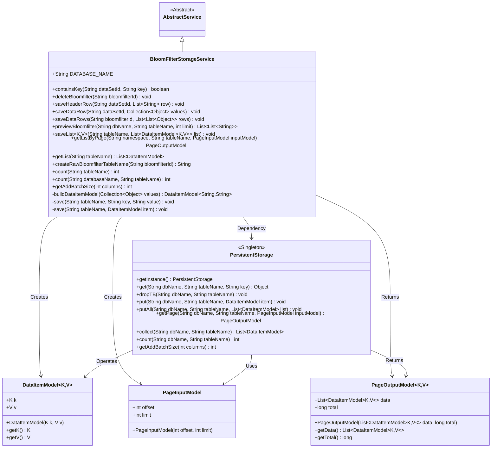

# Basic Information

|      |      |
|------|------|
| Name | BloomFilterStorageService |
| Language | .java |
| Code Path | WeFe/board/board-service/src/main/java/com/welab/wefe/board/service/service/data_resource/bloom_filter/BloomFilterStorageService.java |
| Package Name | com.welab.wefe.board.service.service.data_resource.bloom_filter |
| Dependencies | ['com.alibaba.fastjson.JSON', 'com.welab.wefe.board.service.service.AbstractService', 'com.welab.wefe.common.data.storage.common.Constant', 'com.welab.wefe.common.data.storage.model.DataItemModel', 'com.welab.wefe.common.data.storage.model.PageInputModel', 'com.welab.wefe.common.data.storage.model.PageOutputModel', 'com.welab.wefe.common.data.storage.service.persistent.PersistentStorage', 'com.welab.wefe.common.util.StringUtil', 'org.springframework.stereotype.Service', 'java.util.ArrayList', 'java.util.Collection', 'java.util.List', 'java.util.stream.Collectors'] |
| Brief Description | The BloomFilterStorageService provides Bloom filter data storage functionality, including methods for key-value checking, deletion, saving dataset header information, data rows, and paginated queries, utilizing persistent storage operations for data tables. |

# Description

BloomFilterStorageService is a service class that inherits from AbstractService, primarily designed to manage storage operations for Bloom filter data. It offers multiple functionalities, including checking key existence, deleting Bloom filter tables, saving dataset header information and data rows, previewing data, paginated data reading, retrieving table record counts, and calculating optimal batch sizes. The class utilizes a PersistentStorage instance for data operations, supports JSON format conversion and pagination processing, and can dynamically generate Bloom filter table names. All operations are performed based on specified database names and table names to ensure efficient data storage and retrieval.

# Class Summary

| Name   | Type  | Description |
|-------|------|-------------|
| BloomFilterStorageService | class | BloomFilterStorageService provides Bloom filter data storage operations, including key existence checks, deletion, saving dataset header information, data rows, and batch operations, with support for paginated queries and counting functionality. |

## Class BloomFilterStorageService

|      |      |
|------|------|
| Access Modifier | @Service;public |
| Type | class |
| Name | BloomFilterStorageService |
| Description | BloomFilterStorageService provides Bloom filter data storage operations, including key existence checks, deletion, saving dataset header information, data rows, and batch operations, with support for paginated queries and counting functionality. |

### UML Class Diagram

This code demonstrates a Bloom Filter Storage Service (BloomFilterStorageService) that inherits from an abstract service class (AbstractService). Its primary functionalities include key existence checking, Bloom filter data deletion, header and data row saving, and data preview operations. The class interacts with the underlying database through the singleton PersistentStorage class, using DataItemModel as the data storage model, and PageInputModel and PageOutputModel for handling paginated queries. The service provides comprehensive CRUD operations and batch processing capabilities, supports JSON format data conversion, and includes utility methods such as table name generation.

### Internal Method Call Graph

```mermaid
graph TD
    A["Class BloomFilterStorageService"]
    B["Constant: DATABASE_NAME"]
    C["Method: containsKey(dataSetId, key)"]
    D["Method: deleteBloomfilter(bloomfilterId)"]
    E["Method: saveHeaderRow(dataSetId, row)"]
    F["Method: saveDataRow(dataSetId, values)"]
    G["Method: saveDataRows(bloomfilterId, rows)"]
    H["Method: buildDataItemModel(values)"]
    I["Method: previewBloomfilter(dbName, tableName, limit)"]
    J["Method: save(tableName, key, value)"]
    K["Method: save(tableName, item)"]
    L["Method: saveList(tableName, list)"]
    M["Method: getListByPage(namespace, tableName, inputModel)"]
    N["Method: getList(tableName)"]
    O["Method: createRawBloomfilterTableName(bloomfilterId)"]
    P["Method: count(tableName)"]
    Q["Method: count(databaseName, tableName)"]
    R["Method: getAddBatchSize(columns)"]

    A --> B
    A --> C
    A --> D
    A --> E
    A --> F
    A --> G
    A --> H
    A --> I
    A --> J
    A --> K
    A --> L
    A --> M
    A --> N
    A --> O
    A --> P
    A --> Q
    A --> R

    C --> J
    E --> J
    F --> K
    G --> L
    H --> K
    I --> M
    P --> Q
```

This code illustrates a BloomFilter storage service class, whose primary functionalities include key existence checking, Bloom filter deletion, data row saving and retrieval. The class interacts with underlying storage via PersistentStorage, providing data conversion, paginated queries, and batch operations. Core methods focus on Bloom filter table creation and manipulation, encompassing metadata persistence, data preview, and counting utilities.

### Field List

| Name  | Type  | Description |
|-------|-------|------|
| DATABASE_NAME = Constant.DBName.WEFE_DATA | String | Define a static constant DATABASE_NAME with the value Constant.DBName.WEFE_DATA, representing the database name. |

### Method List

| Name  | Type  | Description |
|-------|-------|------|
| save | void | Save data to persistent storage: specify table name, key, and value, may throw exceptions. |
| getList | List<DataItemModel> | This method retrieves the data list of the specified table through PersistentStorage, returning a collection of DataItemModel, and may throw exceptions. |
| createRawBloomfilterTableName | String | Generation method: Create the original Bloom filter table name based on bloomfilterId, in the format of "blommfilter_" + bloomfilterId. |
| containsKey | boolean | Check if the specified dataset and key exist: Query the key-value in persistent storage and return the existence result. |
| saveDataRows | void | The method `saveDataRows` accepts a Bloom filter ID and a list of data rows, converts each row into a `DataItemModel`, and stores them in a table with the specified name. |
| deleteBloomfilter | void | Delete the specified Bloom filter table. The method generates the table name by ID and invokes the persistence storage interface to remove the corresponding database table. |
| previewBloomfilter | List<List<String>> | Preview Bloom Filter Data: Retrieve paginated data from the specified database and table, convert key-value pairs into a list of strings with the key as a separate item and values appended after splitting by commas. Return a nested list structure. |
| save | void | Save the data item to the specified database table. Call the persistent storage instance to store the data item in the specified database and table. |
| buildDataItemModel | DataItemModel<String, String> | Method to construct DataItemModel: Iterate through the collection, use the first element as the key, convert the remaining elements into a comma-separated string stored in a list, and return a DataItemModel object containing the key and the concatenated string. |
| getListByPage | PageOutputModel | Pagination query method, retrieves paginated data by namespace and table name, returns paginated results. |
| saveHeaderRow | void | The method `saveHeaderRow` processes the header row of the dataset: extracts the first element as `sid`, the remaining elements as `header`, converts them to JSON format, and saves them to `table_name.meta`. |
| saveDataRow | void | Save dataset row data to the specified table, with parameters being the dataset ID and value collection, may throw exceptions. |
| saveList | void | The Java method `saveList` stores a list of `DataItemModel` objects into the specified database table by invoking the `putAll` method of `PersistentStorage` to achieve batch storage. |
| count | int | This method is used to count the number of data rows in a specified database table by invoking the count method of the persistence storage instance. It requires passing the database name and table name as parameters and may throw exceptions. |
| count | int | This method counts the number of records in a specified database table through a PersistentStorage instance, with parameters being the database name and table name, and may throw exceptions. |
| getAddBatchSize | int | This method returns the batch addition size under the specified column count by invoking the getAddBatchSize method of the PersistentStorage instance. |

