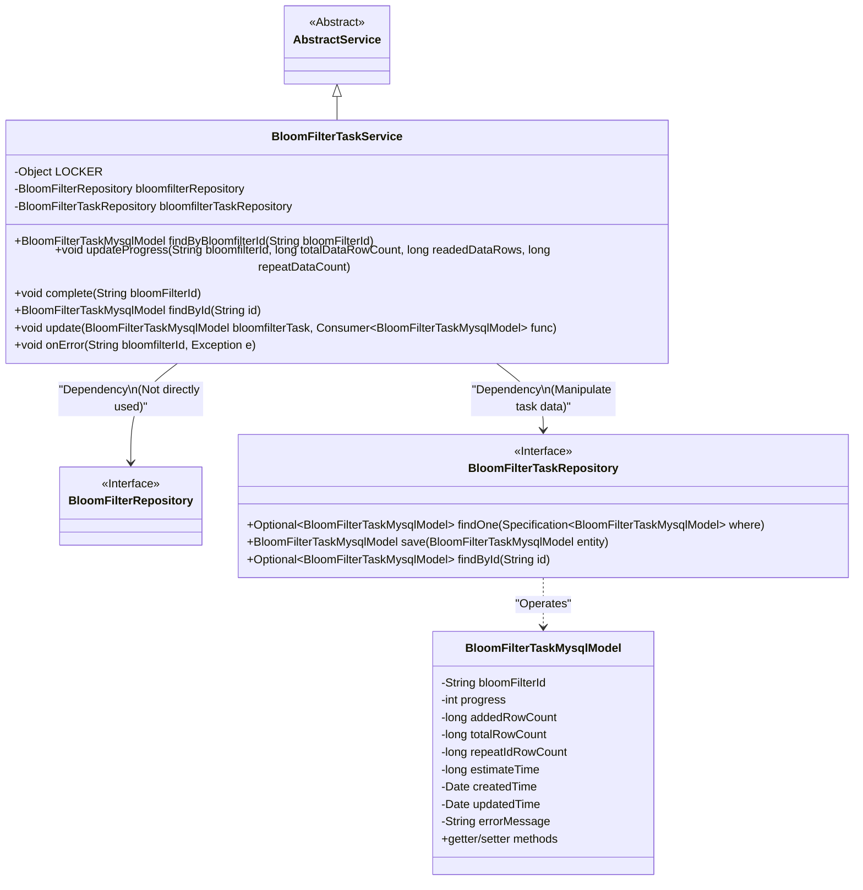
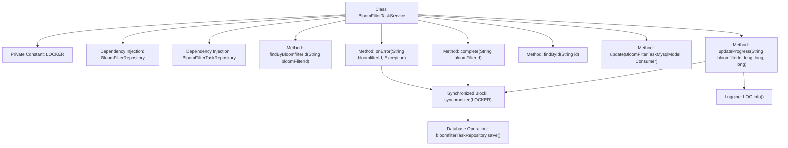

# Basic Information

|      |      |
|------|------|
| Name | BloomFilterTaskService |
| Language | .java |
| Code Path | WeFe/board/board-service/src/main/java/com/welab/wefe/board/service/service/data_resource/bloom_filter/BloomFilterTaskService.java |
| Package Name | com.welab.wefe.board.service.service.data_resource.bloom_filter |
| Dependencies | ['com.welab.wefe.board.service.database.entity.fusion.bloomfilter.BloomFilterTaskMysqlModel', 'com.welab.wefe.board.service.database.repository.data_resource.BloomFilterRepository', 'com.welab.wefe.board.service.database.repository.fusion.BloomFilterTaskRepository', 'com.welab.wefe.board.service.service.AbstractService', 'com.welab.wefe.common.Convert', 'com.welab.wefe.common.data.mysql.Where', 'org.springframework.beans.factory.annotation.Autowired', 'org.springframework.data.jpa.domain.Specification', 'org.springframework.stereotype.Service', 'java.util.Date', 'java.util.function.Consumer'] |
| Brief Description | The BloomFilterTaskService class is used to manage Bloom filter task progress, providing functionalities such as updating progress, completion, error handling, and ensuring concurrency safety through synchronization locks. |

# Description

The code describes a service class named BloomFilterTaskService, which extends AbstractService and is primarily used for managing the upload progress, completion status, and exception handling of Bloom filter tasks. The class employs a synchronization lock LOCKER to ensure thread safety during concurrent operations. It includes the following core functionalities: querying task records by bloomfilterId; updating upload progress, calculating progress percentage and estimated time, with special logic for edge cases such as when progress is 0 or 100; marking tasks as completed by setting progress to 100 and resetting estimated time; handling task exceptions and logging error messages; and providing basic CRUD operations such as querying and updating task records by ID. All database operations are implemented via BloomFilterTaskRepository, with key operations logged.

# Class Summary

| Name   | Type  | Description |
|-------|------|-------------|
| BloomFilterTaskService | class | BloomFilterTaskService provides Bloom filter task management functionalities, including progress updates, completion marking, exception handling, and query operations, utilizing synchronization locks to ensure concurrency safety. |

## Class BloomFilterTaskService

|      |      |
|------|------|
| Access Modifier | @Service;public |
| Type | class |
| Name | BloomFilterTaskService |
| Description | BloomFilterTaskService provides Bloom filter task management functionalities, including progress updates, completion marking, exception handling, and query operations, utilizing synchronization locks to ensure concurrency safety. |

### UML Class Diagram

This class diagram illustrates the core structure of the Bloom Filter task service. BloomFilterTaskService inherits from AbstractService, ensures thread safety through the LOCKER object, and primarily relies on BloomFilterTaskRepository to manipulate BloomFilterTaskMysqlModel entity data. The service provides functionalities such as progress updates, completion marking, and exception handling. The BloomFilterTaskMysqlModel contains fields like task ID, progress value, row count statistics, and interacts with the database via JPA interfaces. The diagram clearly reflects the relationship between the service layer and persistence layer, as well as the encapsulation approach of core business logic.

### Internal Method Call Graph

This flowchart illustrates the main structure and key method invocation relationships of the BloomFilterTaskService class. The class contains 5 core business methods, among which updateProgress, complete, and onError methods employ a synchronization lock mechanism to ensure thread safety. All database update operations are performed via the bloomfilterTaskRepository.save() method, while the updateProgress method additionally includes progress calculation logic and logging functionality. The flowchart clearly presents the hierarchical relationships between class members and methods, particularly highlighting the protective role of synchronized blocks in a multithreaded environment.

### Field List

| Name  | Type  | Description |
|-------|-------|------|
| bloomfilterTaskRepository | BloomFilterTaskRepository | The code snippet uses Spring's @Autowired annotation to automatically inject an instance of BloomFilterTaskRepository for manipulating Bloom filter task data. |
| bloomfilterRepository | BloomFilterRepository | Automatically inject the Bloom filter repository instance. |
| LOCKER = new Object() | Object | Define a private static immutable object LOCKER for synchronization lock. |

### Method List

| Name  | Type  | Description |
|-------|-------|------|
| onError | void | Method onError handles exceptions: searches for the task based on bloomfilterId, updates the error message and timestamp if it exists, then saves it, with synchronized locking to ensure thread safety. |
| update | void | Update Bloom filter task: Execute the callback after checking the task is not empty, set the update time, and save. |
| updateProgress | void | Synchronize the update of Bloom filter task progress, calculate the progress percentage, handle incremental progress during slow reads, avoid division by zero errors, limit progress to no more than 99, estimate remaining time, and save updates. |
| findByBloomfilterId | BloomFilterTaskMysqlModel | This method queries the database using the bloomFilterId and returns the matching BloomFilterTaskMysqlModel object, or null if no results are found. |
| complete | void | This method is used to mark the completion of a Bloom filter task: after synchronization locking, query the task model by ID, update the number of added rows to the total number of rows, estimated time to 0, progress to 100%, and the current time, then save the updates. |
| findById | BloomFilterTaskMysqlModel | Query the Bloom filter task by ID, return null if no result is found. |

